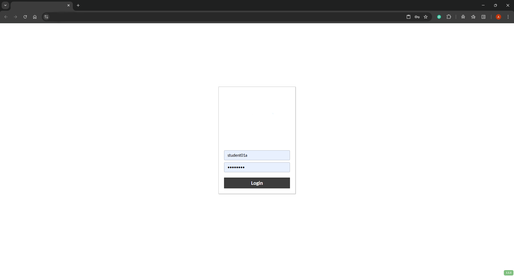

# Práctica 1. Acceso al escritorio y revisión del inventario del vCenter Server

## Objetivos de la práctica:
- Acceder al escritorio remoto.
- Acceder al vCenter Server.
- Revisar el inventario del datacenter.
- Revisar el estado de licenciamiento de los hots y del vCenter Server.

## Duración aproximada:
- 30 minutos.

## Instrucciones

## **Actividad \# 1**

### **Acceso al escritorio remoto**

Utilizar la liga de acceso proporcionada por su instructor.

A manera de ejemplo:
[**https://vlabs.v2s.us/lab**](https://vlabs.v2s.us/lab)

> 
> alt="A screenshot of a computer Description automatically generated" />

Utilizar el usuario y contraseña que le proporcione su instructor.

A manera de ejemplo:

> Usuario: `student01a`
>
> Contraseña: `Arn0224!`
>
> Dar clic en **Login**
>
Seleccionar en esta interfaz el primer Pod de trabajo **vPodProd001a** (1).

> 
> alt="A screenshot of a computer Description automatically generated" />

Al entrar, en la siguiente interfaz proporcionar:

> Usuario: `student01`
>
> Contraseña: `VMware1!`

Dar clic en **OK**.

> Se obtiene acceso al escritorio remoto
>
>  alt="A screenshot of a computer Description automatically generated" />

Abrir una instancia del browser Firefox con acceso directo al **vSphere
Client login interface**:

User: `administrator@vsphere.local`

Password: `VMware1!`

Dar clic en **Login.**

## **Actividad \# 2**

### **Acceso al vCenter Server**

Abrir una instancia del browser Firefox con acceso directo al vSphere
Client login interface.

User: `administrator@vsphere.local`

Password: `VMware1!`

Dar clic en **Login.**

## **Actividad \# 3**

### **Revisión del inventario del datacenter**

Dar clic en el menú **principal** (1), seleccionar **Inventory** (2).

En la vista de **Hosts & Clusters** (1), se observa:

El vCenter server **sa-vcsa-01.vclass.local**

- Un datacenter **SA-Datacenter**

  - Un cluster **SA-Compute-01**

    - Host **sa-esxi-01.vclass.local**

    - Host **sa-esxi-02.vclass.local**

  - Un cluster **SA-Compute-02**

    - Host **sa-esxi-04.vclass.local**

    - Host **sa-esxi-05.vclass.local**

    - Host **sa-esxi-06.vclass.local**

    - 10 VMs Virtuales **Linux-cpu-01**

      - **Linux-cpu-01**

      - **Linux-cpu-02**

      - **Linux-cpu-03**

      - **Linux-cpu-04**

      - **Linux-cpu-05**

      - **Linux01**

      - **Linux02**

      - **Photon-01**

      - **Photon-02**

      - **Photon-03**

También aparece en la parte superior un mensaje de advertencia de
vencimiento de las licencias (2), por lo cual los hosts y las VMs están
desconectados.

Al seleccionar el host **sa-esxi-06** (1), dar clic en la pestaña **VMs**
(2), se desplegará la lista de VMs que están registradas en este servidor.

**Linux01**, **Linux02, photon -01, photon-02** y la VM de servicios del
**cluster vCLS** (3).

Al seleccionar el host **sa-esx1-05** (1), dar clic en la pestaña **VMs**
(2), se desplegará la lista de VMs que están registradas en este servidor.

**Linux-CPU-01, Linux_CPU-02,** **Linux_CPU-03, Linux_CPU-04,
Linux_CPU-05** y otra VM de servicios del **cluster vCLS** (3).

En la vista de **máquinas virtuales y plantillas** (1) se tienen:

1.  10 VMs

2.  4 VMs tipo vCLS (2)

>  alt="A screenshot of a computer Description automatically generated" />

En la vista de **datastores** (1) tenemos:

1.  4 **Datastores** (2)

En la vista de **Redes** (1), tenemos:

- Un Switch Standard (1)

- Un Switch **distribuido** (2)

El inventario responde a esta tabla:

## **Actividad \# 4**

### **Revisión del estado de licenciamiento de los hosts y del vCenter Server**

Verificar en el punto (2) que no tiene licencia asignada el **vCenter
Server**, por lo cual, los host ESXi y las VMs están desconectados.

Asignar licencia al dar clic en el vCenter Server
**sa-vcsa-01.vclass.local** (1) y seleccionar **Configure** (2). Dar clic en
**Licensing** (3) y **Assign Licence** (4).

Proporcionar la licencia que le otorgue el instructor en la ventana
emergente.

Dar click en **NEW LICENCE** (1). Establecer la nueva licencia (2) y
verifique que es de vCenter (3). **OK** (4).

Observar que se lista la licencia en la interfaz.

Adicionalmente a la licencia del vCenter, se tiene que asegurar que los
hosts tengan licencia para conectarlos.

En cada host, seleccionar la vista de **Hosts & Cluster** (1) y seleccionar el
el host (2). Dar clic en **Configure** (3), seleccionar **Licensing** (4). 
**ASSIGN LICENSE** (5).

Seleccionar **NEW LICENSE** (1), proporcionar la licencia que le da su
instructor (2). **OK** (3).

Se muestra en la interfaz la licencia asignada.

Ahora toca conectar el servidor, dirigirse a la vista de **Host & Clusters** (1),
seleccionar el **host** (2) y hacer clic en el menú contextual en **Connection**
(3), elegir **Connect** (4).

Se muestra la advertencia de conexión. **OK**.

Adicionalmente, habrá que quitar la advertencia de licencia vencida en el
host. Hacer clic en el **host** (1). Dirigirse a la pestaña **Summary** (2) y
dar clic en **Actions**. (3) Escoger **Reset to Green**.

Se muestra el host ya conectado.

Realizar la misma operación en el resto de los hosts, así quedará el
estado, con Host y máquinas conectados.

Se requiere adicionalmente asegurarse que la conexión al storage se
actualice.

En cada host podría ser necesario realizar lo siguiente:

Dirigirse a la vista de **Host & Clusters** (1), seleccionar el **host** (2) y
desplegar la pestaña **Configure** (3). Seleccionar **Storage Adapters** (4),
elegir el adaptador **iSCSI software adapter** (5). Dar clic en
**RESCAN ADAPTER** (6) y **RESCAN STORAGE** (7).

Se muestra la advertencia de actualización. **OK**.

Nuestro inventario deberá lucir como se muestra en la imagen:

