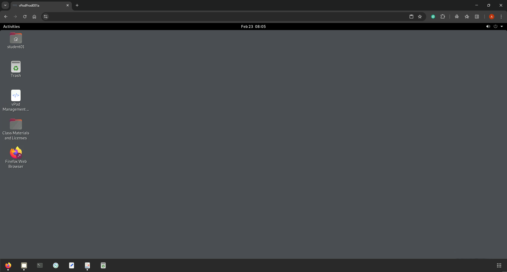
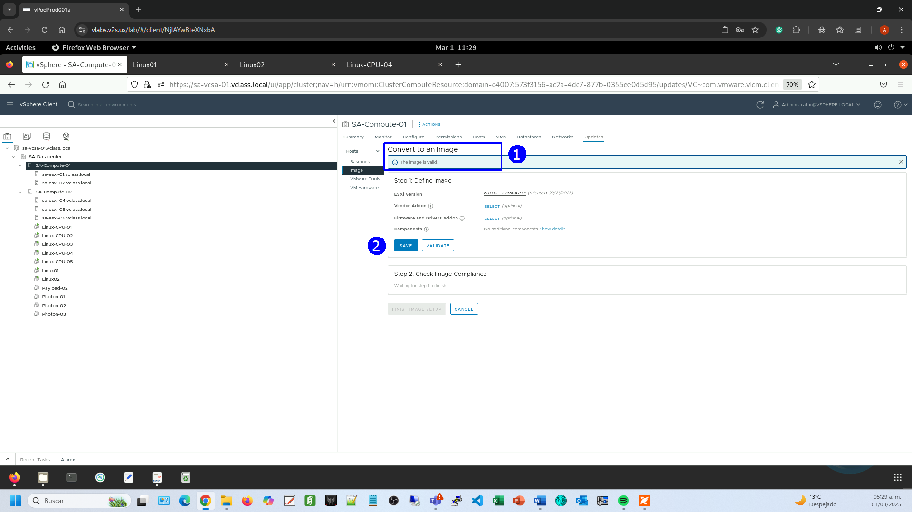
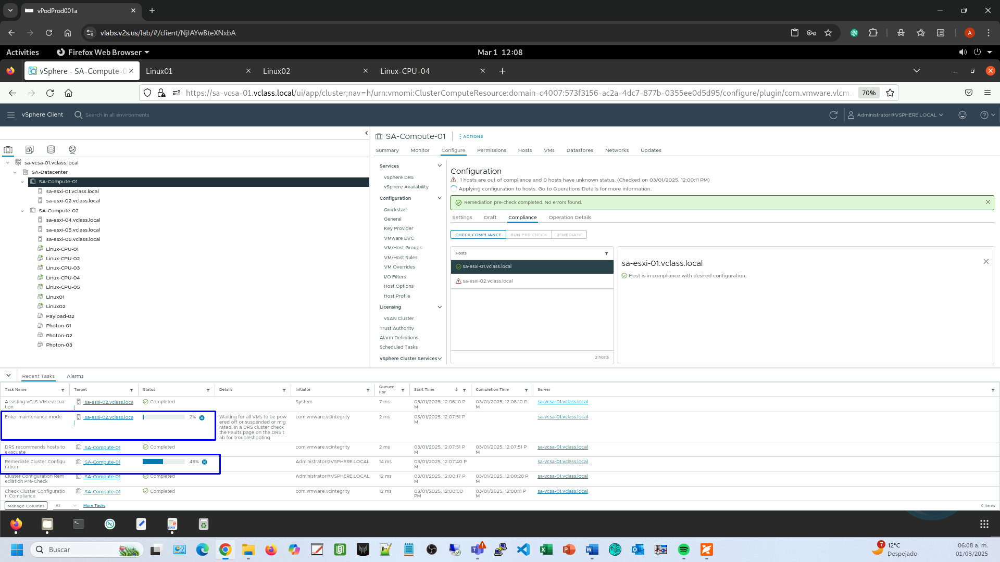

# Práctica 12. Manejo de Host Profiles en Vsphere

## Objetivos de la práctica:

- Configurar un clúster con una imagen única.
- Configurar un clúster con perfiles de configuración.
- Retornar un host a una configuración específica.
- Revisar el documento de configuración.

## Duración aproximada:
- 60 minutos.

## Instrucciones

## **Actividad \# 1**

### **Configuración de un clúster con una imagen única**

Utilizar la liga de acceso proporcionada por su instructor.

A manera de ejemplo:
[**https://vlabs.v2s.us/lab**](https://vlabs.v2s.us/lab)

Utilizar el usuario y contraseña que le proporcione su instructor.

A manera de ejemplo:

> Usuario: `student01a`
>
> Contraseña: `Arn0224!`
>
> Dar clic en **Login.**
>
Seleccionar en esta interfaz el primer pod de trabajo **vPodProd001a** (1).
>
>  alt="A screenshot of a computer Description automatically generated" />

Al entrar, en la siguiente interfaz proporcionar:

> Usuario: `student01`
>
> Contraseña: `VMware1!`

Dar clic en **OK**.

> Se obtiene acceso al escritorio remoto
>
>  alt="A screenshot of a computer Description automatically generated" />

Abrir una instancia del browser Firefox con acceso directo al **vSphere
Client login interface.**

User: `administrator@vsphere.local`

Password: `VMware1!`

Dar clic en **Login**.

En un clúster se realizará una conversión de uso de **configuraciones
base** (baselines) al uso de **perfiles de servidor**, para que los
hosts estén **homologados**.

Partiremos con la revisión de la configuración inicial del clúster

En la vista de **Hosts & Cluster**, seleccionar el **clúster
SA-Compute-01** (2). Dirigirse a la pestaña **Configure** (3). En la sección **Desired State**, dar clic en **Configuration** (4). Se nota que el clúster está actualmente trabajando con **configuraciones base** (baselines).

Ver el mensaje desplegado.

Dirigirse a la pestaña **Updates** (7).

Revisar los mensajes desplegados.

Para ajustar el clúster y que trabaje con configuraciones basadas
en imágenes.

Dar clic en **MANAGE WITH A SINGLE IMAGE** (2).

Dar clic en el botón **SETUP IMAGE MANUALLY** (1).

Del menú desplegable **ESXi Version** (1) seleccionar la versión **8.0 U2 –
22380479** (2).

Dar clic en **VALIDATE**.

Esperar a que se despliegue la confirmación de que la imagen es válida.

En la sección **Convert to image** (1), dar clic en el botón **SAVE** y esperar
a que se verifique el cumplimiento.

**FINISH IMAGE SETUP** (1).

Se despliega un comentario del proceso. **YES, FINISH IMAGE SETUP** (1).

Se tendrá que verificar que los hosts cumplen con la configuración (1).

## **Actividad \#2**

### **Configurar un clúster con perfiles de configuración**

El propósito de usar perfiles de configuración es controlar, monitorear
y, en su caso, retornar un host a una configuración específica.

En la vista de **Hosts & Clusters** (1), elegir el clúster **SA-Compute-01** (2). Dirigirse a la pestaña **Configure** (3) y en la sección **Desired State click** seleccionar **Configuration** (4).

Para hacer que el clúster use una estructura utilizando perfiles de
configuración, dar clic en **CREATE CONFIGURATION** (5).

En la etapa **Create configuration**, hacer clic en **IMPORT FROM REFERENCE
HOST** para establecer cual será la configuración a utilizar en el
perfil (1).

Seleccionar el host **sa-esxi-01.vclass.local**, (1). **IMPORT** (2).

**CLOSE** (1).

**NEXT**. (1)

En la sección **Validate configuration** (1), esperar a que finalice el
proceso de validación. **NEXT** (2).

En la etapa **Pre-check and apply** (1), esperar a que termine el proceso de
pre-verificación para la aplicación. **FINISH AND APPLY** (2).

**CONTINUE** (1).

**GO TO CONFIGURATION** (1).

Se muestra la configuración obtenida como referencia.

## **Actividad \# 3**

### **Retornar un host a una configuración específica**

En este caso, se mostrará como cambiar la configuración de un host para
que ya no cumpla la configuración del perfil del clúster y como corregir
el incumplimiento de la misma aplicando un proceso de reparación.

El cambio de configuración será en la red.

Agregar un puerto **VMkernel** al host

En la vista de **Hosts & Clusters** (1). Elegir el host **sa-esxi-02.vclass.local** (2). Dirigirse a la pestaña **Configure** (3) y en la sección **Networking** seleccionar **VMkernel adapters** (4).

Dar clic en ADD **NETWORKING** (5).

En el paso **Select Connection Type** (1), dejar seleccionada la opción
**VMkernel Network Adapter** (2). **NEXT** (3).

En el paso **Select target device** (1), escoger la opción **Select an
existing standard switch** (2). Enseguida, seleccionar el Switch **vSwitch0** (2). **NEXT** (3).

En el paso **Add Networking** dejar las opciones de default (1). **NEXT** (2).

En el paso **IPV4 Settings** (1), dejar seleccionada la opción **Obtain IPv4
settings automatically** (2). **NEXT** (3).

Revisar la configuración final. **FINISH** (1).

Aparecerá un adaptador adicional tipo vmk, verificar si es **vmk1,
vmk2,** o **vmk3,** este podría ser diferente según el estado del
laboratorio.

Con el propósito de verificar si el host cumple con la configuración del
perfil.

Escoger en la vista de **Hosts & Clusters** (1) el clúster
**SA-Compute-01** (2). Dirigirse a la pestaña **Configure** (3).
En la sección **Desired State**, seleccionar **Configuration** (4).
Dirigirse a la pestaña **Compliance** y seleccionar **CHECK COMPLIANCE** (5).

Se despliega el estado del host **sa-esxi-02.vclass.local** (1) que no
cumple con la configuración del perfil (2).

En este punto, para retornar a la configuración inicial del host, establecida en el perfil del clúster, hacer clic en **REMEDIATE** (1).

Se realizará una verificación del proceso.

Expandir cada host para ver detalles

Dar clic en **NEXT** (3).

Verificar la información del posible impacto del proceso

**REMEDIATE** (1).

Observar el panel de tareas.

Como parte del proceso el host puede reiniciarse.

Se ejecutará un segundo proceso de verificación del cumplimiento de la
configuración.

El host ha regresado a la configuración inicial definida en el clúster.
Seleccionar el host **sa-esxi-02.vclass.local** (1). Dirigirse a la pestaña **Configure** y en el menú desplegable seleccionar **VM kernel adapters** (4).
Verificar que el proceso eliminó el adaptador kernel que se le agregó
anteriormente (5).

## **Actividad \# 4**

### **Revisar el documento de configuración**

Es posible ver la configuración establecida en el clúster de un archivo
tipo **JSON.**

Elegir el clúster **SA-Compute-01** (1). Dirigirse a la pestaña **Configure** (2), en la sección **Desired State** seleccionar **Configuration** (3). Dar clic en **EXPORT** para abrir un menú desplegable (4), seleccionar **Cluster Configuration** (5).

**DOWNLOAD** (1).

1. Abrir el folder **Downloads**.

2. Revisar los detalles del archivo, dar clic en **Save**.

3. Dar clic en la barra de tareas de Linux.

4. Dar clic en **Downloads**.

Abrir con clic derecho el archivo
**export-settings-config-xxxxxxxxxx.json,** dar clic en **Open with Text
Editor**.

Esto despliega el archivo tipo **JSON** para su revisión y, posible
edición si se desea importar, aplicar al clúster.

