# Práctica 15. Manejo de alarmas 

## Objetivos de la práctica:

- Establecer una alarma para monitorear una condición.
- Disparar la alarma de condición.
- Establecer una alarma para monitorear un evento.
- Disparar la alarma de evento.
- Desactivar las alarmas.

## Duración aproximada:
- 40 minutos.

## Instrucciones

## **Actividad \# 1**

**Establecer una alarma para monitorear una condición**

Utilizar la liga de acceso proporcionada por su instructor

A manera de ejemplo:
[**https://vlabs.v2s.us/lab**](https://vlabs.v2s.us/lab)

Utilizar el usuario y contraseña que le proporcione su instructor

A manera de ejemplo

> Usuario: `student01a`
>
> Contraseña: `Arn0224!`
>
> Dar clic en **Login.**
>
Seleccionar en esta interfaz el primer pod de trabajo **vPodProd001a** (1).
>
> 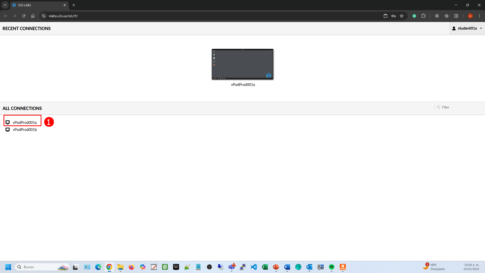 alt="A screenshot of a computer Description automatically generated" />

Al entrar, en la siguiente interfaz proporcionar:

> Usuario: `student01`
>
> Contraseña: `VMware1!`

Dar clic en **OK.**

> Se obtiene acceso al escritorio remoto.
>
>  alt="A screenshot of a computer Description automatically generated" />

Abrir una instancia del browser Firefox con acceso directo al **vSphere
Client login interface.**

User: `administrator@vsphere.local`

Password: `VMware1!`

Dar clic en **Login.**

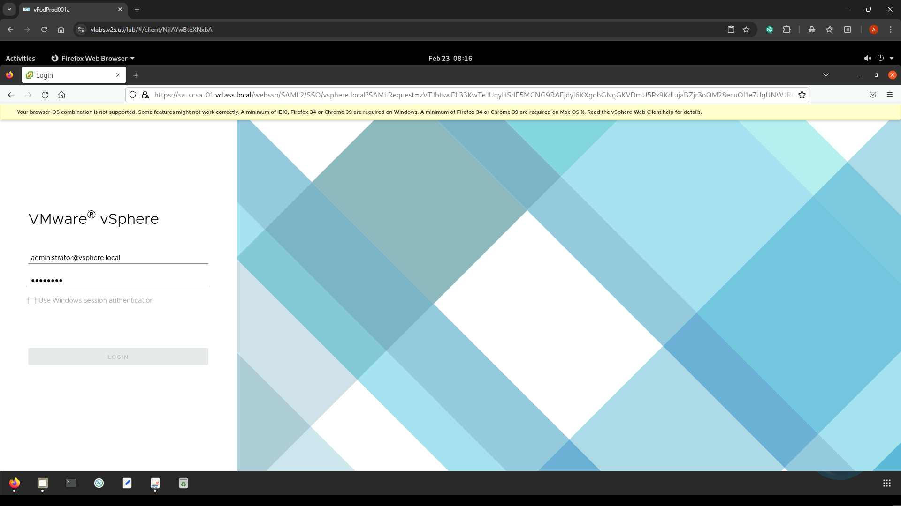

Abrir una instancia de Firefox y seleccionar el shortcut de **vCenter.**

En la vista de **Hosts & Clusters** (1), escoger la VM **Linux-CPU-01**
(2). En el menú contextual, seleccionar **Alarms** (3), **New Alarm** y
**Definition**(4).

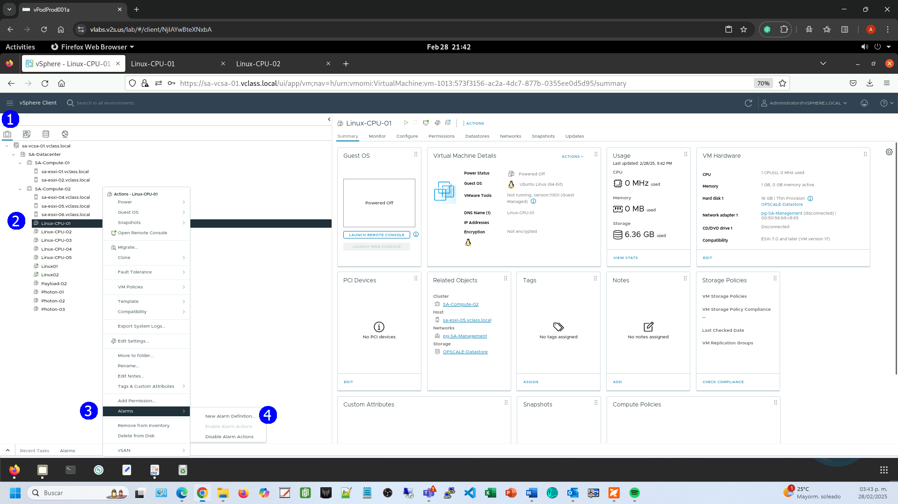

Se despliega el asistente de alarmas.

En el campo **Alarm Name**, establecer **Linux_01_CPU_High_Usage** (2).
**NEXT** (3).

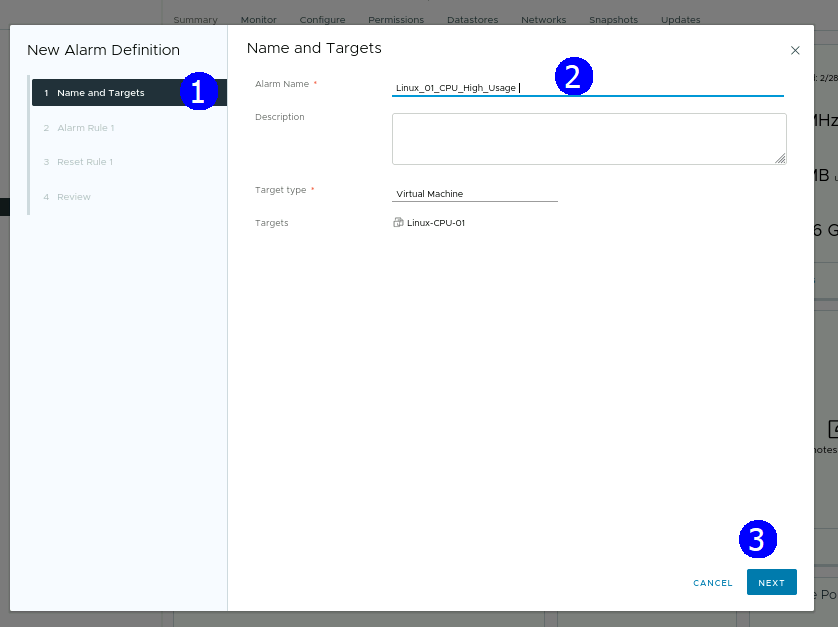

Seleccionar del menú desplegable **IF** (2) y escoger **VM CPU USAGE** (3).

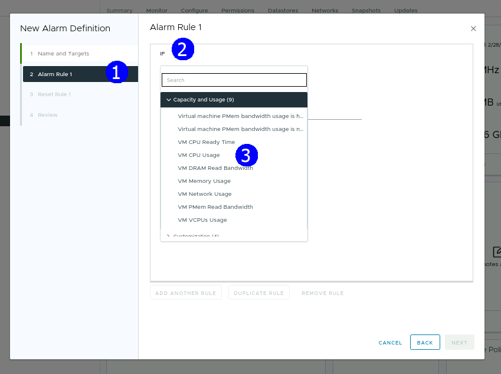

Establecer las siguientes condiciones:

**Métrica : VM CPU Usage (2),**

**Operador: Is above (3)**

**Umbral: 35% (4)**

**Tiempo: 30 Sec (5)**

**Acción: Show as Warning (6)**

**NEXT** (7).

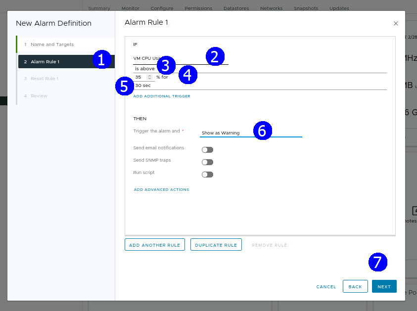

En el paso **Reset Rule** (1), observar la regla presente y avanzar.
**NEXT** (2); la misma indica que la norma para poner la alarma en un estado normal, es que la condición ya no se cumpla.

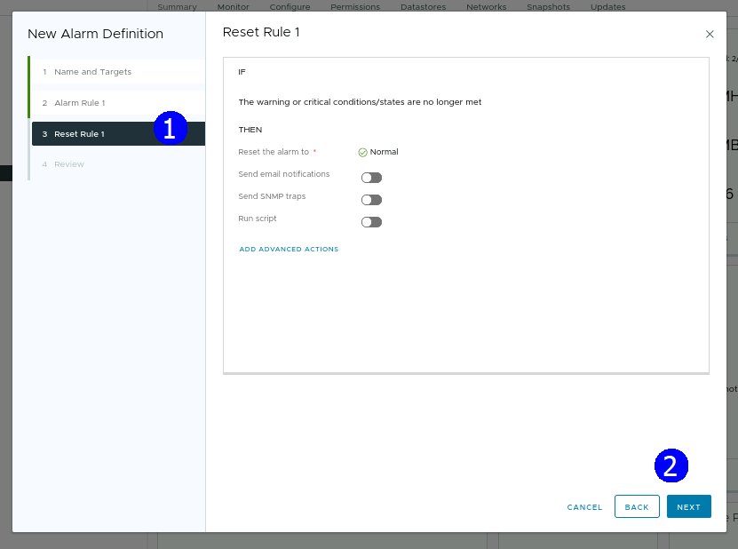

Se muestra el resumen de la alarma, aceptarla con **CREATE** (2).

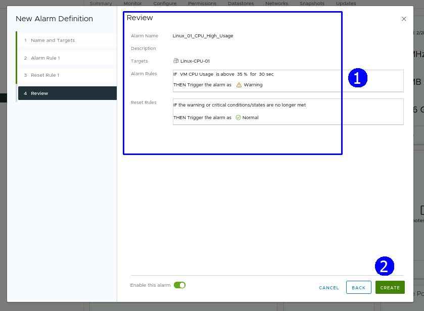

Si se desea administrar las alarmas, y en este caso verificar la
existencia de la alarma recién creada.

En la vista de **Hosts & Clusters** (1), seleccionar el clúster
**SA-Compute-02** (2) y hacer clic en la VM **Linux-CPU-01** (3). Dirigirse a la
pestaña **Configure** (4) y en la sección de **Settings**, seleccionar **Alarm
definitions** (5), dar clic en la alarma **Linux_01_CPU_High_Usage** (6).

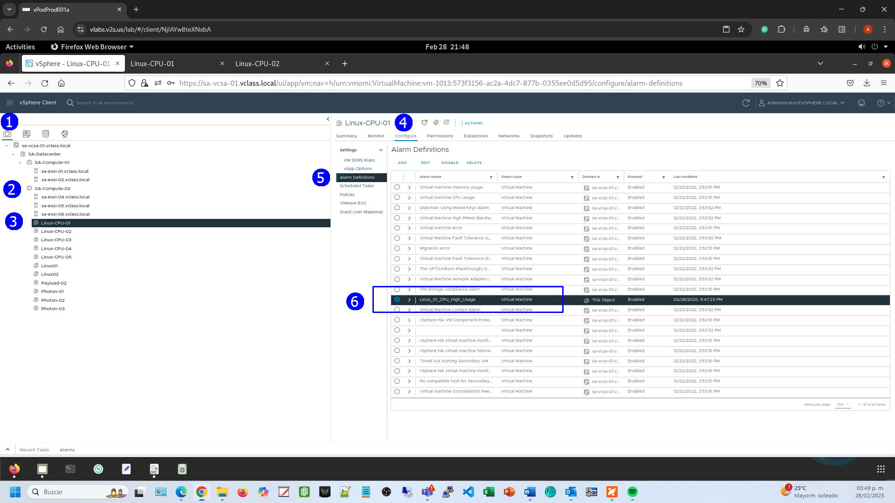

Encender la VM **Linux-CPU-01.**

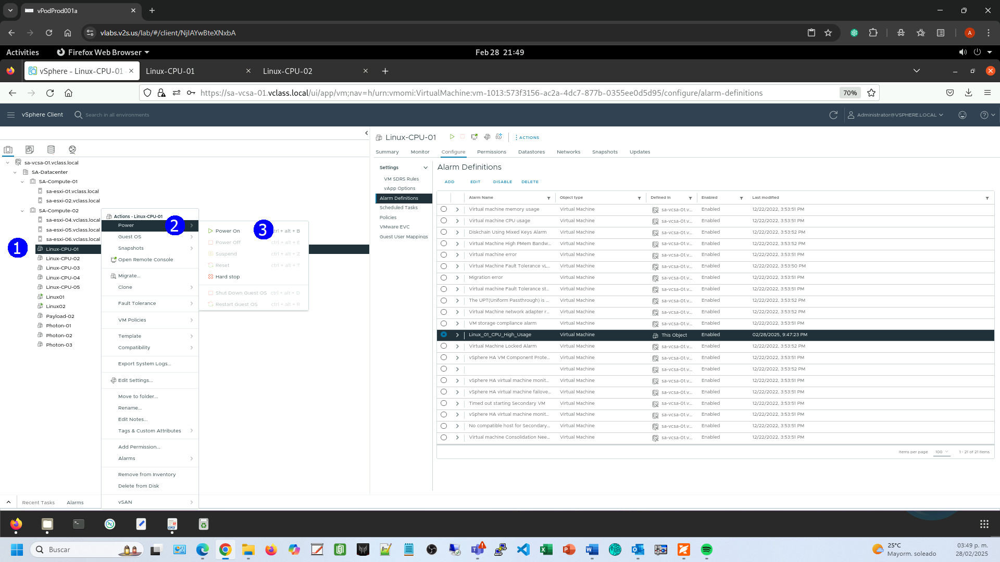

Observar que la VM no tiene alta utilización de CPU en la gráfica de
desempeño.

En la vista de **Hosts & Clusters** (1), seleccionar el clúster
**SA-Compute-02** (2) y hacer clic en la VM **Linux_01** (3). Dirigirse a la
pestaña **Monitor** (4) y en la sección de **Performance** seleccionar
**Advanced**, ver que la gráfica se muestra en tiempo real **Real-Time**
(6). Verificar que la gráfica se refiere a **CPU usage in %** (7).

El uso de CPU está alrededor de 3% (8).

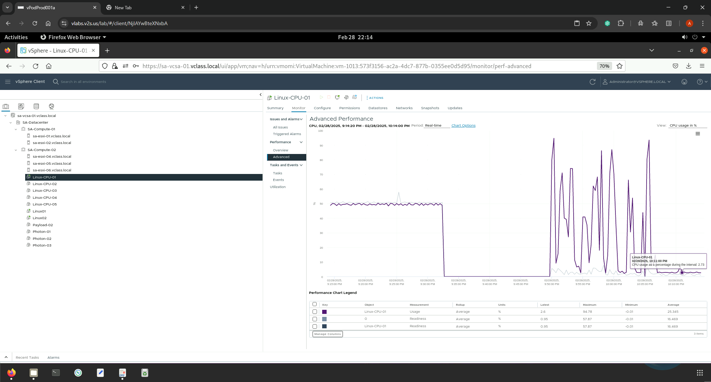

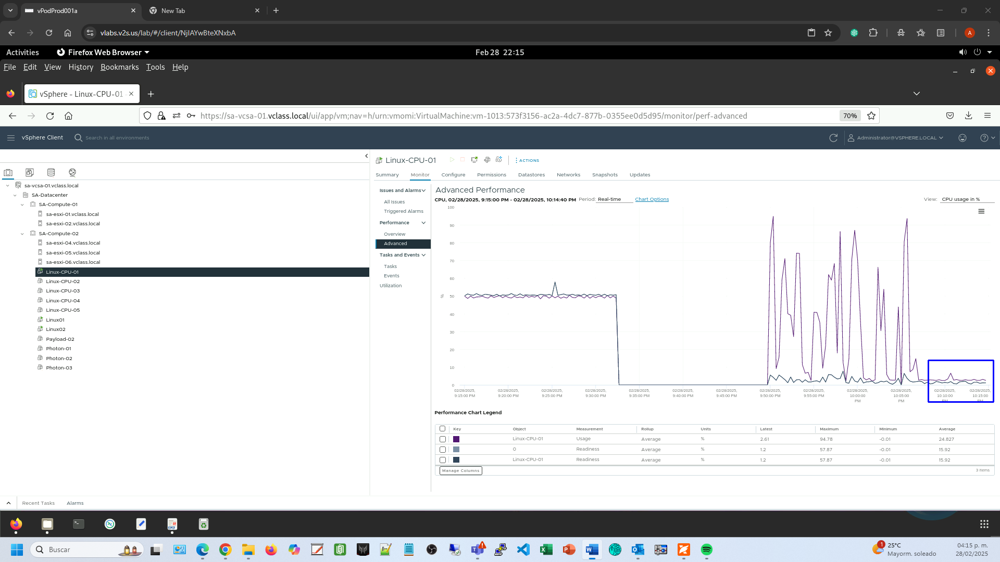

## **Actividad \# 2**

### **Disparar la alarma de condición**

Con la VM **Linux-CPU-01** seleccionada, en la pestaña de **Summary**,
dar click **LAUNCH WEB CONSOLE.**

Usar el password `VMware1!`, si es necesario.

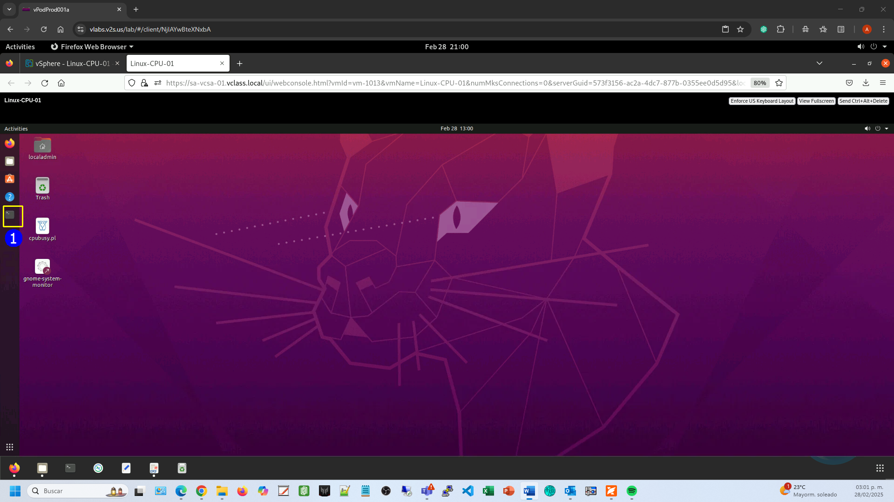

Ejecutar el comando para iniciar el **script cpubusy.pl**.

`./Desktop/cpubusy.pl`

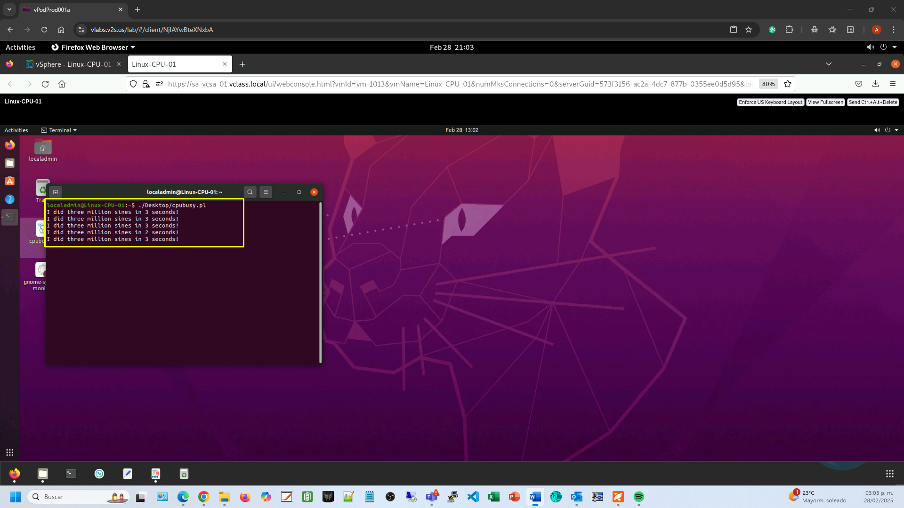

Se dispara la alarma. Observar con la VM **Linux-CPU-01** seleccionada (3)
en la pestaña de resumen (5).

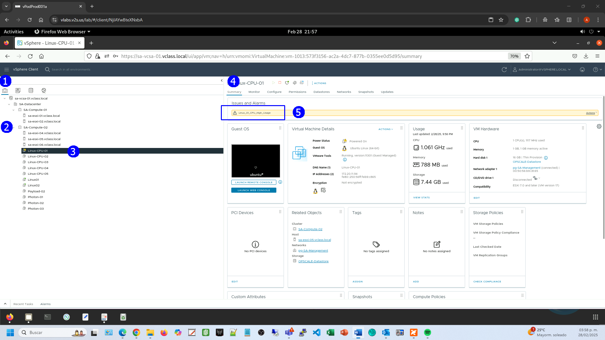

Observar la gráfica avanzada de desempeño.

En la vista de **Hosts & Clusters**, elegir el clúster
**SA-Compute-02** y seleccionar la VM **Linux-CPU-01** (1). Dirigirse a la pestaña de **Monitor** (2) y en la sección de **Performance** seleccionar
**Advanced** (3). Ver que se muestra la gráfica en tiempo real **Real-Time**
(6). Verificar que la gráfica se refiere a **CPU usage in %
aproximadamente de 90** **%** (7).

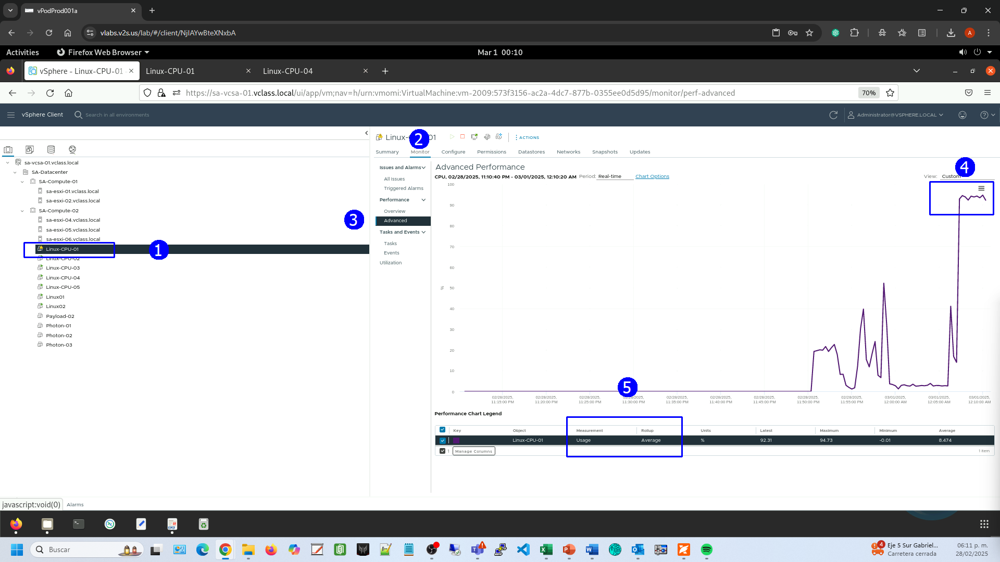

En la sección de Alarmas disparadas podemos ver también la alarma
listada.

En la vista de **Hosts & Clusters** (1), elegir el clúster
**SA-Datacenter-02** (2) y seleccionar la VM **Linux-CPU-01** (3). Dirigirse a la pestaña **Monitor** (4) y en la sección de **Issues and Alarms**
seleccionar **Triggered Alams** (5). Ver que se lista la alarma (6).

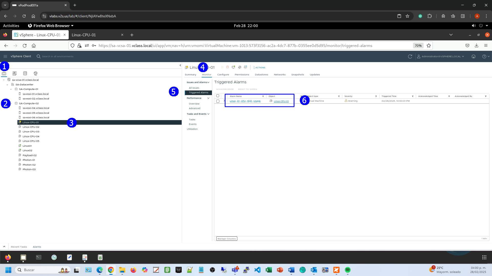

En la lista de eventos también está listado el disparo de la alarma.

En la vista de **Hosts & Clusters** (1), elegir el clúster
**SA-Compute-02** (2) y seleccionar la VM **Linux-CPU-01** (3). Dirigirse a la
pestaña **Monitor** (4) y en la sección de **Tasks and Events** (4) seleccionar **Events** (5). Ver que se lista la alarma (6).

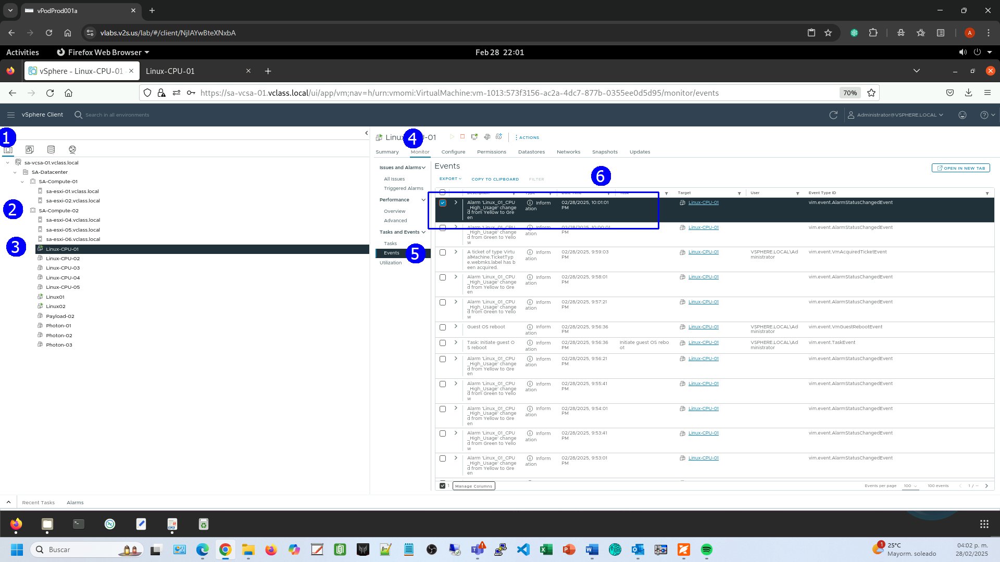

Una opción para apagar la alarma es:

En la vista de **Hosts & Clusters** (1), elegir el clúster
**SA-Compute-02** y seleccionar la VM **Linux_01** (2). Dirigirse a la
pestaña **Monitor** (3), en la sección de **Issues and Alarms**
seleccionar **Triggered Alams** (4). Seleccionar la alarma y dar clic en
**RESET TO GREEN** (5).

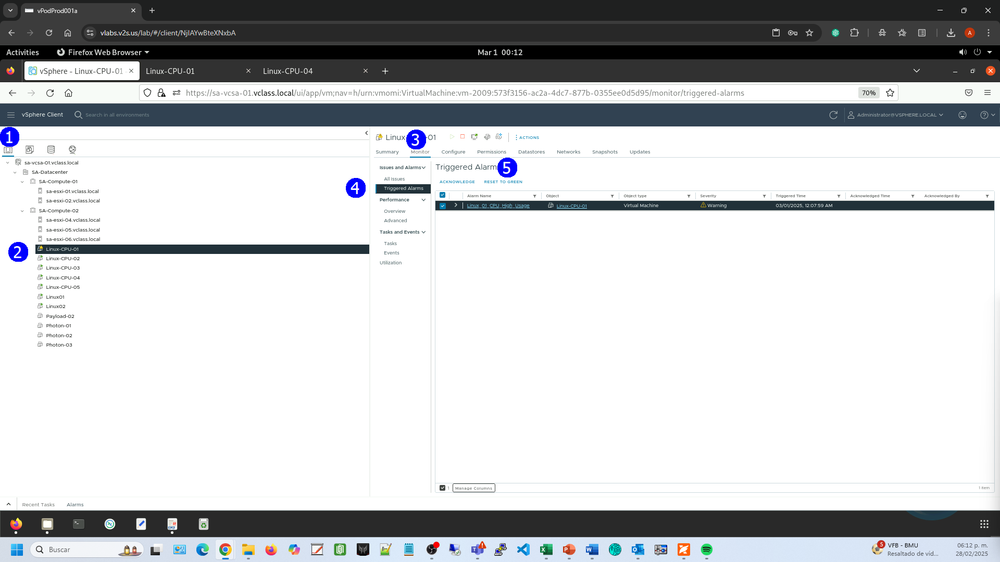

Alternativamente se puede:

En la vista de **Hosts & Clusters** (1), elegir el clúster
**SA-Compute-02** y seleccionar la VM **Linux-CPU-01** (2). Dirigirse a la
pestaña **Summary** (3), hacer clic en Actions (4) y dar clic en **RESET TO
GREEN** (5).

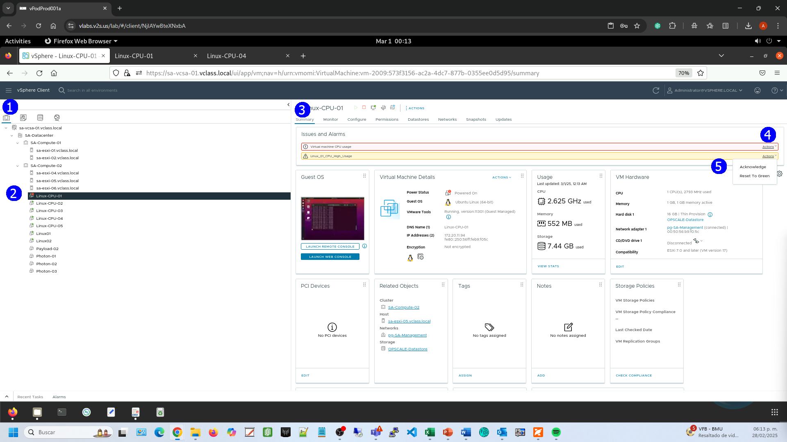

Apagar en la VM la aplicación de **cpubusy.**

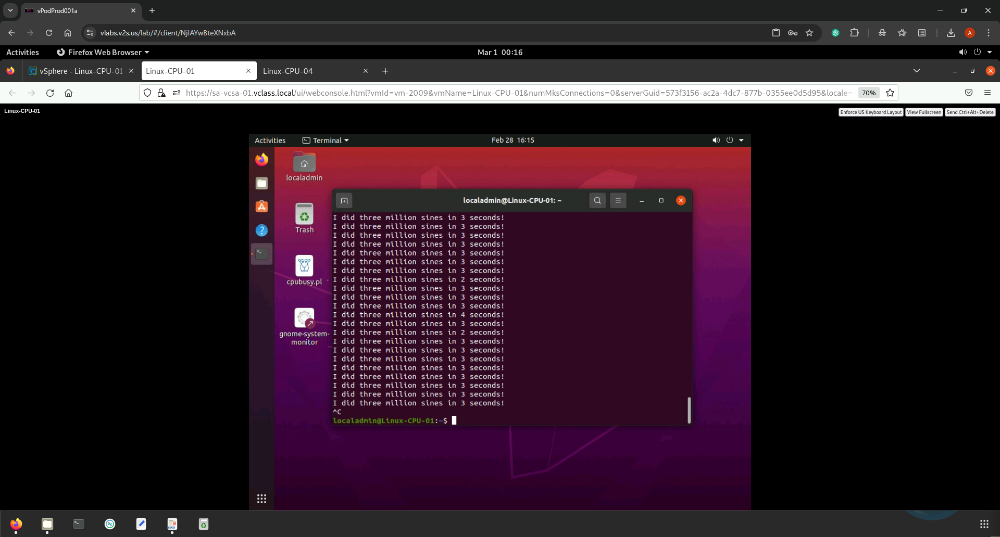

En la vista de **Hosts & Clusters** (1), elegir el clúster
**SA-Compute-02** (2) y seleccionar la VM **Linux-CPU-01** (3). Dirigirse a la
pestaña **Monitor** (4) y en la sección de **Performance** seleccionar
**Advanced**. Ver que la gráfica se muestra en tiempo real **Real-Time**
(6). Verificar que la gráfica se refiere a **CPU usage in %
aproximadamente de 3%** (7).

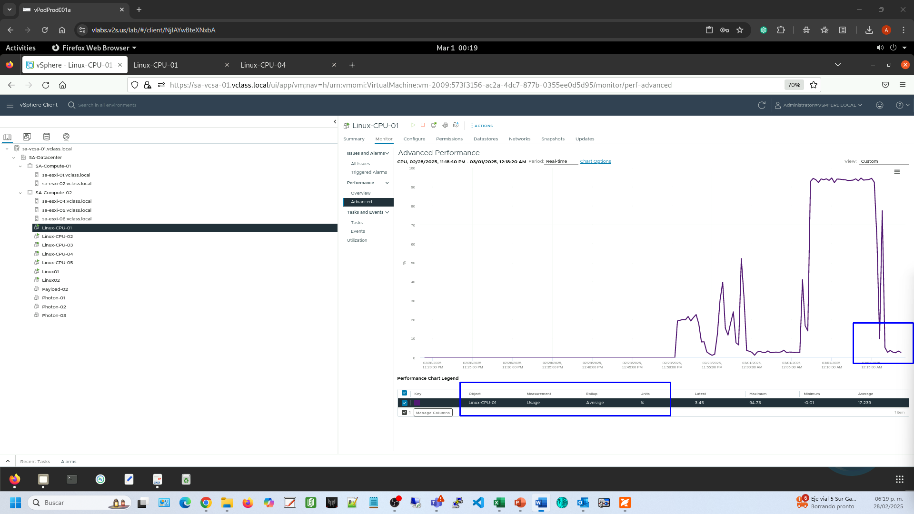

## **Actividad \# 3**

### **Establecer una alarma para monitorear un evento**

En la vista de **Hosts & Clusters** (1), elegir el clúster
**Production Cluster** y seleccionar la VM **Linux_01** (2). Dirigirse a la
pestaña Configure (3), en la sección de **Settings** seleccionar **Alarm
definitions** (5). **ADD** (6).

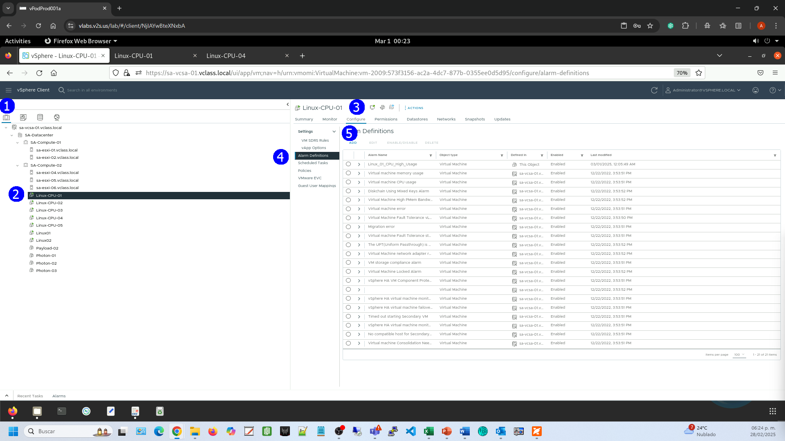

En el paso de **Nombre y objetivo**, establecer en el campo **Alarm Name**: **VM_Suspended** (2) y dejar en **Target Type** Virtual Machine (3). **NEXT** (3).

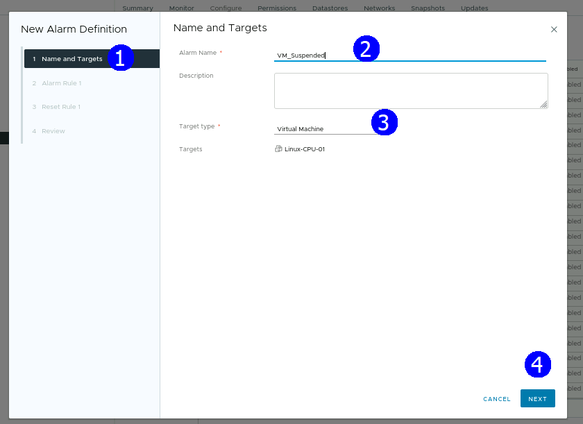

En el paso de **Alarm Rule 1**, en la lista desplegable de **IF** (2), seleccionar **Power and Connection State** (3).

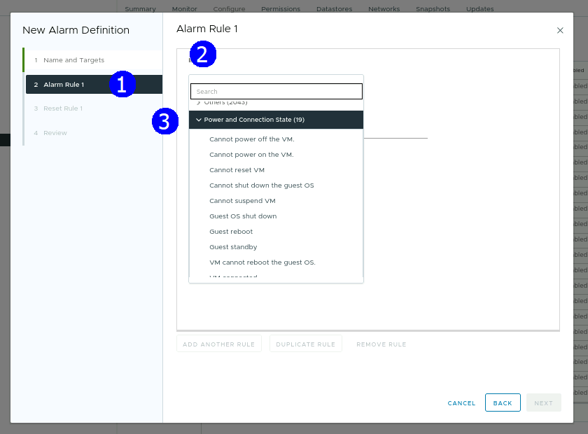

En la lista desplegable de **IF**, seleccionar **VM suspended** (2)

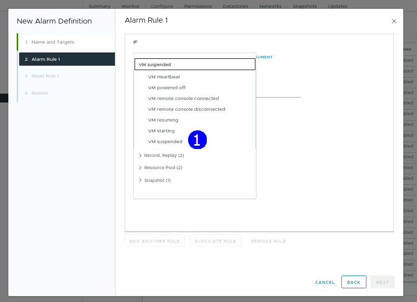

Especificar que cuando se dispare la alarma se muestre una advertencia
(3), **NEXT** (4).

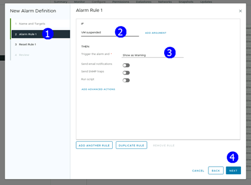

En el paso de **Reset Rule 1**, especificar que la alarma se anule cuando la VM se reinicie (3). **NEXT** (4).

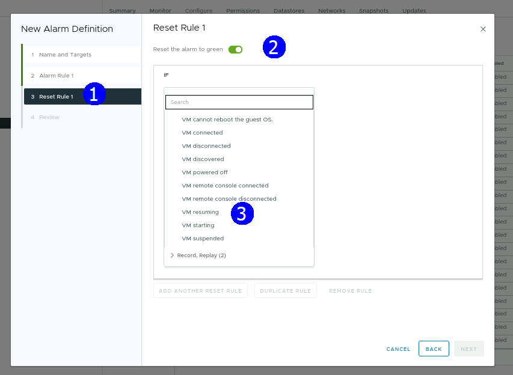

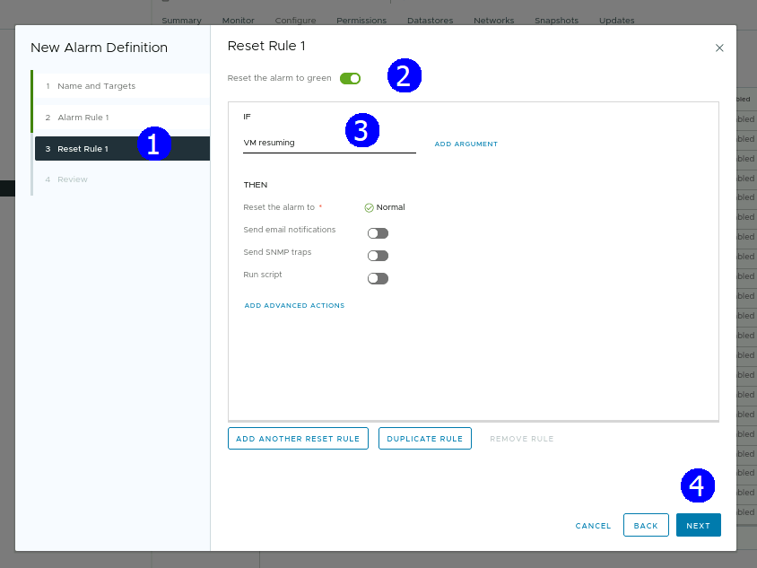

Aceptar el resumen de la configuración de la alarma (1). **CREATE** (2).

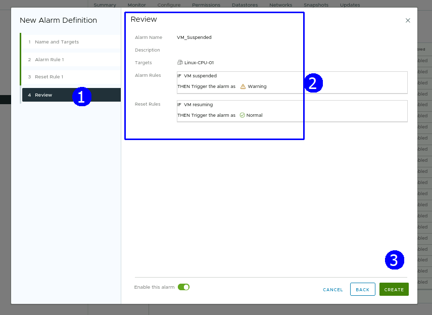

## **Tarea \# 4**

### **Disparar la alarma de evento**

Procedamos a suspender la **VM Linux_01**.

En la vista de **Hosts & Clusters** (1), elegir la **VM Linux-CPU-01**
(2) y en el menú contextual seleccionar **POWER** (3). Seleccionar **Suspend**
(4).

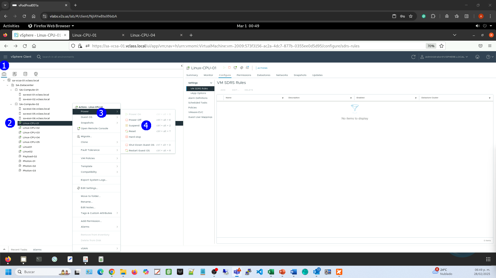

Se muestra la advertencia de que se suspenderá la VM. **YES** (1).

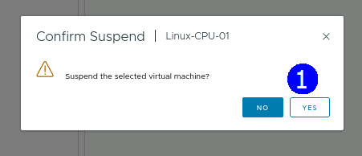

Se dispara inmediatamente la alarma.

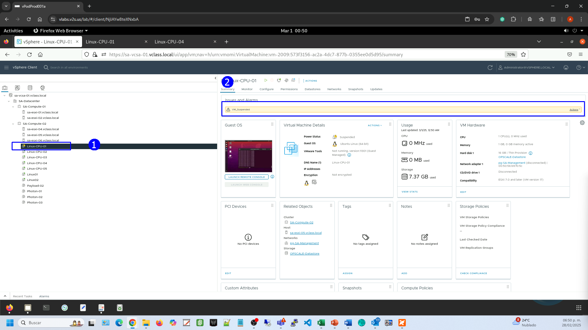

Iniciar la VM para que se anule la alarma.

En la vista de **Hosts & Clusters** (1), elegir la **VM Linux_01**
(2) y en el menú contextual seleccionar **POWER** (3). Dar clic en **Power On**
(4)

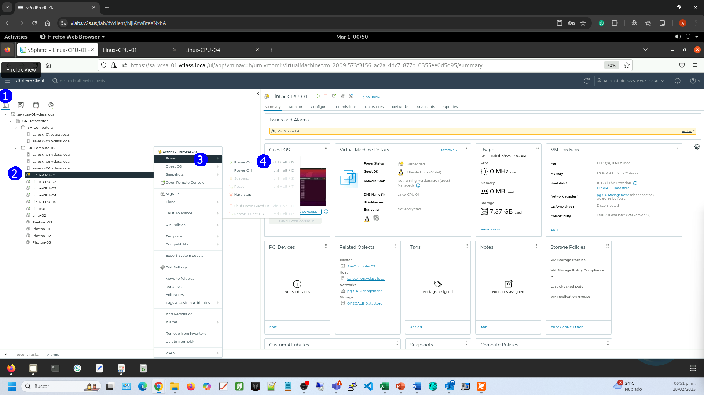

La alarma desaparece.

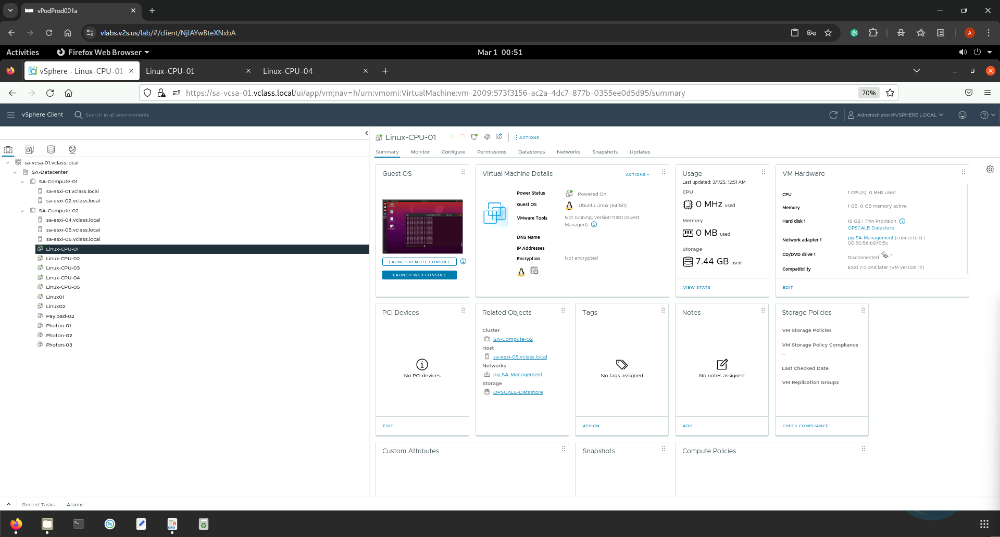

## **Tarea \# 5**

### **Desactivar las alarmas**

En la vista de **Hosts & Clusters** (1), elegir la **VM Linux-CPU-01**
(2). Dirigirse a la pestaña **Configure**(3) y seleccionar **Alarm
Definitions** (4), en la alarma a eliminar (5), dar clic en **DELETE** (6).

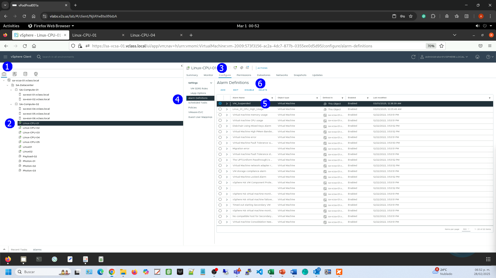

Se muestra la advertencia de eliminación. **OK** (1).

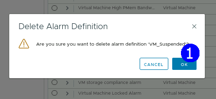
