# Práctica 16. Configuración del modo Lockdown mode en un host ESXi

## Objetivos de la práctica: 

- Activar el servicio de SSH.
- Habilitar y probar el modo Lockdown mode.
- Deshabilitar el Modo Lockdown mode.

## Duración aproximada:
- 20 minutos.

## Instrucciones

## **Actividad \# 1**

### **Activar el servicio de SSH**

Utilizar la liga de acceso proporcionada por su instructor.

A manera de ejemplo:
[**https://vlabs.v2s.us/lab**](https://vlabs.v2s.us/lab)

Utilizar el usuario y contraseña que le proporcione su instructor.

A manera de ejemplo:

> Usuario: `student01a`
>
> Contraseña: `Arn0224!`
>
>  Dar clic en **Login.**
>
Seleccionar en esta interfaz el primer pod de trabajo **vPodProd001a** (1).
>
>  alt="A screenshot of a computer Description automatically generated" />

Al entrar, en la siguiente interfaz proporcionar:

> Usuario: `student01`
>
> Contraseña: `VMware1!`

Dar clic en **OK.**

> Se obtiene acceso al escritorio remoto.
>
>  alt="A screenshot of a computer Description automatically generated" />

Abrir una instancia del browser Firefox con acceso directo al **vSphere
Client login interface.**

User: `administrator@vsphere.local`

Password: `VMware1!`

Click en **Login**

Para activar el servicio SSH

En la vista de **Hosts & Clusters** (1), escoger el host **sa-esxi-01**
(2). Dirigirse a la pestaña **Configure** (3) y en la sección **System**,
dar clic en **Services** (4). Seleccionar **SSH** (5) dar clic en **Start** (6).

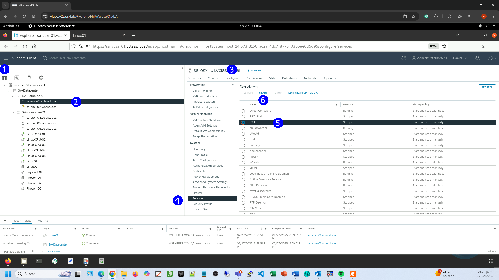

El servicio SHH está activo.

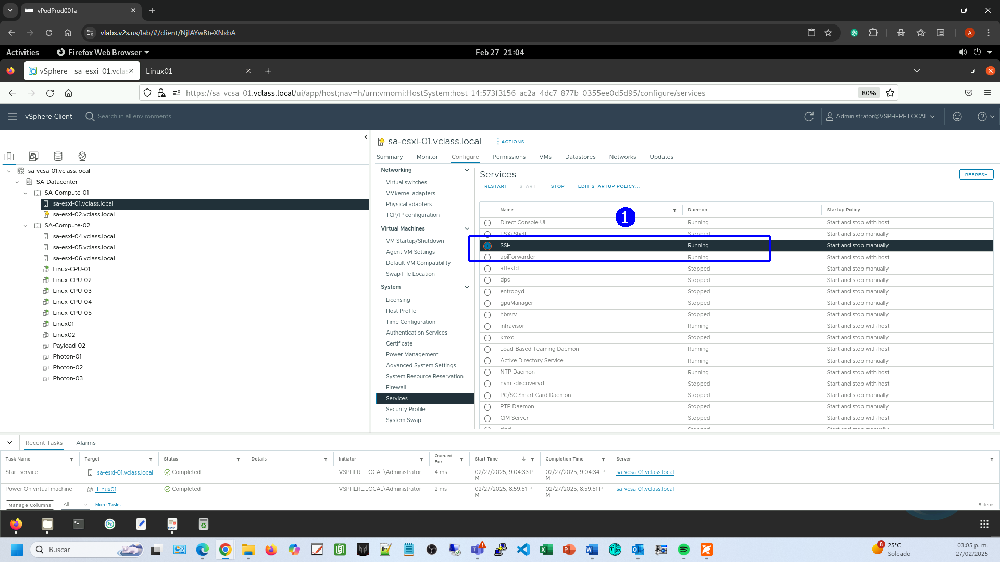

En el escritorio ejecutar la aplicación **Remmina.**

Verificar que se acepta una conexión con **Remmina** usando la cuenta de
root, establecer como host **sa-esxi-01.vclass.local** (1).

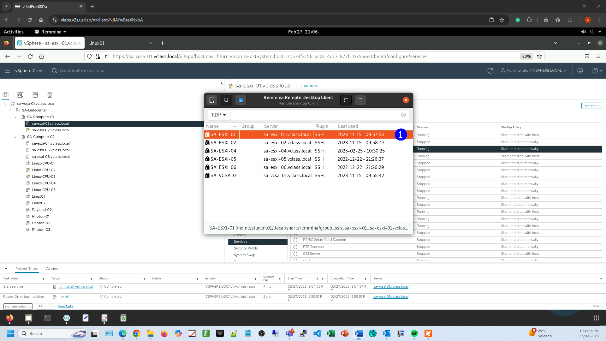

Se logra la conexión con el Host **sa-esxi-01.vclass.local**.

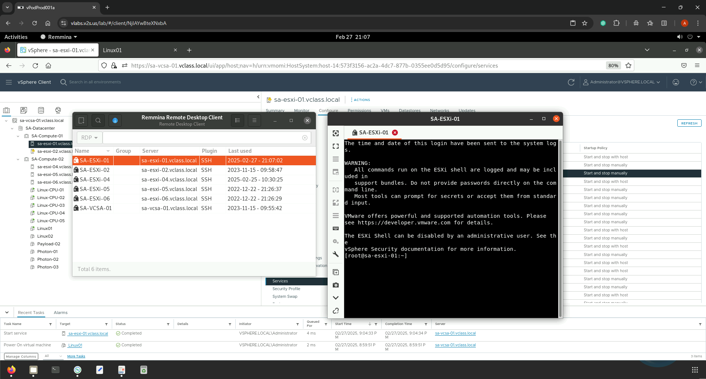

## **Actividad \# 2**

### **Habilitar y probar el modo Lockdown mode**

Enseguida, activar el modo de protección Lockdown Mode.

En la vista de **Hosts & Clusters** (1), escoger el host **sa-esxi-01**
(2). Dirigirse a la pestaña **Configure** (3) y en la sección **System**,
seleccionar **Security Profile** (4). Observar que está deshabilitada la
protección (5). Seleccionar **EDIT** (6).

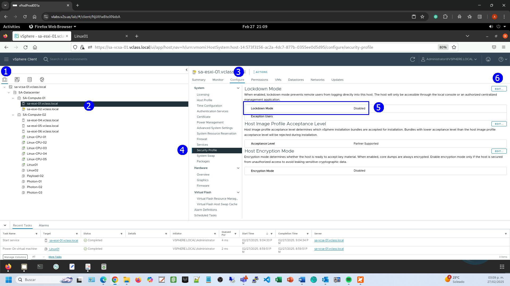

Seleccionar modo **NORMAL** (1). **OK** (2).

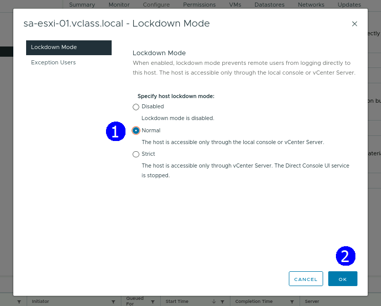

Se activa la protección (1), notar que la lista de **Exception User**
está vacía.

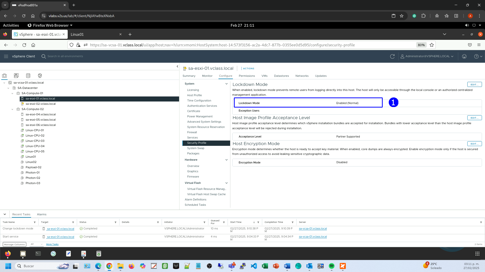

Verificar que no se acepta una conexión con **Remmina** usando la cuenta
de **root**.

Activar Reminna.

**sa-esxi-01.vclass.local** (1).

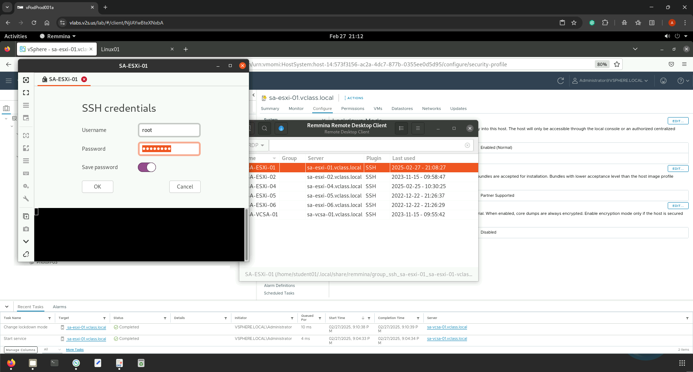

Se deniega la conexión con la cuenta de:

User: `Root`

Password: `VMware1!`

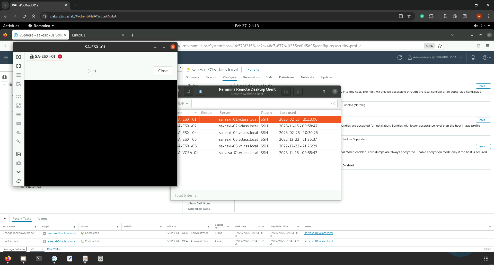

## **Actividad \# 3**

### **Deshabilitar el Modo Lockdown mode**

Para des-habilitar la protección, hacer clic en **EDIT** (1).

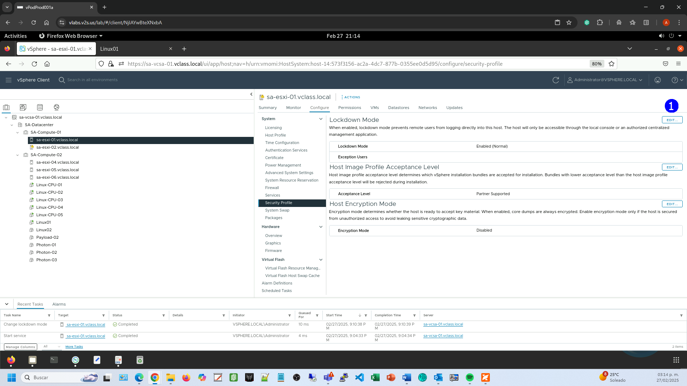

Seleccionar **Disable** (1) **OK** (2).

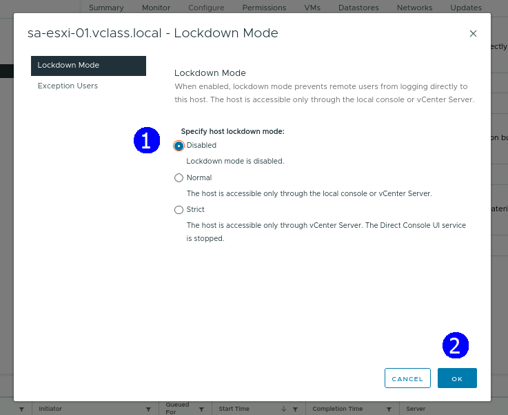

Se muestra el nuevo estado.

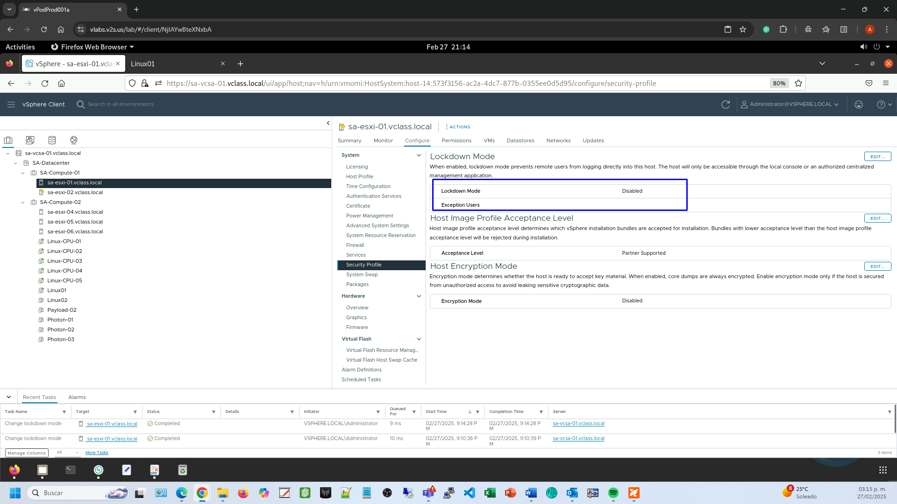

Apagar el servicio de SSH.

En la vista de **Hosts & Clusters** (1), escoger el host **sa-esxi-01**
(2). Desplazarse a la pestaña **Configure** (3) y en la sección **System**,
seleccionar **Services** (4). Hacer clic en **SSH** (5) y en **STOP** (6).

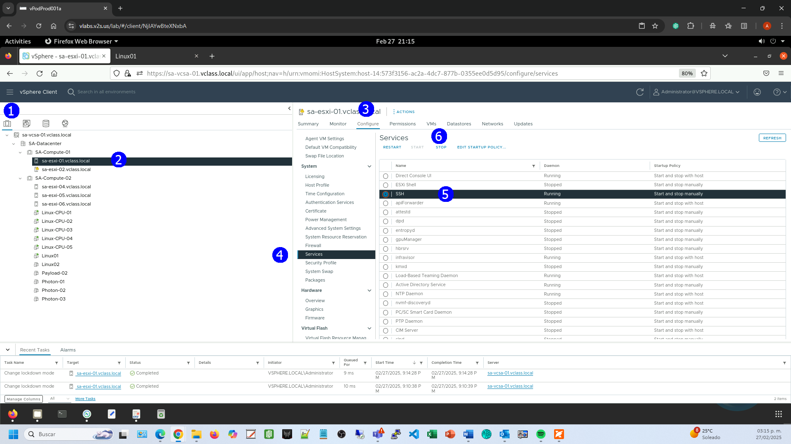

Aparece la advertencia de apagado de SSH. **OK** (1).

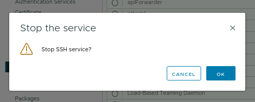

El servicio se ha detenido.

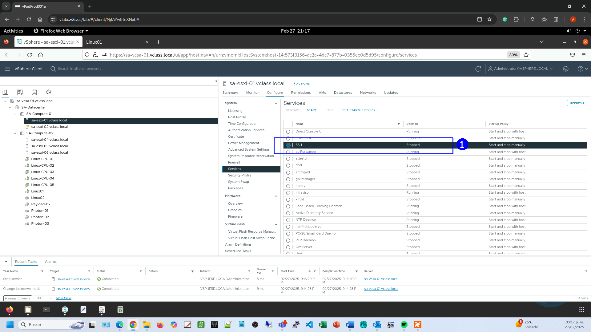
