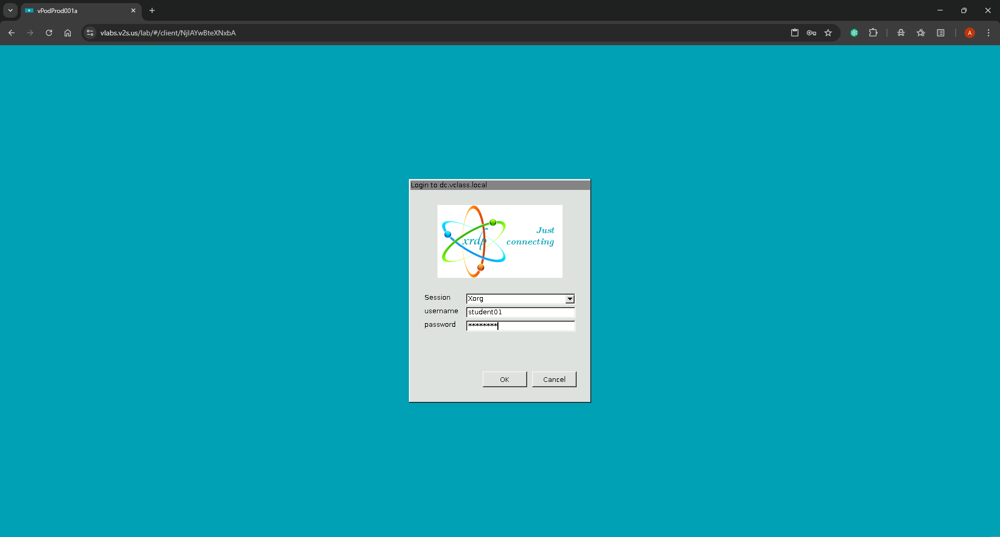
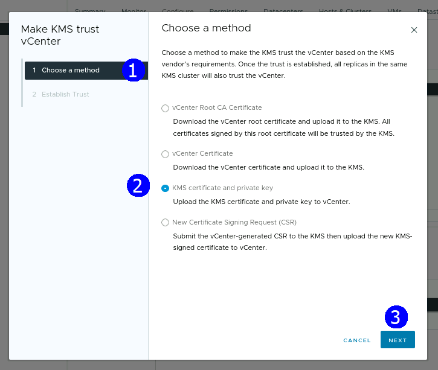

# Práctica 17. Configuración de vCenter para trabajar con un KMS externo

## Duración aproximada:

- Configurar un KMS en vCenter.
- Establecer confianza entre un KMS y vCenter.

## Duración aproximada:
- 40 minutos.

## Instrucciones

## **Actividad \# 1**

### **Configurar un KMS en vCenter**

Utilizar la liga de acceso proporcionada por su instructor.

A manera de ejemplo:
[**https://vlabs.v2s.us/lab**](https://vlabs.v2s.us/lab)

Utilizar el usuario y contraseña que le proporcione su instructor.

A manera de ejemplo:

> Usuario: `student01a`
>
> Contraseña: `Arn0224!`
>
> Dar clic en **Login.**
>
Seleccionar en esta interfaz el primer pod de trabajo **vPodProd001a** (1).
>
>  alt="A screenshot of a computer Description automatically generated" />

Al entrar, en la siguiente interfaz proporcionar:

> Usuario: `student01`
>
> Contraseña: `mVMware1!`

Dar clic en **OK.**

> Se obtiene acceso al escritorio remoto.
>
>  alt="A screenshot of a computer Description automatically generated" />

Abrir una instancia del browser Firefox con acceso directo al **vSphere
Client login interface.**

User: `administrator@vsphere.local`

Password: `VMware1!`

Dar clic en **Login.**

Seleccionar la vista de **Host & clusters** (1), escoger **sa-vcsa-01.vclass.local**. Dirigirse a la pestaña **Configure**. En la sección **Security** dar clic en **Key Providerr.** Hacer clic en **ADD** y 
seleccionar **Add Standard Key Provider.**

En el asistente establecer la siguiente configuración relativa al KMS

**Name**: **sa-kms-01.vclass.local**

**KMS**: **sa-kms-01.vclass.local**

**Address**: `172.20.10.193`

**Port**: `5696`

Hacer clic en **ADD KEY PROVIDER** (5).

En la cuadro de diálogo **Make vCenter Trust Key Provider**, hacer clic en
**TRUST.**

Verificar que el servidor **sa-kms-01.vclass.local** se ha agregado a la
lista de proveedores KMS.

Seleccionar el servidor y verificar el estado de desconectado.

## **Actividad \#2**

### **Establecer una relación de confianza del KMS con el vCenter Server**

En la Sección **Key Providers**, dar clic sobre el proveedor KMS
**sa-kms-01.vclass.local**.

Dar clic en la lista desplegable **ESTABLISH TRUST** y seleccionar **Make
KMS trust vCenter** (1).

Se despliega el asistente **Make KMS trust vCenter**

En la página **Choose a method** (1), seleccionar la opción **KMS
certificate and private key** (2). **NEXT** (3).

En la página **Upload KMS Certificate** (1), dar clic en **UPLOAD A FILE** (2) en la sección **KMS Certificate**.

Seleccionar el archivo **/Downloads/KMS Keys/root_certificate.pem**

Click en **Open**.

En la sección **KMS Private Key**, hacer clic en **UPLOAD A FILE.**
Seleccionar el archivo **/Downloads/KMS Keys/root_key.pem** (1). Dar clic en **Open** (2).

**ESTABLISH TRUST** (1).

## Resultado esperado

Confirmar que se ha establecido confianza entre el **KMS** and
**vCenter.**

