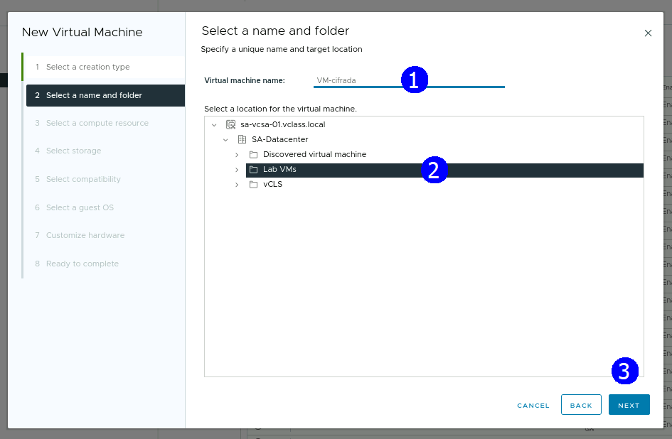

# Práctica 18. Creando una máquina virtual cifrada

## Objetivos de la práctica:

- Crear una máquina virtual cifrada.
- Confirmar que la máquina virtual está cifrada con un proveedor de llaves standard.

## Duración aproximada:
- 40 minutos.

## Instrucciones

## **Actividad \# 1**

### **Crear una Máquina virtual cifrada**

Utilizar la liga de acceso proporcionada por su instructor.

A manera de ejemplo:
[**https://vlabs.v2s.us/lab**](https://vlabs.v2s.us/lab)

Utilizar el usuario y contraseña que le proporcione su instructor.

A manera de ejemplo:

> Usuario: `student01a`
>
> Contraseña: `Arn0224!`
>
> Dar clic en **Login.**
>
Seleccionar en esta interfaz el primer pod de trabajo **vPodProd001a** (1).
>
>  alt="A screenshot of a computer Description automatically generated" />

Al entrar, en la siguiente interfaz proporcionar:

> Usuario: `student01`
>
> Contraseña: `VMware1!`

Dar clic en **OK.**

> Se obtiene acceso al escritorio remoto.
>
>  alt="A screenshot of a computer Description automatically generated" />

Abrir una instancia del browser Firefox con acceso directo al **vSphere
Client login interface.**

User: `administrator@vsphere.local>`

Password: `VMware1!`

Dar clic en **Login.**

Seleccionar la vista **VMs and Templates** (1). Dar clic derecho en **Lab VMs** (2), seleccionar **New Virtual Machine** (3).

Se despliega el asistente **New Virtual Machine**

En la página **Select a creation type** (1), seleccionar **Create a new
virtual machine** (2). **NEXT** (3).

En la página **Select a name and folder**, introducir el nombre de la máquina virtual **VM-cifrada** (1) en el campo
**Virtual machine name**.

Seleccionar la ubicación **Lab VMs** (2).

**NEXT** (3).

En la página **Select a compute resource** (1), expandir la lista
**SA-Datacenter** (2) y seleccionar **SA-Compute-02** (3); expandir la lista y
seleccionar el host **sa-esxi-06.vclass.local** (4). **NEXT** (5).

En la página **Select storage** (1), seleccionar **Encrypt this virtual
machine** (2). Automáticamente se activa la política de almacenamiento
**Management Storage Policy - Encryption** (3).
Seleccionar el datastore **vsanDatastore** (4). **NEXT** (5).

En la página **Select compatibility** dar clic en **NEXT** (1).

En la página **Select a guest OS** (1), seleccionar **Linux** (2) como opción en el apartado **Guest OS Family.** 
En la opción **Guest OS Version** seleccionar **VMware Photon OS
(64bit)** (3). **NEXT** (4).

En la opción de **CD/DVD Drive**, escoger **Datastore ISO File**.
Seleccionar el archivo el datastore **OPSCALE-Datastore** (1), dar clic en el
folder **ISO** (2), seleccionar el archivo **photon-3.0-a0f216d.iso** (3). **OK** (4).

En la página **Customize hardware**, configurar la máquina virtual con
los siguientes parámetros en su hardware virtual:

- **1 CPU** (1).

- **1 GB de memoria** (2).

- **1 disco de 2 GB** (3).

- **Red VM Network** (4).

Expandir la sección **New CD/DVD Drive** (5), activar la opción **Connect At
Power** (6). **NEXT** (8).

En la página **Ready to complete** (1), dar clic en **FINISH** (2).

Verificar que aparece en la lista la máquina **VM-cifrada** en el folder
**Lab VMs.**

## **Actividad \# 2**

### **Confirmar que la máquina virtual está cifrada con un proveedor de llaves standard**

Seleccionar la máquina virtual **VM-Cifrada** en el inventario (1).

En la pestaña **Summary** (2), revisar las especificaciones en la sección
**Virtual Machine Details** (3).

## Resultado esperado

Verificar que la máquina está cifrada.

