# Práctica 2. Compartir en forma centralizada los VMware VMtools

## Objetivos de la práctica:
- Ver el valor por default de la ubicación de las VMtools.
- Modificar la variable avanzada de ubicación de las VMtools.
- Usar una API para actualizar el Symlink del SO que apunta a las VMtools.
- Realizar la reconfiguración normal de servicios.

## Duración aproximada:
- 50 minutos.

> Versión 8

## Instrucciones

## **Actividad \# 1**

### **Ver el valor por default de la ubicación de las VMtools**

Utilizar la liga de acceso proporcionada por su instructor.

A manera de ejemplo:
[**https://vlabs.v2s.us/lab**](https://vlabs.v2s.us/lab)

Utilizar el usuario y contraseña que le proporcione su instructor.

A manera de ejemplo:

> Usuario: `student01a`
>
> Contraseña: `Arn0224!`
>
> Click en **Login**
>
Seleccionar en esta interfaz el primer pod de trabajo **vPodProd001a** (1)

>  alt="A screenshot of a computer Description automatically generated" />

Al entrar, en la siguiente interfaz proporcionar:

> Usuario: `student01`
>
> Contraseña: `VMware1!`

Dar clic en **OK**.

Se obtiene acceso al escritorio remoto.
>
>  alt="A screenshot of a computer Description automatically generated" />

Abrir una instancia del browser Firefox con acceso directo al **vSphere
Client login interface**.

User: `administrator@vsphere.local`

Password: `VMware1!`

Dar clic en **Login**.

En cada host existe una variable avanzada que apunta a un datastore, que
por default es un disco local en el que residen las **VMtools**.

La variable avanzada **UserVars.ProductLOckerLocation** tiene como valor
de default el directorio **/locker/packages/vmtoolsRepo/** en el disco
interno del servidor.

Para verificarlo:

En la vista de **Hosts & Clusters** (1), elegir el clúster
**SA-Compute-02** (2) y seleccionar el host **Esxi-04**(3). Dirigirse a la
pestaña **Configure** (4), en la sección de **System** (5), seleccionar
**Advanced System Settings** (6). Dar clic en **EDIT** (7).

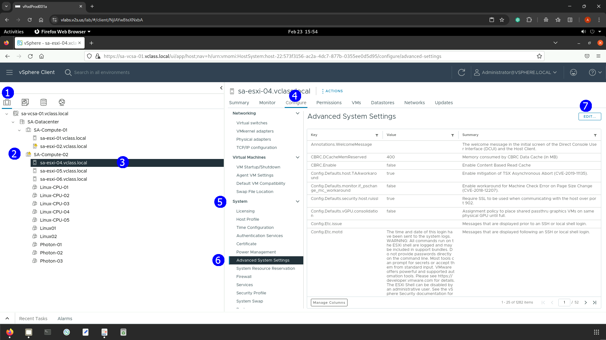

Se mostrará la caja de diálogo siguiente. Dar clic en el filtro (1) para
que se muestre un campo en donde se puede establecer el nombre de una
variable (2).

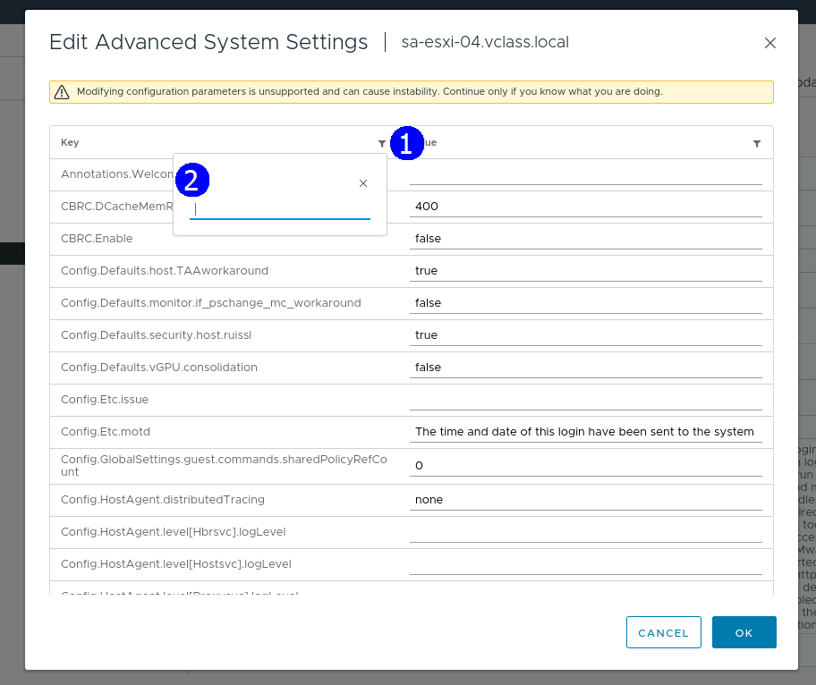

Escribir el nombre de la variable a investigar. Basta con escribir
**User.Vars.pl** para que se filtre de la lista la variable requerida.

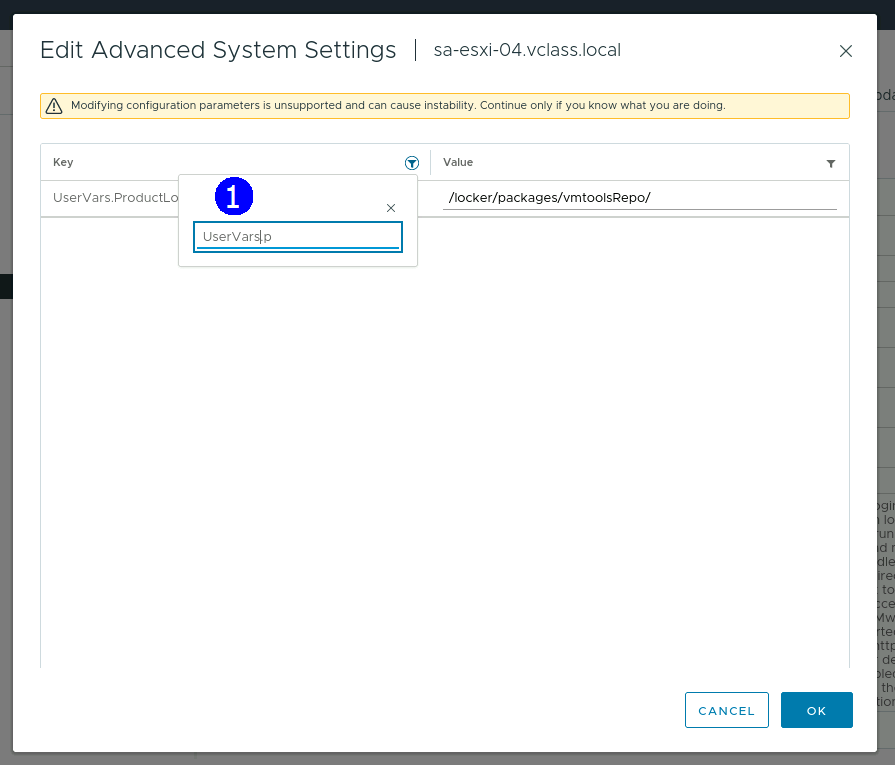

La variable avanzada **UserVars.ProductLOckerLocation** (1) tiene como
valor de default el directorio.

**/locker/packages/vmtoolsRepo/** (2)

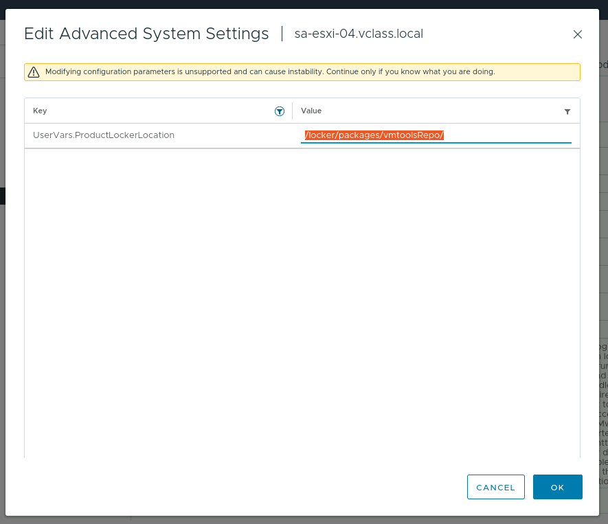

## **Actividad \# 2**

### **Modificación de la variable avanzada de ubicación de las VMtools**

Modificaremos el valor de esa variable emitiendo comando en el host con
un comando ESXi.

Para esto, activar los servicios de **ESXi Shell** y SSH en el host
**ESXi_04**.

En la vista de **Hosts & Clusters** (1), elegir el clúster
**SA-Compute-02** (2) y seleccionar el host **ESXi-04** (3). Dirigirse a la
pestaña **Configure** (4), en la sección **System** (5), dar clic en
**Services** (6). Observar el estado de los servicios **ESXi** **Shell**
(8) y **SSH** (10).

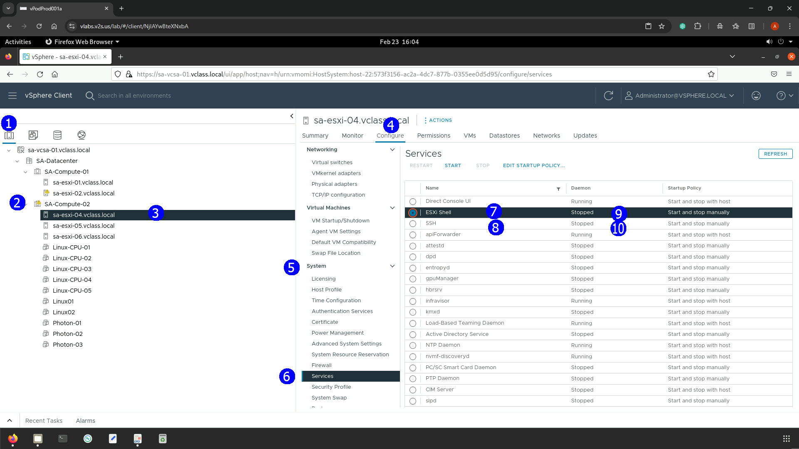

Elegir el servicio **ESXi Shell** (1) y dar clic en **START** (2).

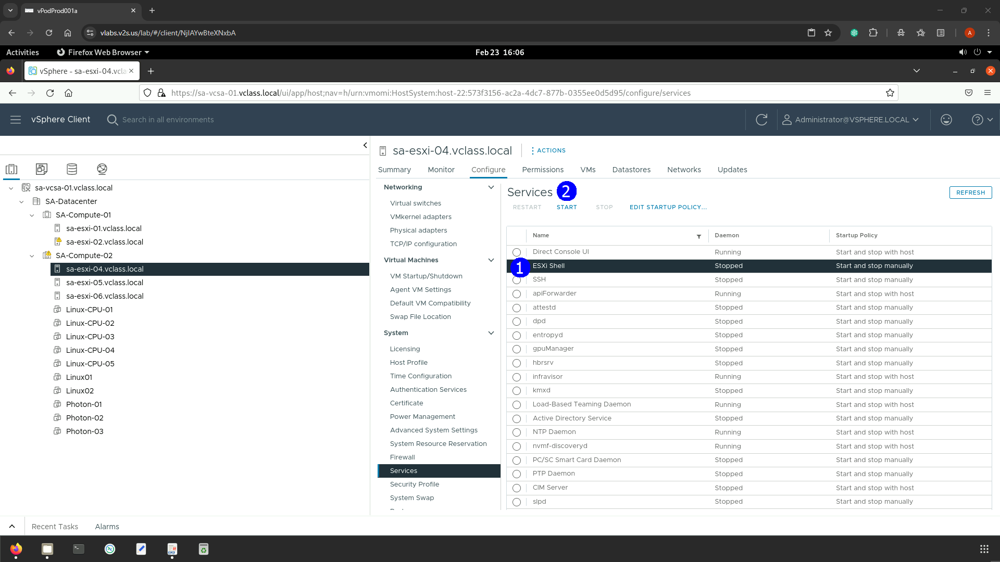

Elegir el servicio **SSH** (1) y dar clic en **START** (2).

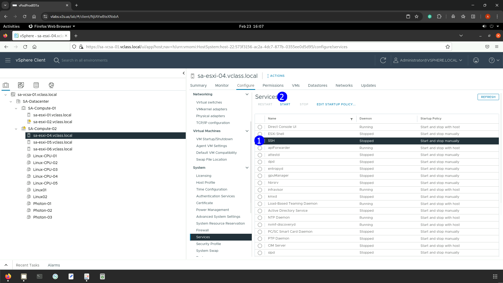

Los servicios ya están activos (1).

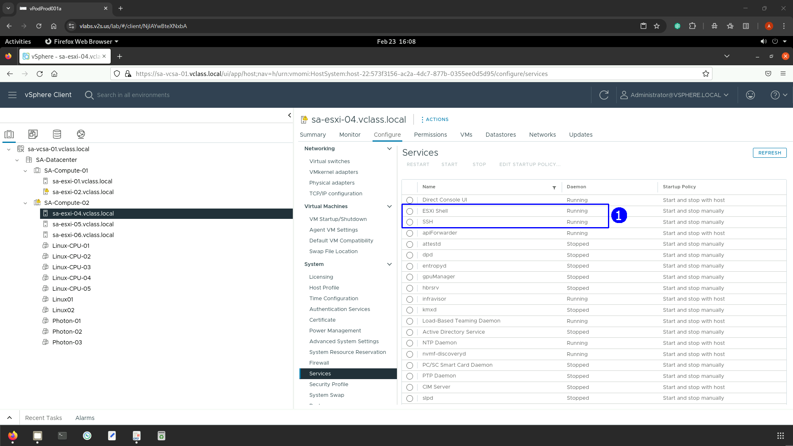

En el desktop ejecutar la aplicación **Remmina** (1).

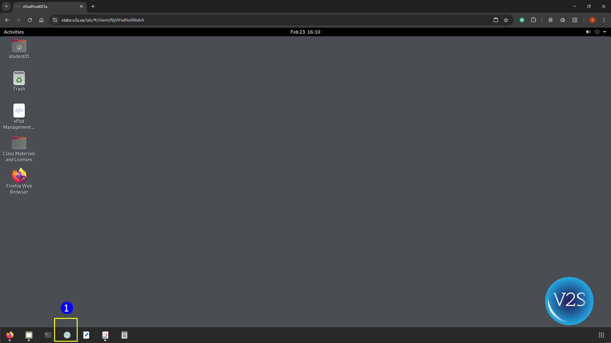

Proporcionar el password `VMware 1!` En la caja de autenticación.

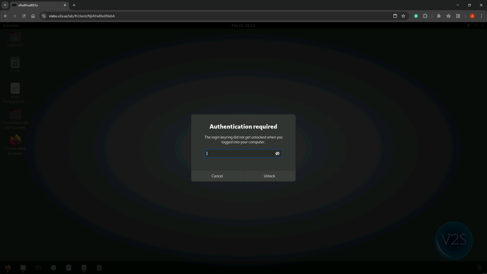

Dar doble clic en **SA-ESXI-04**.

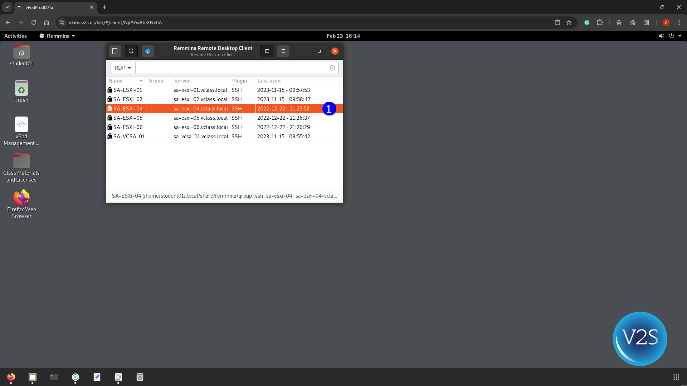

Se despliega la línea de comandos en el host.

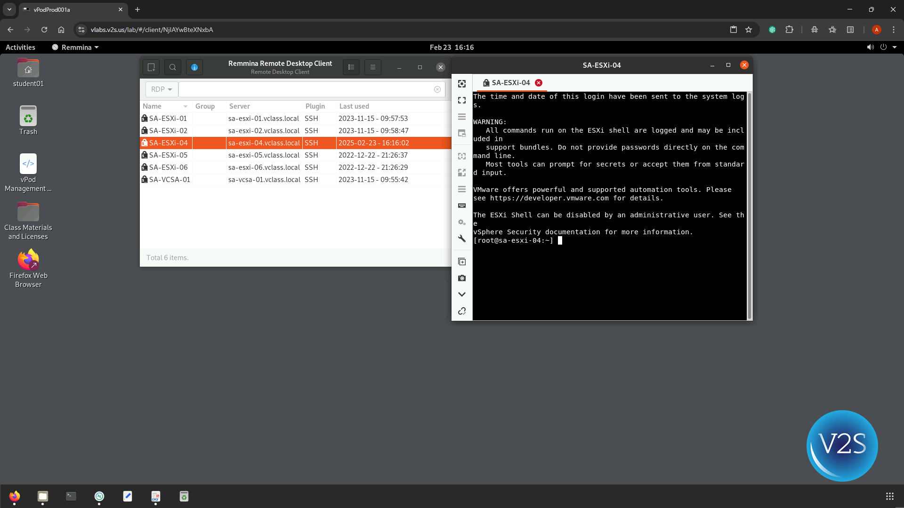

Enseguida, emitir el comando **ls** para mostrar los directorios, entre
ellos examinar el directorio **productLocker** que aloja actualmente las
**VMtools**.

`cd productLocker`

`ls`

Se muestran dos directorios asociados con las VMtools a saber:
**vmtools** y **floppies**

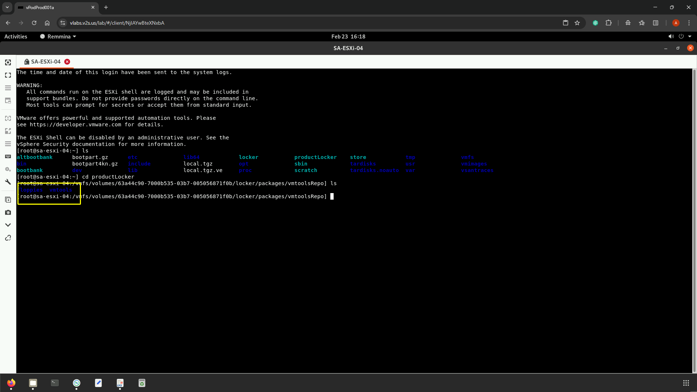

Examinemos ambos directorios que copiaremos a un datastore y
compartiremos para todos los host ESXi.

`cd vmtools`

`ls`

Se muestran los archivos listados en la siguiente imagen:

`cd ..`

`cd floppies`

`ls`

`cd ..`

`ls`

Se muestran los archivos listados en la siguiente imagen:

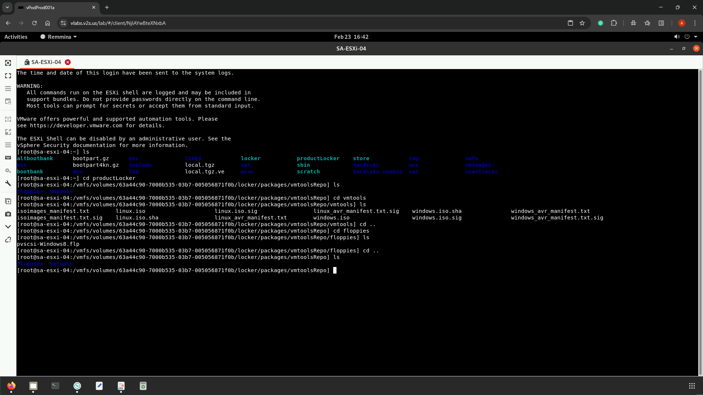

Enseguida, establecer en un datastore **compartido** un directorio en
donde se copiarán las **VMtools** y se actualizarán constantemente para
compartirlas con todos los hosts ESXi en el datacenter.

Emitir los comandos:

`mkdir /vmfs/volumes/OPSCALE-Datastore/VMtoolsShare`

`cp -r \* /vmfs/volumes/OPSCALE-Datastore/VMtoolsShare`

`cd /vmfs/volumes/OPSCALE-Datastore/VMtoolsShare`

`ls`

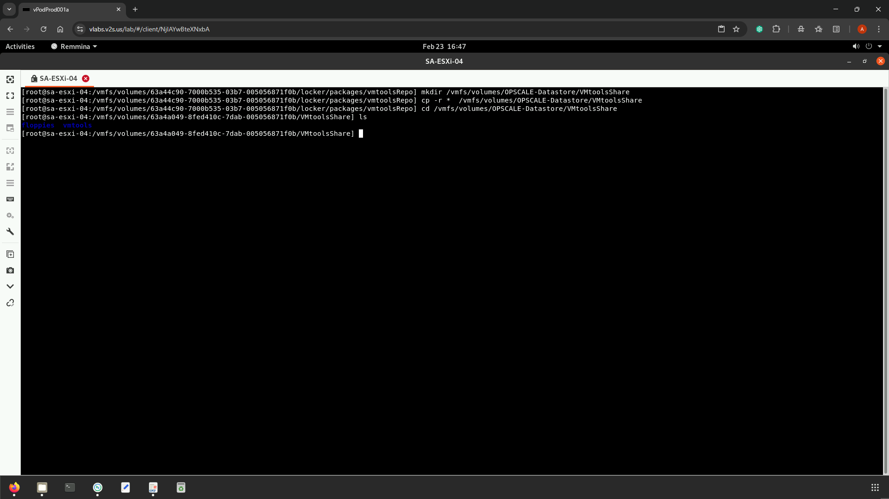

Examinar las copias de los dos directorios.

`cd VMtools`

`ls`

`cd ..`

`cd floppies`

`ls`

`cd ..`

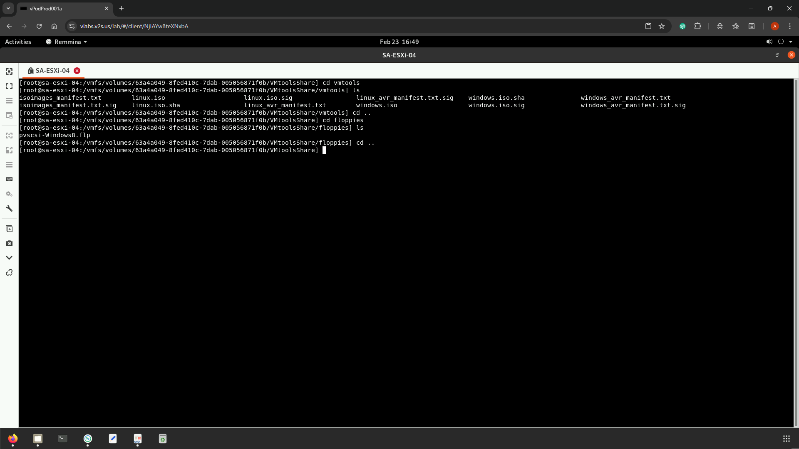

Con el siguiente comando modificamos el valor de la variable avanzada
del host.

**UserVars.ProductLOckerLocation** al valor deseado en un datastore
compartido al que tienen acceso todos los hosts ESXi en el datacenter
**/vmfs/volumes/OPSCALE-Datastore /VMtoolsShare**.

**esxcli system settings advanced set -o /UserVars/ProductLockerLocation
-s /vmfs/volumes/OPSCALE-Datastore/VMtoolsShare**

El nuevo valor se comprueba con el comando:

`esxcli system settings advanced list -o
/UserVars/ProductLOckerLocation`

Observar los resultados:

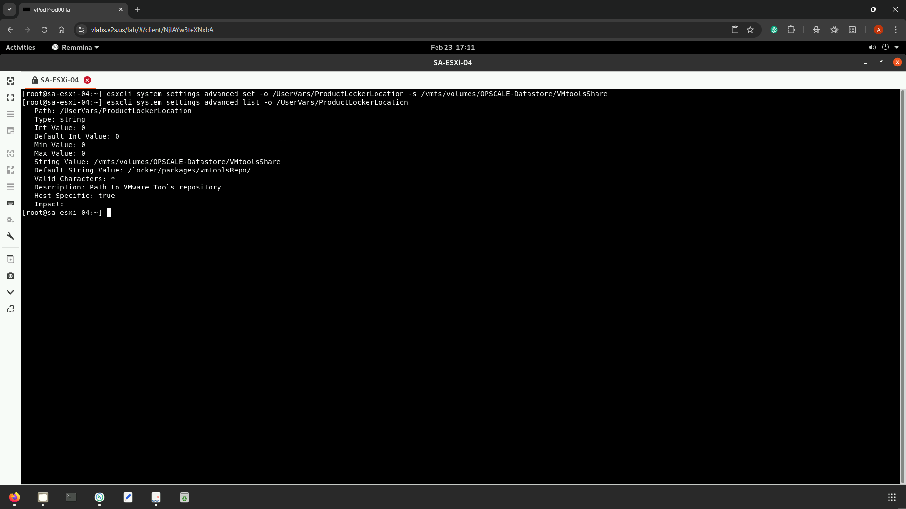

Si se retorna a la interfaz del vCenter y se examina el valor se ve
actualizado.

Para verificarlo:

En la vista de **Hosts & Clusters** (1), elegir el clúster
**SA-Compute-02** (2) y seleccionar el host **Esxi-04** (3). Dirigirse a la
pestaña **Configure** (4) y en la sección de **System** (5), seleccionar
**Advanced System Settings** (6). Dar clic en **EDIT** (7).

Abrir la lista y escribir:

`USerVars.Pro` para desplegar la variable.

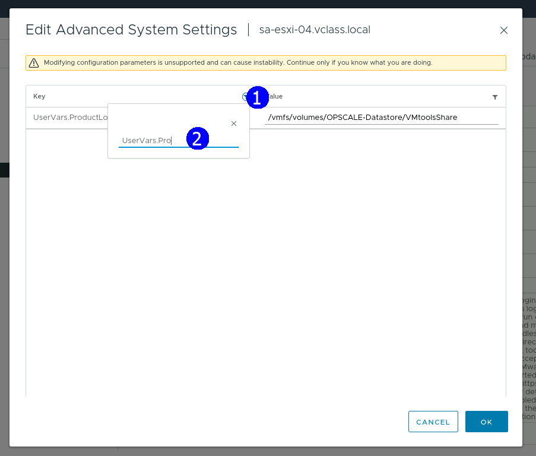

Se muestra que el punto en donde están la VMtools es:

**/vmfs/volumes/OPSCALE-Datastore/VMtoolsShare**

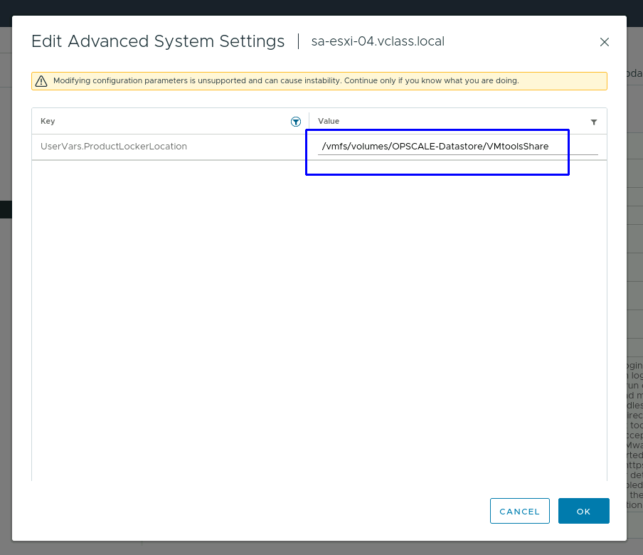

Dar clic **OK**.

## **Actividad \# 3**

### **Uso de una API para actualizar el Symlink del SO que apunta a las VMtools**

Para que este nuevo valor de variable avanzada entre en operación, es
necesario reiniciar el Host ESXi. Sin embargo, cuando se requiere no
interrumpir el servicio, se tiene la alternativa de modificar en el
Sistema operativo del Host el Symlink asociado. (Shortcut en el SO).
Esto se puede hacer con un comando Esxcli o con una llamada de una API.

Observar que en la salida del comando que usamos anteriormente, la variable
avanzada está actualizada pero el Symlink es **/productLocker -\>
/locker/packages/vmtoolsRepo**; no coinciden.

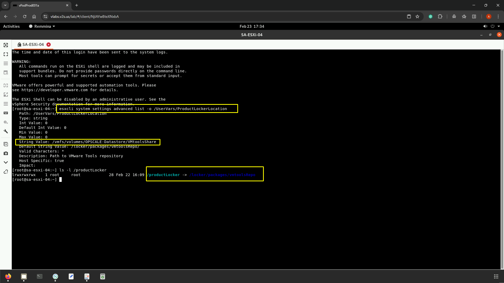

Para hacer uso de una API para ajustar este último valor, seleccionar en
el inventario el host **ESXi-04**. Observar de la URL en el browser el
número de host, en este caso es 22.

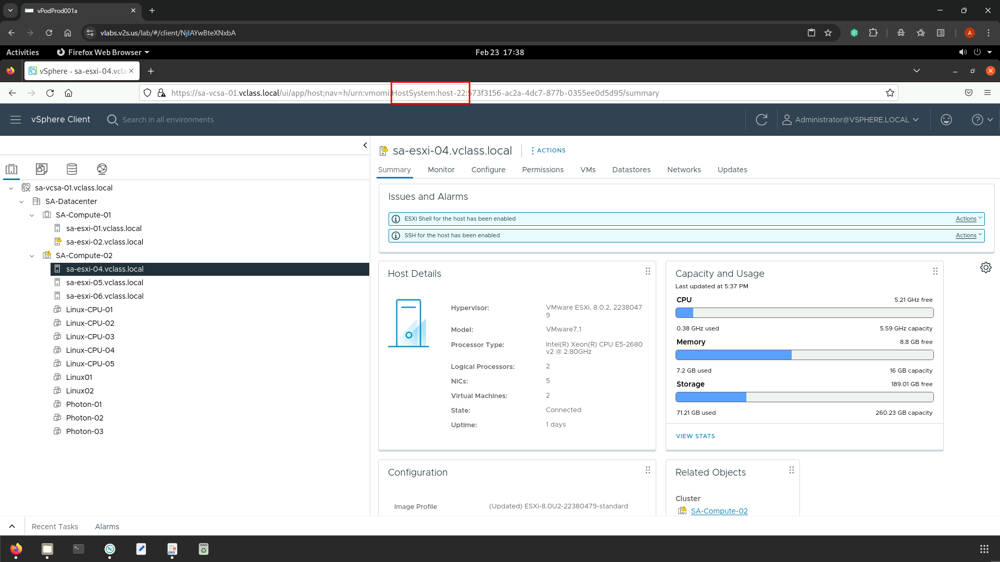

Abrir una nueva ventana usando el \# de host 22 en el URL siguiente, a
manera de ejemplo (sustituya según sea su caso).

[**https://sa-vcsa-01.vclass.local/mob/?moid=host-22&method=updateProductLockerLocation**](https://sa-vcsa-01.vclass.local/mob/?moid=host-22&method=updateProductLockerLocation)

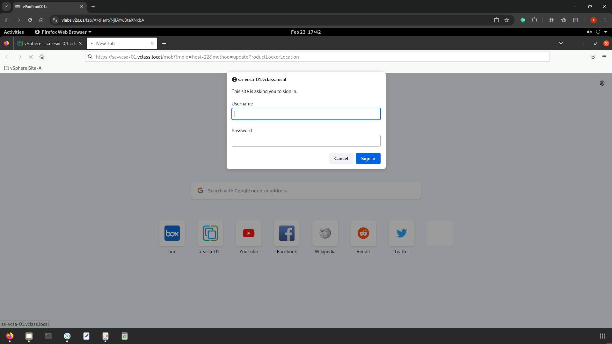

**Proporcionar:**

User: `administrator@vpshere.local`

Password: `VMware1!`

Se muestra la interfaz del api correspondiente para ajustar el
**Symlink** de **UpdateProductLockerLocation_Task** (1), en ella,
determinar el valor.

**/vmfs/volumes/OPSCALE-Datastore/VMtoolsShare** (2), dar click en **Invoke
Method** (3).

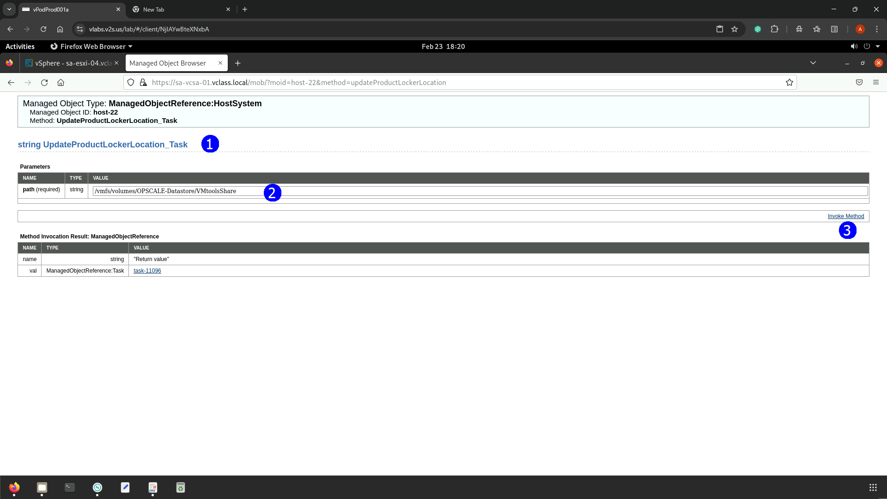

Se ejecuta el Method correspondiente (1)

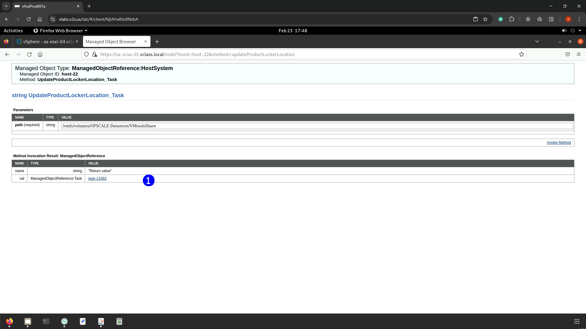

Con la llamada a la API ahora el **symlink** está actualizado.

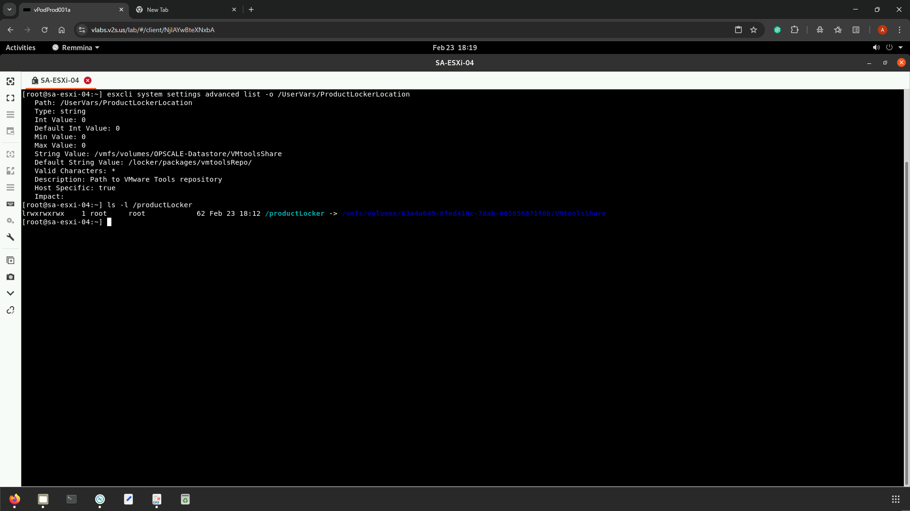

Estas operaciones se tendrían que realizar en cada host, ya sea
manualmente o con un script para automatizar el proceso.

## **Actividad \# 4**

### **Reconfiguración normal de servicios**

Finalmente, cerrar los procesos de ESXi y SSH.

En la vista de **Hosts & Clusters** (1), elegir el clúster
**SA-Compute-02** (2) y seleccionar el host **ESXi-04** (3). Dirigirse a la
pestaña **Configure** (4) y en la sección **System** (5), seleccionar
**Services** (6). Dar clic en **ESXi Shell** (7). **STOP** (8).

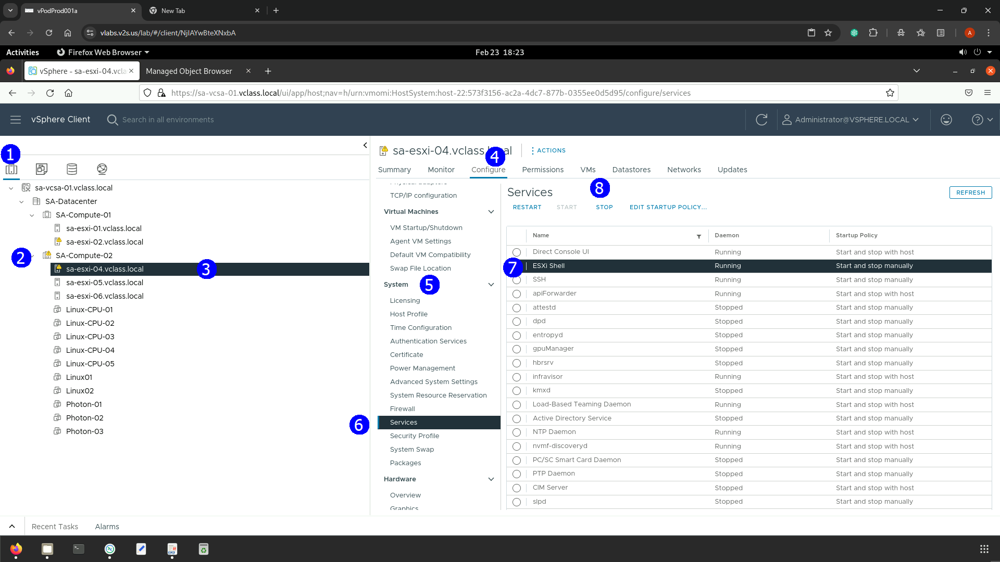

En la vista de **Hosts & Clusters** (1), elegir el clúster
**SA-Compute-02** (2) y seleccionar el host **ESXi-04** (3). Dirigirse a la
pestaña **Configure** (4) y en la sección **System** (5), seleccionar
**Services** (6). Dar click en **SSH** (7). **STOP** (8).

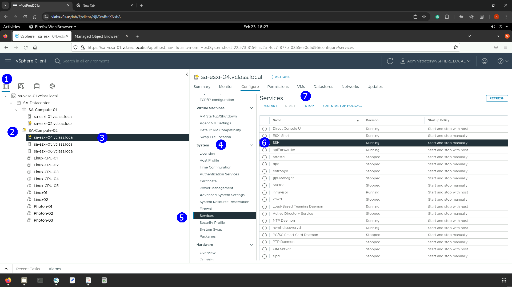

Ahora lucen apagados ambos servicios (1).

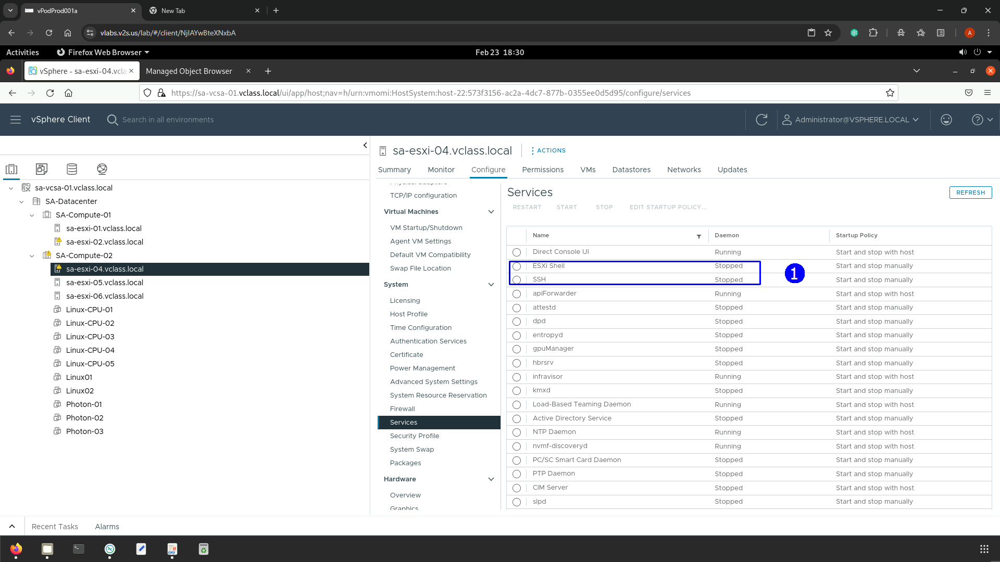
