# Práctica 4. Manejo adecuado de las vCLS VMs en operaciones del storage 

## Objetivos de la práctica:

- Explorar en el clúster el estado de las vCLS VMs.
- Realizar el manejo de vCLS VMs al establecer el modo de mantenimiento del storage en donde residen (usar modo de retiro).

## Duración aproximada:
- 20 minutos.

## Instrucciones

## **Actividad \# 1**

### **Explorar en el clúster el estado de las vCLS VMs**

Utilizar la liga de acceso proporcionada por su instructor.

A manera de ejemplo:
[**https://vlabs.v2s.us/lab**](https://vlabs.v2s.us/lab)

Utilizar el usuario y contraseña que le proporcione su instructor.

A manera de ejemplo

> Usuario: `student01a`
>
> Contraseña: `Arn0224!`
>
> Dar clic en **Login.**
>
Seleccionar en esta interfaz el primer pod de trabajo **vPodProd001a** (1).
>
>  alt="A screenshot of a computer Description automatically generated" />

Al entrar, en la siguiente interfaz proporcionar:

> Usuario: `student01`
>
> Contraseña: `VMware1!`

Dar clic en **OK.**

> Se obtiene acceso al escritorio remoto.
>
>  alt="A screenshot of a computer Description automatically generated" />

Abrir una instancia del browser Firefox con acceso directo al **vSphere
Client login interface**.

User: `administrator@vsphere.local`

Password`: VMware1!`

Dar clic en **Login.**

Recordemos que las **vCLS VMs** se utilizan para garantizar que ciertas
operaciones del clúster, como **DRS** y **HA**, sigan funcionando
incluso si vCenter está temporalmente inaccesible.

Las **vCLS VMs** son creadas automáticamente por vSphere en cada host
del clúster.

Si en las operaciones del clúster es requerido poner el datastore en el
que se alojan los discos de estas máquinas virtuales vCLS en
mantenimiento, es necesario proactivamente migrar con storage vMotion
las vCLS VMS a otro datastore compartido para continuar la protección.

Alternativamente se podrá poner el clúster en modo de retiro apagando y
eliminando las VMs vCLS, eliminando la protección de servicios
distribuidos HA y DRS.

Se pueden observar las VMs que se han creado en el clúster y las vCLS
VMs.

En la vista de **Hosts & Clusters** (1), elegir el clúster
**SA-Compute-02** (2), dar click en la pestaña **VMs** (3), se ven las VMs
de operación (4) y las vCLS VMs (5).

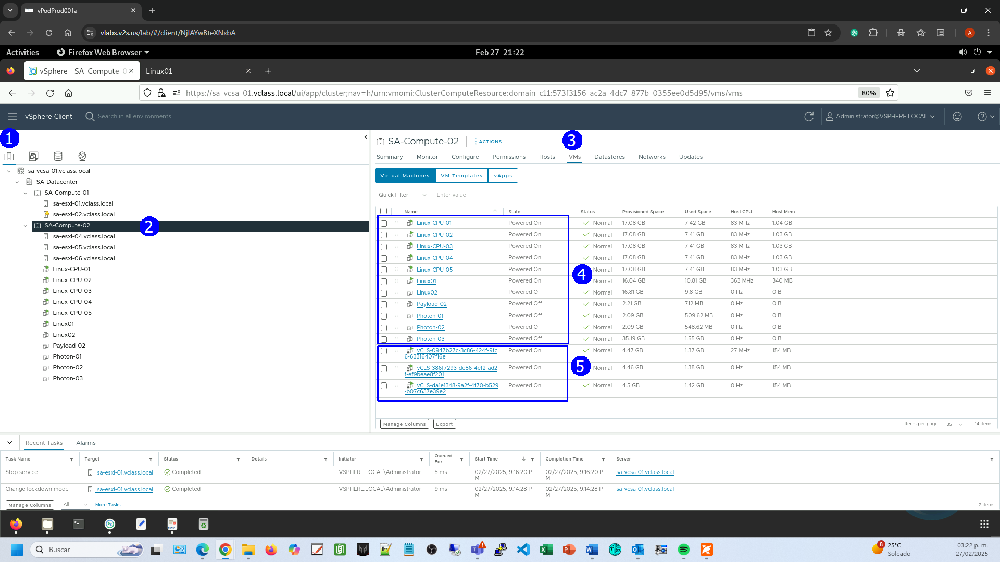

Para observar las **vCLS VMs**, también se puede seleccionar la vista de
**VMS & Templates** (1), en la misma se muestran por separado (2).

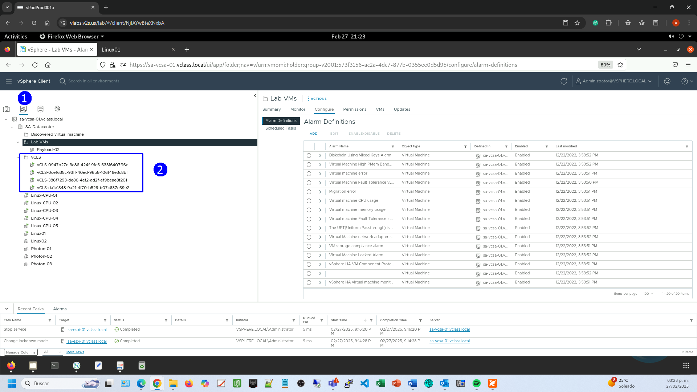

Veamos cómo están ubicadas a nivel de servidor.

En la vista de **Hosts & Clusters** (1), elegir el clúster
**SA-Compute-02** (2) y seleccionar el host **sa-esxi-04** (3). Dirigirse a la
pestaña **VMs** (4), aquí se puede observar que en el host
**sa-esxi-04** está registrada una vCLS VM (5).

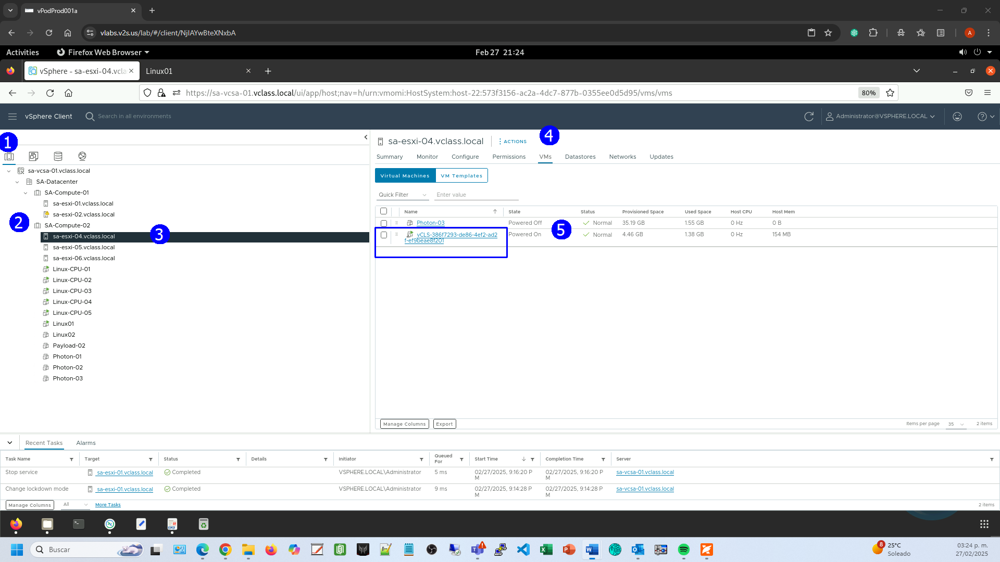

De manera semejante, y por temas de alta disponibilidad, vemos la otra
VCLS en el Host **sa-esxi-05**.

En la vista de **Hosts & Clusters** (1), elegir el clúster
**SA-Compute-02** (2) y seleccionar el host **sa-esxi-05** (3). Dirigirse a la
pestaña **VMs** (4), aquí se puede observar que en el host
**sa-esxi-05** está registrada otra vCLS VM (5).

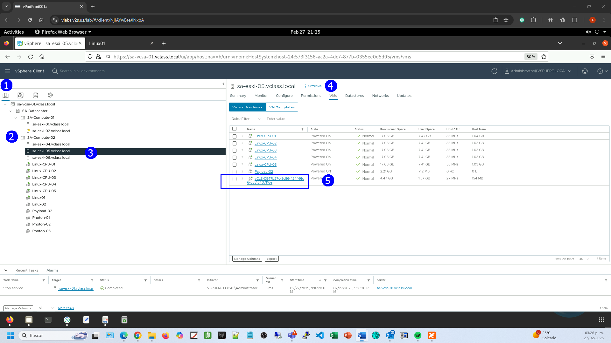

Finalmente, vemos la otra VCLS en el Host **sa-esxi-06**.

En la vista de **Hosts & Clusters** (1), elegir el clúster
**SA-Compute-02** (2) y seleccionar el host **sa-esxi-06** (3). Dirigirse a la pestaña **VMs** (4), aquí se puede observar que en el host
**sa-esxi-06** está registrada una tercera vCLS VM (5).

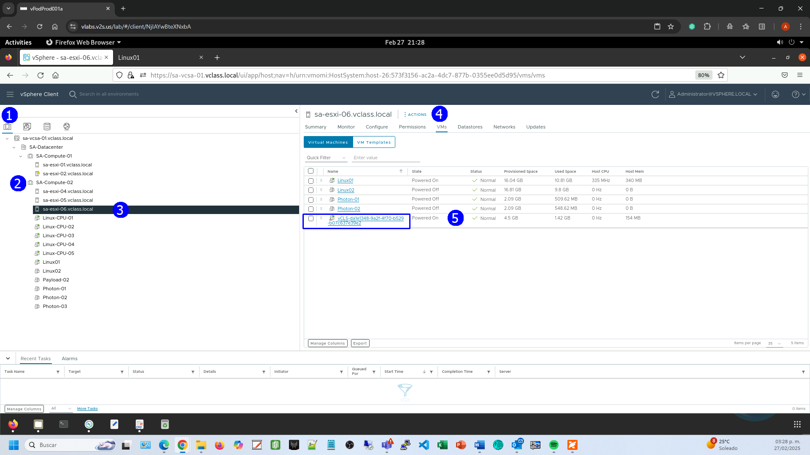

## Actividad \#2

### **Manejo de vCLS VMs al establecer el modo de mantenimiento del storage en donde residen (uso de modo de retiro)**

Veamos cómo se da el proceso ordenado de poner el datastore que aloja
las vCLS VMs.

Observar el clúster **SA-Compute-01** (1) con dos hosts **sa-esxi-01** y
**sa-esxi-02** (2) con VMs **vCLS** (5).

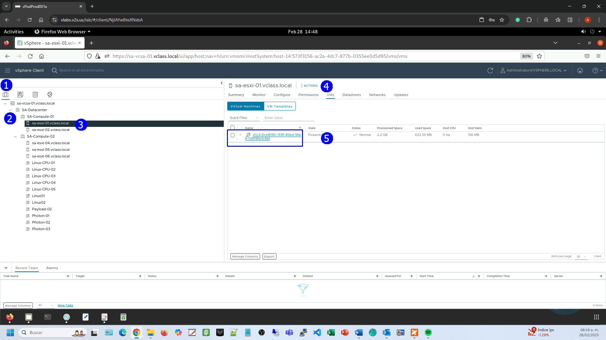

Dar clic en la **VM vCLS** (1).

Eso nos lleva a la vista de **VMs and Templates** (2), clic en la pestaña
**Summary** (3).

Al desplazarse a la sección **Related Objects** (4), se observa que está
almacenada en el datastore **ICM-Datastore** (5).

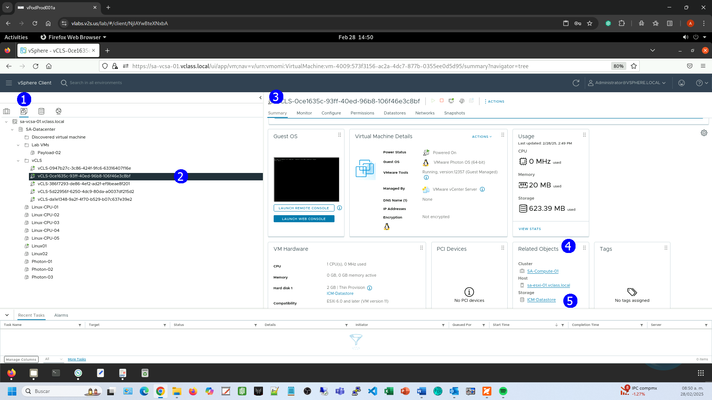

Algo similar podremos observar si en la vista de **Host & Clusters** (1)
seleccionamos el host **sa-esxi-02** (3), damos click en la pestaña **VMs** (4),
ahí existe otra VM tipo **vCLS** (5).

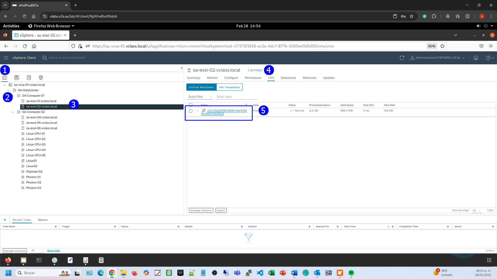

Dar click en la **VM vCLS** (1).

En la vista de **VMs & Templates,** dirigirse a la pestaña **Datastores** (2).

Vemos que también está en el datastore **ICM-Datastore** la otra **vCLS
VM** (3).

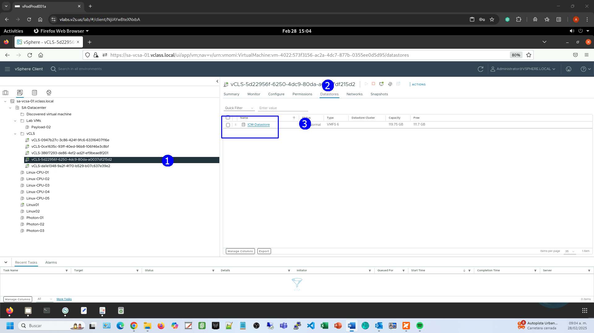

Para ver que VMs tiene el datostore **ICM-Datastore**.

Seleccionar la vista de **Datastores** (1), click en el datastore
**ICM-Datastore** (2), clic en la pestaña **VMS** (3).

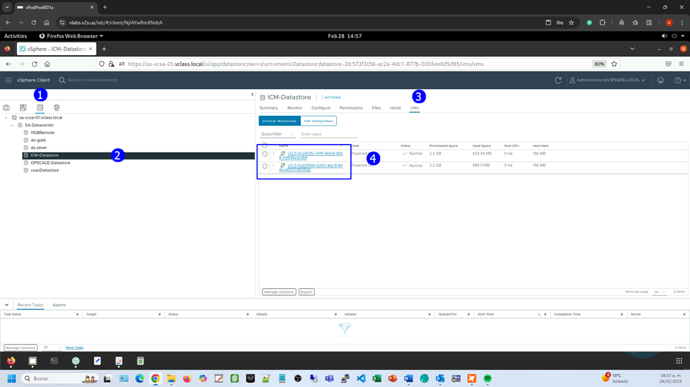

El punto central de nuestro ejercicio es que si deseamos poner el
datastore en modo de mantenimiento **es necesario que no tenga VMs
encendidas**.

En este caso, la VMs que tiene son VMs tipo vCLS que sirven de protección
en los servicios distribuidos de HA, DRS, etc. Por lo que al tratar de
poner en modo mantenimiento el storage, vSphere propone moverlas a otro
storage con storage vMotion para mantenerlas encendidas.

Seleccionar el datastore **ICM-Datastore** (2), hacerc clic derecho y elegir
**Maintenance mode** (3), seleccionar **Enter Maintenance Mode** (4).

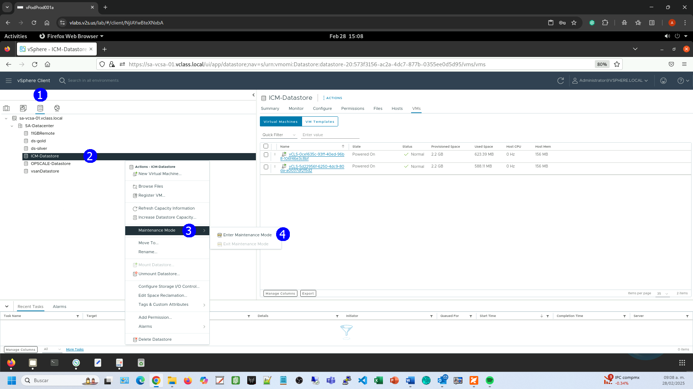

Se muestra la caja de diálogo con la propuesta de migración.

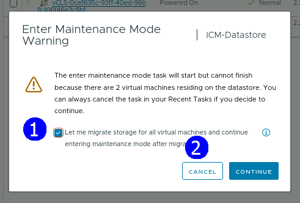

**CANCEL**

Alternativamente, **para poner el clúster en modo de retiro**.

En la vista de **Host & Clusters** (1), seleccionar el clúster
**SA-Compute-01** (2). Dirigirse a la pestaña **Configure** (3).
En la sección **vSphere Clusters Services**, seleccionar **General** (4),
dar clic en **EDIT VCLS MODE** (5).

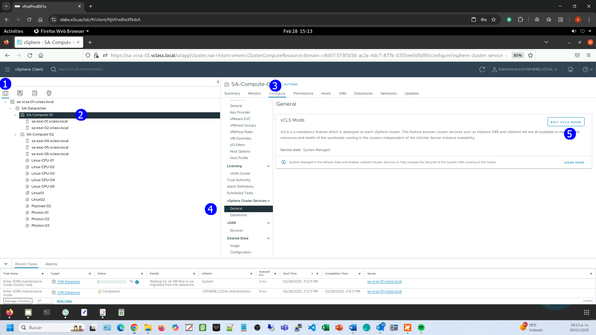

Se despliega la caja de diálogo **Edit vCLS Mode**, seleccionar
**Retreat Mode** (1). **OK** (2).

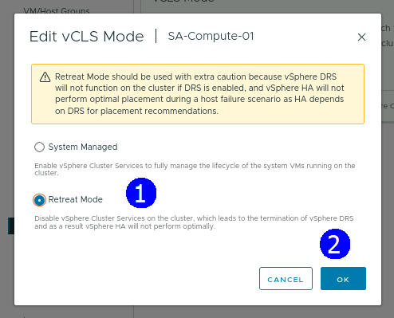

Observar en la pestaña VMS (5) que con esto se apagan y eliminan las VMs
tipo **vCLS** (6).

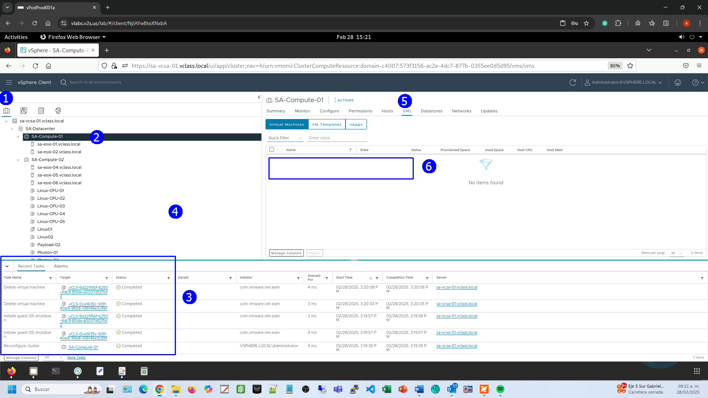

## Resultado esperado

El datastore ICM-Datastore está en modo mantenimiento sin VMs encendidas.

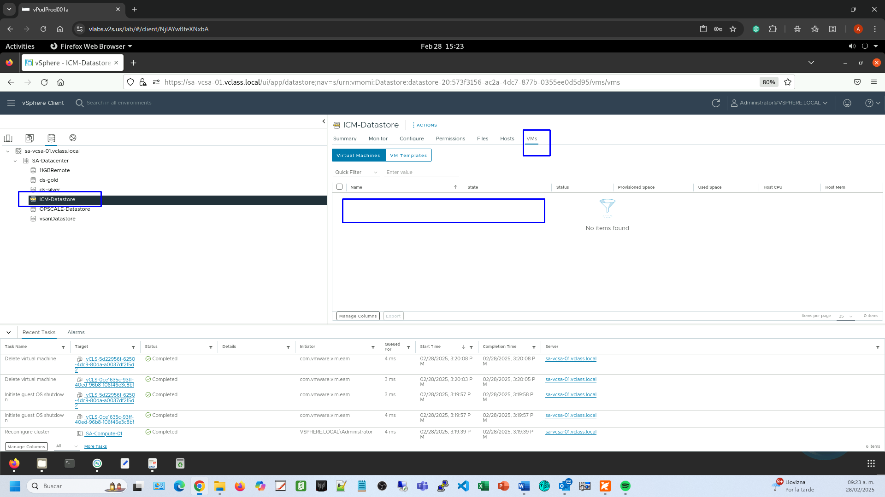

**Así los servicios de DRS y HA se verán afectados directamente.**

## Para revertir la operación:

Seleccionar la vista de **Host & Clusters.**

Dar clic en el clúster **SA-Compute-01 (1)**.

Dirigirse a la pestaña **Configure** (2).

En la sección **vSphere Clusters Services** seleccionar **General** (3),
dar click en **EDIT VCLS MODE** (4).

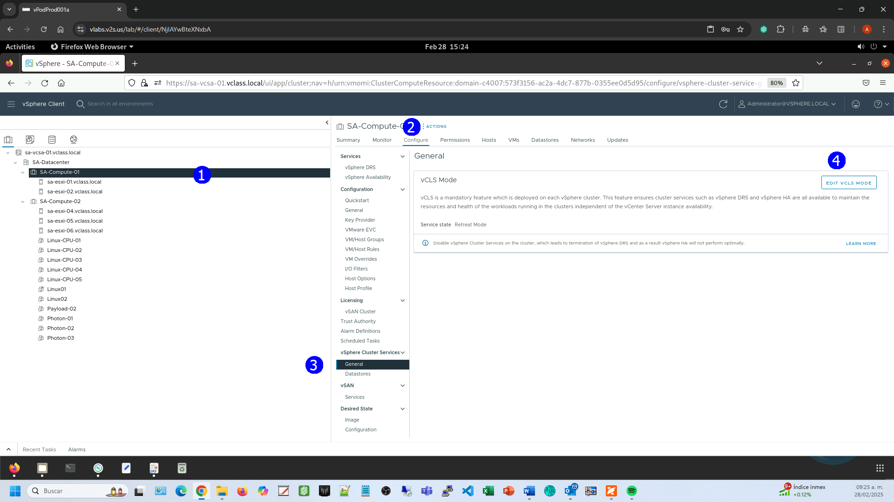

Seleccionar la opción **System Managed** (1). **OK** (2).

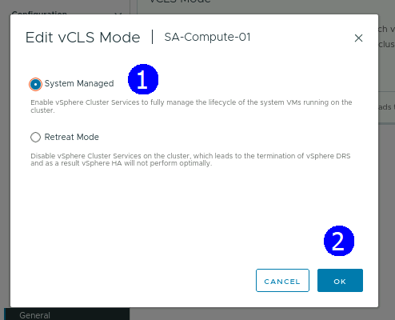

Se crea una VM de tipo **vCLS**

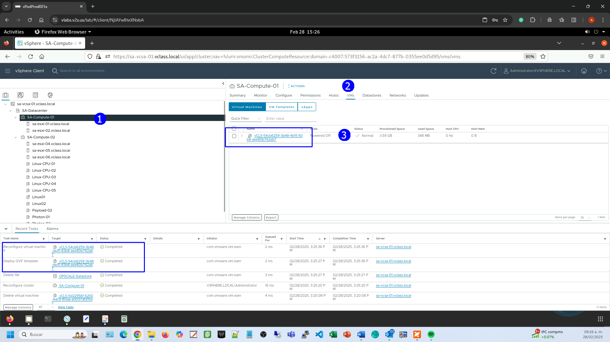
