# Práctica 6. Administración de switches distribuidos 

## Objetivos de la práctica:

- Agregar un grupo de puertos en un switch distribuido.
- Activar la verificación de estado de salud del switch distribuido.
- Verificar la funcionalidad del estado de salud del switch distribuido.
- Realizar la corrección de errores reportados.
- Anular la verificación de estado de salud del switch distribuido.
- Exportar la configuración de un switch distribuido.

## Duración aproximada:
- 30 minutos.

## Instrucciones

## **Actividad \# 1**

### **Agregación de un grupo de puertos en un Switch distribuido**

Utilizar la liga de acceso proporcionada por su instructor.

A manera de ejemplo:
[**https://vlabs.v2s.us/lab**](https://vlabs.v2s.us/lab)

Utilizar el usuario y contraseña que le proporcione su instructor.

A manera de ejemplo

> Usuario: `student01a`
>
> Contraseña: `Arn0224!`
>
> Click en **Login**
>
Seleccionar en esta interfaz el primer pod de trabajo **vPodProd001a** (1).
>
>  alt="A screenshot of a computer Description automatically generated" />

Al entrar, en la siguiente interfaz proporcionar:

> Usuario: `student01`
>
> Contraseña: `VMware1!`

Dar clic en **OK**.

> Se obtiene acceso al escritorio remoto.
>
>  alt="A screenshot of a computer Description automatically generated" />

Abrir una instancia del browser Firefox con acceso directo al **vSphere
Client login interface.**

User: `administrator@vsphere.local`

Password: `VMware1!`

Dar clic en **Login**.

En la vista de **Redes** (1), elegir el switch **vds-Production** (2).
En el menú contextual, seleccionar **Distributed Port Group** (3), dar clic
en **New Distributed port Group** (4).

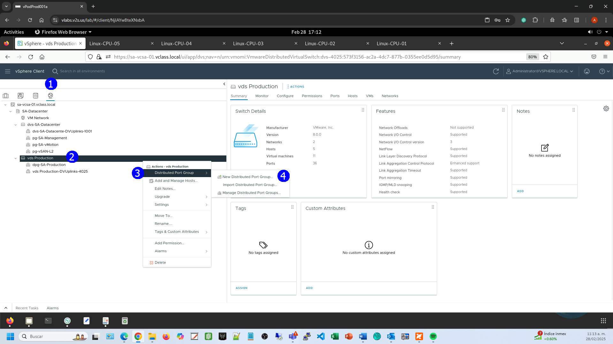

En el paso **Name and Location** (1), proporcionar el nombre del nuevo
grupo de puertos **pg-for-testing** (2). **NEXT** (3).

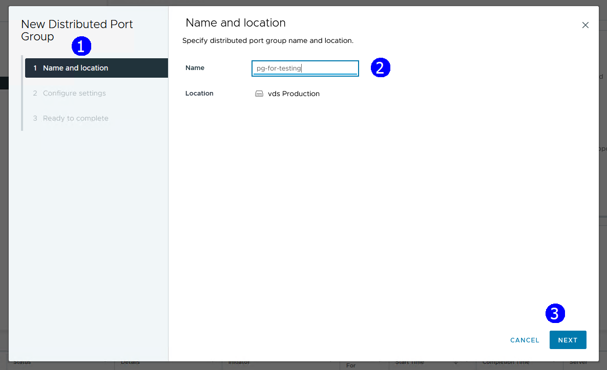

En el paso **Configure settings** (1), dejar los valores por default,
excepto **VLAN Type** y **Vlan ID**, establecerlos como **VLAN** **10**
(2). **NEXT** (4). 
Esta última configuración la utilizaremos para
detectar un error de configuración.

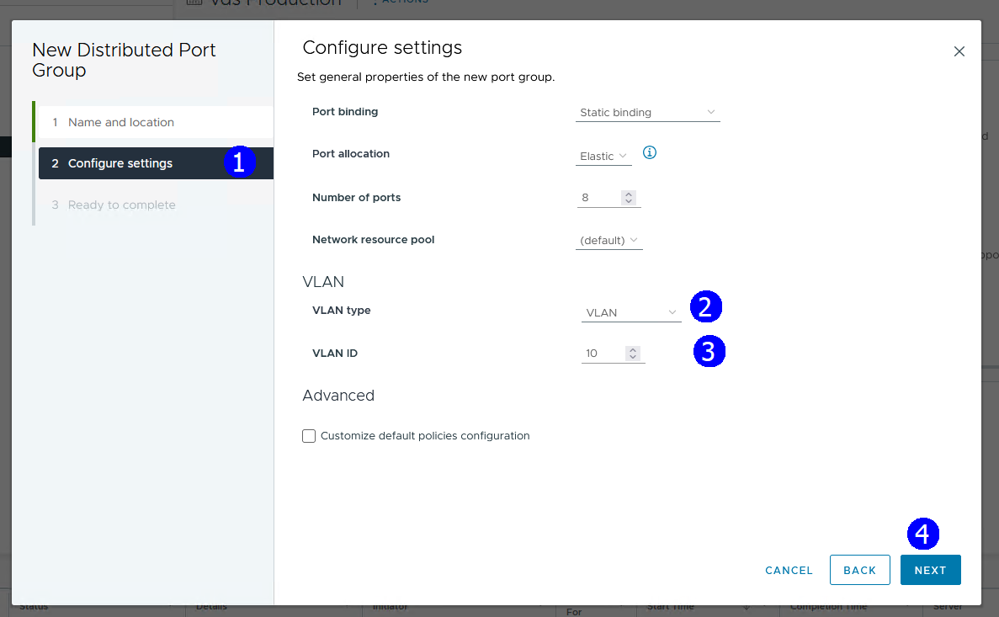

Se muestran a configuración a establecer. **FINISH** (1).

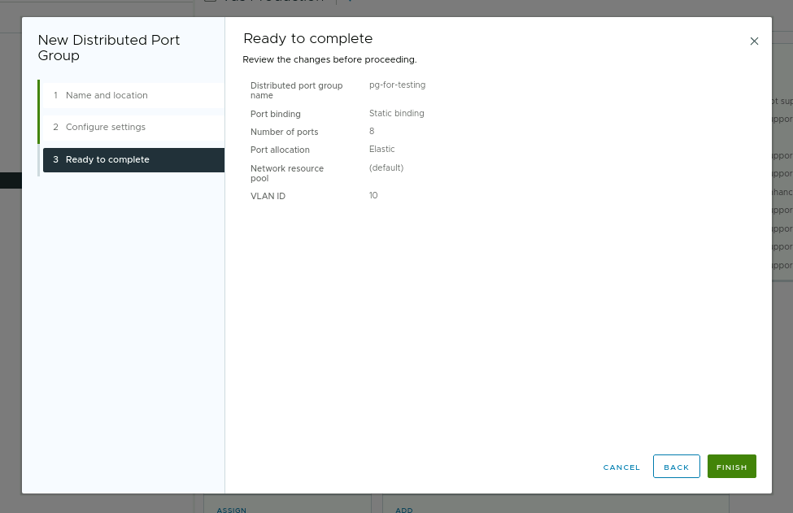

## **Actividad \# 2**

### **Activar la verificación de estado de salud del switch distribuido**

Con el propósito de habilitar la funcionalidad de “**Healt Check**”:

En la vista de **Redes** (1), elegir el switch **vds Production** (2). Dirigirse a
la pestaña **Configure** (3), en la sección **Settings**, seleccionar **Health Check** (4).  **EDIT** (5).

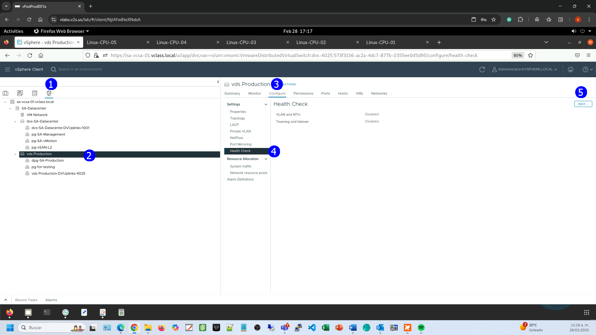

Establecer **Enabled** en ambas secciones **VLAN and MTU** (1), y en
**Teaming and Failover (2). OK** (3).

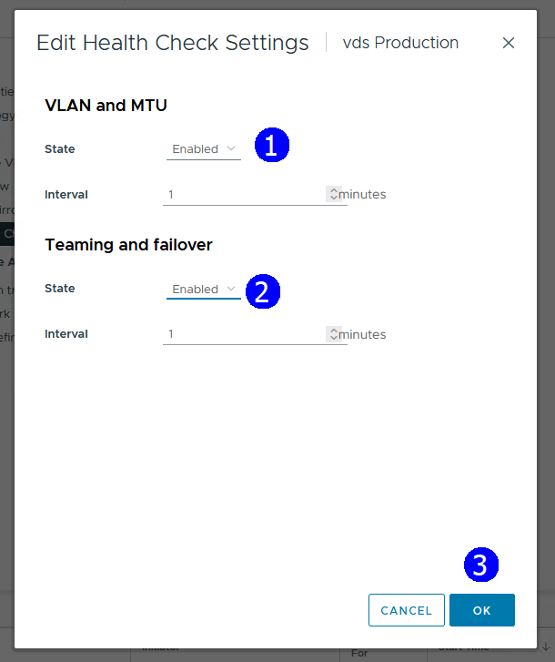

## **Actividad \# 3**

### **Verificar la funcionalidad del estado de salud del switch distribuido**

Es importante considerar que los resultados de los cambios que se
establecieron en VLAN 10 y MTU, pueden ser o no de impacto en la
configuración dependiendo de como está construida la red física.

Si la red física está configurada y no soporta la configuración del
Swith el servicio de “**Health check”** detectará la inconsistencia.

En la vista de Redes (1), seleccionar el switch **vds Production** (2).
Dirigirse a la pestaña **Monitor** (3) y en la sección de **Tasks and
Events** elegir **Health** (4). Dar clic en el host **sa-esxi-01**(5) y
observar que la configuración es consistente con la red física (6), esto
puede ser si la red está en modo troncal.

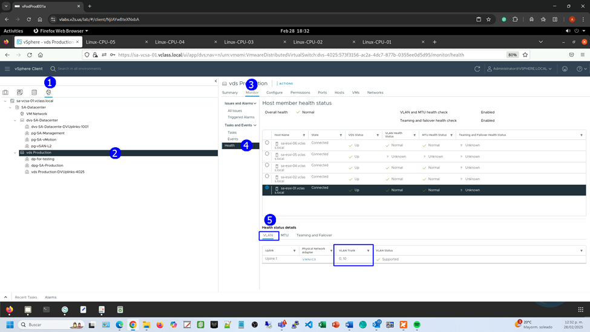

Agregar otra condición a detectar con esta funcionalidad al modificar el
MTU en el Switch para manejar Jumbo frames altamente utilizado en el
storage.

Dar clic derecho en el Switch **vds Production** y seleccionar **Settings**,
elegir **Edit Settings**.

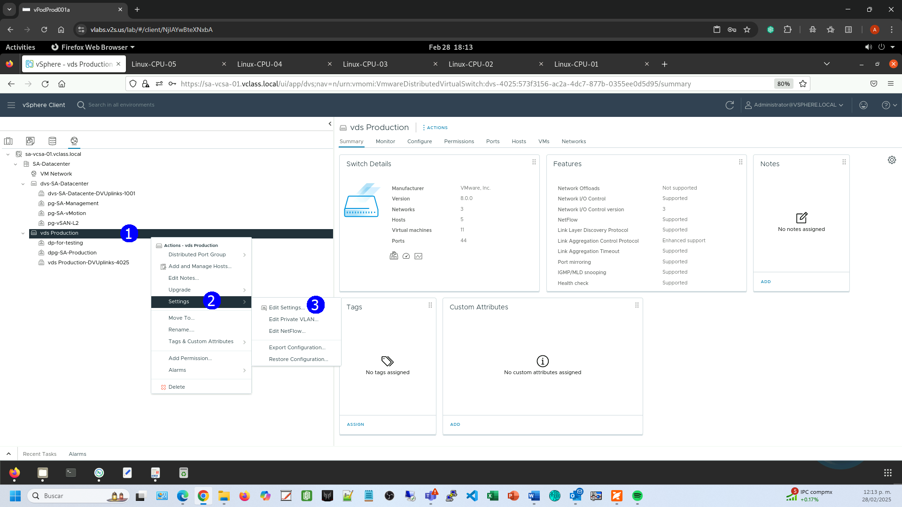

Seleccionar la pestaña **Advanced**, en el campo **MTU** **(Bytes)**
escribir 9000.  **OK**.

Se nota que esto afectó a todos los hosts, observar que no es compatible
con la configuración física.

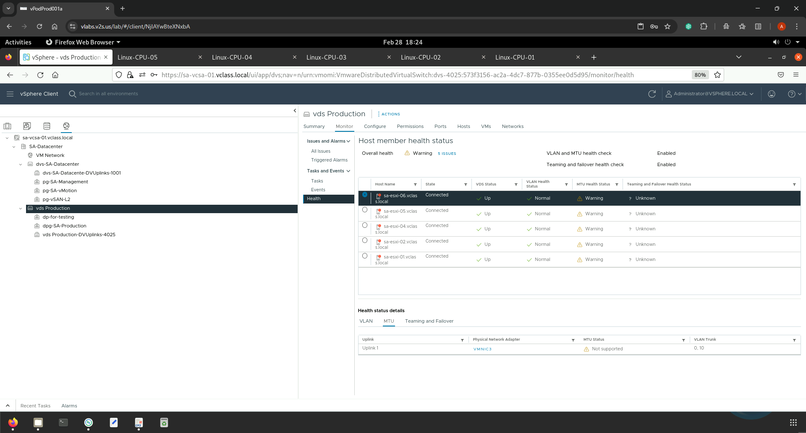

**Actividad \# 4**

**Corrección de errores reportados**

Para corregir el error de configuración detectado.

En la vista de **Redes**, elegir el port group **pg-for-testing**, en
el menú contextual, seleccionar **Edit Settings**.

En la sección **VLAN** (1) establecer en **VLAN Type:** **None** (2).
**OK** (3).

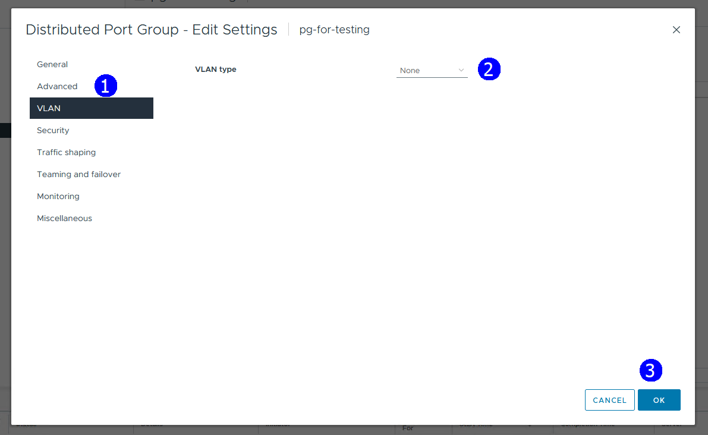

Dar clic derecho en el Switch **vds Production** y seleccionar **Settings**,
click, elegir **Edit Settings**.

Seleccionar la pestaña **Advanced**. En el campo **MTU** **(Bytes)**
escribir 1500. **OK**.

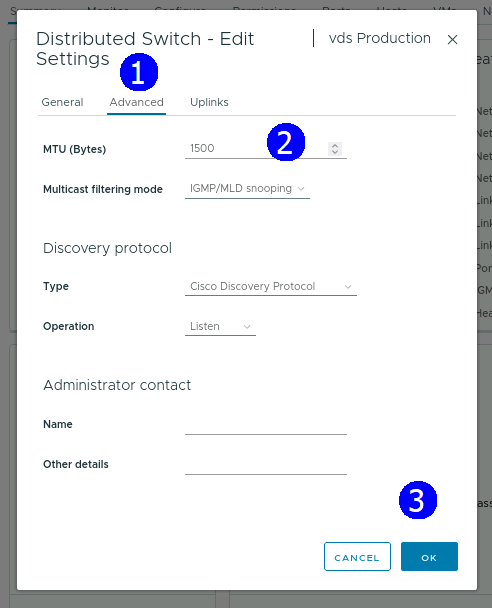

En la vista de Redes (1), seleccionar el switch **vds Production** (2).
Dirigirse a la pestaña **Monitor** (3), en la sección de **Tasks and
Events** seleccionar **Health** (4). Ya no se observan errores.

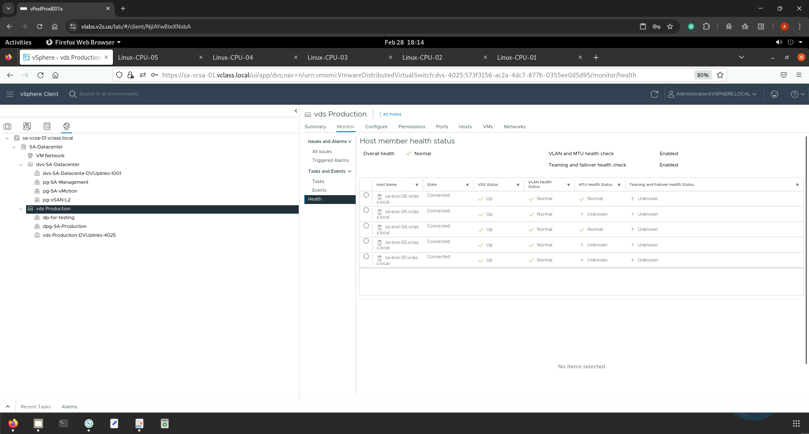

## **Actividad \#4**

### **Anular la verificación del estado de salud del switch distribuido**

Para desactivar la función “**Health check**”.

En la vista de **Redes** (1), seleccionar el switch **vds Production** (2).
Dirigirse a la pestaña **Configure** (3) y en la sección de **Settings**
seleccionar **Health Check** (4). Dar clic en **EDIT** (6).

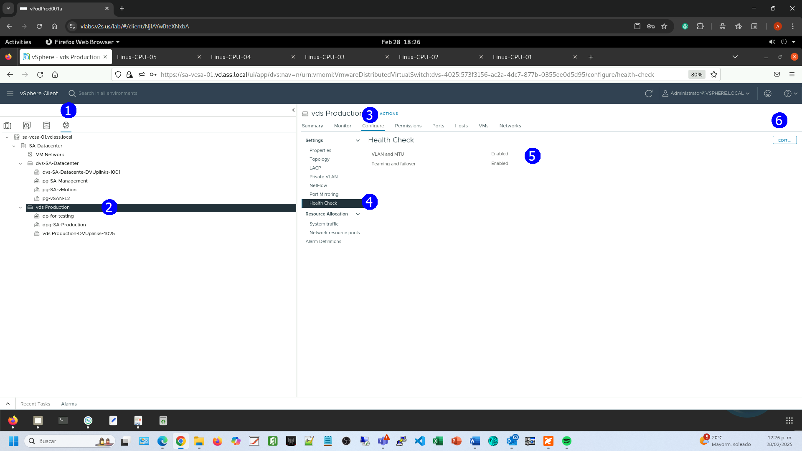

Establecer **Disabled** en ambas secciones **VLAN** **and** **MTU** (1)
y **Teaming** **and** **Failover** (2). **OK** (3).

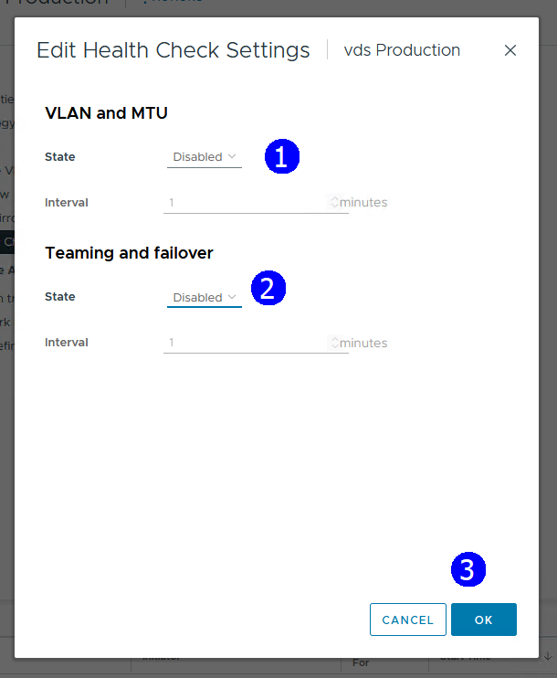

## **Actividad \# 5**

### **Exportación de la configuración de un switch distribuido**

La exportación de la configuración para aplicar en otro switch
distribuido se realiza de la siguiente manera:

En la vista de **Redes** (1), seleccionar el switch **vds Production** (2).
En el menú contextual, seleccionar **Settings** (3) y elegir **Export
configuration** (4).

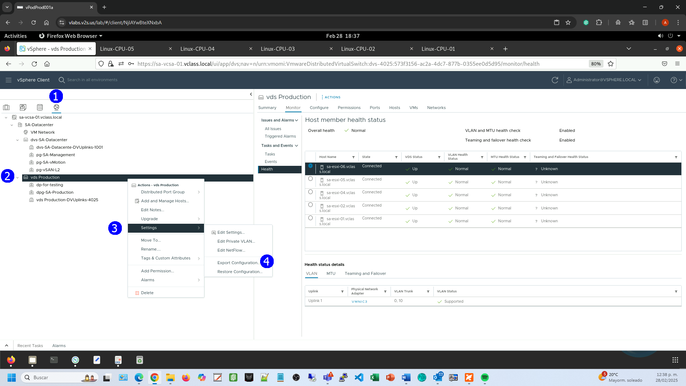

Establecer **Distributed switch and all port groups** (1). **OK** (2).

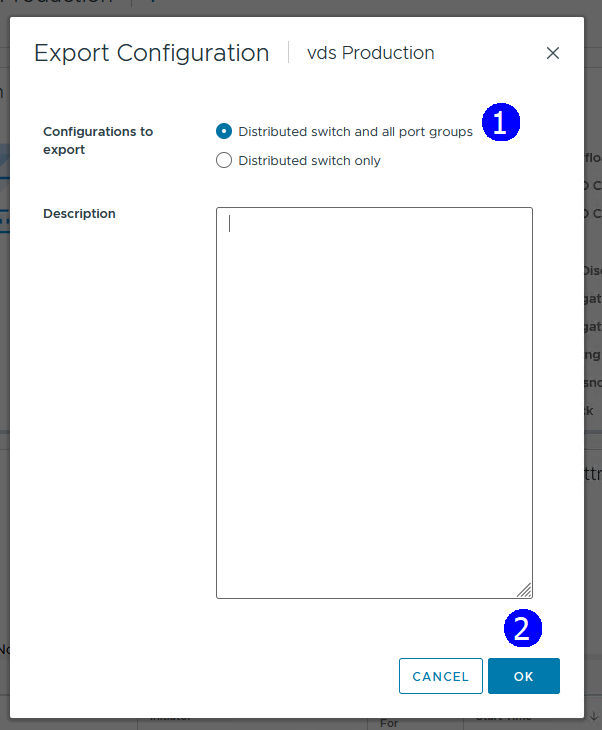

Se genera el archivo **Backup.zip** (1) que se descarga en el
escritorio.

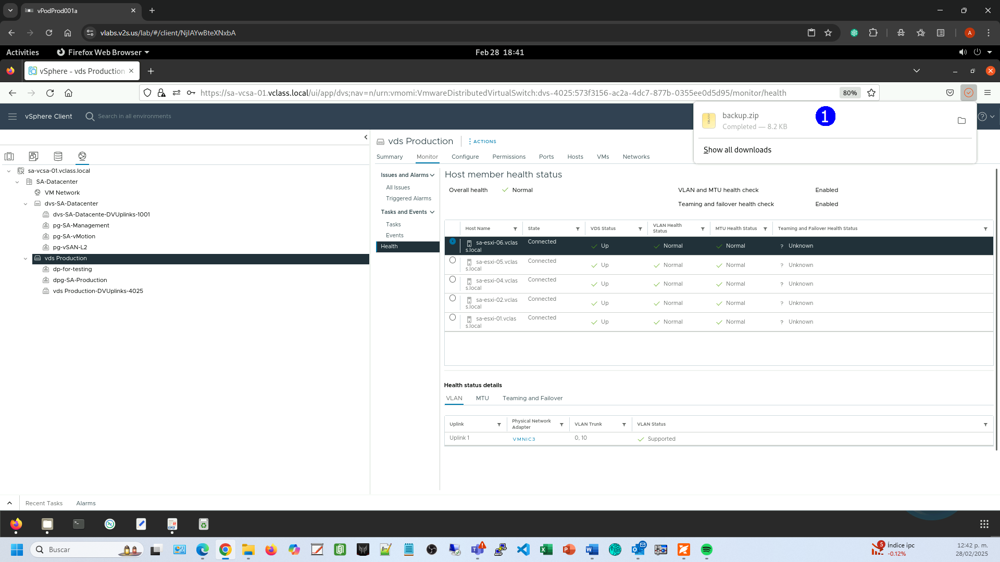
