> # VMware vSphere
>
> ## Operación, Escalamiento y Seguridad**
>
> **Versión 8**
>
> **Guía de uso de laboratorio**

# Laboratorio \# 1

## Acceso al escritorio y revisión del inventario del Center Server

> Revisión 1.1 2024

### Actividades a realizar:

1.  **Acceso al escritorio remoto**

2.  **Acceso al vCenter Server**

3.  **Revisión del inventario del datacenter**

4.  **Revisión del estado de licenciamiento de los hosts y del vCenter
    Server**

## Actividad \# 1

### Acceso al escritorio remoto

Utilizar de su sistema la herramienta de “**Conexión a escritorio
remoto**” con la dirección y puerto que le proporcionará su instructor;
utilizar como:

> Usuario: `vclass\Administrator`
>
> Contraseña: `VMware1!`

a manera de ejemplo:

Se recomienda guardar su identidad y credenciales para futuros accesos.

Se presentará el escritorio remoto con el browser de Firefox

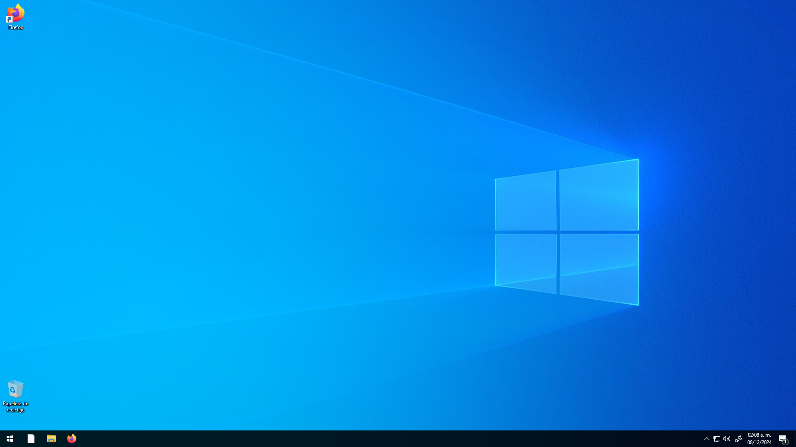

## Actividad \# 2

### Acceso al vCenter Server

Abrir una instancia del browser **Firefox**, en la interfaz encontrará 3
accesos cortos en la barra de herramientas, a saber, **vCenter**,
**Esxi-01**, **Esxi-02**,

En la interfaz del browser **Firefox** click en el acceso directo del
vCenter (podría aparecer también como **VCSA-01**) (1), proporcionar
como user:
`administrator@vsphere.local` (mailto:administrator@vsphere.local) y
Password: `VMware1!` (2), Click en **LOGIN** (3)

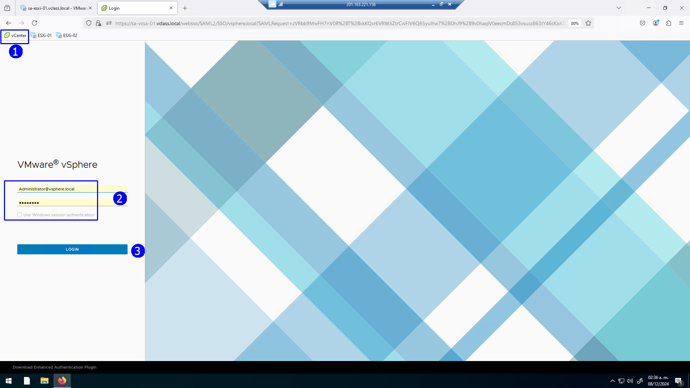

En la vista de **Hosts & Clusters** (1), se observa:

1.  El vCenter server **sa-vcsa-01.vclass.local** (2)

2.  Un cluster **Production Cluster** (3)

3.  Host **sa-esxi-01.vclass.local**

4.  Host **sa-esxi-02.vclass.local**

5.  4 VMs Virtuales **Linux_0x**

También aparece en la parte superior un mensaje de advertencia de
vencimiento de las licencias (6)

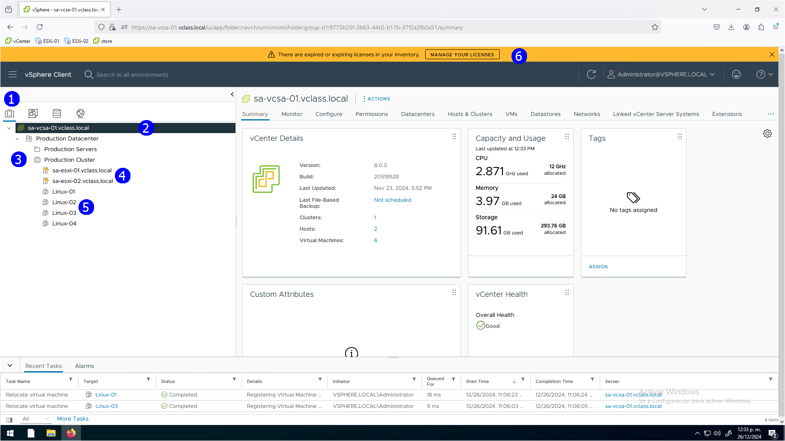

Al seleccionar el host **ESXi_01** (1), click en la pestaña **VMs** (2)
se desplegará la lista de VMs que están registradas en este servidor

**Linux_01**, **Linux_02** y la VM de servicios del **cluster vCLS** (3)

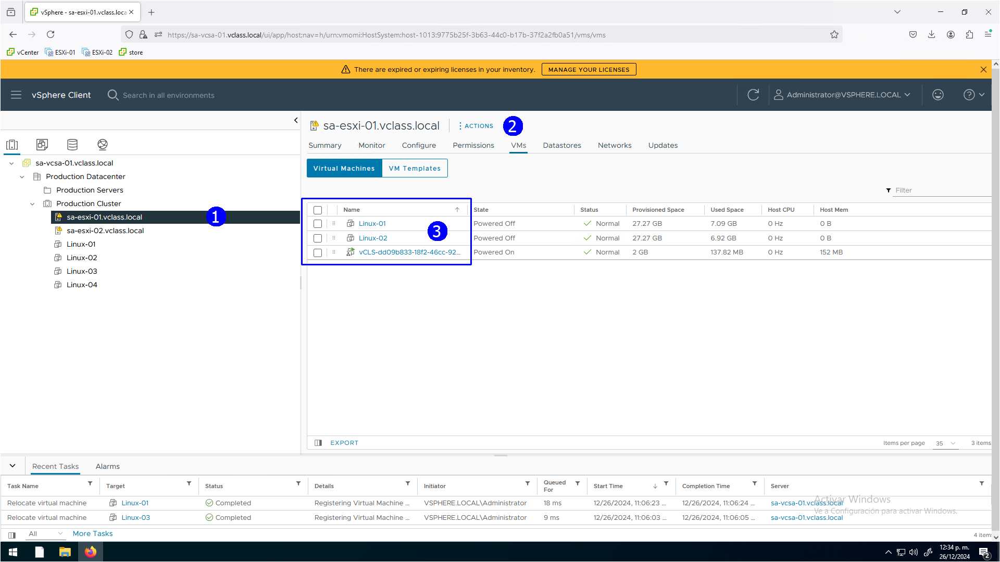

Al seleccionar el host **ESXi_02** (1), click en la pestaña **VMs** (2)
se desplegará la lista de VMs que están registradas en este servidor

**Linux_03**, **Linux_04** y otra VM de servicios del **cluster vCLS**
(3)

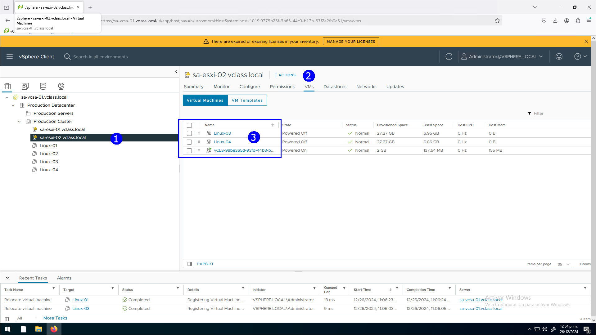

En la vista de **máquinas virtuales y plantillas** (1) se tienen:

1.  Un folder de VMs **Production VMs & Templates** (2)

2.  4 VMs Virtuales **Linux_0x** (3)

3.  1 plantilla **Linux_Template** (4)

4.  2 Vms de servicios del **cluster** (5)

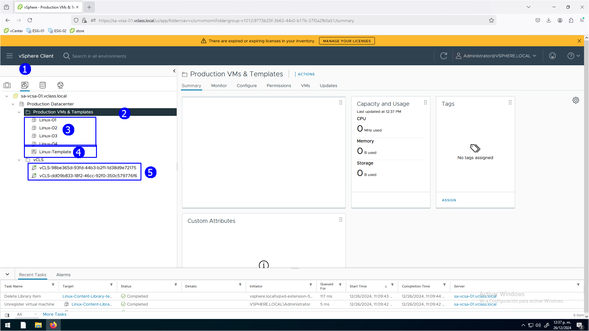

En la vista de **datastores** (1) tenemos:

1.  El datacenter **Production Datacenter** (2)

2.  4 **Datastores compartidos** (3)

3.  2 **Datastores locales** correspondientes a los host **ESXi_01** y
    **ESXi_02** (4)

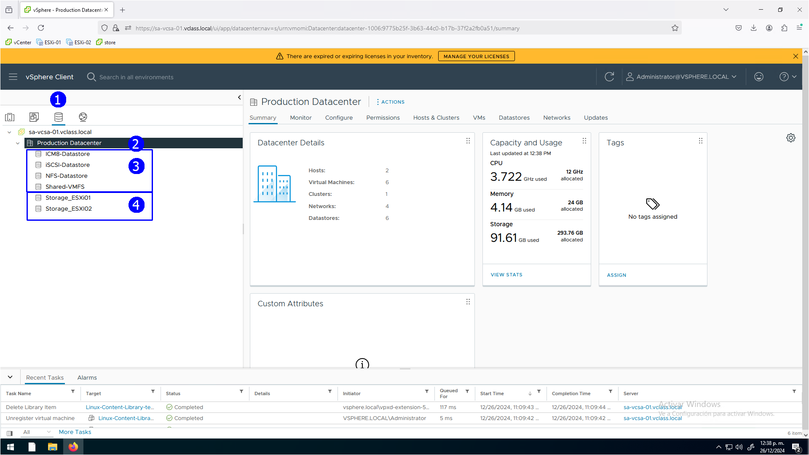

En la vista de **Redes** (1), tenemos:

- El **vCenter server sa-vcsa-01.vclass.local** (2)

- Dos Switches **virtuales** standard (3)

- Un Switch **distribuido** (4)

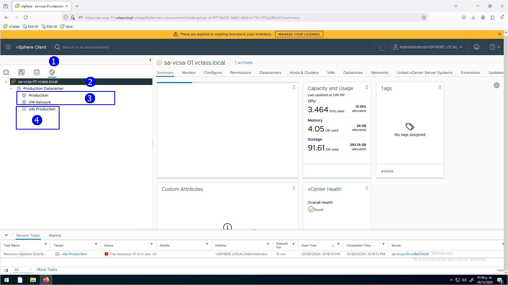

## Actividad \# 3

### Revisión del estado de licenciamiento de los hosts y del vCenter server

Verificar en el punto (6) que no tiene licencia asignada el **vCenter
Server**

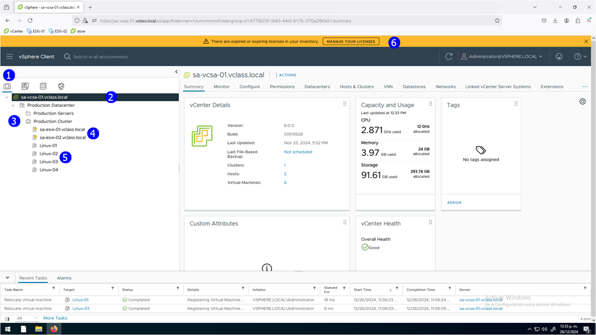

Asignar licencia al Click en el **vCenter Server
sa-vcsa-01.vclass.local** (1), click en **Configure** (2), **Licensing**
(3), **Assign Licence** (4)

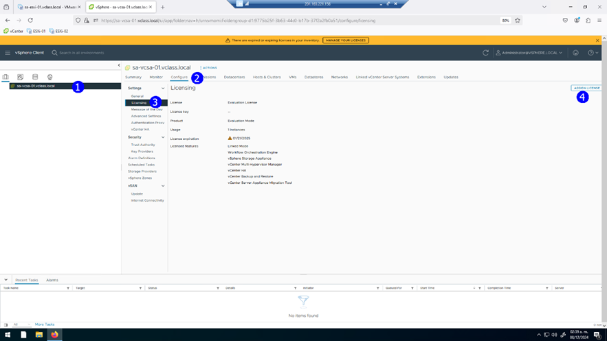

Proporcionar la licencia que le otorgue el instructor en la ventana
emergente

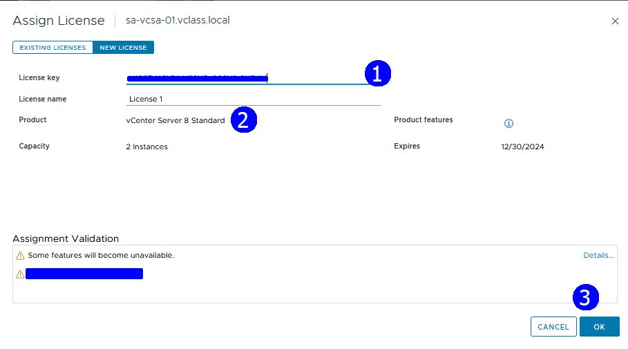

Observe que se lista la licencia en la interfaz

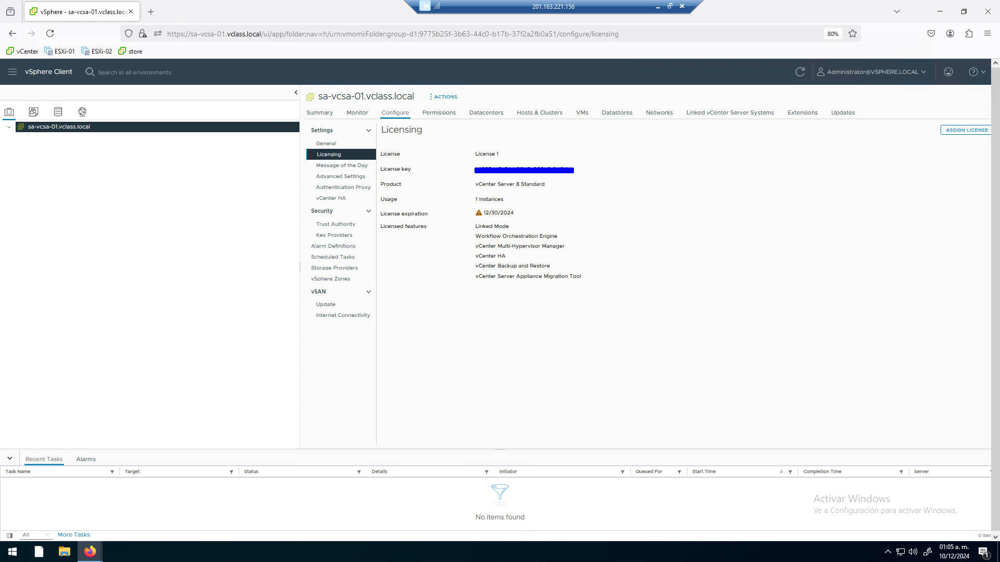
