> # VMware vSphere
>
> ## Operación, Escalamiento y Seguridad
>
> ### Versión 8
>
> **Guía de uso de laboratorio**

## Laboratorio \# 2

### Compartir en forma centralizada las VMware VMtools

> Revisión 1.1 2024

## Laboratorio \# 2

### Compartir en forma centralizada las VMware VMtools

### Actividades a realizar:

1.  **Ver el valor por default de la ubicación de las VMtools**

2.  **Modificación de la variable avanzada de ubicación de las VMtools**

3.  **Uso de una API para actualizar el Symlink del SO que apunta a las
    VMtools**

4.  **Reconfiguración normal de servicios**

## Actividad \# 1

### Ver el valor por default de la ubicación de las VMtools

Utilizar de su sistema la herramienta de “**Conexión a escritorio
remoto**” con la dirección y puerto que le proporcionará su instructor;
utilizar como:

> Usuario: `vclass\Administrator`
>
> Contraseña: `VMware1!`

En cada host existe una variable avanzada que apunta a un datastore, que
por default es un disco local en el que residen las **VMtools**

La variable avanzada **UserVars.ProductLOckerLocation** tiene como valor
de default el directorio /**locker/packages/vmtoolsRepo/** en el disco
interno del servidor.

Para verificarlo:

En la vista de **Hosts & Clusters** (1), click en el cluster
**Production Cluster** (2), click en el host **Esxi_01**(3), click en la
pestaña **Configure** (4), en la sección de **System** (5), seleccionar
**Advanced System Settings** (6), clik en **EDIT** (7).

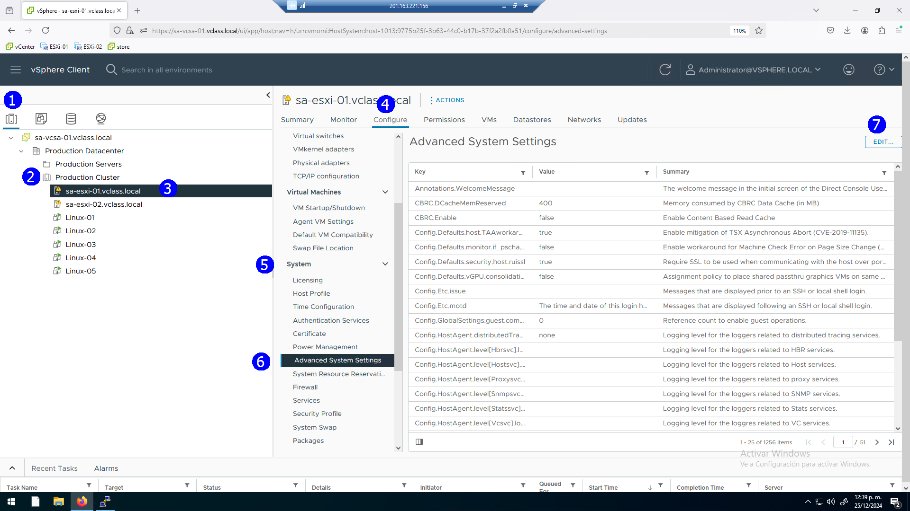

Se mostrará la caja de diálogo siguiente, click en el filtro (1) para
que se muestre un campo en donde se puede establecer el nombre de una
variable (2).

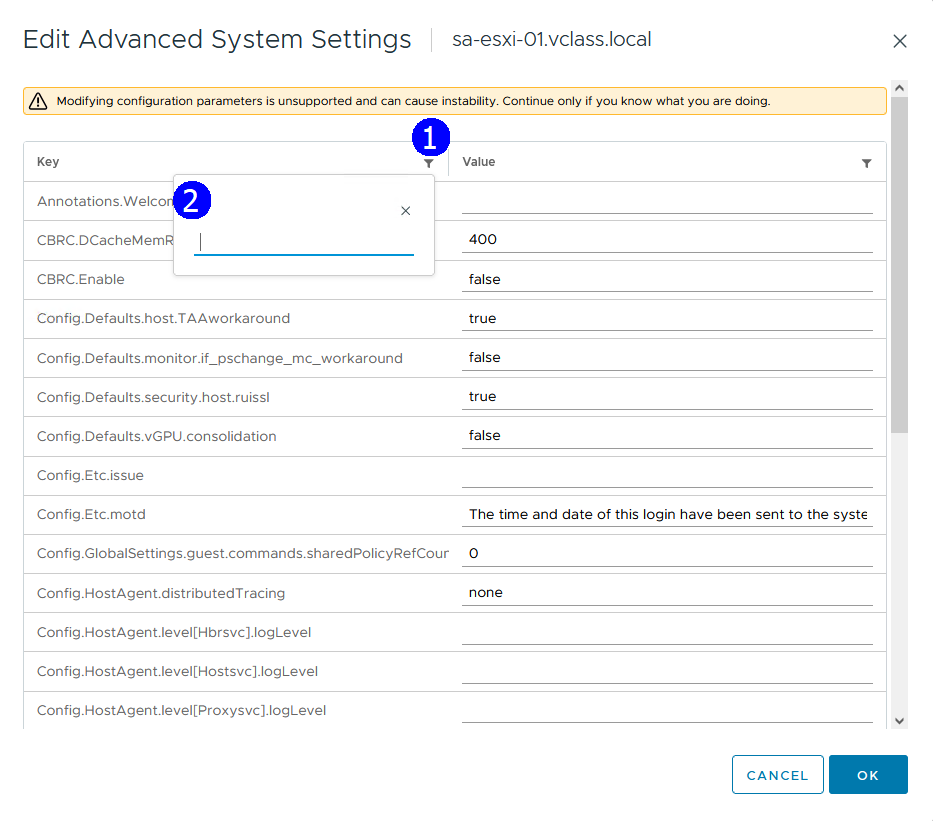

Escribir el nombre de la variable a investigar, basta con escribir
`User.Vars.pl` para que se filtre de la lista la variable requerida

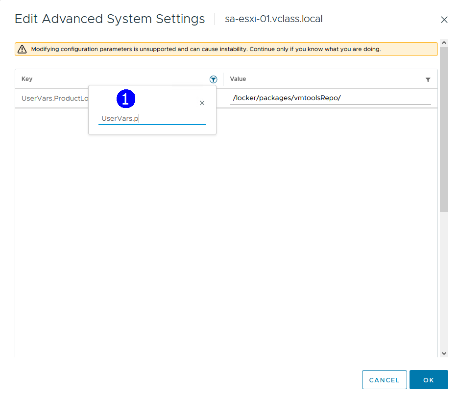

La variable avanzada `UserVars.ProductLOckerLocation` (1) tiene como
valor de default el directorio

**/locker/packages/vmtoolsRepo/** (2)

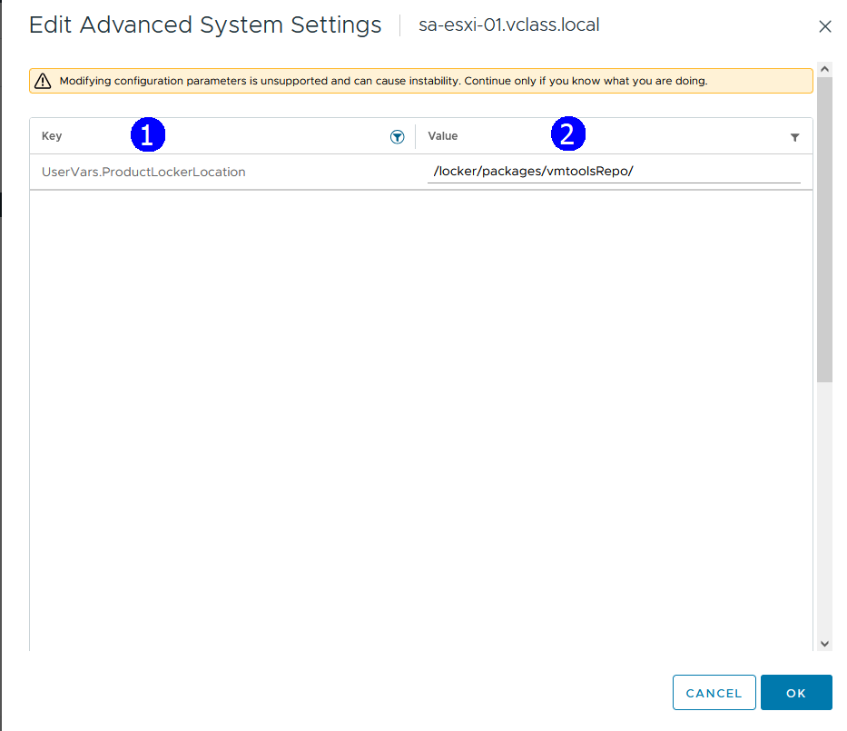

## Actividad \# 2

### Modificación de la variable avanzada de ubicación de las VMtools

Modificaremos el valor de esa variable emitiendo comando en el host con
un comando ESXi

Para esto activemos los servicios de **ESXi Shell** y SSH en el host
**ESXi_01**

En la vista de **Hosts & Clusters** (1), click en el cluster
**Production Cluster** (2), click en el host **ESXi_01** (3), click en
la pestaña **Configure** (4), en la sección **System** (5), click en
**Services** (6), observar el estado de los servicios **ESXi** **Shell**
(8) y **SSH** (10)

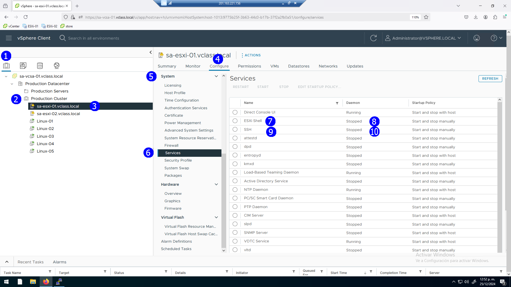

Seleccionar el servicio **ESXi Shell** (1) y click en **START** (2)

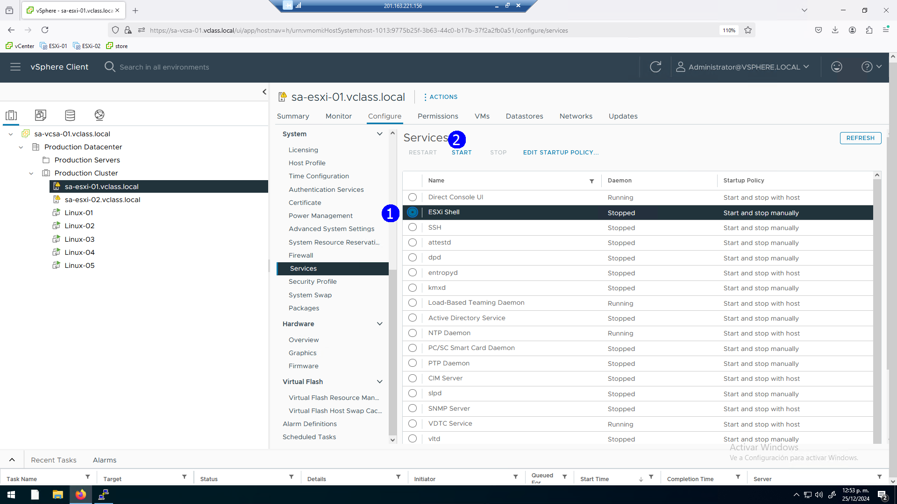

Seleccionar el servicio **SSH** (1) y click en **START** (2)

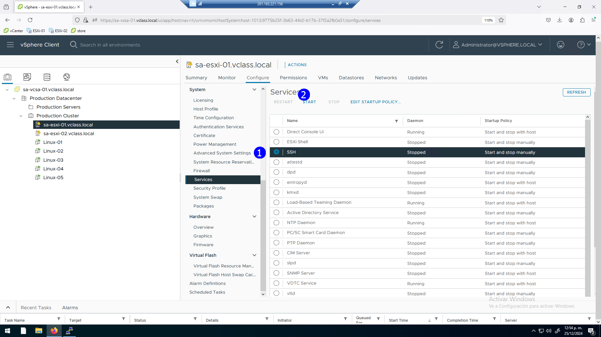

Los servicios ya están activos (1)

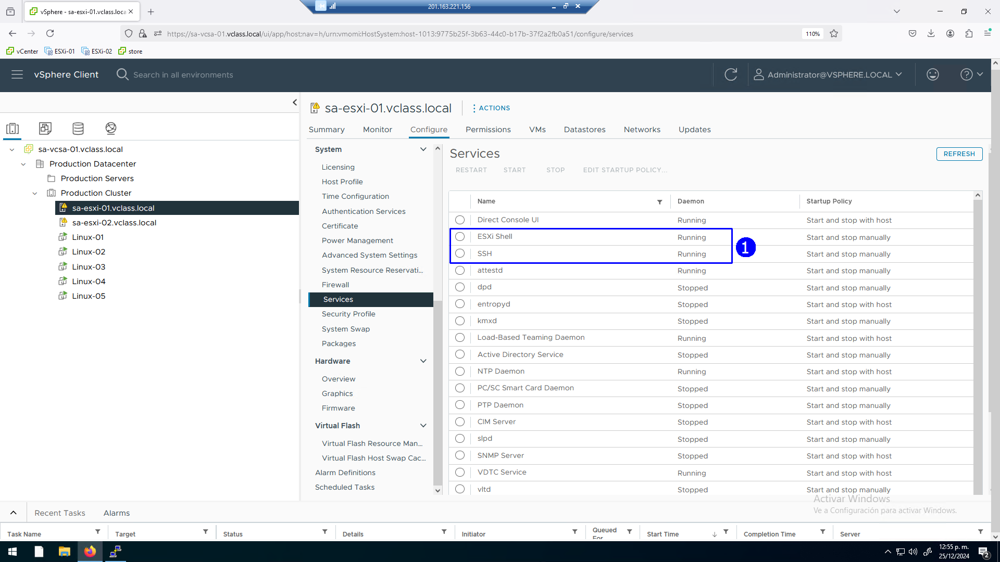

En el desktop ejecutar la aplicación **Putty** y proporcionar en el
campo IP address el nombre completo de dominio del host **ESXI_01:**
`sa-esxi-01.vclass.local` (1), y seleccionar el servicio **SSH** (3)
con puerto 22, click en **Open** (4)

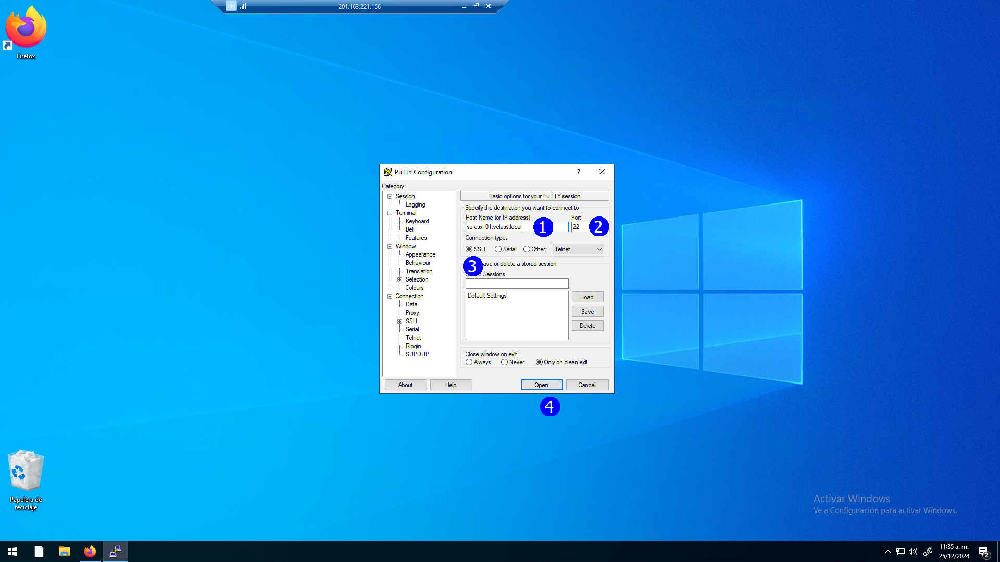

Aceptar el mensaje de conexión con SSH (1)

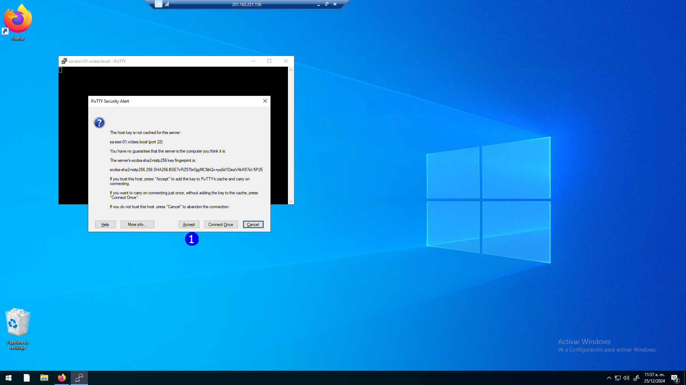

Proporcionar en el SO

User: `root`

Password: `VMware1!`

Enseguida, emitir el comando `ls` para mostrar los directorios, entre
ellos examinar el directorio **productLocker** que aloja actualmente las
**VMtools**,

`cd productLocker`

`ls`

se muestran dos directorios asociados con las VMtools a saber:
**vmtools** y **floppies**

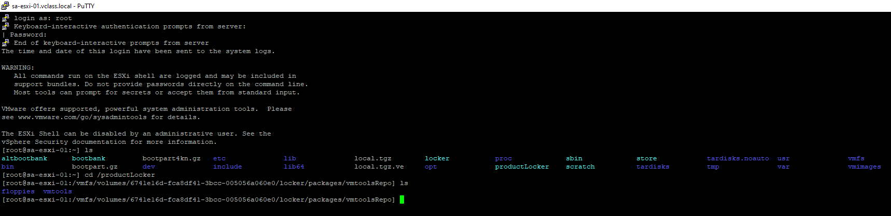

Examinemos ambos directorios que copiaremos a un datastore y
compartiremos para todos los host ESXi

`cd vmtools`

`ls`

se muestran los archivos listados en la siguiente imagen

`cd ..`

`cd floppies`

`ls`

se muestran los archivos listados en la siguiente imagen

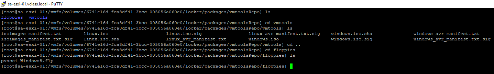

Enseguida, establecer en un datastore un directorio en donde se copiarán
las **VMtools** y se actualizarán constantemente para compartirlas con
todos los hosts ESXi en el datacenter

Emitir los comandos

`mkdir /vmfs/volumes/ICM8-Datastore/VMtoolsShare`

`cp -r \* /vmfs/volumes/ICM8-Datastore/VMtoolsShare`

`cd /vmfs/volumes/ICM8-Datastore/VMtoolsShare`

`ls`

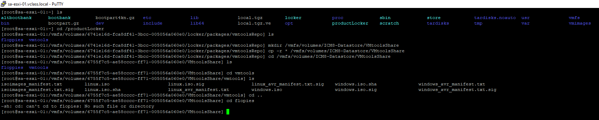

examinar las copias de los dos directorios

`cd VMtools`

`ls`

`cd ..`

`cd floppies`

`ls`

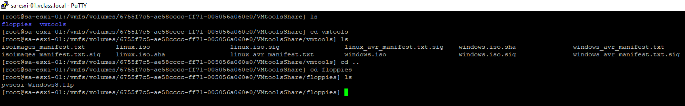

Con el siguiente comando modificamos el valor de la variable avanzada

`UserVars.ProductLOckerLocation` al valor deseado en un datastore
compartido al que tienen acceso todos los hosts ESXi en el datacenter
**/vmfs/volumes/ICM8-Datastore/VMtoolsShare**

`Esxcli system settings advanced set -o /UserVars.ProductLOckerLocation
-s /vmfs/volumes/ICM8-Datastore/VMtoolsShare`

El nuevo valor se comprueba con el comando

`Esxcli system settings advanced list -o
/UserVars.ProductLOckerLocation`

Observar los resultados:

Si se retorna a la interfaz del vCenter y se examina el valor se ve
actualizado.

Para verificarlo:

En la vista de **Hosts & Clusters** (1), click en el cluster
**Production Cluster** (2), click en el host Esxi_01(3), click en la
pestaña Configure (4), en la sección de **System** (5), seleccionar
**Advanced System Settings** (6), clik en **EDIT** (7).

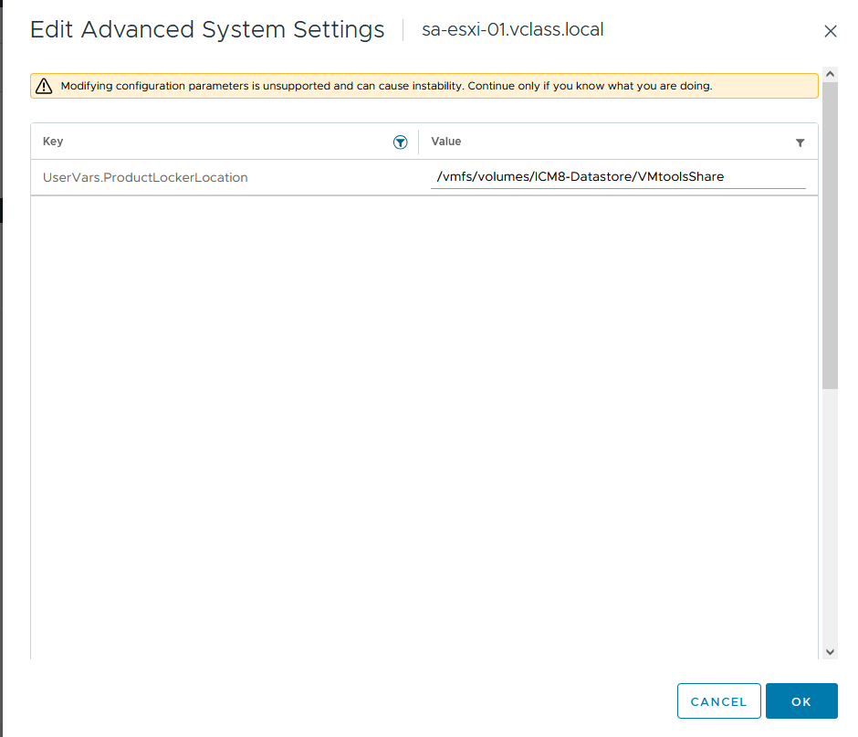

## Actividad \# 3

### Uso de una API para actualizar el Symlink del SO que apunta a las VMtools

Para que este nuevo valor de variable avanzada entre en operación es
necesario reiniciar el Host ESXi, sin embargo, cuando se requiere no
interrumpir el servicio se tiene la alternativa de modificar en el
Sistema operativo del Host el Symlink asociado. (Shortcut en el SO).
Esto se puede hacer con un comando Esxcli o con una llamada de una API.

Observe la salida del comando que usamos anteriormente, la variable
avanzada está actualizada pero el Symlink es **/productLocker -\>
/locker/packages/vmtoolsRepo** no coinciden.

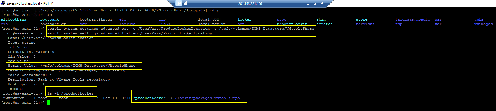

Para hacer uso de una API para ajustar este último valor, seleccionar en
el inventario el host **ESXi_01**, observar de la URL en el browser el
número de host, en este caso 1013

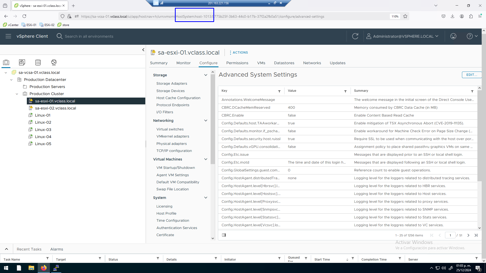

Abrir una nueva ventana usando el \# de host 1013 en el URL siguiente, a
manera de ejemplo (sustituya según sea su caso).

[**https://sa-vcsa-01.vclass.local/mob/?moid=host-1013&method=updateProductLockerLocation**](https://sa-vcsa-01.vclass.local/mob/?moid=host-1013&method=updateProductLockerLocation)

Se muestra la interfaz de la api correspondiente para justar el
**Symlink** de **UpdateProductLockerLocation_Task** (1), en ella,
determinar el valor

**/vmfs/volumes/ICM8-Datastore/VMtoolsShare** (2), click en **Invoke
Method** (3)

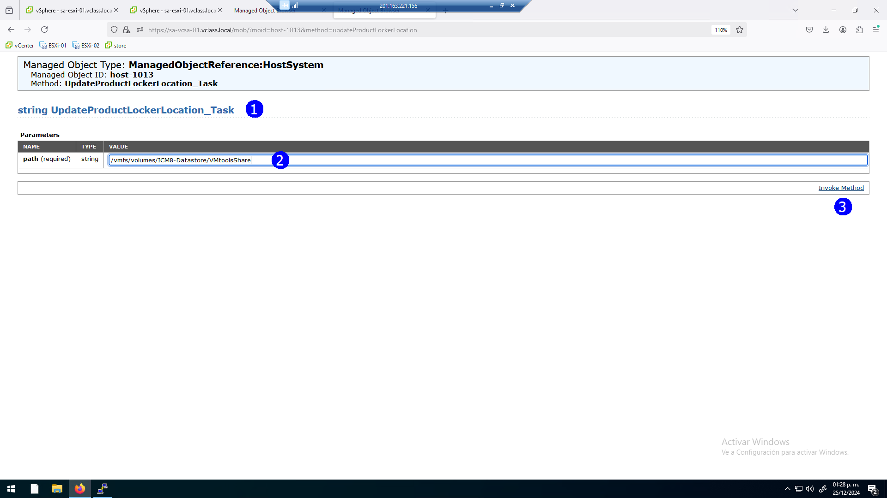

Se ejecuta el Method correspondiente (1)

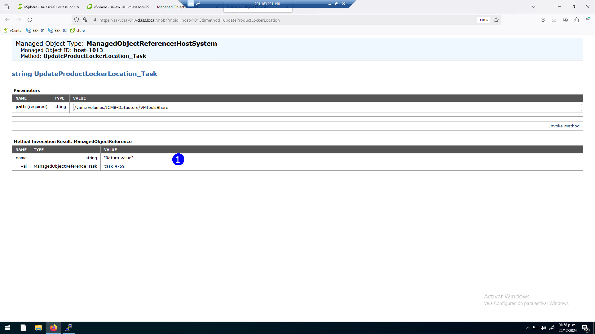

Con la llamada a la API ahora el symlink está actualizado.

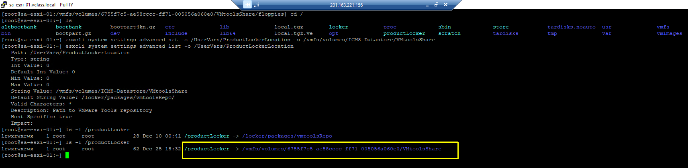

Estas operaciones se tendrían que realizar en cada host ya sea
manualmente o con un script para automatizar el proceso.

## Actividad \# 4

### Reconfiguración normal de servicios

Finalmente cerrar los procesos de ESXi y SSH

En la vista de **Hosts & Clusters** (1), click en el cluster
**Production Cluster** (2), click en el host **ESXi_01** (3), click en
la pestaña **Configure** (4), en la sección **System** (5), click en
**Services**(6), click en **ESXi Shell** (7), **STOP** (8)

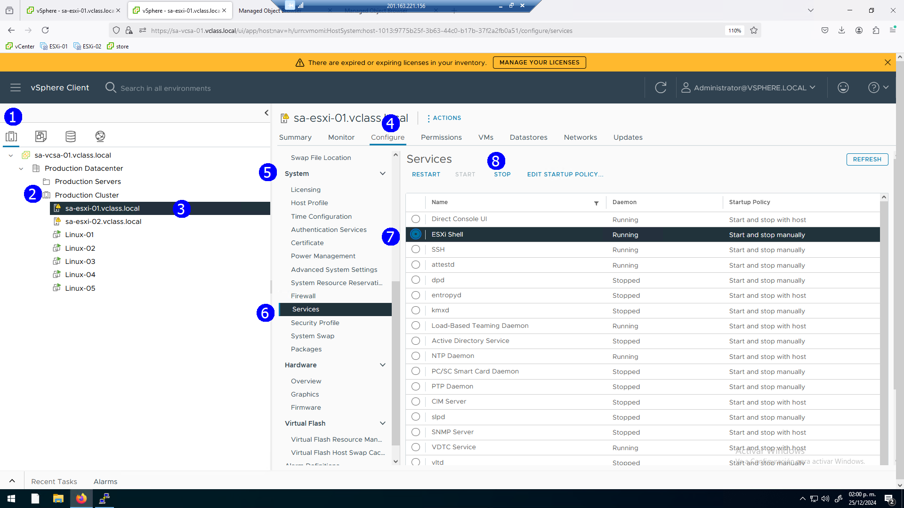

En la vista de **Hosts & Clusters** (1), click en el cluster
**Production Cluster** (2), click en el **host ESXi_01** (3), click en
la pestaña **Configure** (4), en la sección **System** (5), click en
**Services** (6), click en **SSH** (7), **STOP** (8)

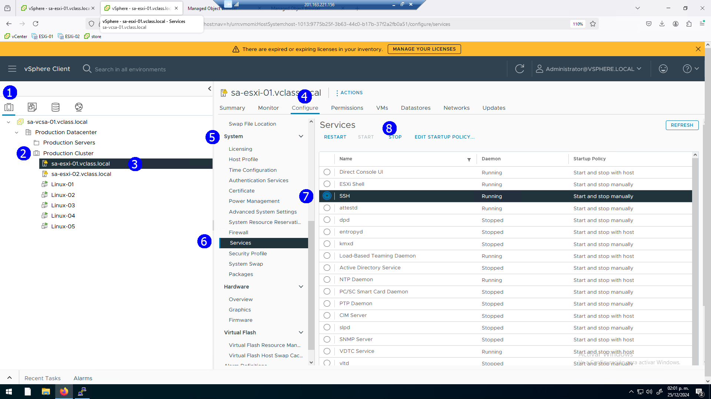

Ahora lucen apagados ambos servicios (1)

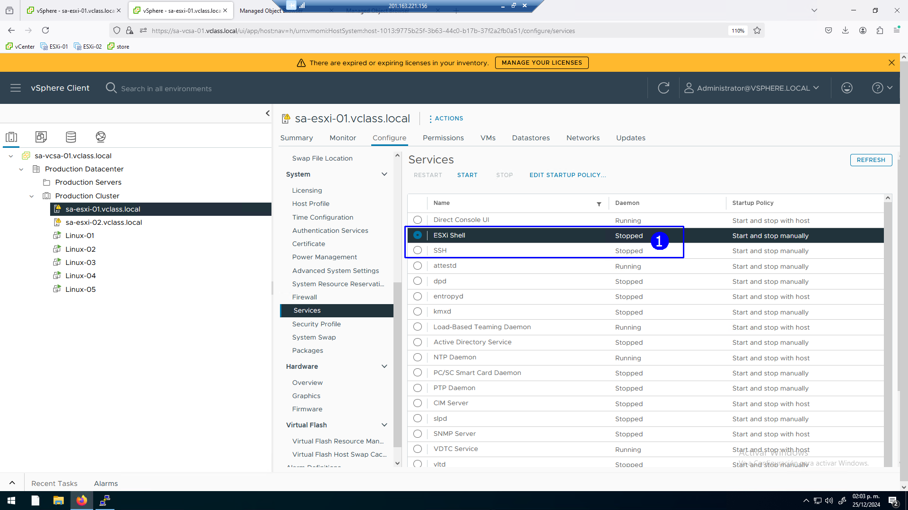
