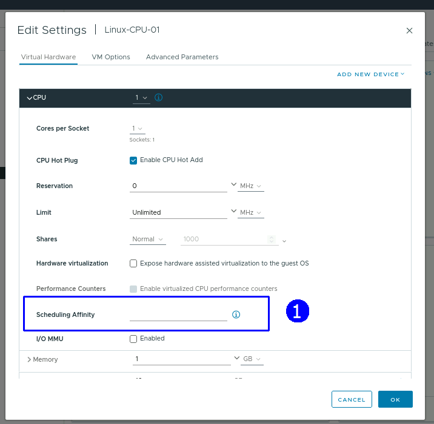
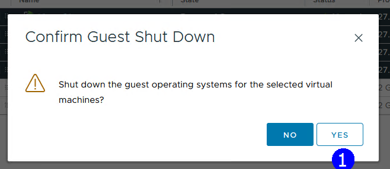
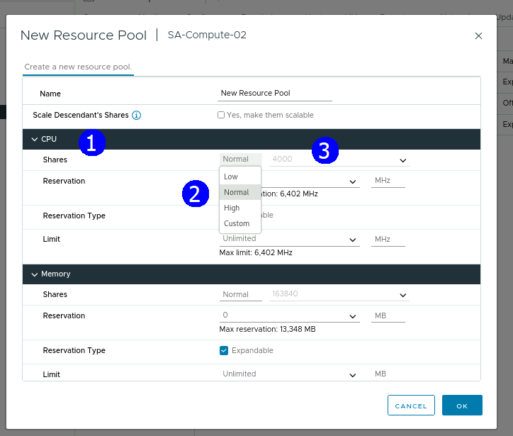
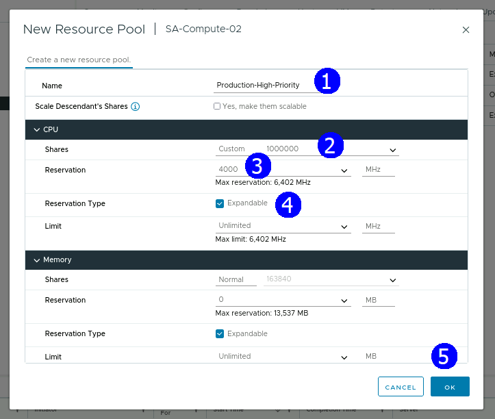
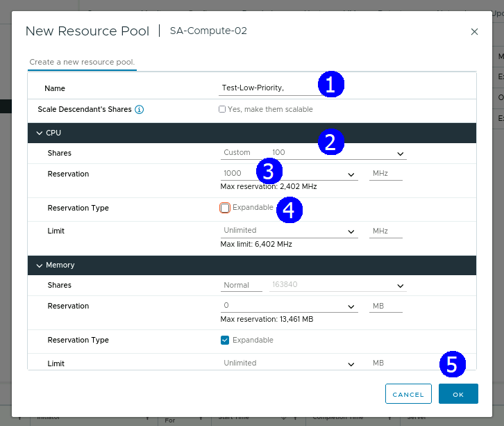
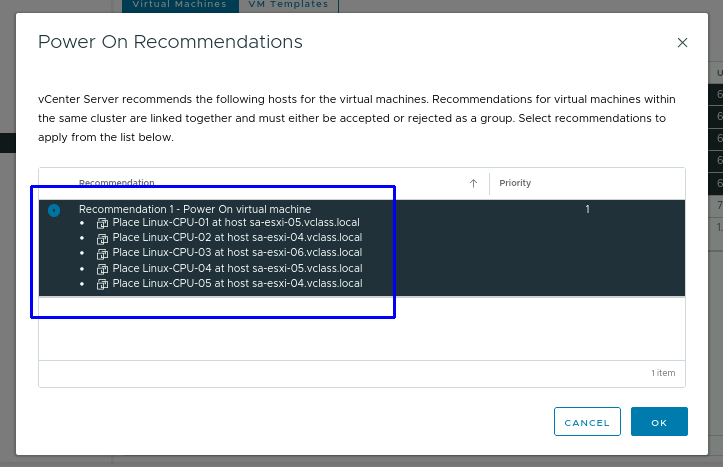
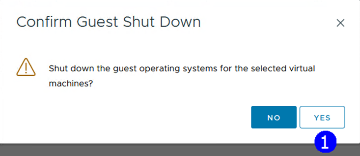

> # **VMware vSphere**
>
> ## **Operación, Escalamiento y Seguridad**
>
>### **Versión 8**
>
> #### **Guía de uso de laboratorio**

## **Laboratorio \# 3**

### **Administración de pools de recursos**

#### Actividades a realizar:

1.  Revisar el inventario actual

2.  Revisar desempeño de VMs sin condiciones de contención

3.  Creación de condiciones de contención

4.  Revisar desempeño de VMs con condiciones de contención

5.  Creación de pools de recursos

6.  Revisar el desempeño utilizando pools de recursos

## **Actividad \# 1**

### **Revisar el inventario actual**

Utilizar la liga de acceso proporcionada por su instructor

A manera de ejemplo:
[**https://vlabs.v2s.us/lab**](https://vlabs.v2s.us/lab)

Utilizar el usuario y contraseña que le proporcione su instructor

A manera de ejemplo

> Usuario: `student01a`
>
> Contraseña: `Arn0224!`
>
> Click en **Login**
>
> Seleccionar en esta interfaz el primer pod de trabajo **vPodProd001a**
> (1)
>
>  alt="A screenshot of a computer Description automatically generated" />

Al entrar, en la siguiente interfaz proporcionar

> Usuario: `student01`
>
> Contraseña: `VMware1!`

Click en **OK**

> Se obtiene acceso al escritorio remoto
>
>  alt="A screenshot of a computer Description automatically generated" />

Abrir una instancia del browser Firefox con acceso directo al **vSphere
Client login interface**

User: `<administrator@vsphere.local>`

Password: `VMware1!`

Click en **Login**

Considerar el inventario actual

Un vCenter Server (**sa-vcsa-01.vclass.local**), un Datacenter
(**SA-Datacenter**), dos clusters (**SA-Compute-01 y SA-Compute-2**)

En el host **sa-esxi-05.vclass.local** se tienen las VMs **Linux-CPU-01,
Linux-CPU-02, Linux-CPU-03, Linux-CPU-04, Linux-CPU-05. Payload-02,** y
una tipo **VM vCLS**

Observar la configuración de los vCPUs de una VM encendida,

Encender la VM

Click en la VM **Linux-CPU-01**, en el menú contextual seleccionar
**Edit Settings** (2)

Al expander el campo de **vCPU** se tienen los siguientes campos
disponibles

Si se apaga la VM entonces se tendrá acceso al campo **Scheduling**
**Affinity** (1)

## **Actividad \# 2**

### **Revisar desempeño de VMs sin condiciones de contención**

Observar la capacidad de cómputo de las VMs con la configuración actual;
para esto Encender por separado las VMs **Linux-CPU-01, Linux-CPU-02,
Linux-CPU-03, Linux-CPU-04, Linux-CPU-05.**

Accesar la consola de cada una de las VMs y ejecutar una aplicación para
medir el desempeño, a manera de ejemplo, click en la **VM Linux-CPU-01**
(1), en la pestaña **Summary** click en **LAUNCH WEB CONSOLE** (2)

Si presenta el navegador un mensaje de advertencia de ventanas
**Pop-Up** click en **Preferences** y seleccione **Allow pop-ups for
sa-vcsa-01.class.local**

Accesar con el password `VMware1!` si se requiere, se presenta el
escritorio de la VM

Click en el botón de la aplicación Terminal (1)

En la aplicación **Terminal** emitir el comando

`./Desktop/cpubusy.pl`

Entonces se lanza una aplicación que realizar cálculos matemáticos; la
medida del desempeño es el tiempo en segundo que le toma hacer un ciclo
de cálculos

Lanzar la aplicación en todas las VMs **Linux-CPU-01** hasta la
**Linux-CPU-05**

Esperar algunos minutos para que se estabilice el cálculo, con todas las
VMs Linux-CPU, encendidas el promedio que se observa es similar al que
muestra la VM **Linux-CPU-01**

## **Actividad \# 3**

### **Creación de condiciones de contención**

Las VMs están en un solo host **sa-esxi-05.vclass.local**

Esa es una primera condición de contención al estar compartiendo los
recursos del servidor, de hecho, se puede ver que se ha lanzado una
advertencia de contención de CPU en el Host con todas las VMs encendidas
y la aplicación cpubusy activa que demanda recursos de CPU

Un segundo mecanismo de contención a establecer es asignar afinidad

Apagar las VMs **Linux-CPU-03**, **Linux-CPU-4**, **Linux-05**

En la vista de **Hosts & Clusters** (1), seleccionar el cluster
**SA-Compute-02** (2), click en la pestaña **VMs** (3), seleccione las 3
VMs (4), en el menú contextual seleccionar **Power** (5), **Shutdown
Guest OS** (6)

Confirmar el apagado múltiple **YES** (1)

Se muestran la VM apagadas

En cada una de las 3 VMs, establecer afinidad de CPU con el CPU físico
0, a manera de ejemplo

En la vista de **Hosts & Clusters**, seleccionar el cluster
**SA-Compute-02**, click en **Linux-CPU-03** (3), en el menú contextual
click en **Edit Settings** (4).

En la pestaña **Virtual Hardware** (1), expander la sección **vCPU**
(2), escribir **0** en el campo **Scheduling Affinity** (3), **OK** (4).

Repetir la misma operación en las VMs **Linux-CPU-04, Linux-CPU-05**

**Encender las 3 VMS por separado**.

## **Actividad \# 4**

**Revisar desempeño de VMs con condiciones de contención**

Accesar de nuevo a las consolas de las VMs **Linux-CPU-03, Linux-CPU-04,
Linux-CPU-05** y ejecutar el comando en la aplicación **Terminal**

`./Desktop/cpubusy.pl`

Después de minutos de espera observar las consolas de las VMS, se nota
un incremento proporcional del tiempo requerido para cada ciclo similar
en cada una de las 3 VMs **Linux-CPU-03, Linux-CPU-04, Linux-CPU-05**

Las VMS están en un solo host utilizando ahora un sólo CPU físico

Examinar el tiempo de ejecución en las **VM Linux-CPU-01,
Linux-CPU-02**, estás ocupan todos los cpus físicos del servidor,
incurren en un menor tiempo para realizar el cálculo

En comparación a las **Linux-CPU-03, Linux-CPU-04, Linux-CPU-05** que
sólo pueden usar y comparten el cpu físico 0 del Host Esxi, requieren
entonces más segundos para el ciclo de cálculo

## Actividad \# 5

### **Creación de pools de recursos**

Con el propósito de ver la aplicación de los pools de recursos

Activar **DRS** en el Cluster, esto es totalmente necesario para incluir
un pool de recursos en el cluster.

En la vista de **Hosts & Clusters** (1), click en el cluster
**SA-Compute**(2), click en la pestaña **Configure** (3), en la sección
**Services** seleccionar **vSphere DRS** (4), click en **EDIT** (5)

Observar que al activar el servicio (1), tenemos varias opciones de
operación **Manual** , **Partially Automated** y **Fully Automated**.
(2)

Seleccionar **Manual** (2), **OK** (3)

Se crearán dos pools, uno con alta prioridad de asignación de recursos y
otro con baja prioridad de recursos para incluir VMs en cada uno de
ellos y observar los resultados

Creación de pool con **alta prioridad** de asignación de recursos

En la vista de **Hosts & Clusters** (1), click en el cluster
**SA-Compute-02** (2), en el menú contextual seleccionar **New Resource
Pool** (3)

Al ingresar a la definición de pools en vCPUs y Memoria podrá observar
los campos siguientes, en **Shares** se tienen las opciones **Low**,
**Normal**, **High** (1) y **Custom** (2)

Para este primer pool establecer las opciones **Name:**
**Production-High-Priority** (1), CPU **Shares**, **Custom 1000000**
(2), **Reservation Máximum =4,000** (3) y activar **Expandable** (4),
**OK** (5)

Se incluye en el inventario del cluster el Pool
**Production-High-Priority**, observar los parámetros establecidos

Crear un segundo pool, en la vista de **Hosts & Clusters** (1), click en
el cluster **SA-Compute-02** (2), en el menú contextual seleccionar
**New Resource Pool** (3)

Llenar la caja de diálogo del Pool

Para este segundo pool establecer las opciones **Name:**
**Test-Low-Priority** (1), CPU **Shares**, **Custom 100** (2),
**Reservation 0** y desactivar **Expandable** (3), **OK** (4)

Se muestra en el inventario el segundo Pool **Test-Low-Priority**,
observar los parámetros establecidos

Enseguida arrastrar en el inventario las VMs **Linux-CPU-01** y
**Linux-CPU-02** sobre en el pool de **Production-High-Priority**. (1)

Arrastrar en el inventario a las VMs **Linux-CPU-03, Linux-CPU-04, y
Linux-CPU-05** sobre el pool de **Test-Low-Priority** (2), el resultado
se muestra enseguida

## **Actividad \# 6**

### **Revisar el desempeño utilizando pools de recursos**

Para que tengan efecto los parámetros **apagar y encender todas las VMS
por separado** asegurándose de encenderlas en el host ESXi-05 ante las
recomendaciones que se muestran dado que está DRS activo

**Nota: si las enciende en grupo recibirá una propuesta de encendido en
diferentes Hosts, como la que se muestra enseguida, evitar esto dado que
se perderán las condiciones del ejercicio**

Verifique que todas las VMs estén en el Host sa-esxi-05

Accesar a las consolas de todas las VMs, usar la aplicación **Terminal**
y emitir el comando

`./Desktop/cpubusy.pl`

Después de varios minutos observar el desempeño de las VMs

Se puede observar **alto desempeño** en las VMs **Linux-CPU-01** y
**Linux-CPU-02**

Se puede observar **bajo desempeño** en las VMs **Linux-CPU-03**,
**Linux-CPU-04, y Linux-CPU-05**

Los resultados anteriores es el resultado de la utilización de pools de
recursos.

Restaurar las VMs a una operación normal,

Apagar las VMs

En la vista de **Hosts & Clusters** (1), click en el cluster
**SA-Compute-02** (2), click en la pestaña **VMs** (3), seleccionar
todas las VMs (4), en el menú contextual seleccionar **Power**, click en
**Shut Down Guest OS** (5)

Aceptar la operación múltiple (yes)

Eliminar en sus especificaciones la afinidad de cpu

En la vista de **Hosts & Clusters** (1), click en la VM **Linux_01**
(2), en el menú contextual seleccionar **Edit Settings** (3)

Eliminar afinidad de CPU, en el campo de **Scheduling Affinity** borrar
**0** (2), **OK** (3)

Repetir la operación para las VMs **Linux_02**, **Linux_03** y
**Linux_04**

Poner RDS en operación totalmente automática,

En la vista de **Hosts & Clusters** (1), click en el cluster
**Production Cluster** (2), click en la pestaña **Configure** (3), Click
en **vSphere RDS** (4), click en **EDIT** (6)

Configurar **Automatic level** en **Fully Automated** (2).

