> # **VMware vSphere**
>
> ## **Operación, Escalamiento y Seguridad**
>
> ### **Versión 8**
>
> #### **Guía de uso de laboratorio**

## **Laboratorio \# 4**

### **Manejo adecuado de las vCLS VMs en operaciones del storage**

#### **Actividades a realizar:**

1.  **Explorar en el cluster el estado de las vCLS VMs**

2.  **Manejo de vCLS VMs al establecer el modo de mantenimiento del
    storage en donde residen (usar modo de retiro)**

## **Actividad \# 1**

### **Explorar en el cluster el estado de las vCLS VMs**

Utilizar la liga de acceso proporcionada por su instructor

A manera de ejemplo:
[**https://vlabs.v2s.us/lab**](https://vlabs.v2s.us/lab)

Utilizar el usuario y contraseña que le proporcione su instructor

A manera de ejemplo

> Usuario: `student01a`
>
> Contraseña: `Arn0224!`
>
> Click en **Login**
>
> Seleccionar en esta interfaz el primer pod de trabajo **vPodProd001a**
> (1)
>
>  alt="A screenshot of a computer Description automatically generated" />

Al entrar, en la siguiente interfaz proporcionar

> Usuario: `student01`
>
> Contraseña: `VMware1!`

Click en **OK**

> Se obtiene acceso al escritorio remoto
>
>  alt="A screenshot of a computer Description automatically generated" />

Abrir una instancia del browser Firefox con acceso directo al **vSphere
Client login interface**

User: `administrator@vsphere.local`

Password`: VMware1!`

Click en **Login**

Recordemos que las **vCLS VMs** se utilizan para garantizar que ciertas
operaciones del clúster, como **DRS** y **HA**, sigan funcionando
incluso si vCenter está temporalmente inaccesible.

Las **vCLS VMs** son creadas automáticamente por vSphere en cada host
del clúster.

Si en las operaciones del cluster es requerido poner el datastore en el
que se alojan los discos de estas máquinas virtuales vCLS en
mantenimiento, es necesario proactivamente migrar con storage vMotion
las vCLS VMS a otro datastore compartido para continuar la protección.

Alternativamente se podrá poner el cluster en modo de retiro apagando y
eliminando las VMs vCLS, eliminando la protección de servicios
distribuidos HA y DRS

Se pueden observar las VMs que se han creado en el cluster y las vCLS
VMs

En la vista de **Hosts & Clusters** (1), click en el cluster
**SA-Compute-02** (2), click en la pestaña **VMs** (3), se ven las VMs
de operación (4) y las vCLS VMs (5)

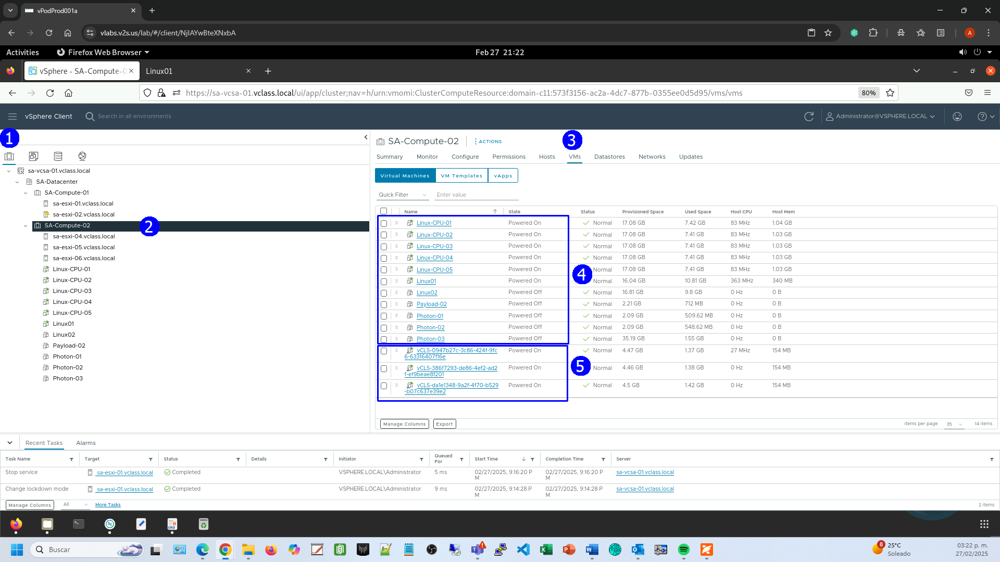

Para observar las **vCLS VMs** también se puede seleccionar la vista de
**VMS & Templates** (1), en la misma se muestran por separado (2)

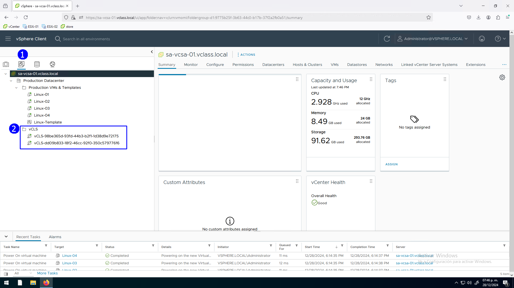

Veamos cómo están ubicadas a nivel de servidor

En la vista de **Hosts & Clusters** (1), click en el cluster
**SA-Compute-02** (2), click en el host **sa-esxi-04** (3), click en la
pestaña **VMs** (4), aquí se puede observar que en el host
**sa-esxi-04** está registrada una vCLS VM (5).

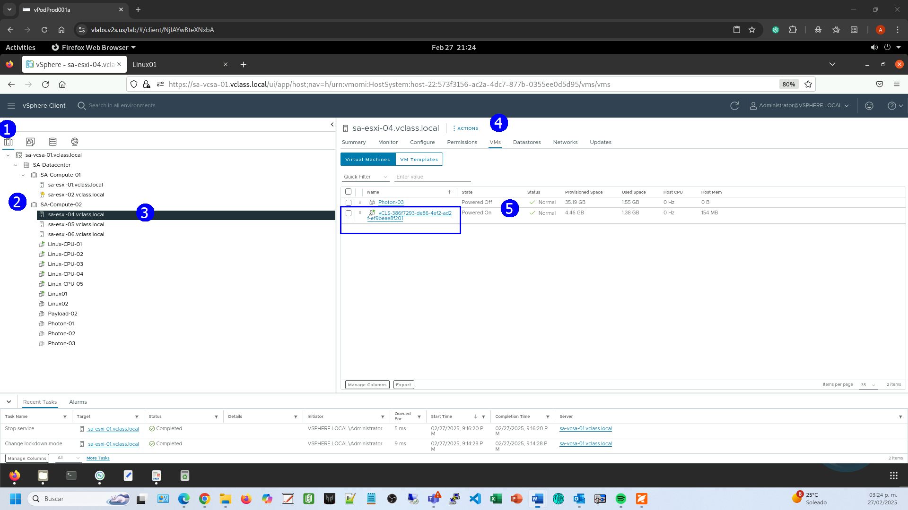

De manera semejante y por temas de alta disponibilidad vemos la otra
VCLS en el Host **sa-esxi-05**

En la vista de **Hosts & Clusters** (1), click en el cluster
**SA-Compute-02** (2), click en el host **sa-esxi-05** (3), click en la
pestaña **VMs** (4), aquí se puede observar que en el host
**sa-esxi-05** está registrada otra vCLS VM (5).

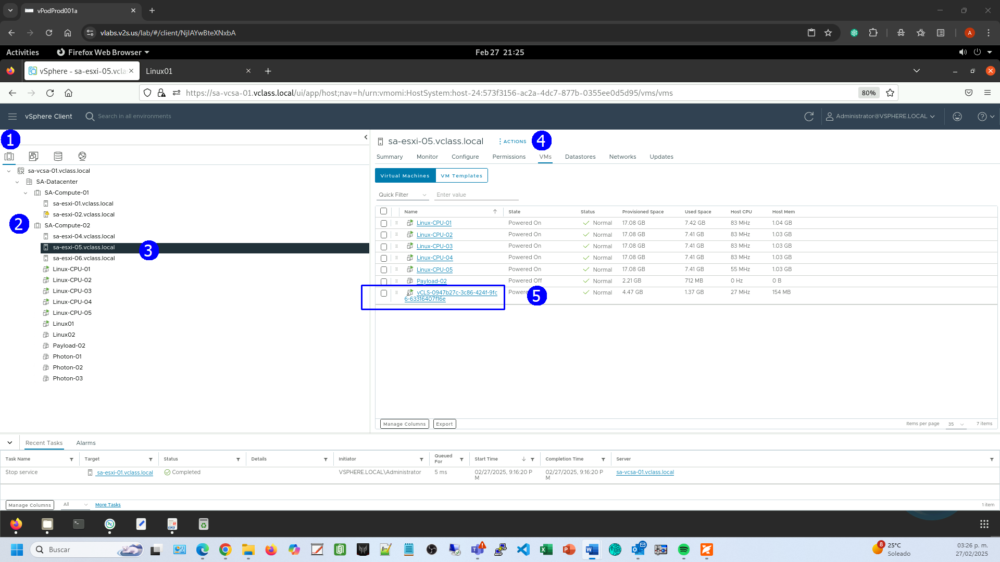

Finalmente vemos la otra VCLS en el Host **sa-esxi-06**

En la vista de **Hosts & Clusters** (1), click en el cluster
**SA-Compute-02** (2), click en el host **sa-esxi-06** (3), click en la
pestaña **VMs** (4), aquí se puede observar que en el host
**sa-esxi-06** está registrada una tercera vCLS VM (5).

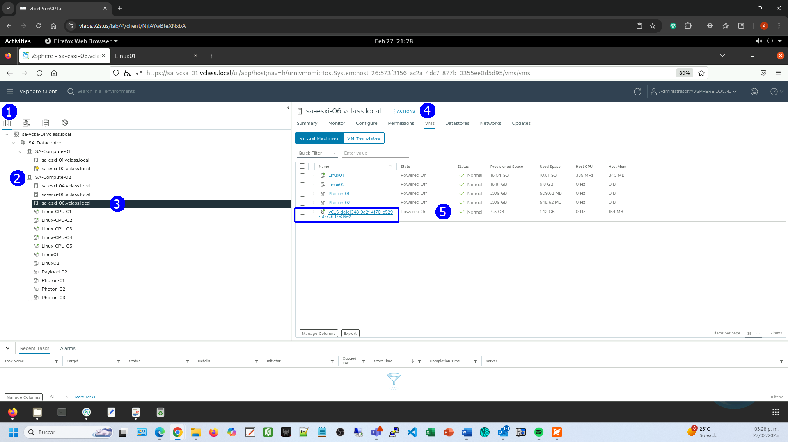

## Actividad \#2

### **Manejo de vCLS VMs al establecer el modo de mantenimiento del storage en donde residen (uso de modo de retiro)**

Veamos cómo se da el proceso ordenado de poner el datastore que aloja
las vCLS VMs,

Observar el Cluster **SA-Compute-01** con dos hosts **sa-esxi-01** y
**sa-esxi-02** con VMs **vCLS**

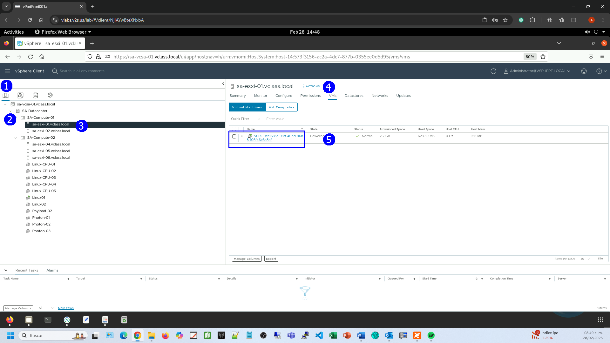

Click en la **VM vCLS**

Eso nos lleva a la vista de **VMs and Templates**, click en la pestaña
**Summary**

Al desplazarse a la sección **Related Objects** se observa que está
almacenada en el datastore **ICM-Datastore**

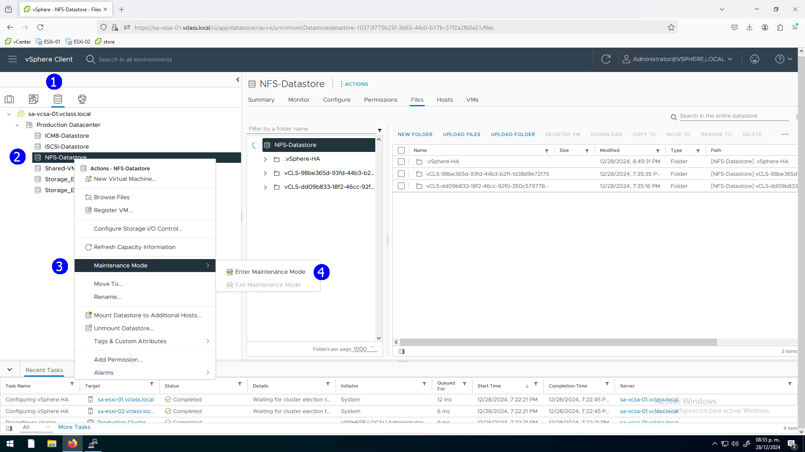

Algo similar podremos observar si en la vista de **Host & Clusters**
seleccionamos el host **sa-esxi-02**, damos click en la pestaña **VMs**,
ahí existe otra VM tipo **vCLS**

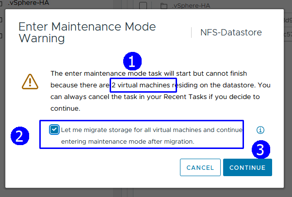

Click en la **VM vCLS**

En la vista de **VMs & Templates,** click en la pestaña **Datastores**

Vemos que también está en el datastore **ICM-Datastore** la otra **vCLS
VM.**

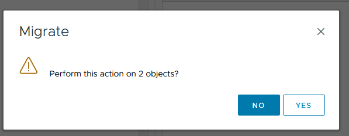

Para ver que VMs tiene el datostore **ICM-Datastore**

Seleccionar la vista de **Datastores**, click en el datastore
**ICM-Datastore**, click en la pestaña **VMS**

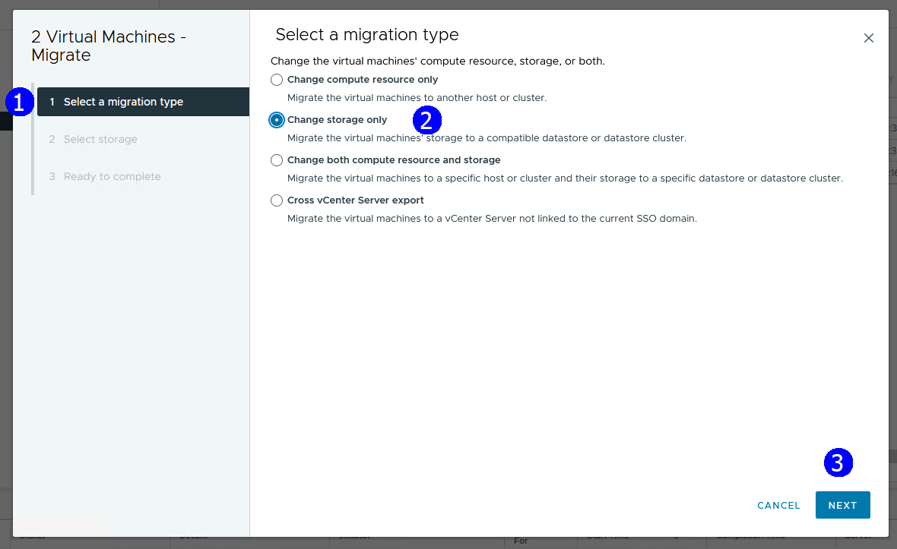

El punto central de nuestro ejercicio es que si deseamos poner el
datastore en modo de mantenimiento **es necesario que no tenga VMs
encendidas**.

En este caso la VMs que tiene son VMs tipo vCLS que sirven de protección
en los servicios distribuidos de HA, DRS, etc. Por lo que al tratar de
poner en modo mantenimiento el storage, vSphere propone moverlas a otro
storage con storage vMotion para mantenerlas encendidas

Seleccionar el datastore **ICM-Datastore**, click derecho, seleccionar
**Maintenance mode**, seleccionar **Enter Maintenance Mode**

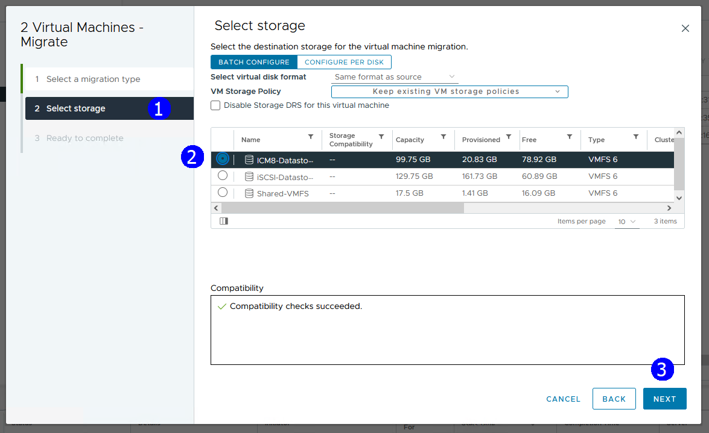

Se muestra la caja de diálogo con la propuesta de migración

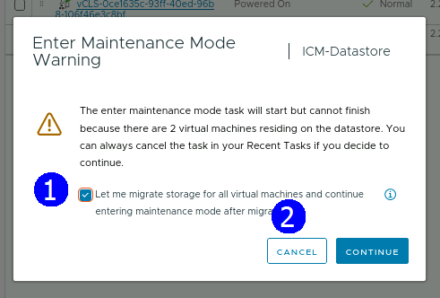

Click en **Cancel**

Alternativamente, **para poner el cluster en modo de retiro**

En la vista de **Host & Clusters**, click en el cluster
**SA-Compute-01**

Click en la pestaña **Configure**

En la sección **vSphere Clusters Services** seleccionar **General**,
click en **EDIT VCLS MODE**

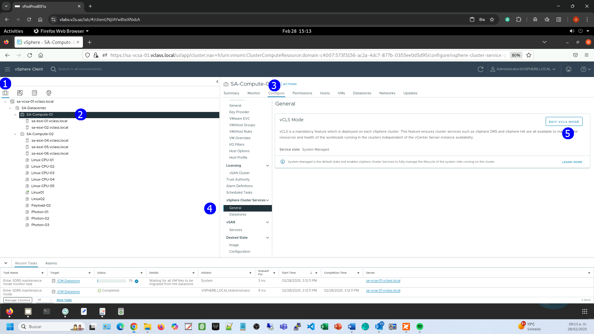

Se despliega la caja de diálogo **Edit vCLS Mode**, seleccionar
**Retreat Mode**, Click en **OK**

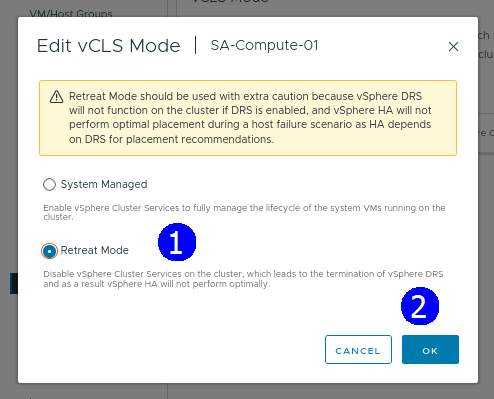

Observar en la pestaña VMS que con esto se apagan y eliminan las VMs
tipo **vCLS**

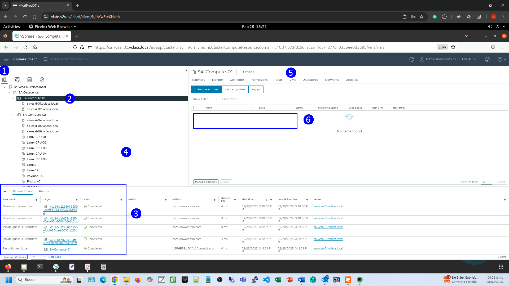

El datastore ICM-Datastore está en modo mantenimiento sin VMs encendidas

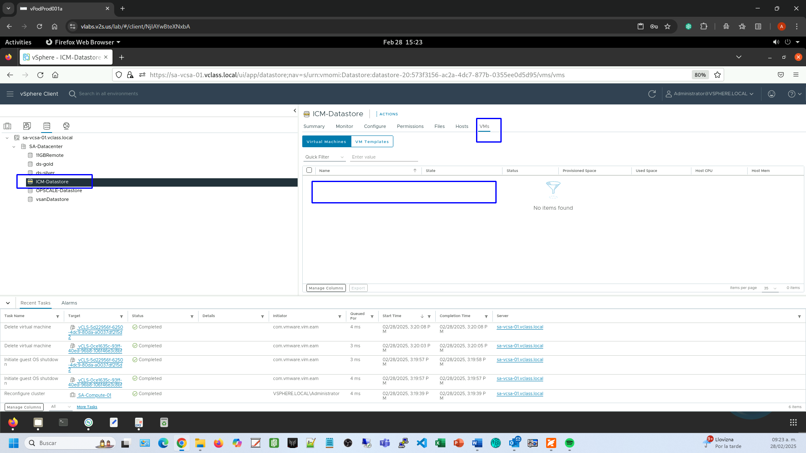

**Así los servicios de DRS y HA se verán afectados directamente**

Para revertir la operación

Seleccionar la vista de **Host & Clusters**

Click en el cluster **SA-Compute-01**

Click en la pestaña **Configure**

En la sección **vSphere Clusters Services** seleccionar **General**,
click en **EDIT VCLS MODE**

Seleccionar la opción **System Managed**, click en **OK**

Se crea una VM de tipo **vCLS**

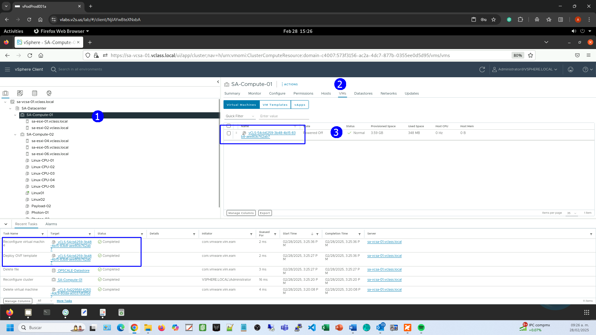
