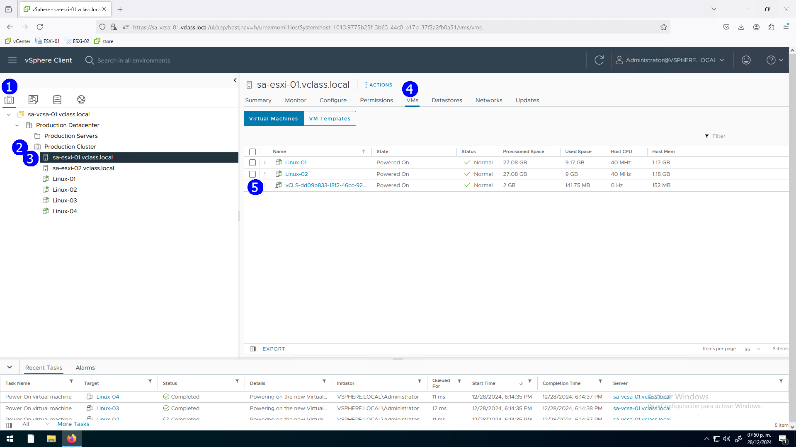
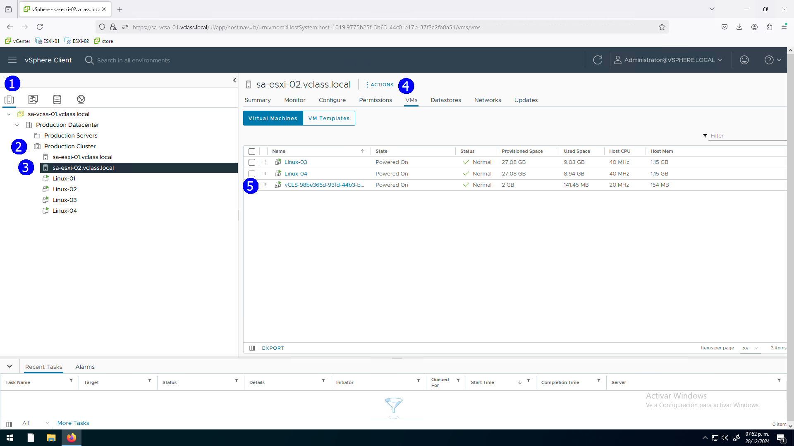
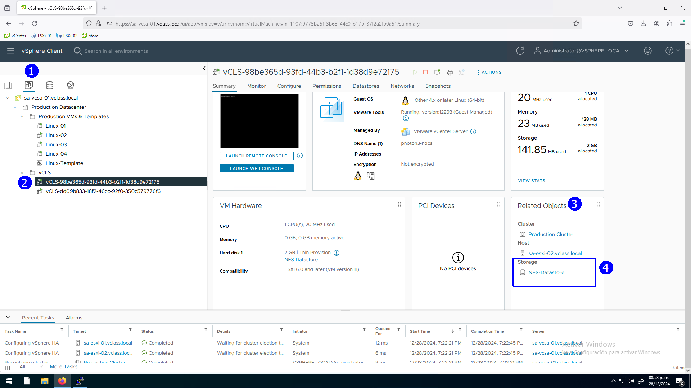
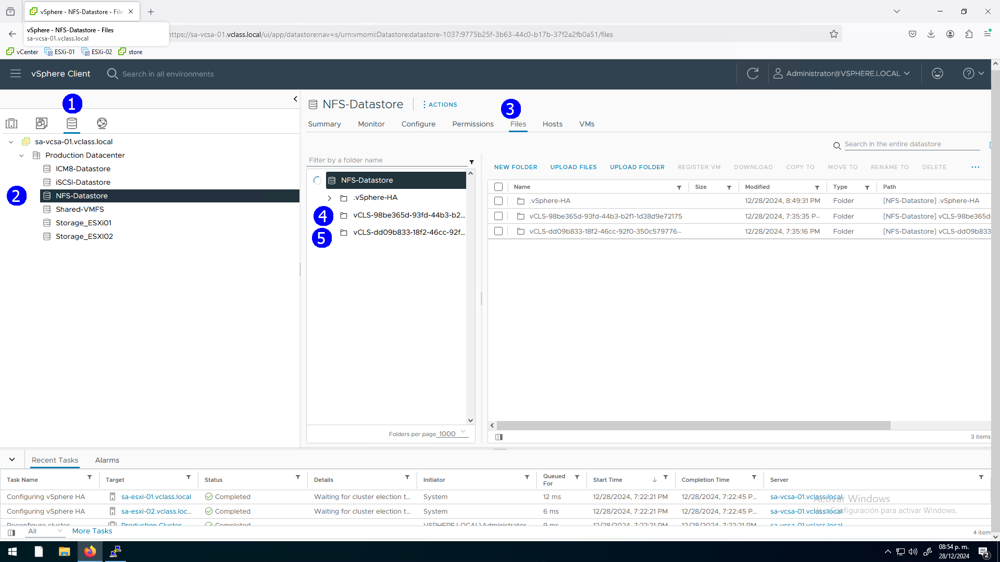
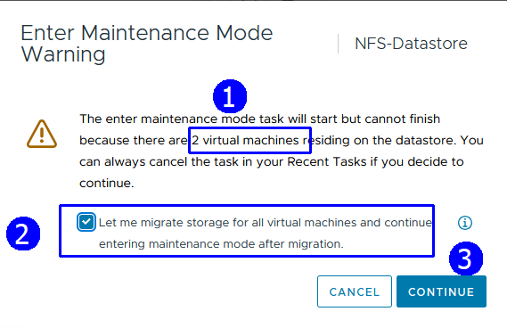
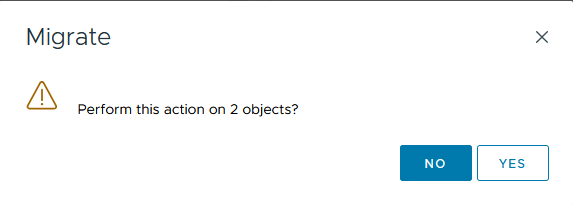
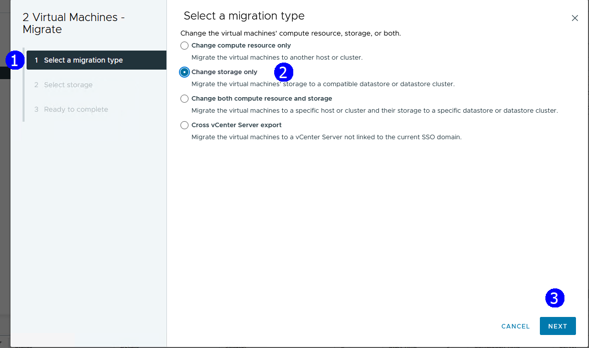
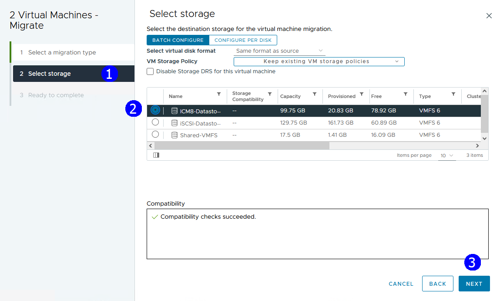
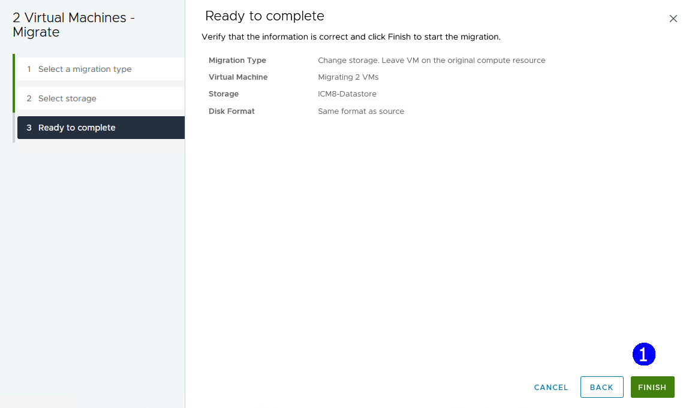
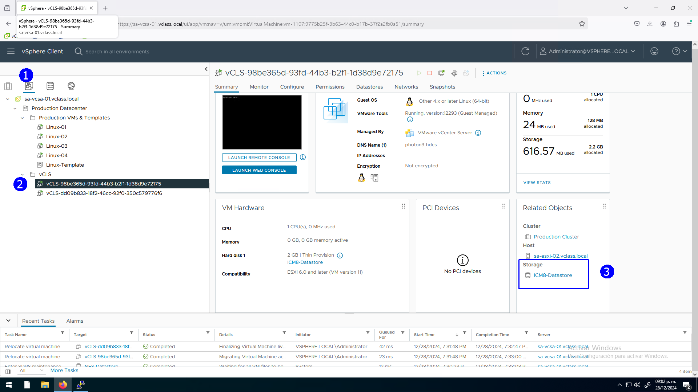

> # VMware vSphere
>
> ## Operación, Escalamiento y Seguridad
>
> **Versión 8**
>
> **Guía de uso de laboratorio**

## Laboratorio \# 4

### Manejo adecuado de las vCLS VMs en operaciones del storage

> Revisión 1.1 2024

## Laboratorio \# 4

### Manejo adecuado de las vCLS VMs en operaciones del storage

#### Actividades a realizar:

1.  **Explorar en el cluster el estado de las vCLS VMs**

2.  **Manejo de vCLS VMs al establecer el modo de mantenimiento del
    storage en donde residen**

## Actividad \# 1

### Explorar en el cluster el estado de las vCLS VMs

Utilizar de su sistema la herramienta de “**Conexión a escritorio
remoto**” con la dirección y puerto que le proporcionará su instructor;
utilizar como:

> Usuario: `vclass\Administrator`
>
> Contraseña: `VMware1!`

Recordemos que las vCLS VMs se utilizan para garantizar que ciertas
operaciones del clúster, como DRS y HA, sigan funcionando incluso si
vCenter está temporalmente inaccesible.

Las vCLS VMs son creadas automáticamente por vSphere en cada host del
clúster.

Si en las operaciones del cluster es requerido poner el datastore en el
que se alojan los discos de estas máquinas virtuales en mantenimiento es
necesario proactivamente migrar con storage vMotion las vCLS VMS a otro
datastore compartido para continuar la protección.

Se pueden observar las VMs que se han creado en el cluster y las vCLS
VMs

En la vista de **Hosts & Clusters** (1), click en el cluster
**Production Cluster** (2), click en la pestaña **VMs** (3), se ven las
VMs de operación (4) y las vCLS (5)

Para observar las vCLS VMs también se puede seleccionar la vista de
**VMS & Templates** (1), en la misma se muestran por separado (2)

Veamos cómo están ubicadas a nivel de servidor

En la vista de **Hosts & Clusters** (1), click en el cluster
**Production Cluster** (2), click en el host **ESXi_01** (3), click en
la pestaña **VMs** (4), aquí se puede observar que en el host
**ESXi_01** está registrada una vCLS VM (5).

De manera semejante y por temas de alta disponibilidad vemos la otra
VCLS en el Host **ESXi_02**

En la vista de **Hosts & Clusters** (1), click en el cluster
**Production Cluster** (2), click en el host **ESXi_02** (3), click en
la pestaña **VMs** (4), aquí se puede observar que en el host
**ESXi_02** está registrada otra vCLS VM (5).

Ahora, observar a manera de ejemplo en que datastore está alojada la
vCLS que está en el host **ESXi_01**.

En la vista de **VMs & Templates** (1), click en la **vCLS VM** (2),
Observar la sección de objetos relacionados (3).

El datastore en el que se encuentra es el **NFS**.

Las dos vCLS están en el mismo datastore

En la vista de **Datastores** (1), click en el datastore **NFS** (2),
click en la pestaña **Files** (3), Observar que se encuentran los dos
directorios relacionados con las **vCLS VMs**. (4)(5)

## Actividad \#2

### Manejo de vCLS VMs al establecer el modo de mantenimiento del storage en donde residen

Veamos cómo se da el proceso ordenado de poner el datastore NFS que
aloja las vCLS VMs,

En la vista de **Datastores** (1), click en el datastore **NFS** (2), en
el menú contextual, click en **Maintenance Mode** (3), seleccionar
**Enter maintenance mode** (4).

En este caso se detecta que el datastore tiene dos vCLS VMs (1), por lo
tanto, se nos ofrece la opción de hacer un storage vMotion de ambas VMs
antes de poner el datastore en modo mantenimiento.

Activar la opción de migración anticipada (2), **CONTINUE** (3),

Se nos solicita confirmar una migración colectiva, aceptar, **Yes** (1)

Seleccionar **Change storage only** (2), **NEXT** (3)

Seleccionar un storage compartido **ICM8-Datastore** (2), **NEXT** (3)

Se muestra el resumen, aceptar **FINISH** (1)

Se realiza la migración, ya no están los directorios de las vCLS VMs
(2), y el datastore está en modo mantenimiento (1)

Al revisar el datastore relacionado, ahora la vCLS VMs están en el nuevo
datastore, manteniendo la protección de HA y DRS

En la vista de **VMs & Templates** (1), click en la **vCLS VM** (2),
observar la sección de objetos relacionados (3).

Cuando no se hace una migración ordenada vCenter Server trata de hacer
una migración a otro datastore disponible de forma automática, si no se
cuenta con esa condición falla el proceso de poner en modo mantenimiento
el datastore
