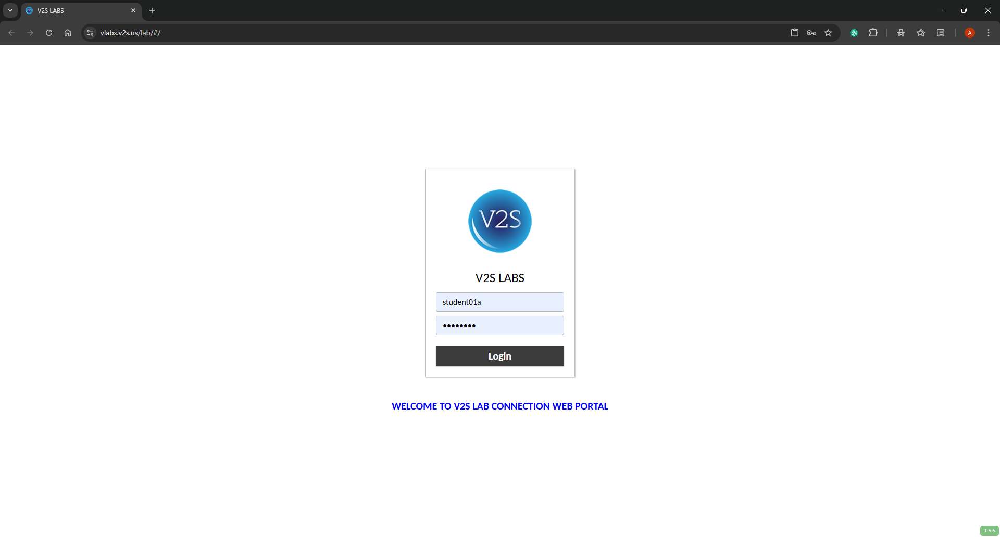
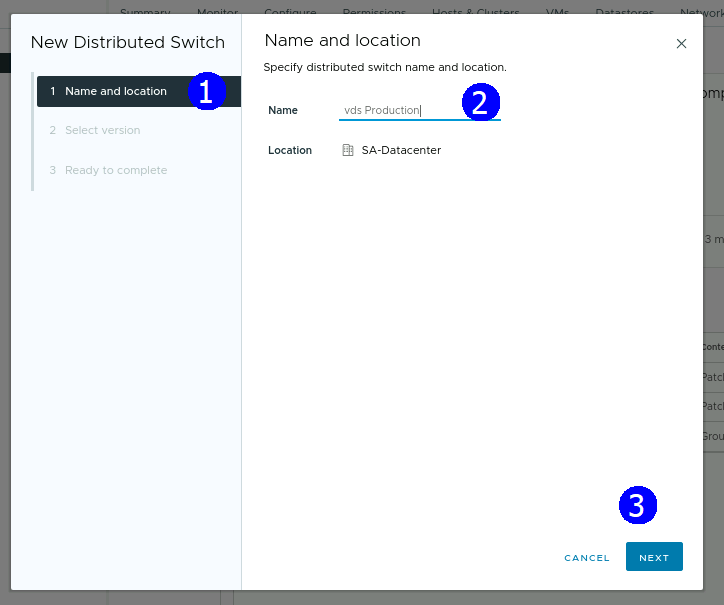
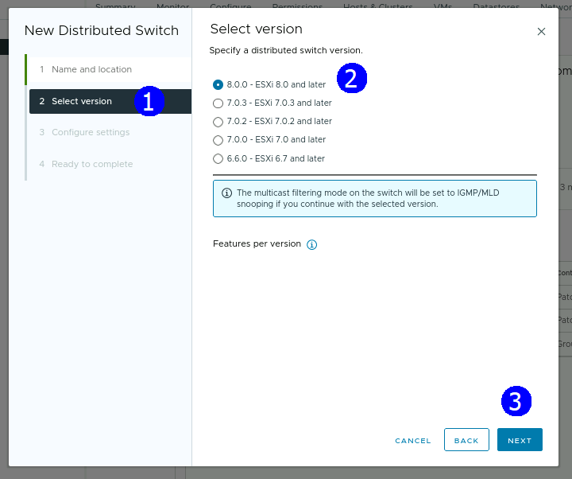
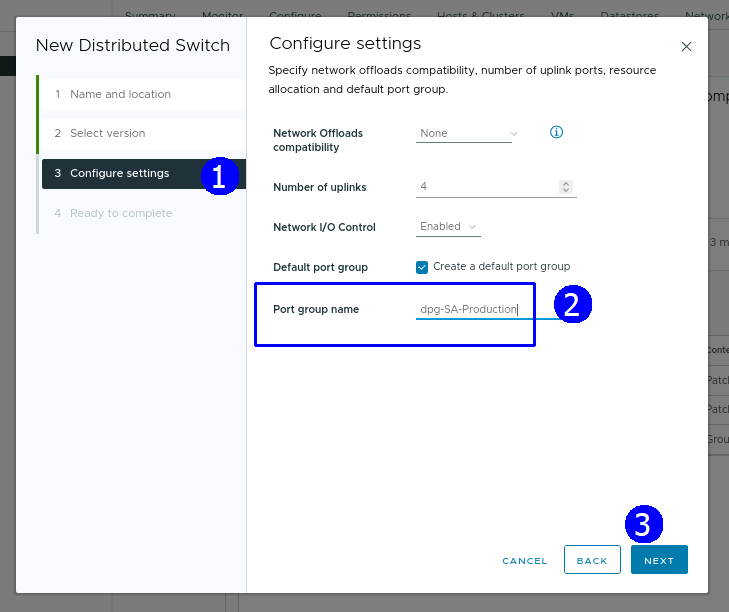
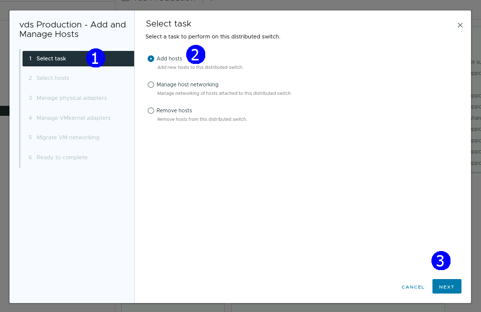
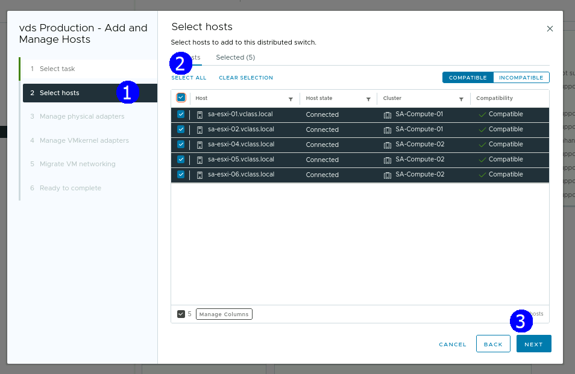
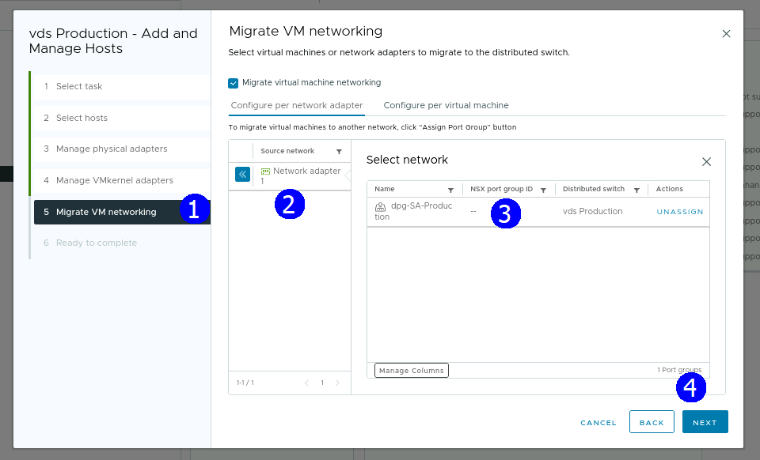

> # **VMware vSphere**
>
> ## **Operación, Escalamiento y Seguridad**
>
> ### **Versión 8**
>
> #### **Guía de uso de laboratorio**

## **Laboratorio \# 5**

### **Creación y configuración de un Switch Distribuido**

Actividades a realizar:

1.  Crear un Switch distribuido

2.  Configuración del Switch distribuido

3.  Integración de Hosts al Switch distribuido, migración de VMs

4.  Verificar configuración del Switch distribuido

## **Actividad \# 1**

### **Crear y configurar un Switch distribuido**

Utilizar la liga de acceso proporcionada por su instructor

A manera de ejemplo:
[**https://vlabs.v2s.us/lab**](https://vlabs.v2s.us/lab)

Utilizar el usuario y contraseña que le proporcione su instructor

A manera de ejemplo

> Usuario: `student01a`
>
> Contraseña: `Arn0224!`
>
> Click en **Login**
>
> Seleccionar en esta interfaz el primer pod de trabajo **vPodProd001a**
> (1)
>
>  alt="A screenshot of a computer Description automatically generated" />

Al entrar, en la siguiente interfaz proporcionar

> Usuario: `student01`
>
> Contraseña: `VMware1!`

Click en **OK**

> Se obtiene acceso al escritorio remoto
>
>  alt="A screenshot of a computer Description automatically generated" />

Abrir una instancia del browser Firefox con acceso directo al **vSphere
Client login interface**

User: `administrator@vsphere.local`

Password: `VMware1!`

Click en **Login**

Para crear un Switch distribuido click en la vista de redes (1), click
en el datacenter **SA-Datacenter** (2), presionar el botón derecho, en
el menú contextual seleccionar **Distributed Switch**, click en **New
Distributed Switch** (4)

En el paso de Nombre y ubicación establecer como nombre: **vds
Production** (2), **NEXT** (3)

En el paso para selección de la versión de Switch dejar la versión por
default **Esxi 8.0** (2), **NEXT** (3)

En el paso de configuración de especificaciones dejar los campos con
opciones de **default** y asignar el nombre **dps-SA-Production** al
**port group**. (2), **NEXT** (3)

Revisar la configuración del Switch, **FINISH** (3)

Se presenta el nuevo SW

## Actividad \# 2

### **Configuración del Switch distribuido**

En la vista de redes, seleccionar el **SA-Datacenter** y expandir el
switch **vds Production**

Observar el port group **dps-SA-Production**

Click en el port group **dpg-SA-Production** (1), presionar el botón
derecho y seleccionar **Edit Settings** (2)

Se muestra la caja de diálogo siguiente, seleccionar **Teaming** **and
Failover**

Seleccionar un **Uplink** a la vez y mover hacia abajo a la sección de
**Standby uplinks** con el botón **MOVE DOWN** para terminar con la
configuración siguiente, sólo el **uplink 1** (3) queda activo, los
otros están inactivos (4), aceptar las opciones de **monitoring** y
**micellaneous** con valores de default. Click en **OK**

## **Actividad \# 3**

### **Integración de Hosts al Switch distribuido, migración de VMs**

Para administrar los hosts en la vista de red seleccionar el Switch
distribuido (1), presionar botón derecho, click en **Add and Manage
Host** (2)

En la opción de seleccionar tareas, click en **Add Host** (2), **NEXT**
(3)

En el paso para seleccionar host, click en **SELECT ALL** (2), **NEXT**
(3)

En el paso de administrar tarjetas de red físicas, seleccionar la
**vmnic 3** que dejamos como activas en todos los **ESXis**, se ve la
lista de **Related Host** (3), click en **X** (4)

Seleccionar **uplink 1** (1) de la lista desplegable

El resultado es el siguiente, **NEXT** (4)

En el paso de **administració**n de adaptadores **VMkernel** click en
**NEXT**

En el paso de migrar **VMs**, click en **Migrate virtual machine
networkin**g (2), click en **configure per network adapter** (3), click
en **ASSIGN PORT GROUP** (5)

La asignación se muestra

Revisar la configuración, **FINISH** (3)

## **Actividad \# 4**

### **Verificar configuración del Switch distribuido**

Para explorar la configuración final, click en el Switch distribuido
(1), click en la pestaña **Configure** (2), en la sección de
**Settings** (3), click en **Topology** (4), observe las **VMS** (5) y
las **vmnics** asociadas de cada Host

Otra vista de la configuración está al seleccionar el **Switch** (1),
click en la pestaña **Configure** (2), en la sección de **Settings**
click en **Properties** (3), verifique **Uplinks** (4), **MTU** (5),
**CDP** (6)

Para revisar que las **VMs** están controladas por el **Switch** click
en el **port Group** (1), click en la pestaña **VMs** (2), ver la lista
de **VMs** (3)

Click en el port group (1), Click en pestaña **Ports** (2), se muestra
lista de hosts asociados, **VMs** y estado de uplinks

