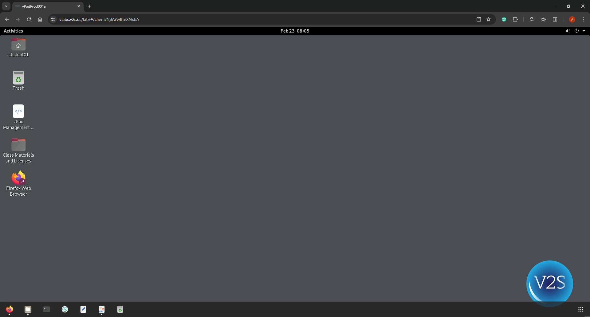
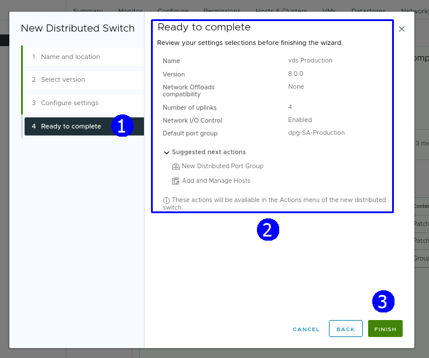
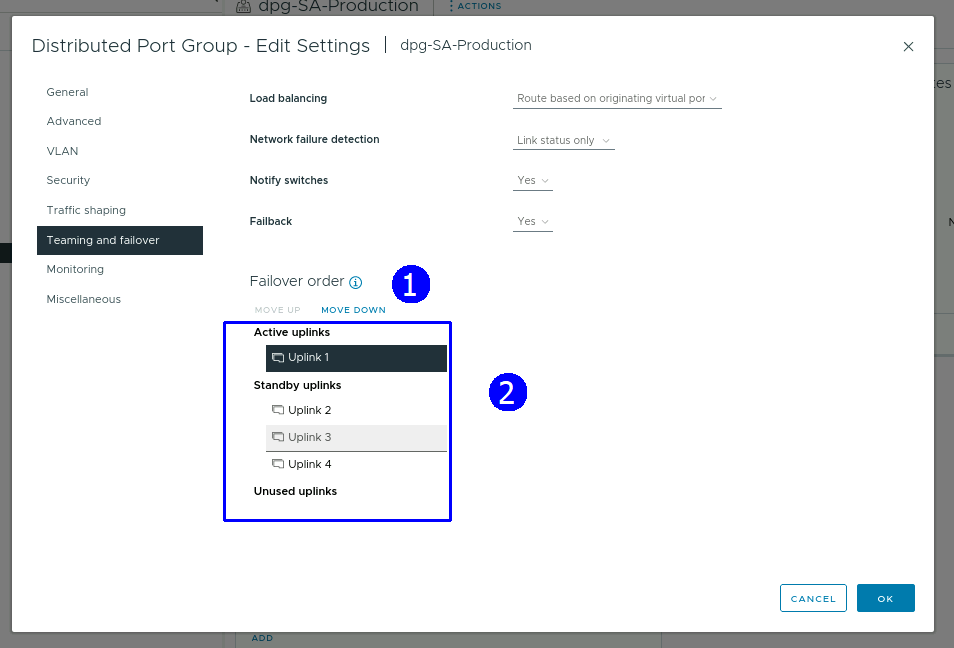
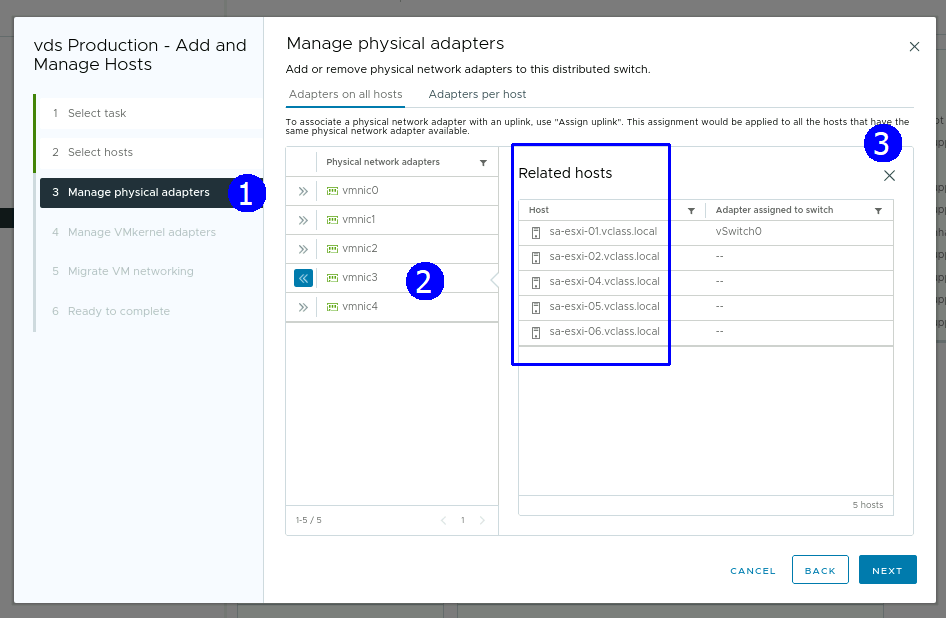
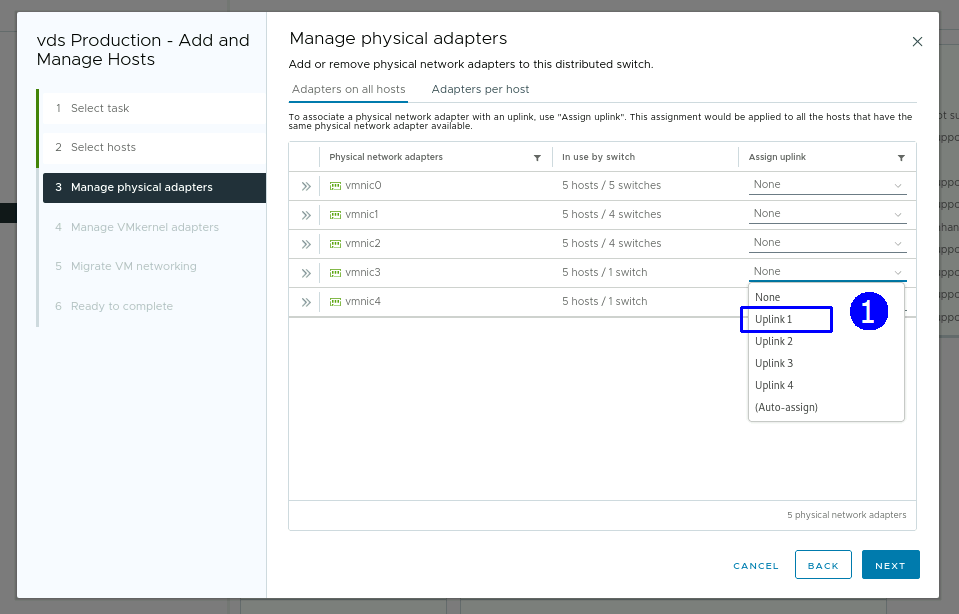
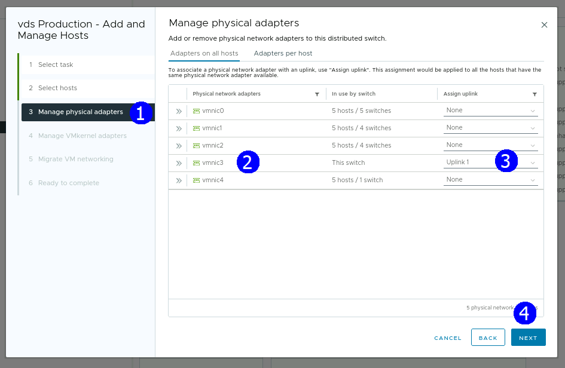
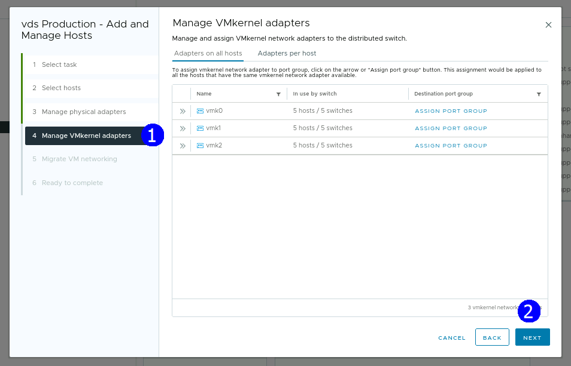
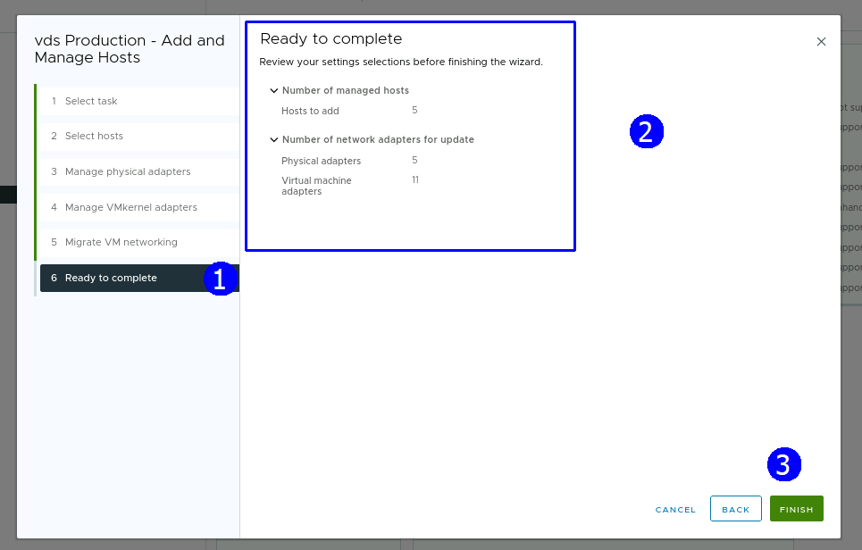

# Práctica 5. Creación y configuración de un Switch Distribuido

## Objetivos de la práctica:

- Crear un Switch distribuido.
- Configurar del Switch distribuido.
- Integrar Hosts al Switch distribuido y migración de VMs.
- Verificar la configuración del Switch distribuido.

## Duración aproximada:
- 30 minutos.

## Instrucciones

## **Actividad \# 1**

### **Crear y configurar un Switch distribuido**

Utilizar la liga de acceso proporcionada por su instructor.

A manera de ejemplo:
[**https://vlabs.v2s.us/lab**](https://vlabs.v2s.us/lab)

Utilizar el usuario y contraseña que le proporcione su instructor.

A manera de ejemplo:

> Usuario: `student01a`
>
> Contraseña: `Arn0224!`
>
> Click en **Login**
>
Seleccionar en esta interfaz el primer pod de trabajo **vPodProd001a** (1).
>
>  alt="A screenshot of a computer Description automatically generated" />

Al entrar, en la siguiente interfaz proporcionar:

> Usuario: `student01`
>
> Contraseña: `VMware1!`

Dar clic en **OK**.

> Se obtiene acceso al escritorio remoto
>
>  alt="A screenshot of a computer Description automatically generated" />

Abrir una instancia del browser Firefox con acceso directo al **vSphere
Client login interface.**

User: `administrator@vsphere.local`

Password: `VMware1!`

Dar click en **Login**.

Para crear un Switch distribuido hacer clic en la vista de redes (1), seleccionar el datacenter **SA-Datacenter** (2) y presionar el botón derecho. En
el menú contextual seleccionar **Distributed Switch**, dar clic en **New
Distributed Switch** (4).

En el paso de Nombre y ubicación, establecer como nombre: **vds
Production** (2). **NEXT** (3).

En el paso para seleccionar la versión de Switch, dejar la versión por
default **ESXi 8.0** (2). **NEXT** (3).

En el paso de configuración de especificaciones, dejar los campos con
opciones de **default** y asignar el nombre **dps-SA-Production** al
**port group** (2). **NEXT** (3).

Revisar la configuración del Switch (2). **FINISH** (3).

Se presenta el nuevo SW.

## Actividad \# 2

### **Configuración del Switch distribuido**

En la vista de redes (1), seleccionar el **SA-Datacenter** (2) y expandir el
switch **vds Production** (3).

Observar el port group **dps-SA-Production**.

Seleccionar el port group **dpg-SA-Production** (1), presionar el botón
derecho y seleccionar **Edit Settings** (2)

Se muestra la caja de diálogo siguiente: seleccionar **Teaming** **and
Failover.**
Seleccionar un **Uplink** a la vez y mover hacia abajo a la sección de
**Standby uplinks** con el botón **MOVE DOWN** para terminar con la
configuración siguiente:

Sólo el **uplink 1** (3) queda activo, los
otros están inactivos (4). Aceptar las opciones de **monitoring** y
**micellaneous** con valores de default. Dar clic en **OK**.

## **Actividad \# 3**

### **Integración de Hosts al Switch distribuido, migración de VMs**

Para administrar los hosts en la vista de red, seleccionar el Switch
distribuido (1), presionar el botón derecho y hacer clic en **Add and Manage
Host** (2).

En la opción de seleccionar tareas (1), elegir **Add Host** (2). **NEXT**.
(3)

En el paso para seleccionar host, dar clic en **SELECT ALL** (2). **NEXT**
(3).

En el paso para administrar tarjetas de red físicas, seleccionar la
**vmnic 3** (2) que dejamos como activas en todos los **ESXis**, se muetra la
lista de **Related Host** (3). Dar click en **X** (4).

Seleccionar **uplink 1** (1) de la lista desplegable.

El resultado es el siguiente. **NEXT** (4).

En el paso de **administración** de adaptadores **VMkernel**, dar click en
**NEXT**.

En el paso de migrar **VMs**, seleccionar **Migrate virtual machine
networkin**g (2), elegir **Configure per network adapter** (3), dar clic
en **ASSIGN PORT GROUP** (5). **NEXT** (6).

La asignación se muestra.

Revisar la configuración. **FINISH** (3).

## **Actividad \# 4**

### **Verificar configuración del Switch distribuido**

Para explorar la configuración final, elegir el Switch distribuido
(1). Dirigirse a la pestaña **Configure** (2), en la sección de
**Settings** (3), seleccionar **Topology** (4). Observar las **VMS** (5) y
las **vmnics** (6) asociadas de cada Host.

Otra vista de la configuración está al seleccionar el **Switch** (1),
dirigirse a la pestaña **Configure** (2) y en la sección de **Settings**
seleccionar **Properties** (3). Verficar **Uplinks** (4), **MTU** (5) y
**CDP** (6).

Para revisar que las **VMs** están controladas por el **Switch**, seleccionar
el **port Group** (1). Dirigirse a la pestaña **VMs** (2) y ver la lista
de **VMs** (3).

Seleccionar el port group (1). Dirigirse a la pestaña **Ports** (2), donde se muestra
la lista de hosts asociados, **VMs** y estado de uplinks.

