> # VMware vSphere
>
> ## Operación, Escalamiento y Seguridad
>
> ### Versión 8
>
> #### Guía de uso de laboratorio

## Laboratorio \# 6

> ### Administración de Switches Distribuidos
>
> Revisión 1.1 2024
## Laboratorio \# 6

### Administración de Switches Distribuidos

#### Actividades a realizar:

1.  Agregación de grupo de puertos en un Switch distribuido

2.  Activar la verificación de estado de salud del switch distribuido

3.  Verificar la funcionalidad del estado de salud del switch
    distribuido

4.  Corrección de errores reportados

5.  Anular la verificación de estado de salud del switch distribuido

6.  Exportación de la configuración de un switch distribuido

## Actividad \# 1

### Agregación de grupo de puertos en un Switch distribuido

Utilizar de su sistema la herramienta de “**Conexión a escritorio
remoto**” con la dirección y puerto que le proporcionará su instructor;
utilizar como:

> Usuario: `vclass\Administrator`
>
> Contraseña: `VMware1!`

Abrir una instancia de Firefox, seleccionando el acceso rápido de
**vCenter**.

En la vista de **Redes** (1), click en el switch **vds Production** (2),
en el menú contextual seleccionar **Distributed Port Group** (3), click
en **New Distributed port Group** (4)

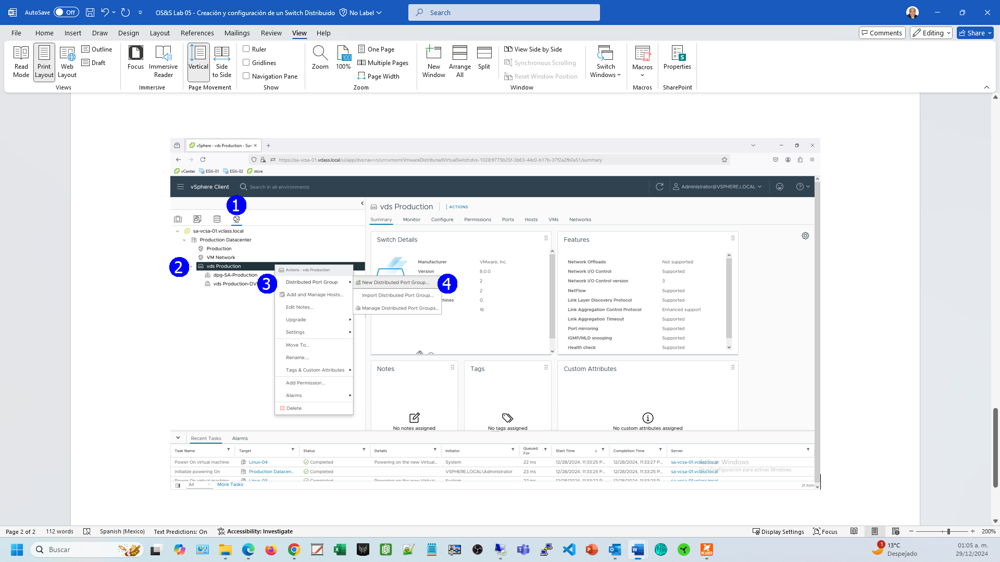

En el paso **Name and Location** (1), proporcionar el nombre del nuevo
grupo de puertos **pg-for-testing** (2), **NEXT** (3)

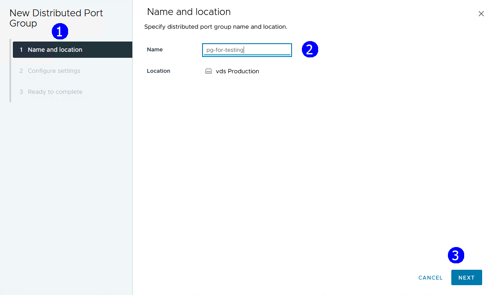

En el paso **Configure settings** (1), dejar valores por default,
excepto **VLAN Type** y **Vlan ID**, establecerlos como **VLAN** (2)
**10** (3), **NEXT** (4), esta última configuración la utilizaremos para
detectar un error de configuración.

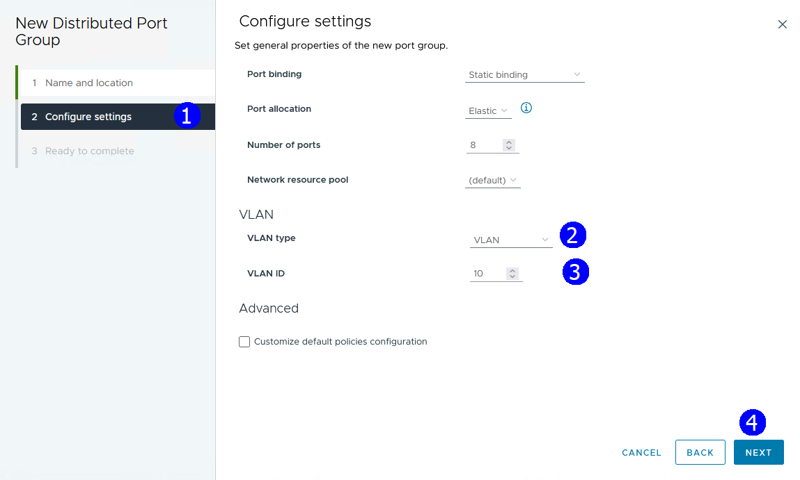

Se muestran a configuración a establecer, **FINISH** (1)

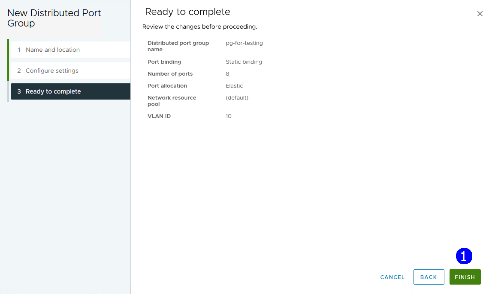

## Actividad \# 2

### Activar la verificación de estado de salud del switch distribuido

Con el propósito de habilitar la funcionalidad de “**Health Check**”

En la vista de **Redes** (1), click en el switch **vds Production** (2),
click en la pestaña **Configure** (3), en la sección **Settings**, click
en **Health Check** (4), click en **EDIT** (5).

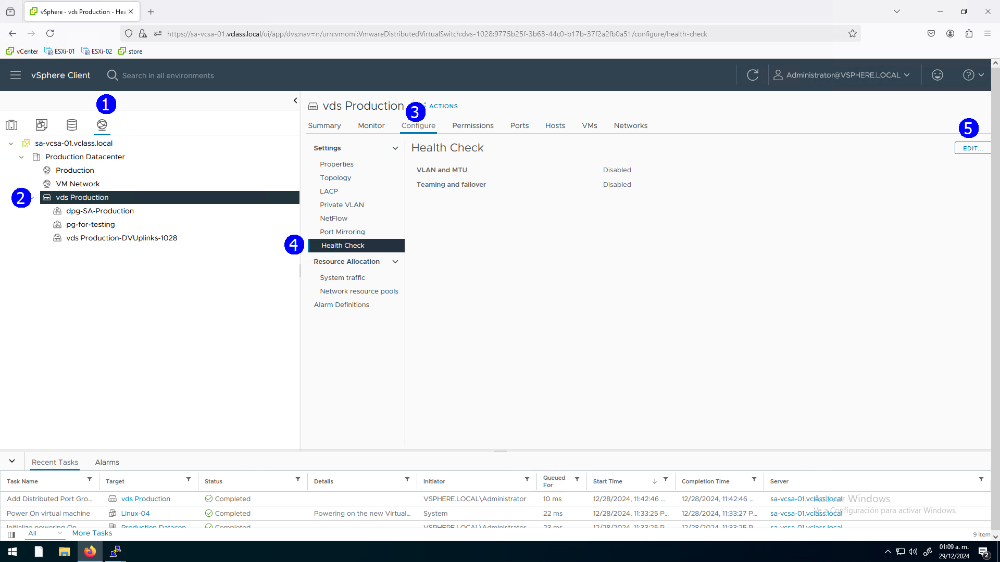

Establecer **Enabled** en ambas secciones **VLAN and MTU**, y en
**Teaming and Failover, OK** (3)

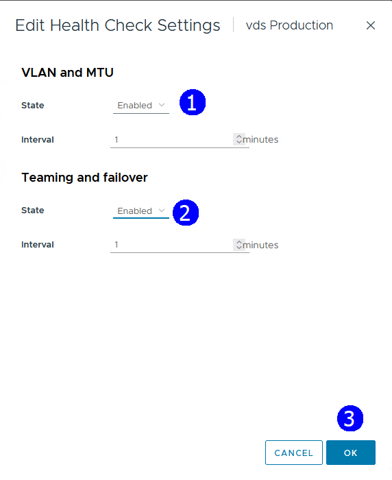

## Actividad \# 3

### Verificar la funcionalidad del estado de salud del switch distribuido

Con esto, dado que establecimos en el grupo de puertos la vlan 10, y el
tráfico no aplica en esa vlan el servicio de “**Health check”** detecta
esta inconsistencia y se muestra el error de configuración.

En la vista de Redes (1), click en el switch **vds Production** (2),
click en la pestaña **Monitor** (3), en la sección de **Tasks and
Events** click en **Health** (4), click en el host **ESXi_01** (5),
observar la advertencia (6) relacionada con la **VLAN 10** (7)

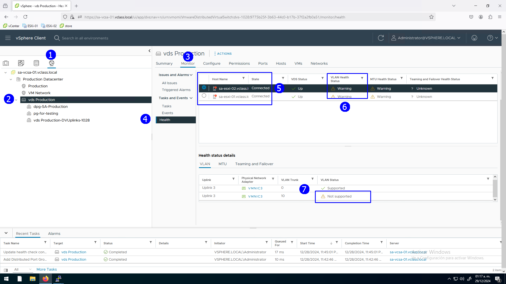

## Actividad \# 4

### Corrección de errores reportados

Para corregir el error de configuración detectado

En la vista de **Redes** (1), click en el port group **pg-for-testing**
(2), en el menú contextual seleccionar **Edit Settings** (3)

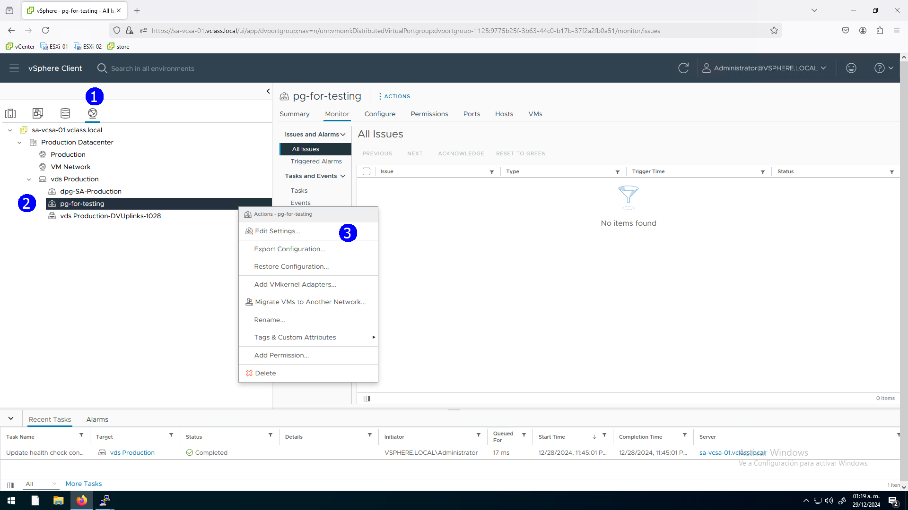

En la sección **VLAN** (1) establecer en **VLAN Type:** **None** (2),
**OK** (3)

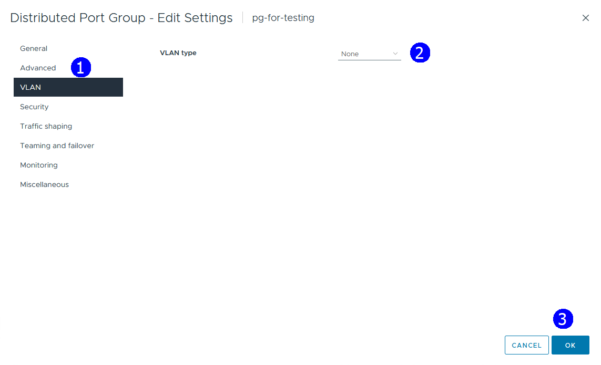

En la vista de Redes (1), click en el portgroup **pg-for-testing** (2),
click en la pestaña **Monitor** (3), en la sección de **Tasks and
Events** click en **Health** (4), ya no se observan errores

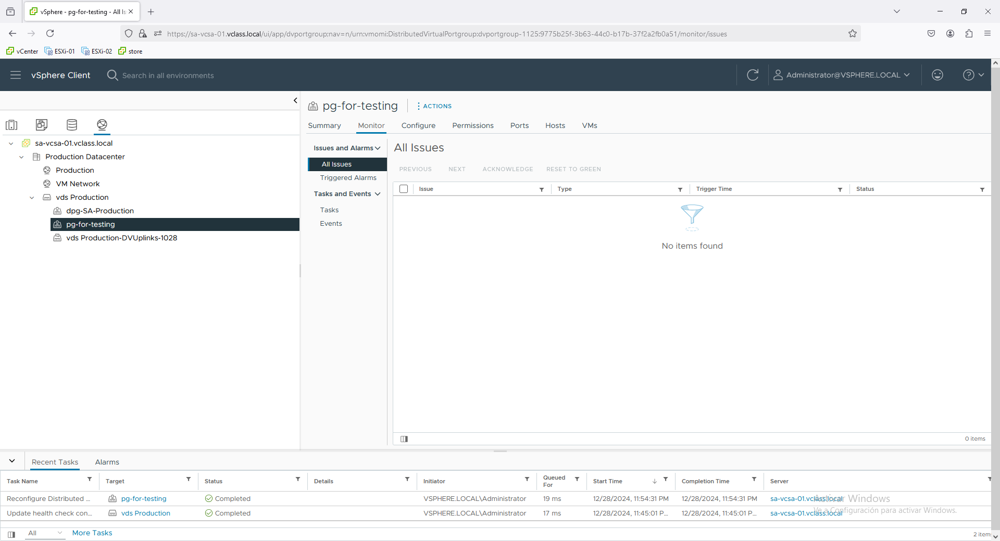

## Actividad \#4

### Anular la verificación de estado de salud del switch distribuido

Para desactivar la función “**Health check**”

En la vista de **Redes** (1), click en el switch **vds Production** (2),
click en la pestaña **Configure** (3), en la sección de **Settings**
click en **Health** **Check** (4), click en **EDIT** (6)

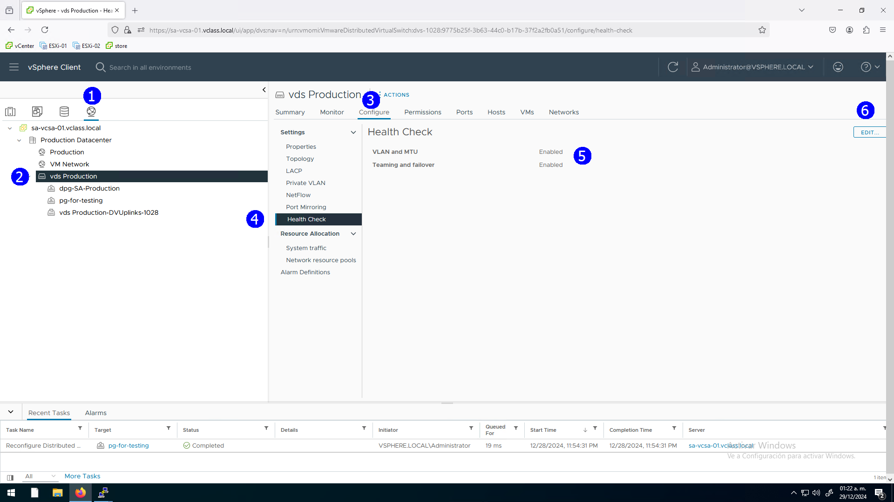

Establecer **Disabled** en ambas secciones **VLAN** **and** **MTU** (1)
y **Teaming** **and** **Failover** (2), **OK** (3)

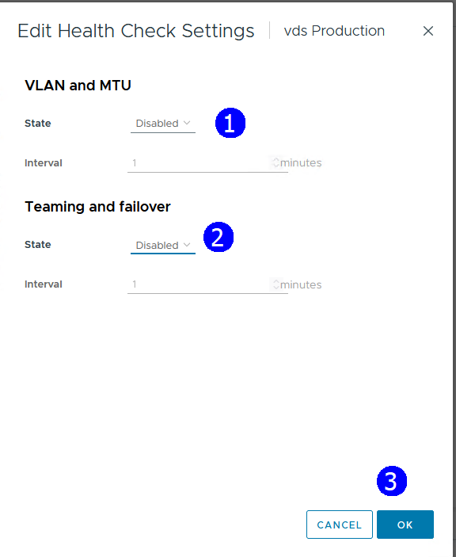

## Actividad \# 6

### Exportación de la configuración de un switch distribuido

La exportación de la configuración para aplicar en otro Switch
distribuido se realiza de la siguiente manera

En la vista de **Redes** (1), click en el switch **vds Production** (2),
en el menú contextual seleccionar **Settings** (3), click en **Export
configuration** (4)

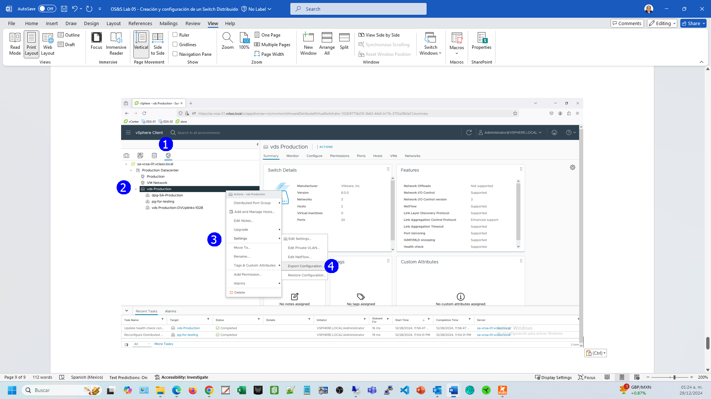

Establecer **Distributed switch and all port groups** (1), **OK** (2)

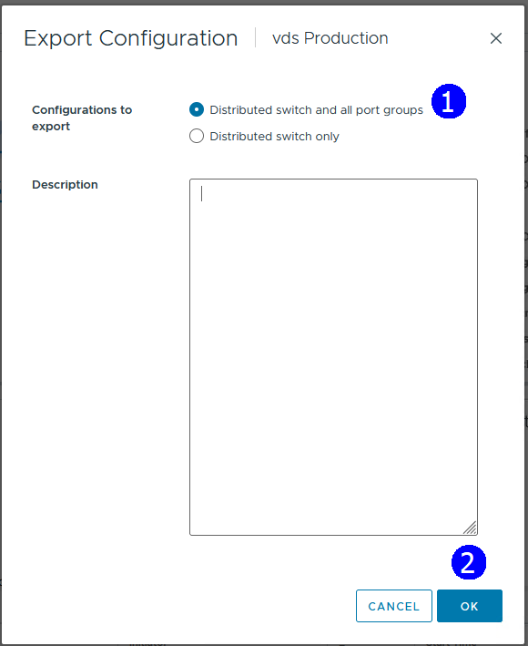

Se genera el archivo **Backup.zip** (1) que se descarga en el
escritorio.

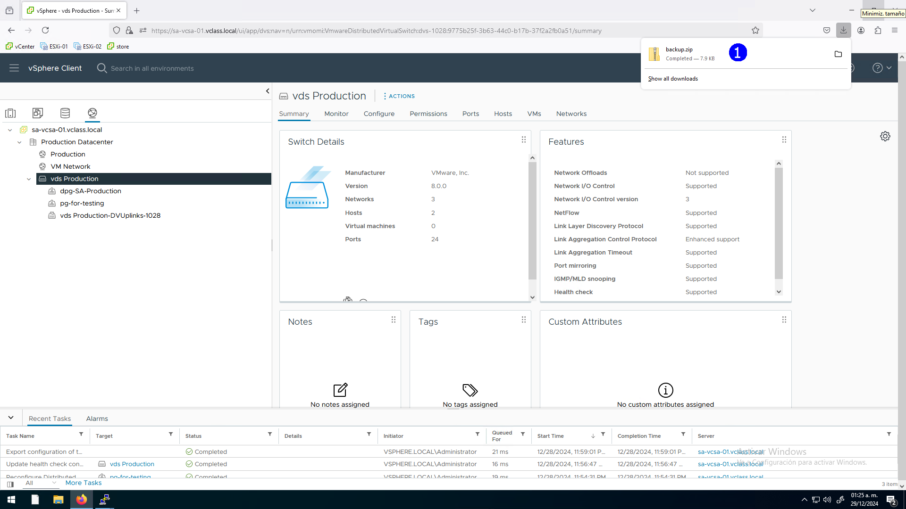
