> # **VMware vSphere**
>
> ## **Operación, Escalamiento y Seguridad**
>
> ### **Versión 8**
>
> #### **Guía de uso de laboratorio**

## **Laboratorio \# 8**

### **Exploración de la configuración de un datastore vSAN**

Actividades por realizar:

1.  Revisar la configuración de un datastore de vSAN

2.  Revisar la política por default de almacenamiento en vSAN

3.  Revisar una VM en el datastore de vSAN

## **Actividad \# 1**

### **Revisar la configuración de un datastore de vSAN**

Utilizar la liga de acceso proporcionada por su instructor

A manera de ejemplo:
[**https://vlabs.v2s.us/lab**](https://vlabs.v2s.us/lab)

Utilizar el usuario y contraseña que le proporcione su instructor

A manera de ejemplo

> Usuario: `student01a`
>
> Contraseña: `Arn0224!`
>
> Click en **Login**
>
> Seleccionar en esta interfaz el primer pod de trabajo **vPodProd001a**
> (1)
>
>  alt="A screenshot of a computer Description automatically generated" />

Al entrar, en la siguiente interfaz proporcionar

> Usuario: `student01`
>
> Contraseña: `VMware1!`

Click en **OK**

> Se obtiene acceso al escritorio remoto
>
>  alt="A screenshot of a computer Description automatically generated" />

Abrir una instancia del browser Firefox con acceso directo al **vSphere
Client login interface**

User: `administrator@vsphere.local`

Password: `VMware1!`

Click en **Login**

**2.- Verificar que **VSAN** está habilitado en el cluster**

En la vista de **Hosts & Clusters** (1), seleccionar el cluster
**SA-Compute-02** (2), click en la pestaña **Configure** (3), en la
sección de configuración seleccionar **Quickstart,** revisar que
**vSAN** aparece como un servicio activo

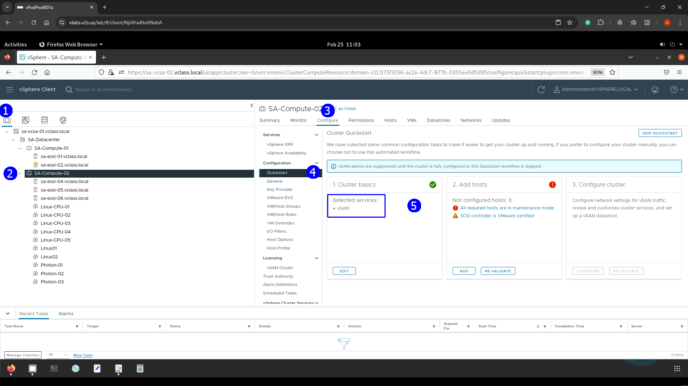

**3.- Revisar que Hosts pertenecen al cluster de **vSAN****

En la vista de **Hosts & Clusters** (1), seleccionar el cluster
**SA-Compute-02** (2), click en la pestaña **Summary** (3)

Desplazarse entre las secciones y checar que en la sección de **Cluster
Resources** el número de hosts que están relacionados en el cluster de
**vSAN.**

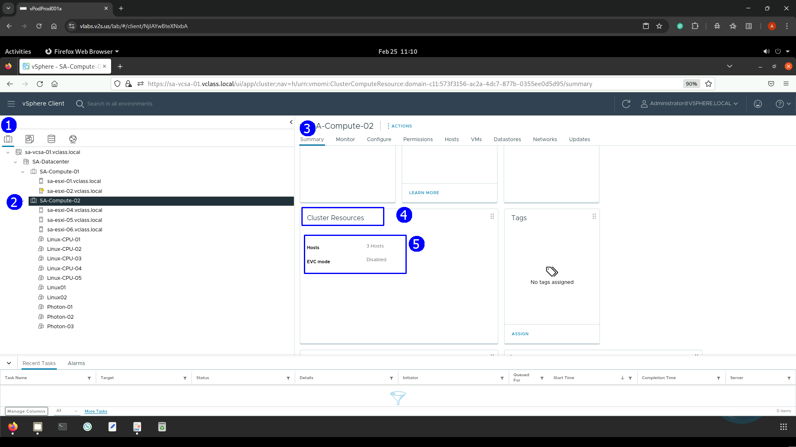

Click en la pestaña de **Hosts** (1) para ver el nombre de los host ESXi
en el cluster (2)

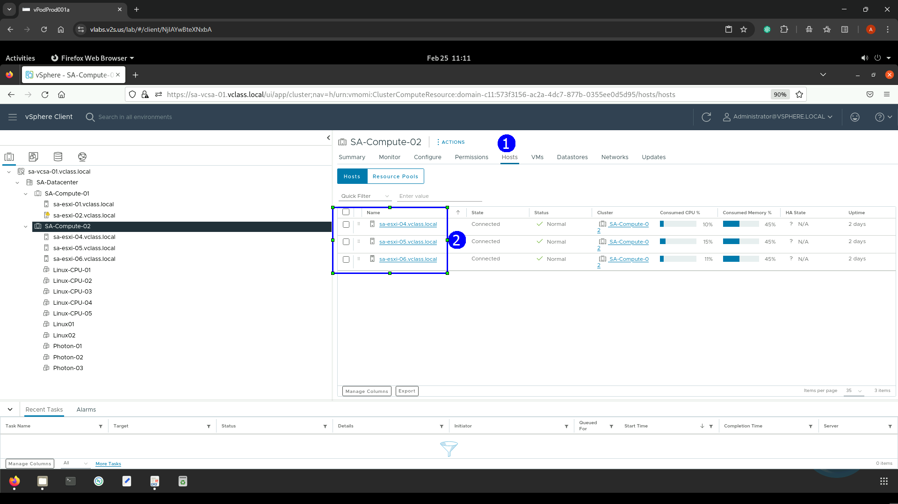

**4.- Revisar la configuración de grupos de discos en el cluster de**
**vSAN**

En la vista de **Hosts & Clusters** (1), seleccionar el cluster
**SA-Compute-02** (2), click en la pestaña **Configure** (3)

En la sección de **vSAN** (4) click **Disk Managment (5)**

En cada host seleccionar **VIEW DISK** (6) y (7)

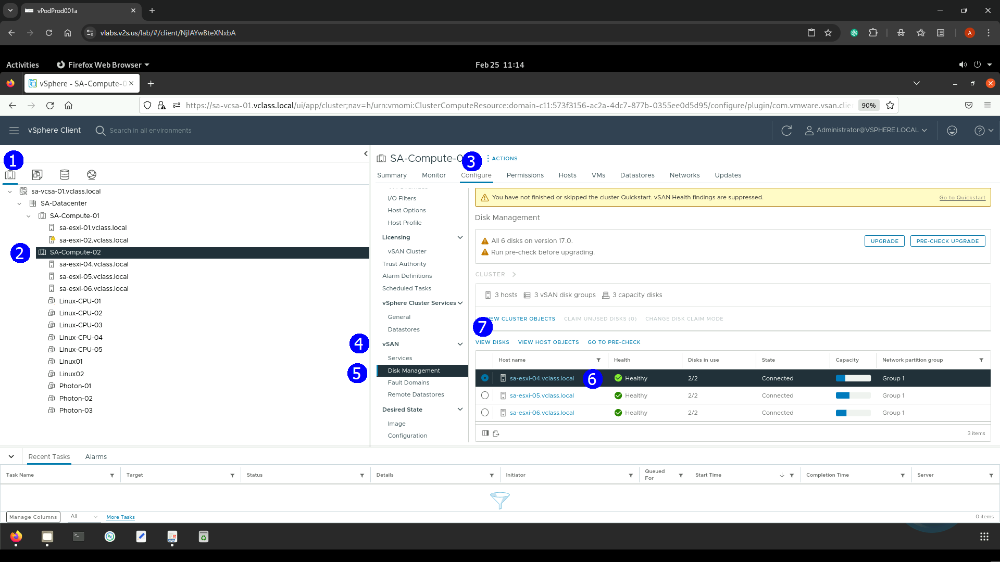

Expanda el grupo de discos **Disk group** para ver sus detalles

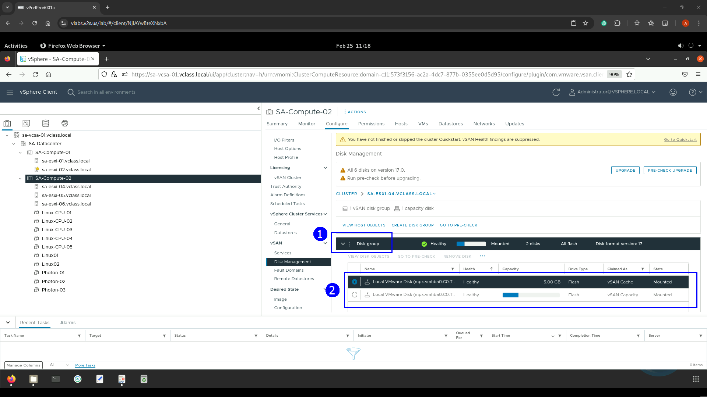

**5.- Identificar la configuración del puerto VMkernel que se usa para
accesar la red de** **vSAN**.

En la vista de **Hosts & Clusters** (1), seleccionar el cluster
**SA-Compute-02** (2), click en el host **ESXI_04** (3), click en la
pestaña **Configure** (4), en la sección de **Networking** (5)
seleccionar **Vmkernel Adapters** (6)

En la lista de puertos VMkernel expandir el **vmk2** (7) para revisar
sus detalles

Click en la pestaña de **Properties** (8) para el puerto **vmk2**

Verificar que aparece el servicio **vSAN** activo para este puerto(9).

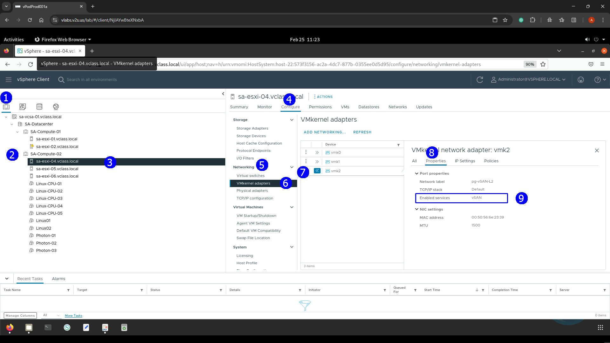

**6.- Ver la capacidad de almacenamiento del cluster de vSAN** 

En la vista de **Hosts & Clusters** (1), seleccionar el cluster
**SA-Compute-02** (2), click en la pestaña **Summary** (3),

Desplazarse entre las secciones para hallar en la sección de **vSAN**
que muestra la capacidad de almacenamiento. (4)

Para ver el uso del espacio de vSAN click **VIEW CAPACITY** (5)

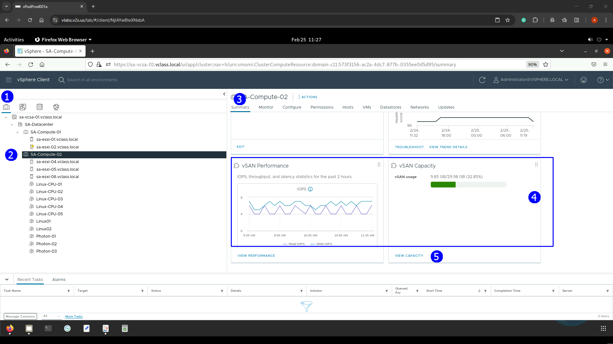

Se muestra la pestaña **MONITOR,** click **Capacity Usage**, ver en
**Capacity Overview** el espacio libre y ocupado en **vSAN**

## **Actividad \# 2**

### **Revisar la política por default de almacenamiento en vSAN**

Desde el menú principal (1) seleccionar **Policies and Profiles** (2)

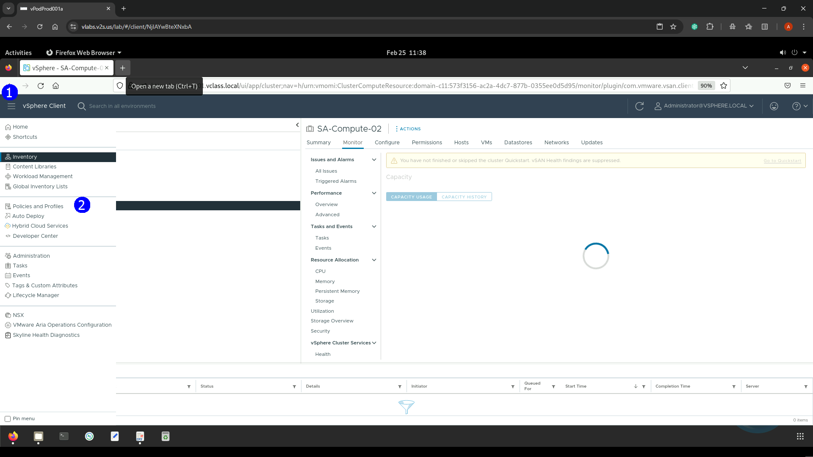

En el panel de navegación verificar que políticas de almacenamiento para
VMs están activas (1)

En el panel derecho desplazarse en la lista de políticas y seleccionar
**vSAN Default Storage Policy**

En la pestaña de reglas ver la especificación para esta política de
almacenamiento

La misma una política de RAID 1 (mirroring) (3), es la política por
default de vSAN

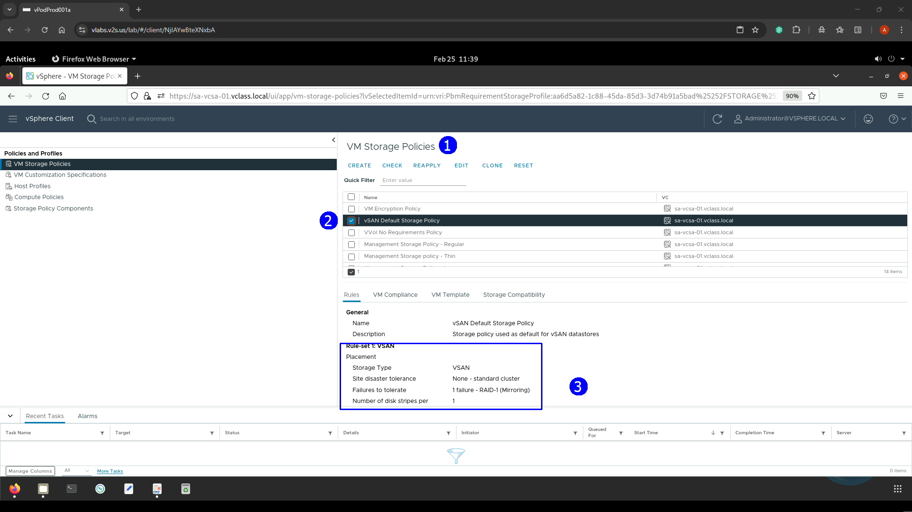

## **Tarea \#3**

### **Revisar una VM en el datastore de vSAN**

Para tener la certeza de que una VM está almacenada en un datastore de
vSAN

En la vista de **Datastores** (1) click en el datastore
**vsanDatastore** (2), click en la pestaña de **VMs** (3)

En la misma aparece la VM Photon-03

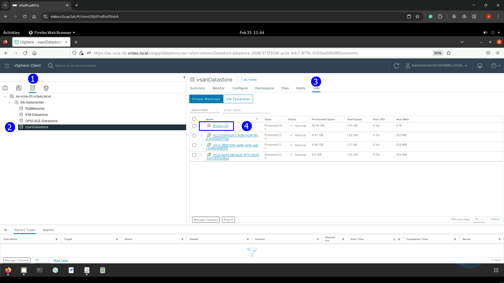

Dar click en la **VM Photon-03**, observar que la VM está seleccionada
en el inventario en la sección izquierda (1), dar click en la pestaña
**Monitor** (2), en la sección de **vSAN** (3), click en **Physical disk
placement** (4), en la sección de la derecha aparecen los componentes
del objeto **VM Photon-03** ubicados en los servidores del cluster
**ESXI-06, ESXI-05 y ESXI-04** (5)

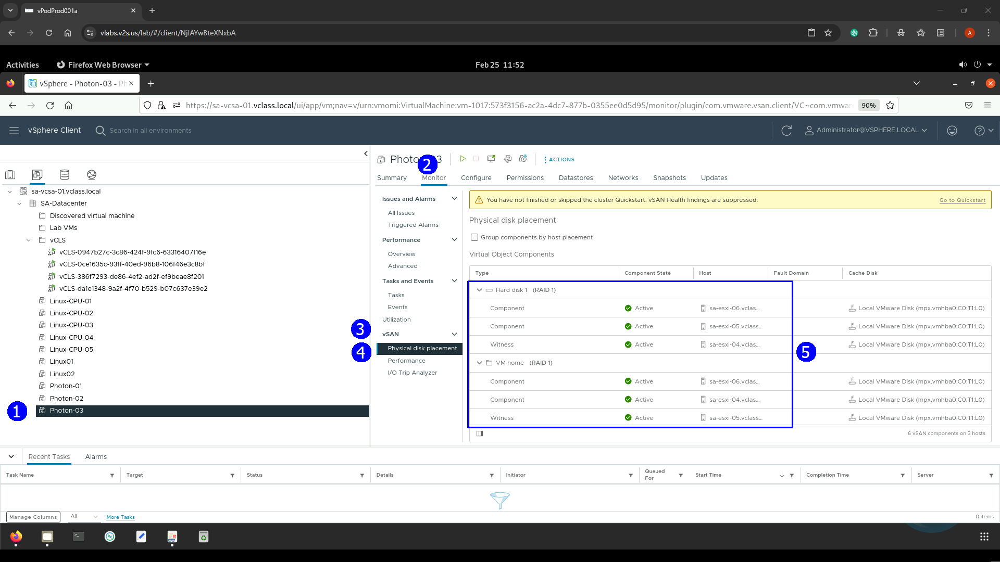
