> # **VMware vSphere**
>
> ## **Operación, Escalamiento y Seguridad**
>
> ### **Versión 8**
>
> #### **Guía de uso de laboratorio**

## **Laboratorio \# 9**

### **Aplicación de una política de almacenamiento**

#### **Actividades por realizar:**

> **1. Agregar datastores para que los use el almacenamiento basado en
> políticas**
>
> **2. Use vSphere Storage vMotion para migrar el almacenamiento de
> máquinas virtuales**
>
> **3. Configurar etiquetas de almacenamiento**
>
> **4. Crear Políticas de almacenamiento para máquinas virtuales**
>
> **5. Asignar políticas de almacenamiento a las máquinas virtuales**

## **Actividad \# 1**

### **Agregar almacenes de datos para que los use el almacenamiento basado en políticas**

Utilizar la liga de acceso proporcionada por su instructor

A manera de ejemplo:
[**https://vlabs.v2s.us/lab**](https://vlabs.v2s.us/lab)

Utilizar el usuario y contraseña que le proporcione su instructor

A manera de ejemplo

> Usuario: `student01a`
>
> Contraseña: `Arn0224!`
>
> Click en **Login**
>
> Seleccionar en esta interfaz el primer pod de trabajo **vPodProd001a**
> (1)
>
>  alt="A screenshot of a computer Description automatically generated" />

Al entrar, en la siguiente interfaz proporcionar

> Usuario: `student01`
>
> Contraseña: `VMware1!`

Click en **OK**

> Se obtiene acceso al escritorio remoto
>
>  alt="A screenshot of a computer Description automatically generated" />

Abrir una instancia del browser Firefox con acceso directo al **vSphere
Client login interface**

User: `administrator@vsphere.local`

Password: `VMware1!`

Click en **Login**

2\. En el menú principal, seleccione **Inventory** y haga click en el
ícono **Storage**.

3\. Cree un almacén de datos denominado **ds-gold**.

1)  En el panel de navegación, haga click con el botón derecho en
    **SA-Datacenter** y seleccione **Storage**, click **New Datastore**.

>  alt="A screenshot of a computer Description automatically generated" />

Aparece el asistente **New datastorage**.

En la página **Type**, deje **VMFS** seleccionado y haga clic en
**NEXT**.

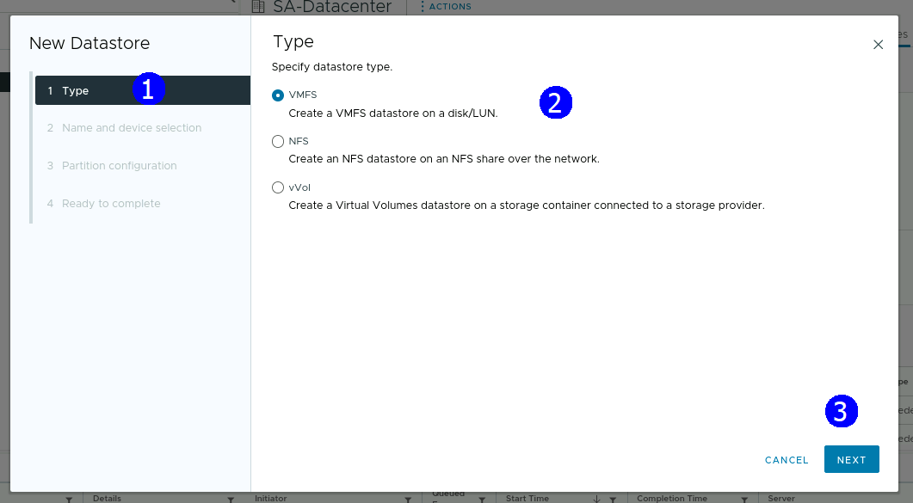

En la página **Name and device Selection**, ingrese **ds-gold** en el
cuadro de texto **Name**.

En el menú desplegable **Select a host**, seleccione ESXi host
**sa-esxi-04.vclass.local**

En la lista de LUNs, seleccione **LUN 7** con la descripción de entrada
FreeNAS ISCSI Disk (naa..) y capacidad **8.00 GB**, y haga clic en
**NEXT**.

En la página **VMFS version**, deje **VMFS 6** seleccionado y haga clic
en **NEXT**.

En la página **Partition configuration**, mantenga los valores
predeterminados, click en **NEXT**.

En la página **Ready to complete** para terminar, revise la
configuración y haga clic en **FINISH**.

En el panel de Tareas recientes, verifique que la tarea se haya
completado.

Verifique que el almacén de datos **ds-gold** aparezca en el panel de
navegación.

Crear un datastore llamado **ds-silver**.

En el panel de navegación, haga clic con el botón derecho en
**SA-Datacenter** y seleccione **Storage**, click en **New datastore**.

Aparece el asistente **New datastore**.

En la página **Type**, deje **VMFS** seleccionado y haga clic en
**NEXT**.

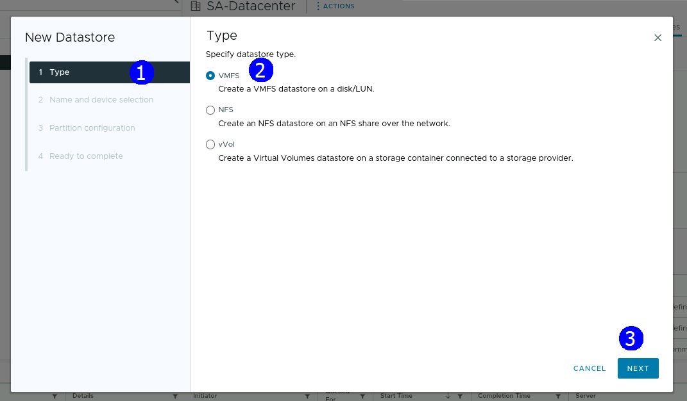

En la página **Name and device selection**, ingrese **ds-silver** en el
campo **Name**.

En el menú desplegable **Select a host**, seleccione ESXi host
**sa-esxi-04.vclass.local**.

En la lista de LUNs, seleccione **LUN 8** con la descripción de entrada
FreeNAS ISCSI Disk (naa..) y capacidad **12.00 GB**, y haga clic en
**NEXT**.

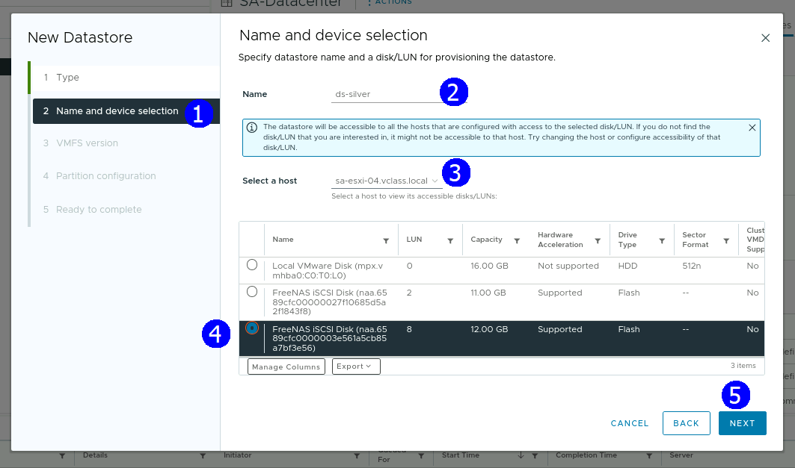

En la página **VMFS version**, deje **VMFS 6** seleccionado y haga clic
en **NEXT**.

En la página **Partition configuration**, mantenga los valores
predeterminados y haga clic en **NEXT**.

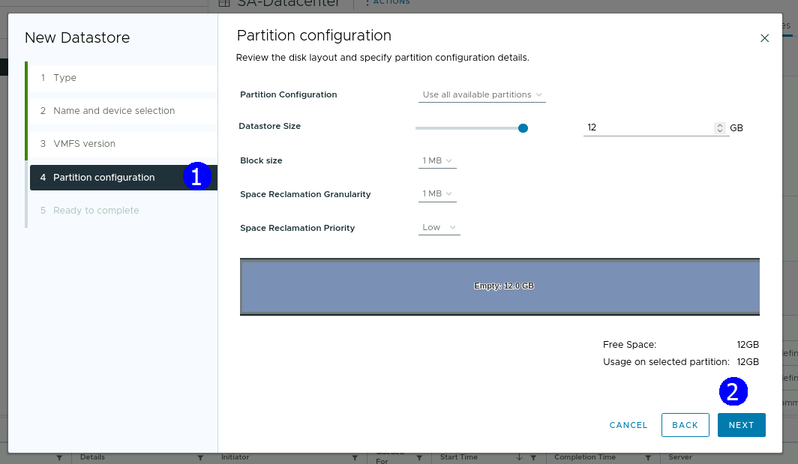

En la página **Ready to complete**, revise la configuración y haga clic
en **FINISH**.

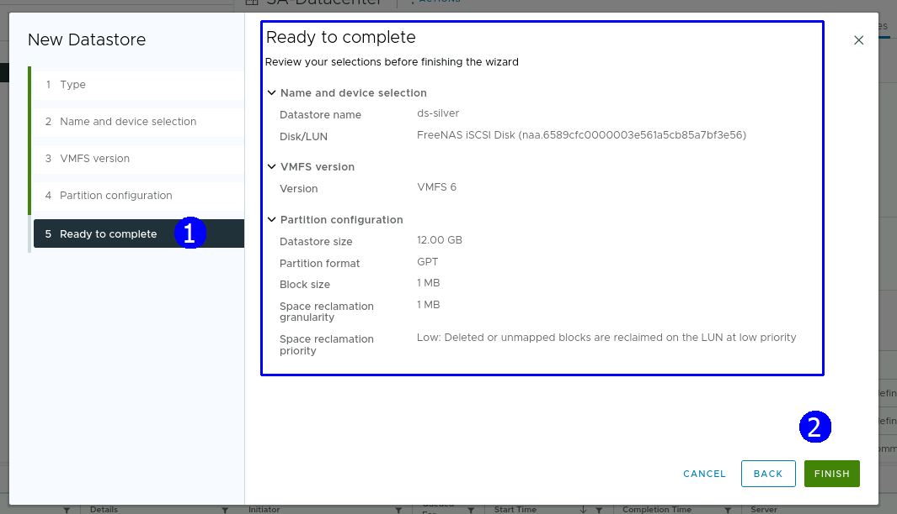

En el panel Tareas recientes, verifique que se haya completado la tarea.

Verifique que el almacén de datos **ds-silver** aparezca en el panel de
navegación

## **Actividad \# 2**

### **Use vSphere Storage vMotion para migrar el almacenamiento de máquinas virtuales**

Utilice **vSphere Storage vMotion** para migrar la máquina virtual
**Photon-01** al almacén de datos **ds-gold**.

En el menú principal, seleccione **Inventory** y haga clic en el icono
**Hosts & clusters**

En el panel de navegación, haga clic con el botón derecho en
**Photon-01** y seleccione **Migrate**.

Aparece el asistente de migración.

En la página **Select a migration type**, haga clic en **Change storage
only** y haga click en **NEXT**.

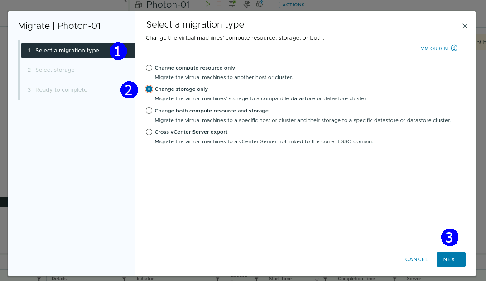

En la página **Select storage**, seleccione el almacén de datos
**ds-gold**, deje todas las demás configuraciones con sus valores
predeterminados y haga clic en **NEXT**.

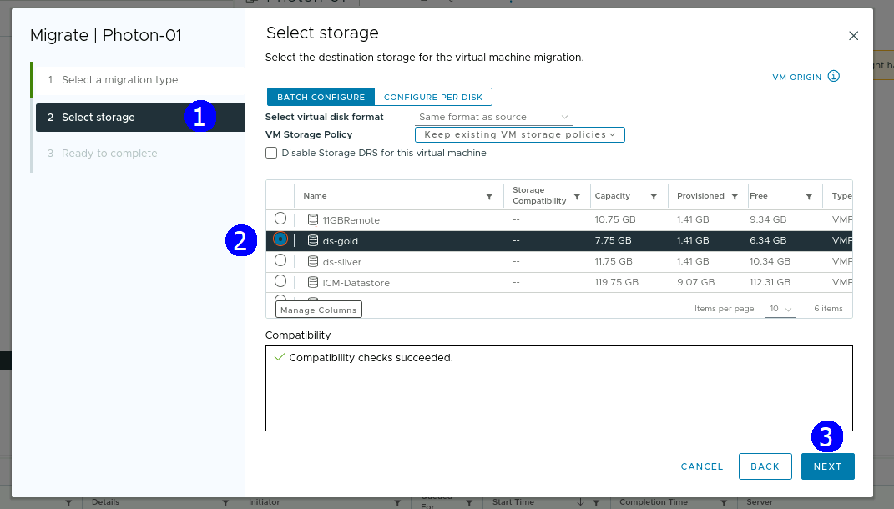

En la página **Ready to complete**, haga clic en **FINISH**.

En el panel Tareas recientes, supervise la tarea de migración hasta su
finalización.

Verifique que la migración se haya realizado correctamente.

En el panel de navegación, seleccione **Photon-01**.

En el panel derecho, haga clic en la pestaña **Datastores** y verifique
que el almacén de datos **ds-gold** esté en la lista.

\+

## **Actividad \# 3**

### **Configurar etiquetas de almacenamiento**

Se asociarán etiquetas a los diferentes tipos de almacenamiento

Del menú principal seleccionar **Tags & Custom Attibutes**

Para configurar una etiqueta y asociarla a un nivel de almacenamiento

Click en **NEW**

Aparece el asistente, en el campo **Name** introducir **Gold Tier**,
click en **Create New Category**

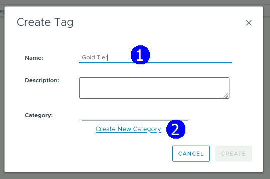

Aparece una caja de diálogo en la que se muestran opciones de
configuración

En el campo **Category** **Name** escribir **Storage Tiers**, en
**Associable Object Types** click en **All objects** para deseleccionar
todos los objetos, seleccionar la opción **Datastore**, click en
**CREATE**

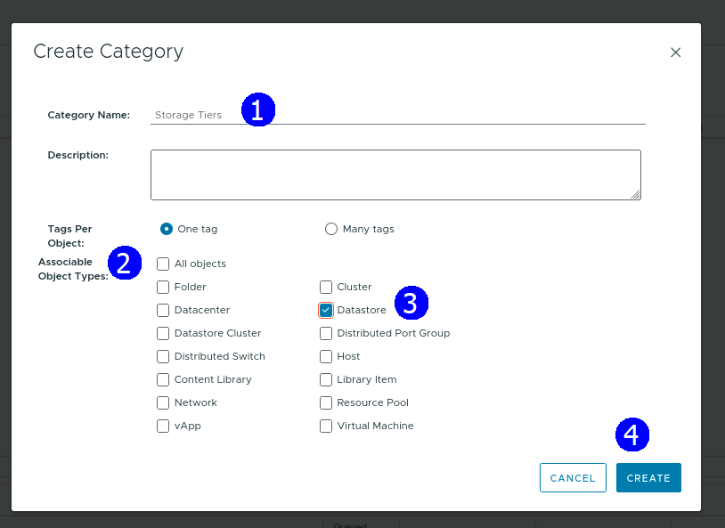

En la caja de diálogo **Create** **Tag** dar click en **CREATE**

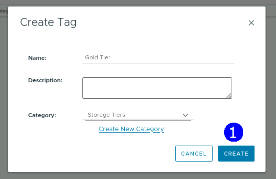

Se muestra etiqueta **Gold Tier** creada

Ahora generar otra etiqueta de almacenamiento **Silver Tag**

Click en **NEW**

En el campo **Name** escribir **Silver Tier,** Click en el menú
desplegabe de **Category**, seleccionar **Storage Tiers** y click en
**CREATE**.

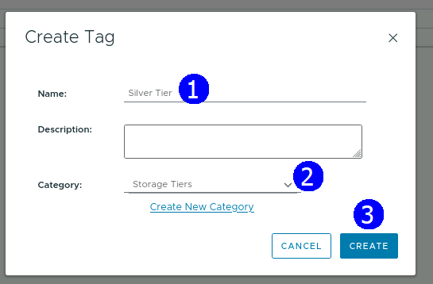

Se lista la nueva etiqueta Silver Tier

Asignar la etiqueta **Gold** **Tier** al datastore **ds-gold**

En la vista de almacenamiento, click derecho sobre el datastore
**ds-gold**, y seleccionar **Tags & Custom Attributes**, seleccionar
**Assign Tag**

Click en el check box **Gold Tier**, click en **ASSIGN**

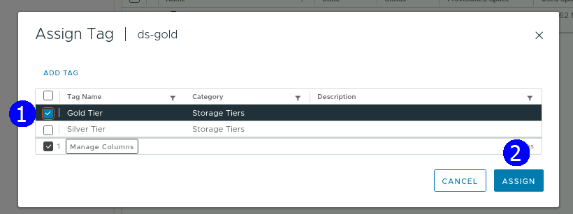

En la vista de almacenamiento, click en el datastore **ds-gold**, click
en la pestaña **Summary** y en la sección de tags ver que tiene ya
asignada la etiqueta **Gold Tier.**

Asignar la etiqueta **Silver Tier** al datastore **ds-silver** datastore

En la vista de almacenamiento, click derecho sobre el datastore
**ds-silver**, y seleccionar **Tags & Custom Attributes**, seleccionar
**Assign Tag**

Click en el check box **Gold Tier**, click en **ASSIGN**

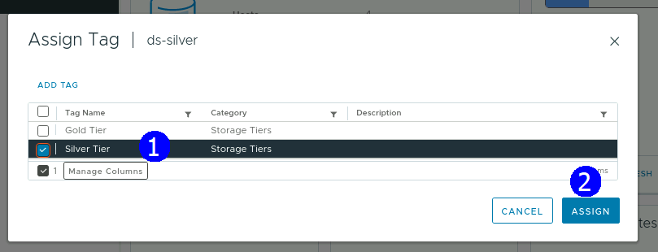

En la vista de almacenamiento, click en el datastore **ds-silver**,
click en la pestaña **Summary** y en la sección de tags ver que tiene ya
asignada la etiqueta **Silver Tier.**

## **Actividad \# 4**

### **Crear Políticas de almacenamiento para máquinas virtuales**

Creación de Políticas para asignar posteriormente a las VM sin importar
su estado de energía

Click en el **menú principal**, seleccionar **Polices and Profiles**

Crear una política **Gold Tier**

Click **VM Storage Polices**, Click en **CREATE**

Se muestra el asistente

En la página **Name and description** en el campo **Name** escribir
**Gold Tier Policy,** Click en **NEXT**

En la página **Policy structure**, en la sección **Datastore specific
rules,** seleccionar **Enable tag** **based placement** rules, click en
**NEXT**

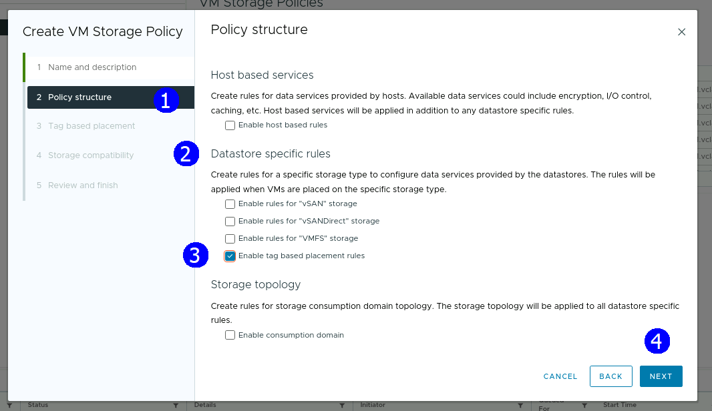

En la página **Tag based placement** seleccionar **Storage Tiers** en el
menú desplegable **Tag Category**, click en **BROWSE TAGS**

Seleccionar **Gold Tier**, click en **OK**

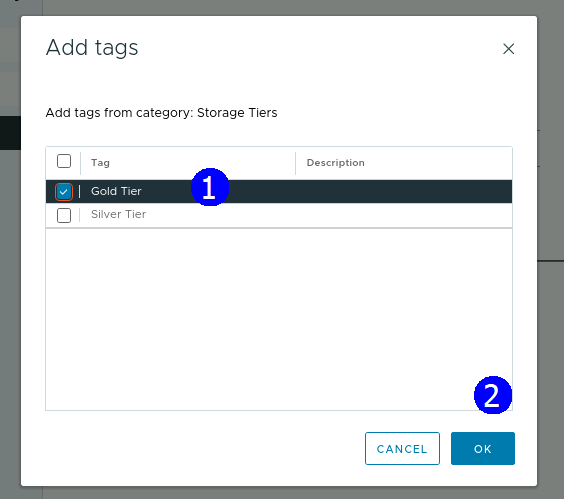

Click en **NEXT**

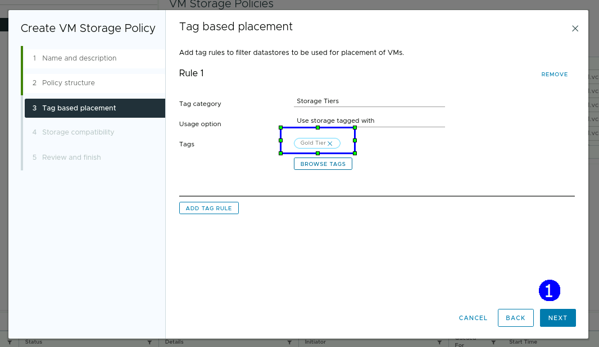

En la página **Storage compatibility** verificar que aparece listado el
datastore **ds-gold,** click **NEXT**

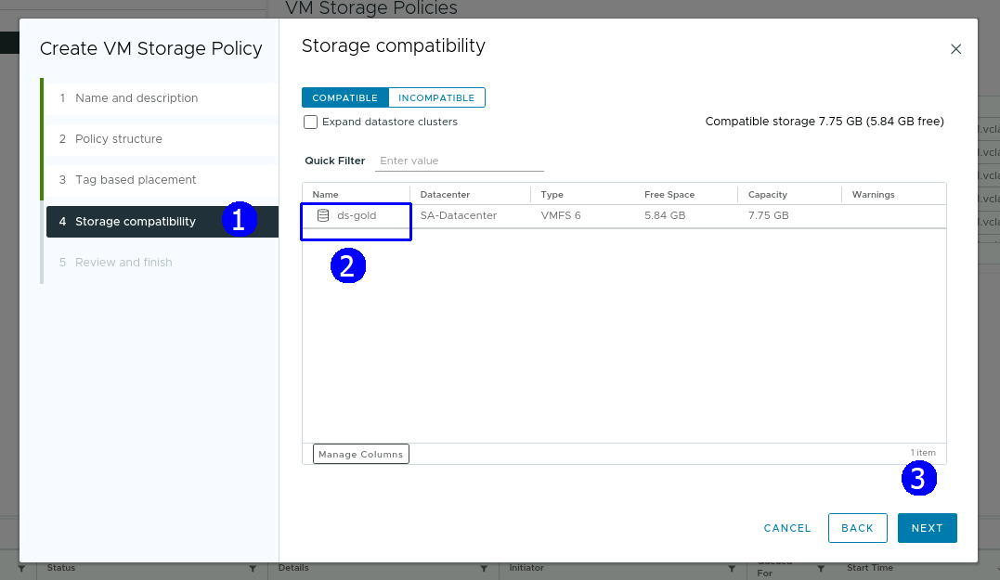

En la página de revisión click en **FINISH**

Aplicar los pasos similares para crear la política de almacenamiento
**Silver Tier Policy**

Verificar que en la lista de políticas aparecen ambas.

## **Actividad \# 5**

### **Asignar políticas de almacenamiento a las máquinas virtuales**

La asignación de una política de almacenamiento se realiza sin importar
el estado de energía de una VM y se utiliza para asegurar el desempeño
en términos de su operación en el almacenamiento.

Seleccionar la vista de **Hosts & Clusters**

Dar click derecho en la VM **Photon-01**

Seleccionar **VM Policies**, click en **Edit VM Storage Policies**

Desde el menú desplegable **VM storage policy**, seleccionar **Gold Tier
Policy**, click en **OK**

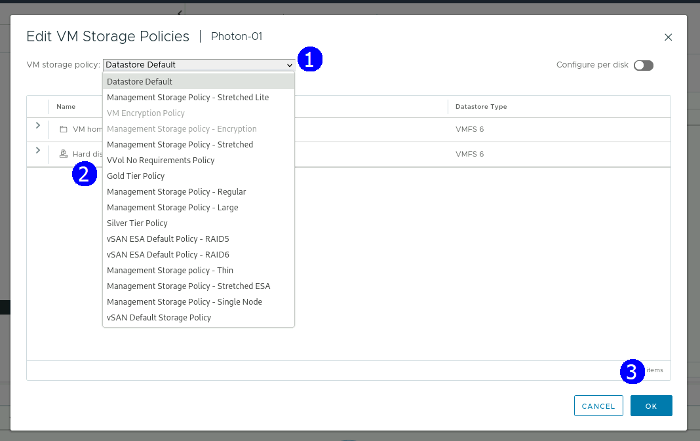

Asegurarse que se asignó la política al dar click en la VM **Photon-01**
click en **Summary**, desplazarse a la sección de **Storage Policies** y
ver la asignación.

La VM cumple (**compliant**) con la política porque migramos los
archivos a este datastore

Aplicar la política **Silver Tier** a la VM **Photon-02**

Seleccionar la vista de **Hosts & Clusters**

Dar click derecho en la VM **Photon-02**

Seleccionar **VM Policies**, click en **Edit VM Storage Policies**

Desde el menú desplegable **VM storage policy**, seleccionar **Silver
Tier Policy**, click en **OK**

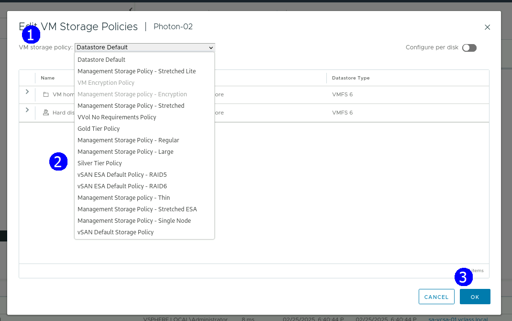

Asegurarse que se asignó la política al dar click en la VM **Photon-02**
click en **Summary**, desplazarse a la sección de **Storage Policies** y
ver la asignación.

La VM no cumple (**no compliant**) con la política porque migramos los
archivos a este datastore que no está incluido en esta política.

Para corregir esta condición de no cumplimiento con la política migremos
la VM al datastore correcto.

Seleccionar la VM **Photon-02**, click derecho, seleccionar **Migrate**

En página **Select a migration type,** click en **Change storage only**,
click en **NEXT**

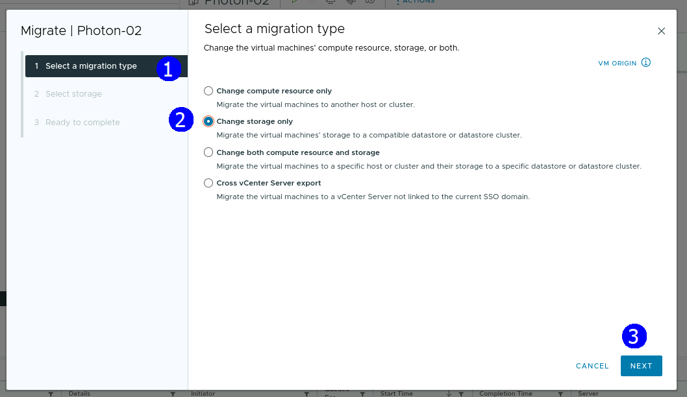

En la página **Select Storage Silver** click en **NEXT**

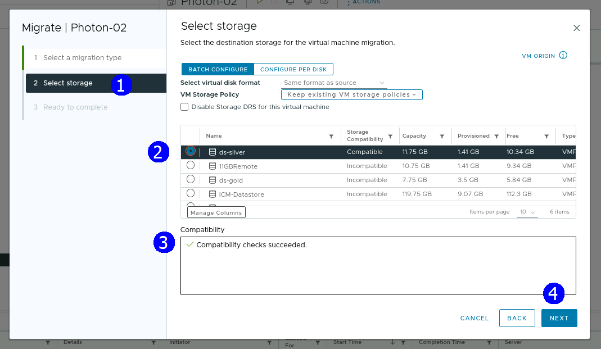

En la página **Ready to Complete**. Click en **FINISH**

Esperar a que se lleve a cabo la migración

Con la VM **Photon-02** seleccionada, click en **Summary**, desplazarse
a la sección de **Storage Policies** y ver que la VM cumple
(**compliant**) con la política porque migramos los archivos de la misma
al datastore correspondiente a esta política.

