# Práctica 10. Creación de una política de vSAN >

## Objetivos de la práctica:

- Examinar la política de almacenamiento predeterminada.
- Crear una política personalizada sin tolerancia a errores.
- Asignar la política personalizada a una máquina virtual.
- Hacer que la máquina virtual cumpla con la configuración preestablecida.

## Duración aproximada:
- 30 minutos.

## Instrucciones

## **Actividad \# 1**

### **Examinar la política de almacenamiento predeterminada**

Utilizar la liga de acceso proporcionada por su instructor.

A manera de ejemplo:
[**https://vlabs.v2s.us/lab**](https://vlabs.v2s.us/lab)

Utilizar el usuario y contraseña que le proporcione su instructor.

A manera de ejemplo:

> Usuario: `student01a`
>
> Contraseña: `Arn0224!`
>
Dar clic en **Login**.
>
Seleccionar en esta interfaz el primer pod de trabajo **vPodProd001a** (1).
>
>  alt="A screenshot of a computer Description automatically generated" />

Al entrar, en la siguiente interfaz proporcionar:

> Usuario: `student01`
>
> Contraseña: `VMware1!`

Dar clic en **OK**.

> Se obtiene acceso al escritorio remoto.
>
>  alt="A screenshot of a computer Description automatically generated" />

Abrir una instancia del browser Firefox con acceso directo al **vSphere
Client login interface.**

User: `administrator@vsphere.local`

Password: `VMware1!`

Dar clic en **Login.**

Examinar la política de almacenamiento predeterminada de vSAN.

Se ha preconfigurado un almacén de datos de **vSAN**

En el menú principal, seleccionar **Policies and Profiles** (2).

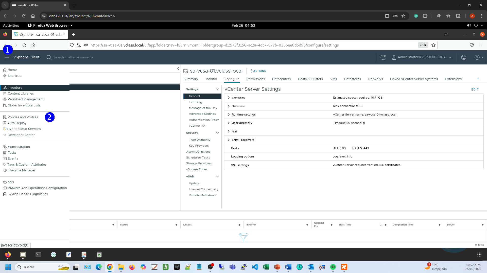

Dar clic en **VM Storage Policies**

Seleccionar **vSAN Default Storage Policy** (2) en la sección derecha. Dirigirse a la pestaña **EDIT** (3).

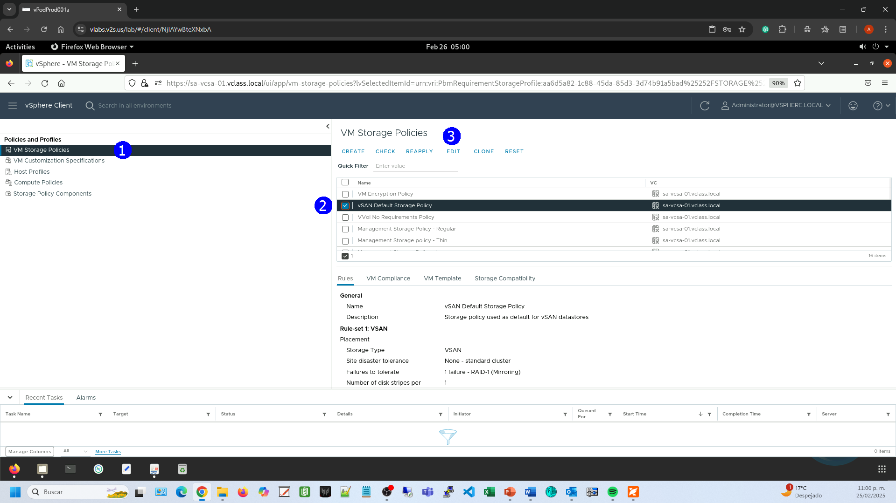

En la página **Name and description** (1), dar clic en **NEXT** (2).

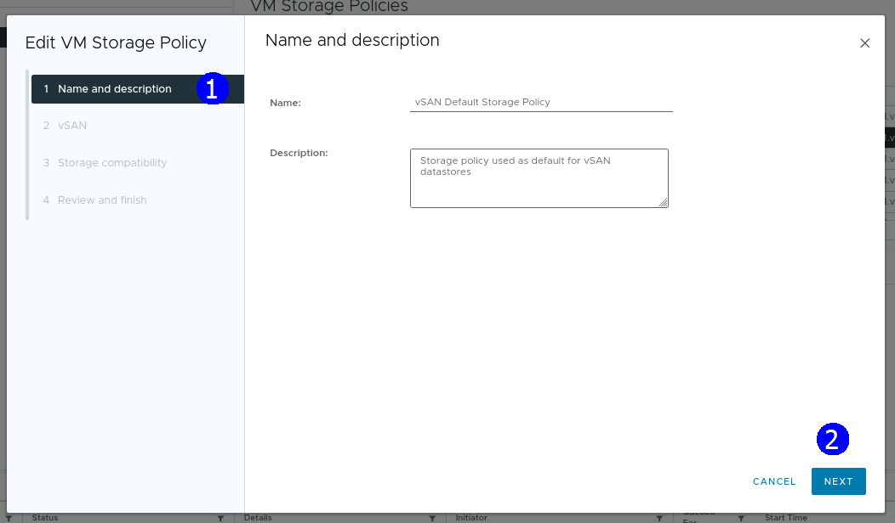

En la página **vSAN** (1), examinar las reglas en las pestañas
**Availability (2), Storage Rules (3), Advanced Policy Rules(4), y Tags (5).**

Identificar cuantas fallas puede tolerar (6).

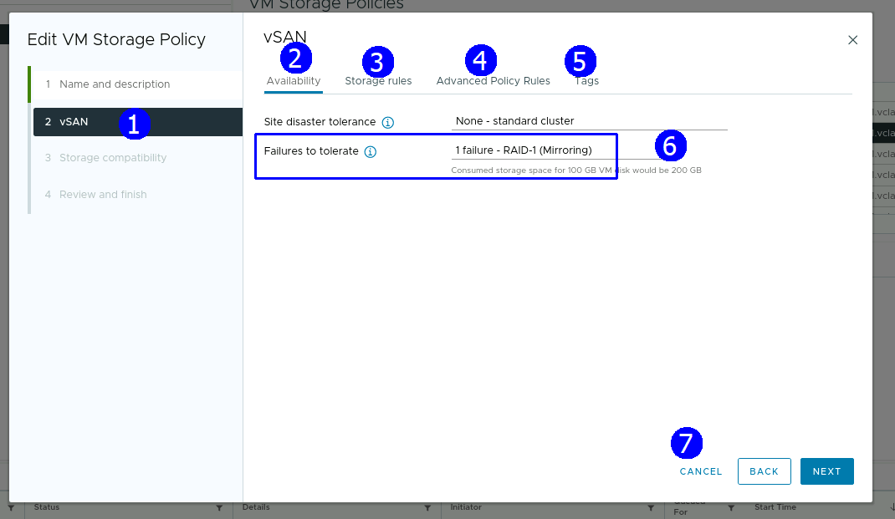

Dar clic en **CANCEL** (7).

## **Tarea \# 2**

### **Crear una política personalizada sin tolerancia a errores**

Crear una política de almacenamiento **vSAN** personalizada que no
proporciona tolerancia a errores.

En el panel derecho, dirigirse a la pestaña **CREATE** (2).

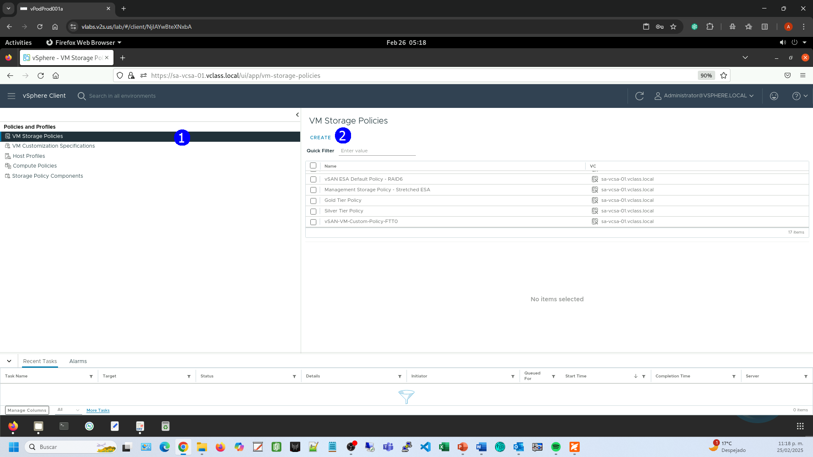

En la página **Name and description** (1), ingresar
**vSAN-VM-Custom-Policy-FTT0** en el cuadro de texto **Name** (2). **NEXT** (3).

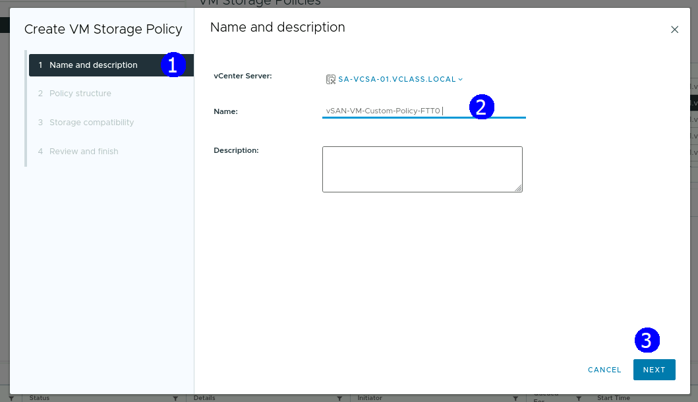

En la página **Policy structure** (1), en la sección **Datastore specific
rules** (2), activar la opción de verificación **Enable rules for “vSAN”
storage** (3). **NEXT** (4).

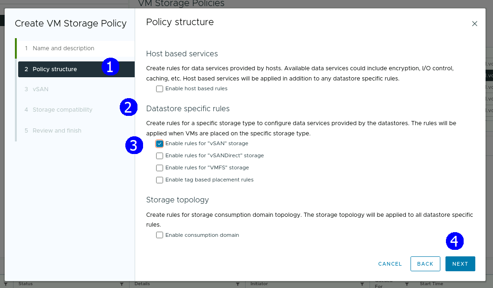

En la página **vSAN** (1), dirigirse a la pestaña **Availability** (2). 
En la lista desplegable **Failures to tolerate** (3), seleccionar **No data
redundancy** (4). Observar la información del espacio de almacenamiento
consumido debajo del menú desplegable. **NEXT** (5).

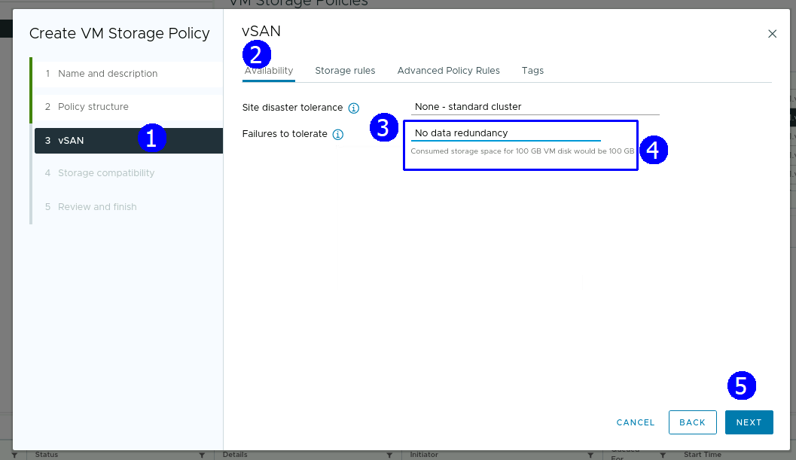

En la página **Storage compatibility** dar clic en **NEXT.**

Solo **vsanDatastore** aparece en la lista de Almacenamiento compatible.

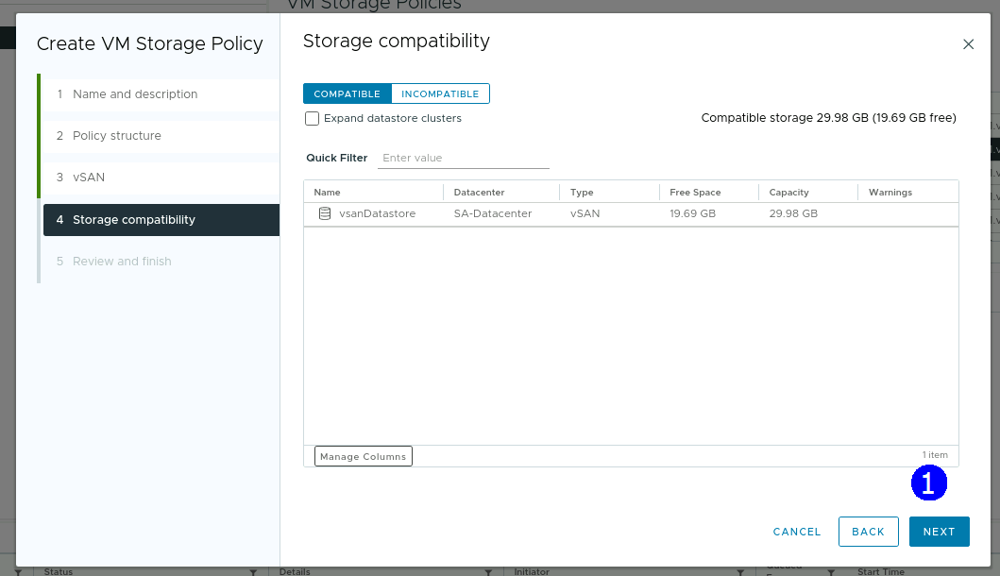

En la página **Review and finish** dar clic en **FINISH** (1).

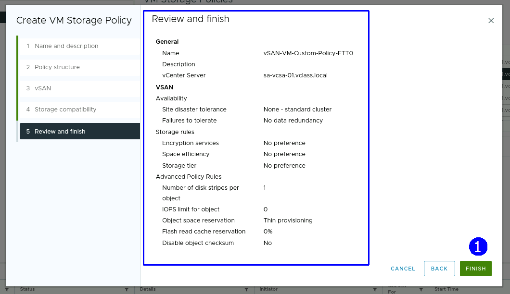

Verificar que la política de almacenamiento
**vSAN-VM-Custom-Policy-FTT0** se haya creado y aparezca en la lista.

Es posible que sea necesario desplazarse por la lista de **VM Storage
Policies**.

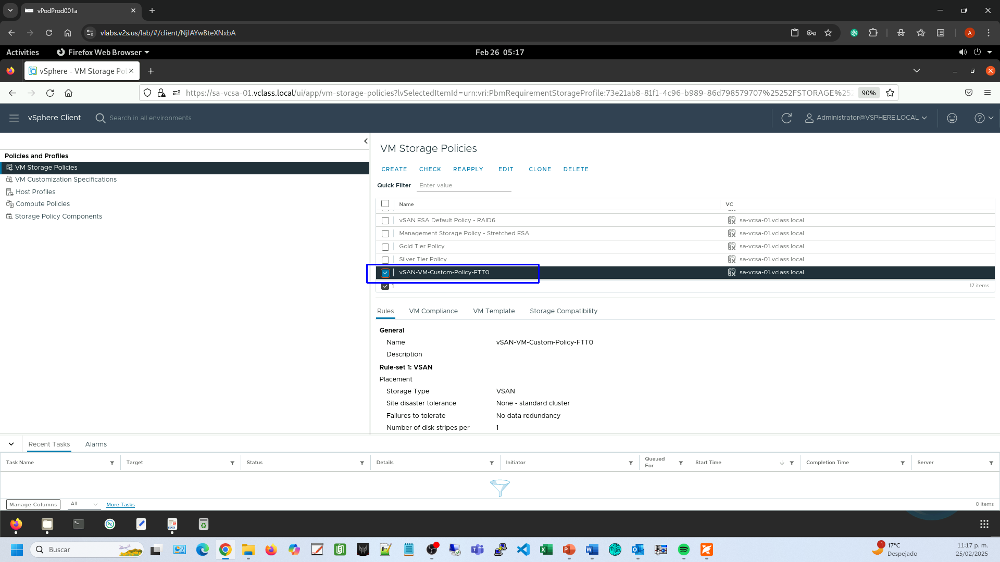

## **Actividad \# 3**

### **Asignar la política personalizada a una máquina virtual**

Crear una máquina virtual y aplicar la nueva política de almacenamiento
de **vSAN**.

En el menú principal, seleccionar **Inventory**. Dar clic en el ícono
**Hosts & clusters** (1).

Clonar una máquina virtual desde **Photon-01**.

En el panel de navegación, dar clic con el botón derecho en
**Photon-01** (1) y seleccionar **Clone** (3), seleccionar **Clone to Virtual
Machine** (4).

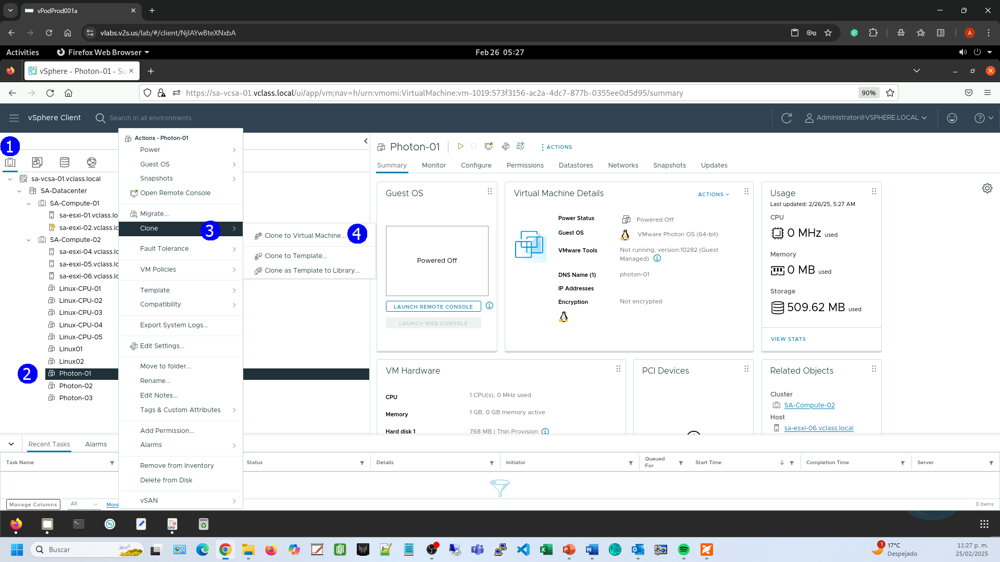

En la página **Select a name and folder** (1), ingresar **Payload-02** en el
cuadro de texto **Virtual machine name** (2) y seleccionar **Lab VMS** como
ubicación. **NEXT** (4).

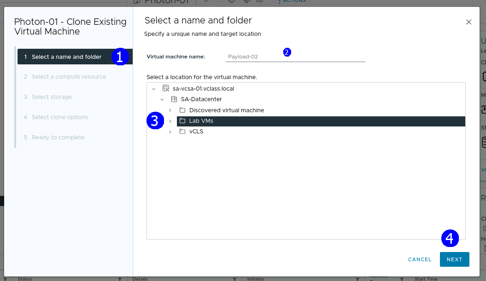

En la página **Select a compute resource** (1), expander **SA-Datacenter** (2) y
**SA-Compute-02** (3) y seleccionar **sa-esxi-05.vclass.local** (4). 
**NEXT** (5).

> NOTA: Es posible que se vea una advertencia de compatibilidad para el host
ESXi. Esta advertencia se puede ignorar de forma segura.

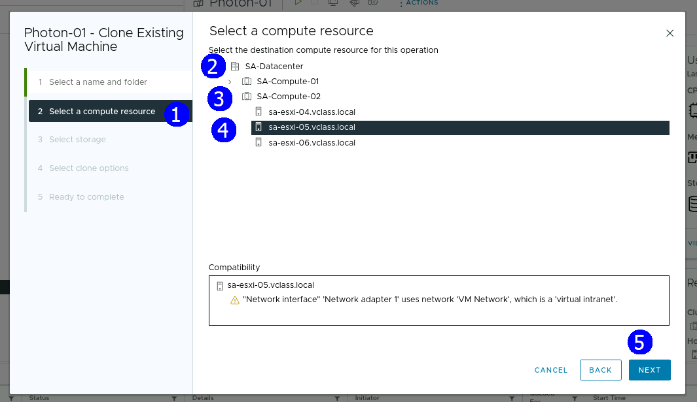

En la página **Select storage** (1), seleccionar **Datastore Default** en el
menú desplegable **VM Storage Policy** (2).

Seleccionar **OPSCALE-Datastore** de la lista de datastores (3). **NEXT** (4).

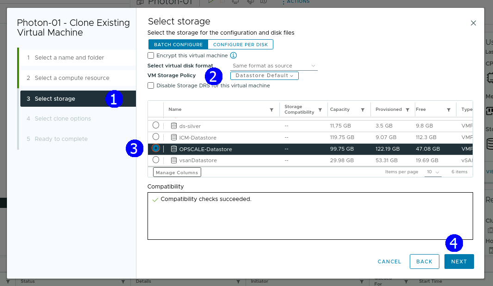

En la página **Select clone options** (1), seleccionar solamente **Power on
virtual machine after creation** (2). **NEXT** (3).

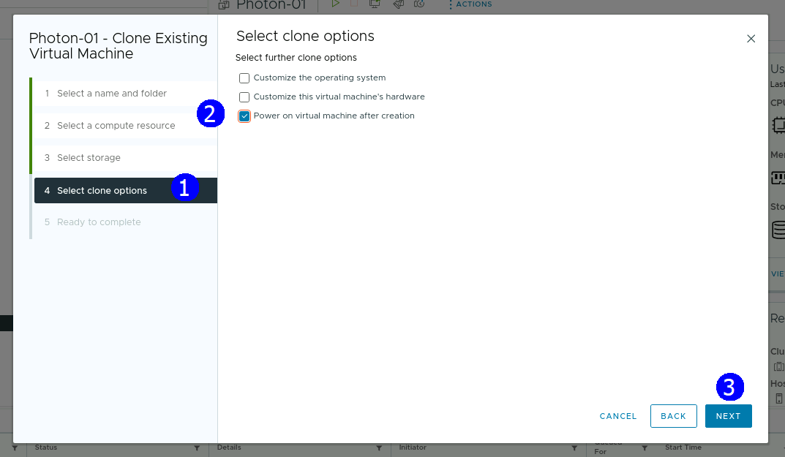

En la página **Ready to complete** (1), dar clic en **FINISH** (2).

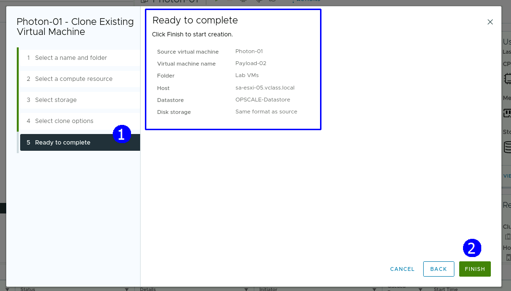

Observar el panel de tareas recientes para verificar que la tarea **Clonar
máquina virtual** se complete correctamente.

Verificar que la nueva máquina virtual esté incluida en el panel de
navegación y esté encendida.

Si no ve la máquina virtual incluida y encendida, dar clic en el ícono
**Update.**

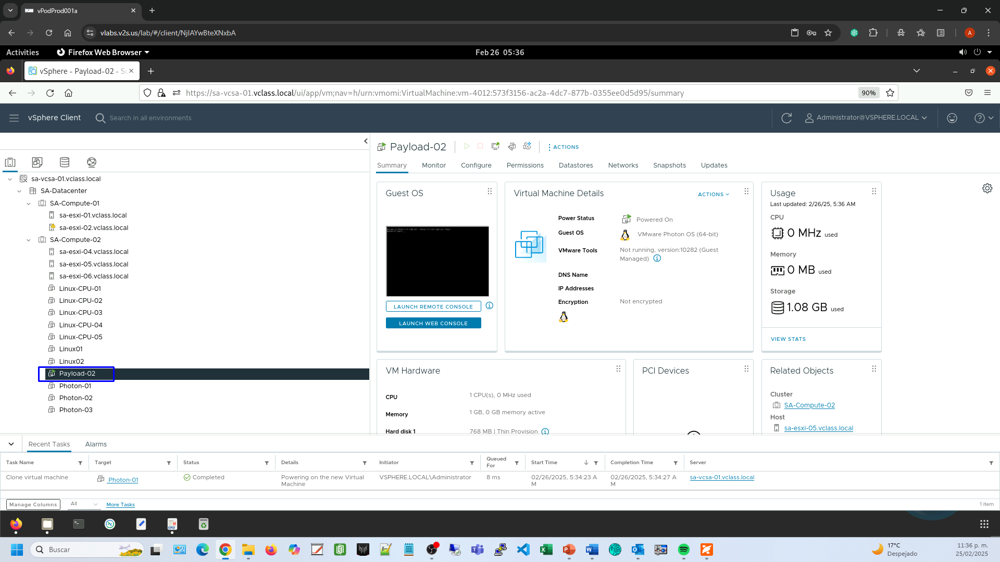

Asignar la política de almacenamiento **vSAN-VM-Custom-Policy-FTT0** a
**Payload-02**.

En el panel de navegación, dar clic con el botón derecho en la VM
**Payload-02** (1) y seleccionar **VM Policies** (2), escoger **Edit VM
Storage Policies** (3).

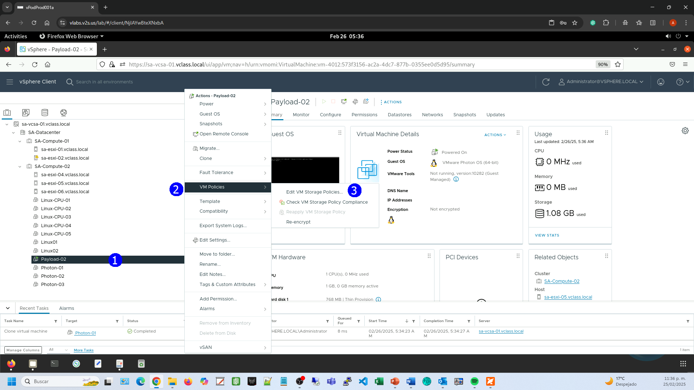

Seleccionar **vSAN-VM-Custom-Policy-FTT0** en el menú desplegable **VM
storage policy** (1), **OK** (2).

Supervisar el panel de tareas recientes para verificar que la tarea
**Reconfigure virtual machine** se termine correctamente.

En el panel de navegación, seleccionar **Payload-02** (1). Dirigirse a la pestaña **Summary** (2) y revisar tanto el recuadro **Related Objects** (3) como el
correspondiente a **VM Storage Policies** (5).

Es posible que sea necesario desplazarse hacia abajo en el panel derecho
para ver estos recuadros. Revisar la configuración.

Notar que **VM Storage Policy Compliance** (6) marca como **Not Applicable** (7).

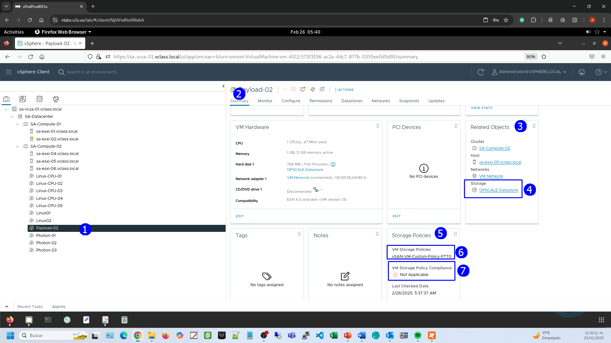

## **Actividad \# 4**

### **Hacer que la máquina virtual cumpla con la configuración preestablecida**

Migrar la máquina virtual **Payload-02** desde el datastore **VMFS**
compartido al almacén de datos **vSAN** para hacerla compatible con su
política de almacenamiento.

En el panel de navegación, dar clic con el botón derecho en **Payload-02** (1)
y seleccionar **Migrate** (2).

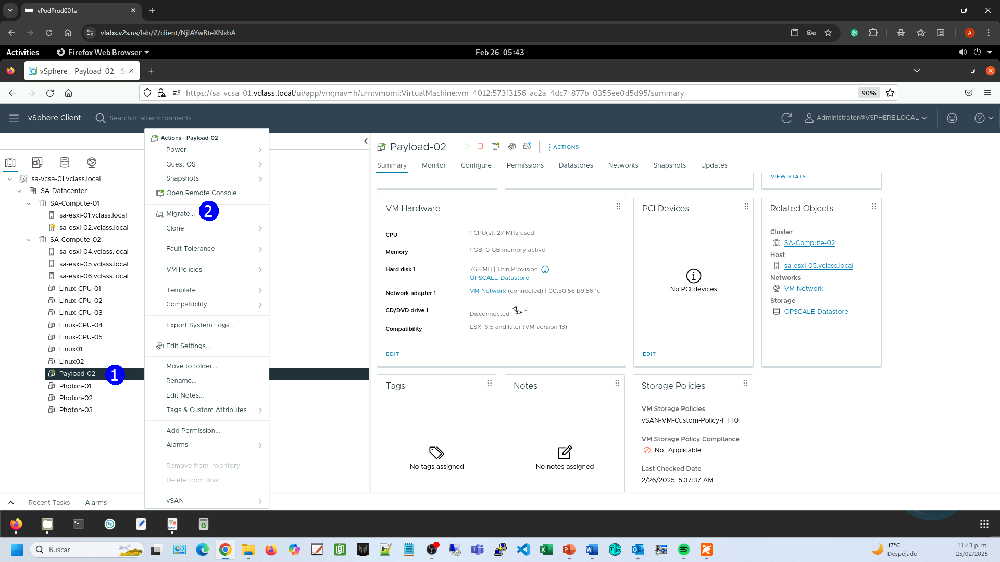

En la página **Select a migration type** (1), seleccionar **Change storage
only** (2). **NEXT** (3).

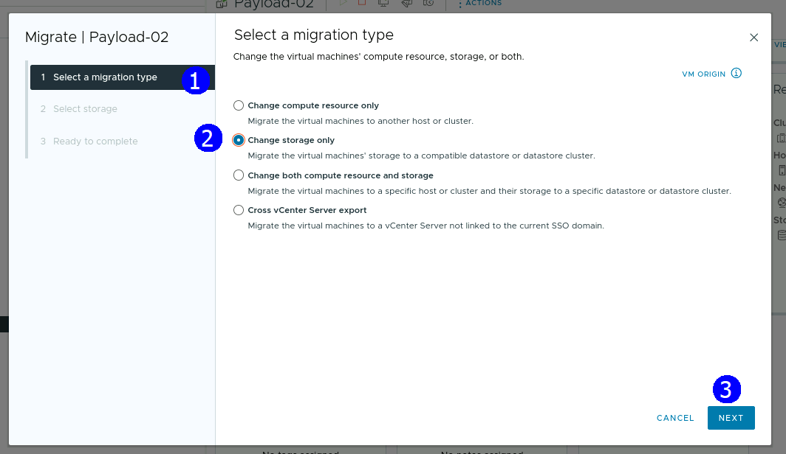

En la página **Select Storage** (1), dejar seleccionada la opción **Keep
existing VM storage policies** en el menú desplegable **VM Storage
Policy** (2).

En la lista de datastores, seleccionar **vsanDatastore** (2). **NEXT** (3).

Tener en cuenta que **vsanDatastore** es el único almacén de datos que
aparece como compatible.

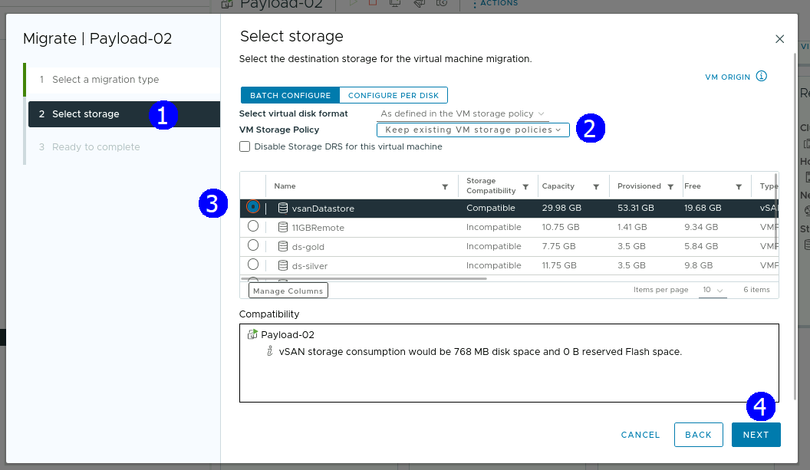

En la página **Ready to complete** (1). **FINISH** (2).

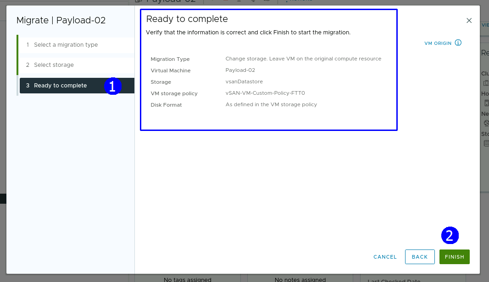

Supervisar el panel de tareas recientes hasta que la tarea se termine
correctamente.

En el panel derecho, con la VM seleccionada (1). Dirigirse a la pestaña **Summary** (2) y observar el recuadro **VM Storage Policies** (3).
Dar clic en **Check Compliance** (4).

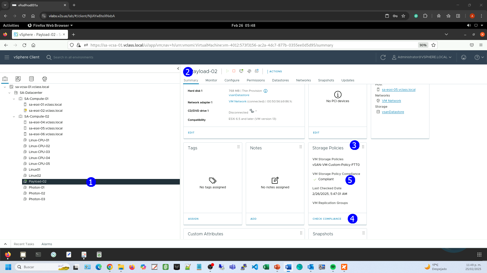

Es posible que el cliente vSphere haya actualizado automáticamente el
estado de cumplimiento. Si es así, no es necesario hacer clic en
**Check Compliance**.

Apagar la VM.
