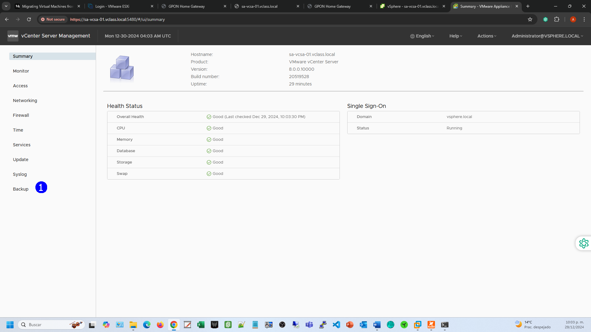
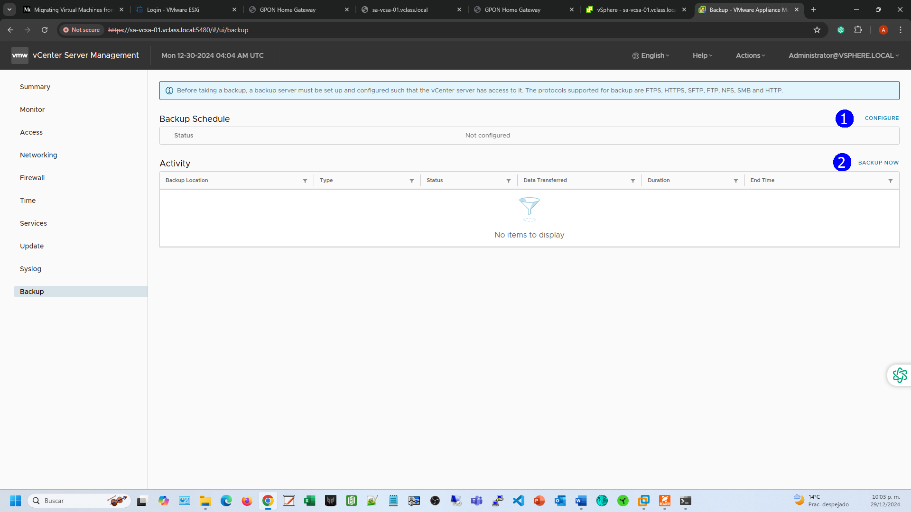
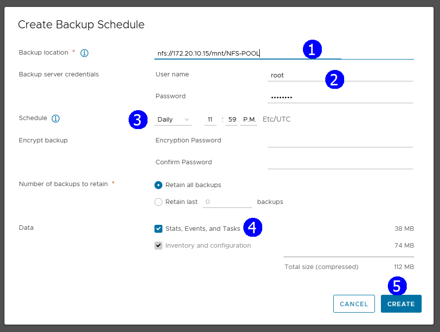
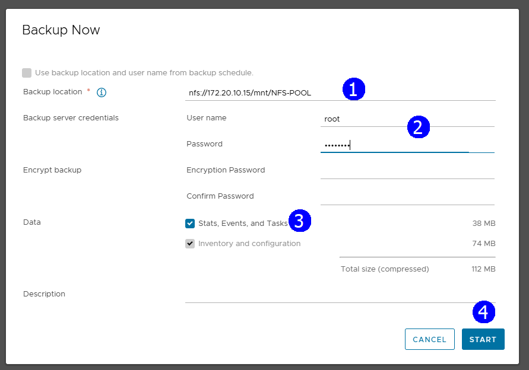
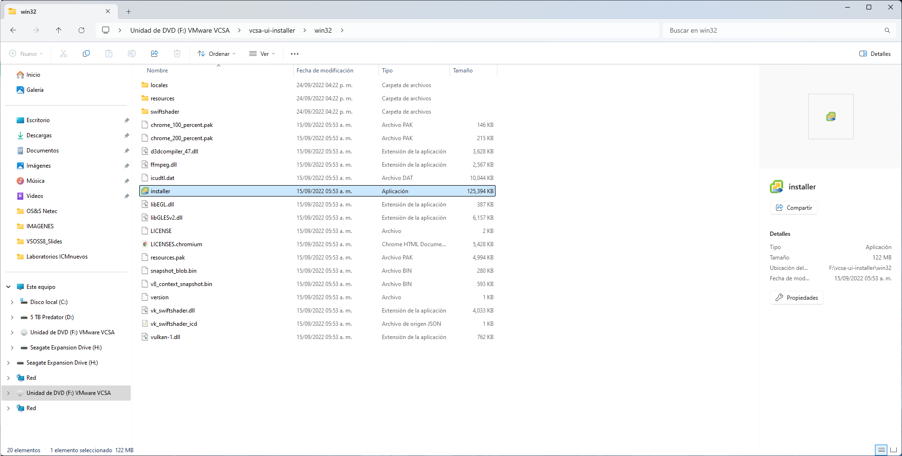

# Práctica 11. Respaldo del vCenter Server 

## Objetivos de la práctica_

- Acceso a la consola de administración del vCenter Server.
- Examinar las opciones para respaldos programados e inmediatos.
- Lanzar un proceso de respaldo del vCenter Server.
- Visualizar la opción de restauración de un backup con la aplicación Install.

## Duración aproximada
- 30 minutos.

## Instrucciones

## **Actividad \# 1**

### **Acceso a la consola de administración del vCenter Server**

Utilizar la liga de acceso proporcionada por su instructor.

A manera de ejemplo:
[**https://vlabs.v2s.us/lab**](https://vlabs.v2s.us/lab)

Utilizar el usuario y contraseña que le proporcione su instructor.

A manera de ejemplo:

> Usuario: `student01a`
>
> Contraseña: `Arn0224!`
>
> Dar clic en **Login**.
>
Seleccionar en esta interfaz el primer pod de trabajo **vPodProd001a** (1).
>
>  alt="A screenshot of a computer Description automatically generated" />

Al entrar, en la siguiente interfaz proporcionar:

> Usuario: `student01`
>
> Contraseña: `VMware1!`

Dar clic en **OK**.

> Se obtiene acceso al escritorio remoto.
>
>  alt="A screenshot of a computer Description automatically generated" />

Abrir una instancia del browser Firefox con acceso directo al **vSphere
Client login interface.**

User: `administrator@vsphere.local`

Password: `VMware1!`

Dar clic en **Login.**

Abrir una instancia de Firefox. Seleccionar el shortcut de la VAMI o escribir el URL en el browser.

<https://sa-vcsa-01.vclass.local:5480> (1),

Notar que el acceso es a la vista de administración del vCenter Server
(2).

Proporcionar el user:
[**administrator@vsphere.local**](mailto:administrator@vsphere.local) 
Proporcionar password: `VMware 1!` (3). 
**LOGIN.** (4)

En la interfaz de administración dar clic en **Backup** (1).

## **Actividad \# 2**

### **Examinar las opciones para respaldos programados e inmediatos**

En el panel derecho se muestran dos opciones:

**CONFIGURE** para establecer una programación recurrente de backups (1).

**BACKUP** **NOW** para iniciar un proceso inmediato de respaldo (2).

Seleccionar **Configure.**

Se muestran opciones de programación recurrente. Entre los datos relevantes
están: el datastore en donde se realiza la copia (1), el user y password
del datastore (2), la programación (3) y los datos (4) a proteger.

## **Actividad \# 3**

### **Lanzar un proceso de respaldo del vCenter Server**

Para realizar un respaldo inmediato.

Establecer **nfs://172.20.10.15/msnt/NFS-POOL** (1) en el **Backup location** 

(2)
Username: `root`

Password: `VMware1!`

Seleccionar en **Data** la opción de **Stats, Events, and Tasks (3). START (4)

Vigilar el proceso de backup del vCenter Server Appliance.

## **Actividad \# 4**

### **Visualizar la opción de restauración de un backup con Install**

Para un proceso de restauración es importante recordar que éste se lleva a cabo desde la aplicación de instalación del vCenter.

Ejecutar la aplicación Installer del ISO. 

En la aplicación, usar la opción **Restore** (1).

