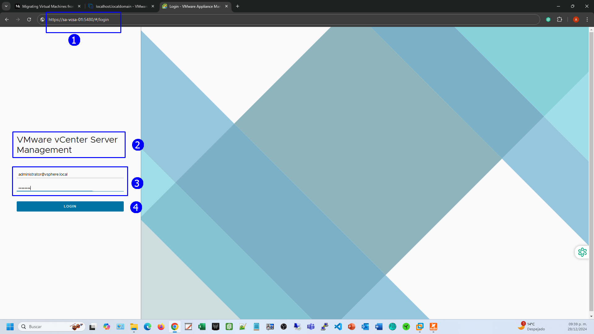
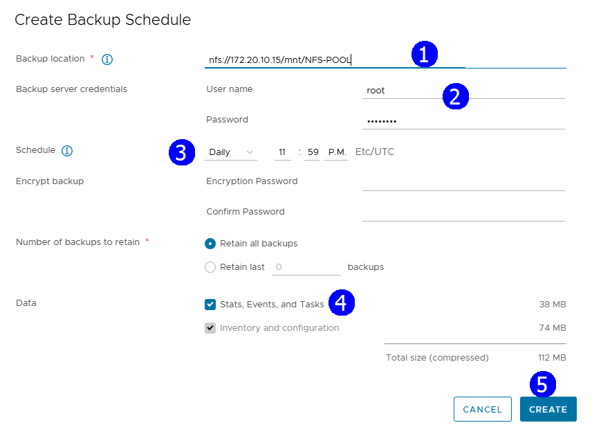
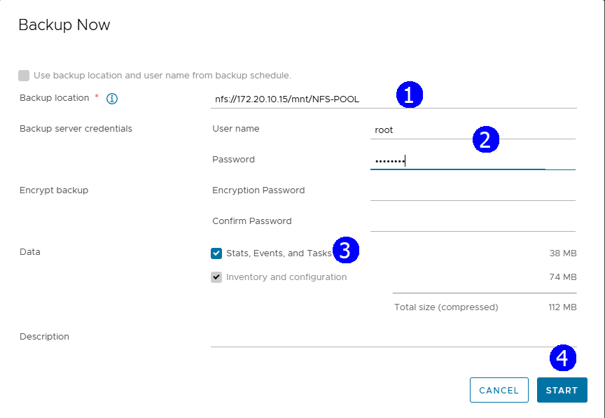
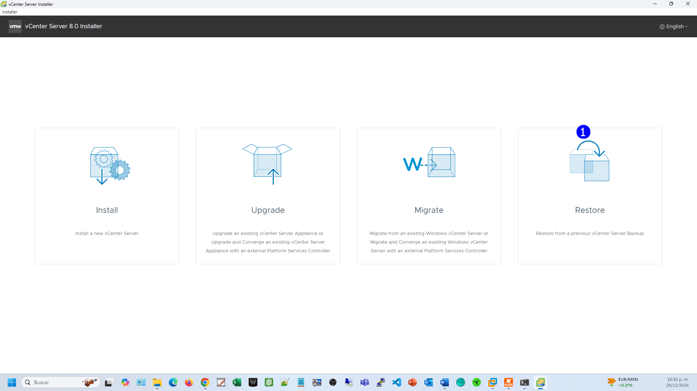

> # VMware vSphere
>
> ## Operación, Escalamiento y Seguridad
>
> ### Versión 8
>
> #### Guía de uso de laboratorio

## Laboratorio \#11

>### Respaldo del vCenter Server
>
> Revisión 1.1 2024

## Laboratorio \# 11

### Respaldo del vCenter Server

#### Actividades por realizar:

1.  Acceso a la consola de administración del vCenter Server

2.  Examinar las opciones para respaldos programados e inmediatos

3.  Lanzar un proceso de respaldo del vCenter Server

4.  Visualizar la opción de restauración de un backup con la aplicación
    Install

## Actividad \# 1

### Acceso a la consola de administración del vCenter Server

Utilizar de su sistema la herramienta de “**Conexión a escritorio
remoto**” con la dirección y puerto que le proporcionará su instructor;
utilizar como:

> Usuario: `vclass\Administrator`
>
> Contraseña: `VMware1!`

Abrir una instancia de Firefox

En el browser seleccionar el shortcut de la VAMI o escribir el url

<https://sa-vcsa-01.vclass.local:5480> (1),

Notar que el acceso es a la vista de administración del vCenter Server
(2),

proporcionar el user:
[`administrator@vsphere.local`](mailto:administrator@vsphere.local) y
password `VMware 1!` (3), **LOGIN** (4)

En la interfaz de administración click en **Backup** (1)

## Actividad \# 2

### Examinar las opciones para respaldos programados e inmediatos

en el panel derecho se muestran dos opciones:

**CONFIGURE** para establecer una programación recurrente de backups (1)

**BACKUP** **NOW** para iniciar un proceso inmediato de respaldo (2)

Click en **Configure**

Se muestran opciones de programación recurrente, entre datos relevantes
están el datastore en donde se realiza la copia (1), el user y password
del datastore (2), la programación (3), los datos (4) a proteger.

## Actividad \# 3

### Lanzar un proceso de respaldo del vCenter Server

Para realizar un respaldo inmediato

En **Backup location** establecer **nfs://172.20.10.15/msnt/NFS-POOL**
(1)

Username: `root`

\(2\) Password: `VMware1!`

Click en **START** (4)

Vigilar el proceso de backup del vCenter Server Appliance

## Actividad \# 4

### Visualizar la opción de restauración de un backup con Install

Para un proceso de restauración recordar que éste se lleva a cabo desde
la aplicación de instalación del vCenter

Del ISO ejecutar la aplicación Installer

En la aplicación usar la opción **Restore** (1)

