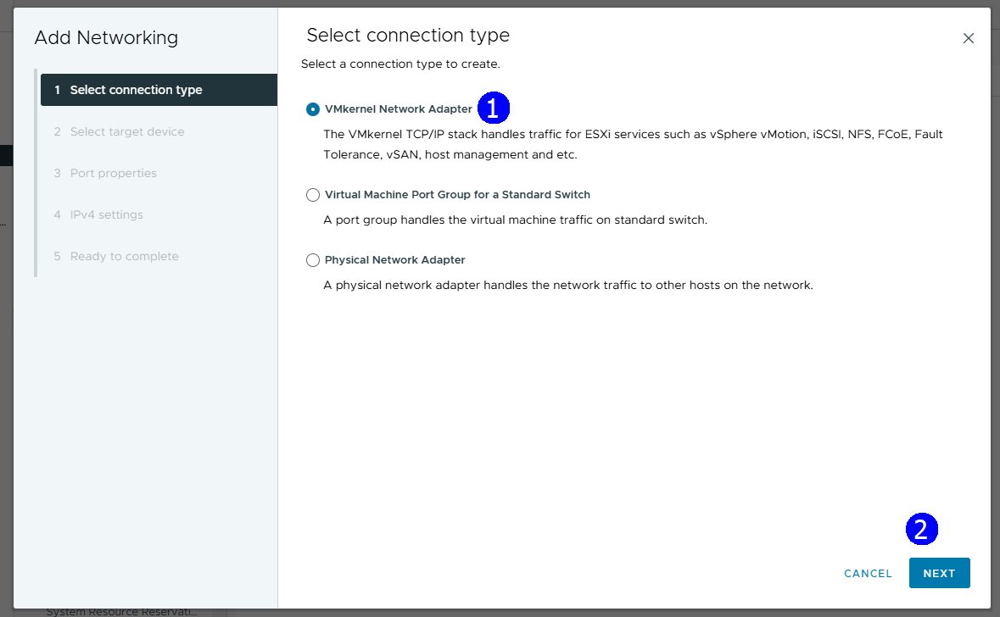
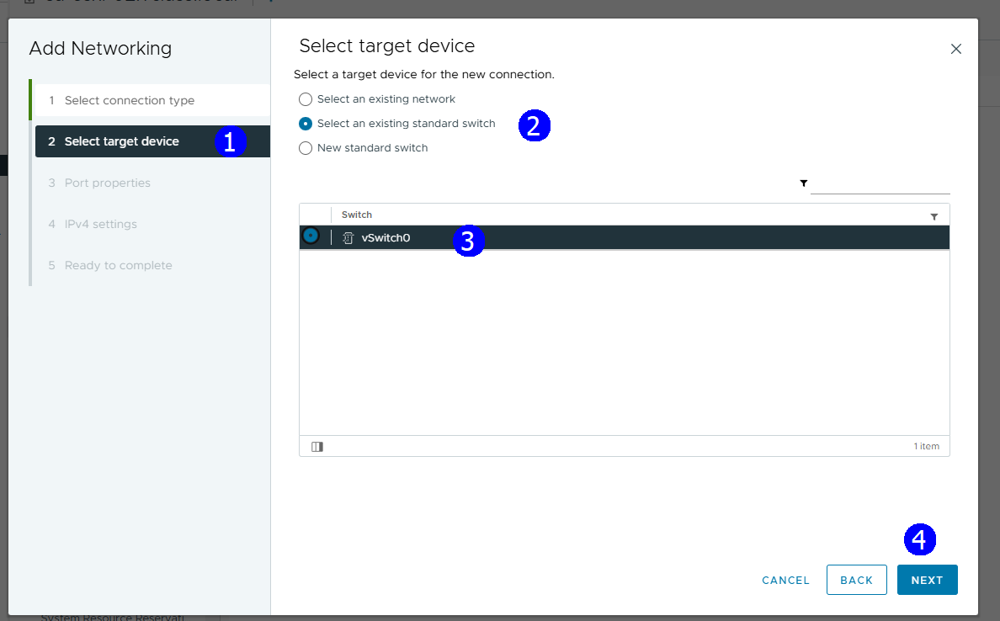
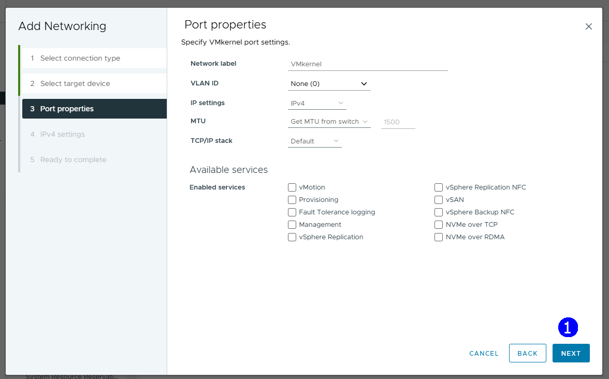
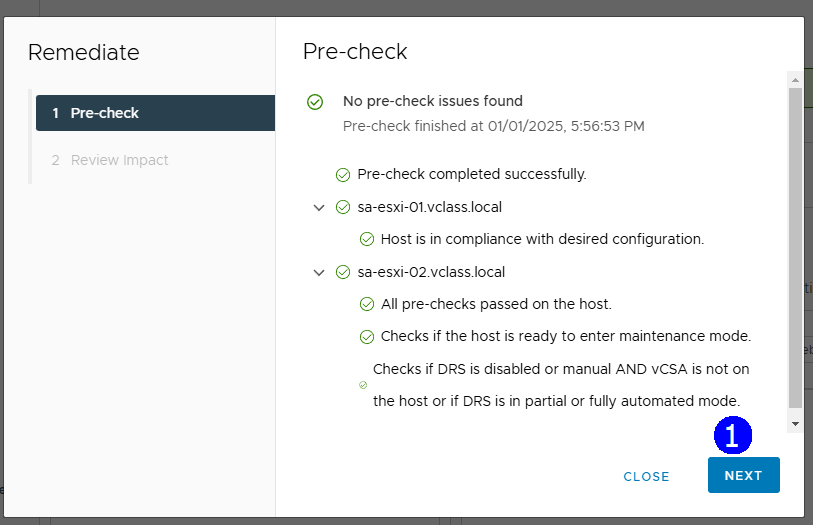
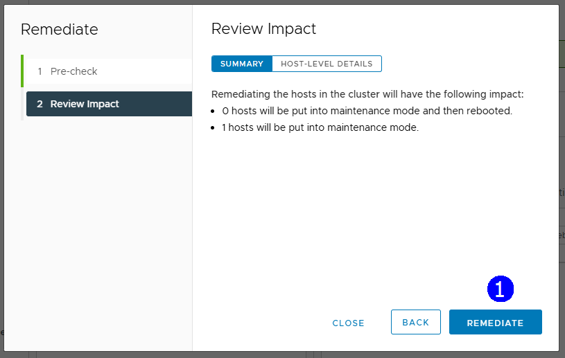

> # VMware vSphere
>
> ## Operación, Escalamiento y Seguridad
>
> ### Versión 8**
>
> #### Guía de uso de laboratorio

## Laboratorio \# 12

> ### Manejo de Host Profiles en Vsphere
>
> Revisión 1.1 2024

## Laboratorio \# 12

### Manejo de Host Profiles en Vsphere

#### Actividades por realizar:

1.  Revisión de la versión de vSphere en los hosts de un cluster

2.  Actualización y homogenización de la versión de los Host ESXi

3.  Creación de un perfil de configuración homogénea de Host en el
    Cluster

4.  Desviación de la configuración de un Host

5.  Retorno a la configuración preestablecida de un host modificado.

## Actividad \# 1

### Revisión de la versión de vSphere en los hosts de un cluster

Utilizar de su sistema la herramienta de “**Conexión a escritorio
remoto**” con la dirección y puerto que le proporcionará su instructor;
utilizar como:

> Usuario: `vclass\Administrator`
>
> Contraseña: `VMware1!`

Abrir una instancia de Firefox, seleccionar el shortcut de **vCenter**

Con el propósito de poder administrar las actualizaciones de los host
ESXi se puede configurar un cluster basado en imágenes.

Observar la versión de la imagen del Host **ESXi_01**, seleccionar el
host para identificar que la versión es **ESXi 8.0.0** (1) y (2)

Una buena práctica es que las imágenes de todos los hosts en un cluster
sea la misma, esto se puede realizar desde la creación misma del cluster

Enseguida se muestra el procedimiento de actualización y homogeneización
del cluster con Hosts que tienen máquinas virtuales encendidas, en donde
el cluster tiene habilitado DRS.

En resumen, se seleccionará la nueva versión a la que se actualizarán
los hosts y en cada caso para actualizar el Host, DRS moverá las VMS a
otro Host para que el host en turno se ponga en modo mantenimiento, se
actualice, se reinicie para que enseguida se puedan retornar VMS
conforme sea necesario.

## Tarea \#2

### Actualización y homogenización de la versión de los Host ESXi

En la vista de **Hosts & Clusters** (1), click en el cluster
**Production Cluster** (2), click en la pestaña **Configure** (3), en la
sección **Desired State** click en **Configuration** (4).

Se nota que el cluster está configurado basado en configuraciones base
“baselines”

En amarillo se nos indican las ventajas de la configuración basada en
perfiles de Hosts

Procedamos a actualizar las versiones de los hosts

En la vista de **Hosts & Clusters** (1), click en el cluster
**Production Cluster** (2), click en la pestaña **Updates** (3), en la
sección **Image** (4), click en **Edit** (5).

Seleccionar la imagen del Host en la lista desplegable (1), click en
**ver 8.0 U3c** (3), click en **VALIDATE**, esta nueva versión se
aplicará a todos los hosts del cluster

Con espera para la validación se presenta que la imagen es válida (1),
click en **SAVE** (2).

Observar que los dos hosts no tienen esta versión 8.3 (1), importante
notar que los hosts se tendrán que reiniciar (2)

En el proceso, se tiene que dar click en **RUN PRE-CHECK** (3) en primer
término para tener información de las posibles implicaciones de la
actualización

Después, dar click en **REMEDIATE ALL** (4).

Al dar click en **RUN PRE-CHECK** (2),

Se muestra que no se encontraron problemas en el cluster si se desea
aplicar la actualización de imagen

Para iniciar la homogenización de imagen, click en **REMEDIATE ALL**
(2).

En la lista de tareas se nota el inicio del proceso (1)

En la vista de **Hosts & Clusters** (1), click en el cluster
**Production Cluster** (2), click en el host **Esxi_01** (3), click en
la pestaña **VMs** (4), Observar las VMs que están encendidas en el
**Host ESXi_01** que está próximo en la actualización (5)

Se inicia la migración de la VM **Linux_01** al host **Esxi_02** (3)
esto se realiza con apoyo de **DRS**

Ahora el host **Esxi_02** tiene a las dos VMs **Linux** y una VM
**vCLS** (1)

El host **ESXi_01** entra en mantenimiento y la VM vCLS se apaga (2)

El host ESXi_01, se actualiza y se reinicia (1)

Se pierde conexión al host al reinicio (1)

El host se reconecta (1), sale de modo de mantenimiento y se enciende la
VM vCLS (2)

Se inicia migración de las VMs (1) y (2) que están en el host
**ESXi_02** para actualizarlo

Ahora el host **Esxi_01** tiene las VMs (3)

El host ESXi_02 entra en modo de mantenimiento (1), la VM **vCLS** se
apagó (2)

Se aplica la actualización, se reinicia el host, se desconecta (1)

Se reincorpora el host Esxi_02 (1), se enciende la VM vCLS (2)

Se balancea el cluster, cada host tiene una VM Linux y una VM vCLS (2)

Para revisar que un host está en cumplimiento con la versión del cluster

En la vista de **Hosts & Clusters** (1), click en el cluster
**Production Cluster** (2), click en la pestaña **Updates** (3), Click
en **Image** (4), Click en **CHECK COMPLIANCE** (5)

El host **ESXi_01** tiene la **versión 8.0.3** (1) sujeto de
actualización (2)

El host **ESXi_02** tiene la **versión 8.0.3** (1) sujeto de
actualización (2)

## Tarea \#3

### Creación de un perfil de configuración homogénea de Host en el Cluster

Para mantener a través del tiempo la configuración homogénea de los
hosts es preferible usar el recurso de perfiles de Host llamado “Host
Profiles”.

En la vista de **Hosts & Clusters** (1), click en el cluster
**Production Cluster** (2), click en la pestaña **Configure** (3), en la
sección de **Desired State** (4) click en **Configuration** (5), click
en **CREATE CONFIGURATION** (6)

En este paso determinaremos desde donde se toma como referencia la
configuración que deberá estar presente en todos los hosts en el cluster

Seleccionar **IMPORT FROM REFERENCE HOST**

Seleccionar como referencia el Host **ESXi_01** (1), **IMPORT** (2)

Se muestra que la importación de la configuración fue exitosa

Se muestra cual es la configuración seleccionada (1), Click en **NEXT**
(2)

Se ve que la configuración es válida (5) y que todos los hosts cumplen
con una configuración homogénea (6), click en **NEXT** (7)

Se verifica que no hay problemas para finalizar el proceso (2), click en
**FINISH and APPLY** (3)

Se confirma la aplicación al click **CONTINUE** (1)

Se aplicado finalmente como configuración homogénea la configuración que
se tomó del Host ESXi_01, click en **VIEW CONFIGURATION**

Se muestra la configuración establecida en el cluster.

## Tarea \# 4

### Desviación de la configuración de un Host

Para mostrar la aplicación de la configuración de un cluster

Crear un puerto vkernel en el host **ESXi_02** para desviarlo de la
configuración homogénea e ilustrar como detectarlo y retornarlo a la
configuración original

En la vista de **Hosts & Clusters** (1), click en el **Host ESXi_02**
(2), click en la pestaña **Configure** (3), click en **Virtual
switches** (4), click en el Switch **vSwitch0** (5), Click en **ADD
NETWORKING** (6)

Dejar opciones por default (1), click en **NEXT** (2)

Selecionar **Select an existing standard switch** (2), seleccionar el
**vSwitch0** (3), **NEXT** (4)

Dejar opciones por default (1), click en **NEXT** (2)

Dejar opciones por default (1), click en **NEXT** (2)

Aceptar resumen **FINISH** (1)

Se agregó un puerto vKernel al host **ESXi_02**.

## Tarea \# 5

### Retorno a la configuración preestablecida de un host modificado.

Evaluar si hay un host que no cumple con la configuración

Click en el cluster **Production cluster** (1), click en **Configure**
(2), click **Configuration** (3), click **Compliance** (4)

Click en **CHECK COMPLIANCE** (2), Se muestra como resultado que el host
**ESXi_2** no cumple con la configuración,

Para retornar el host **Esxi_02** a la configuración original, click en
**REMEDIATE** (1)

Se muestran las posibles implicaciones en un Pre-check, **NEXT** (1)

Click en **REMEDIATE** (1)

Se anuncia que el retorno a la configuración fue un éxito (2) y los dos
hosts se ven en compliance

Si retorna a revisar el **vSwitch0** este ya no tendrá el puerto
**vKernel** creado.
