> # **VMware vSphere**
>
> ## **Operación, Escalamiento y Seguridad**
>
> ### **Versión 8**
>
> #### **Guía de uso de laboratorio**

## **Laboratorio \# 13**

### **Trabajo con Certificados**

Actividades por realizar:

1.  Examinar el certificado SSL de una Máquina Virtual

2.  Generar una solicitud de firma de certificado

3.  Reemplazar un certificado SSL de la máquina por un certificado de CA
    pregenerado

## **Actividad \# 1**

### **Examinar el certificado SSL de una Máquina Virtual**

Utilizar la liga de acceso proporcionada por su instructor

A manera de ejemplo:
[**https://vlabs.v2s.us/lab**](https://vlabs.v2s.us/lab)

Utilizar el usuario y contraseña que le proporcione su instructor

A manera de ejemplo

> Usuario: `student01a`
>
> Contraseña: `Arn0224!`
>
> Click en **Login**
>
> Seleccionar en esta interfaz el primer pod de trabajo **vPodProd001a**
> (1)
>
>  alt="A screenshot of a computer Description automatically generated" />

Al entrar, en la siguiente interfaz proporcionar

> Usuario: `student01`
>
> Contraseña: `VMware1!`

Click en **OK**

> Se obtiene acceso al escritorio remoto
>
>  alt="A screenshot of a computer Description automatically generated" />

Abrir una instancia del browser Firefox con acceso directo al **vSphere
Client login interface**

User: `administrator@vsphere.local`

Password: `VMware1!`

Click en **Login**

El certificado SSL de vCenter se utiliza para proteger la comunicación y
garantizar la confidencialidad e integridad de los datos que se
intercambian entre los componentes de vCenter y otras entidades en la
infraestructura de VMware.

En el menú principal, seleccionar **Administration** (2)

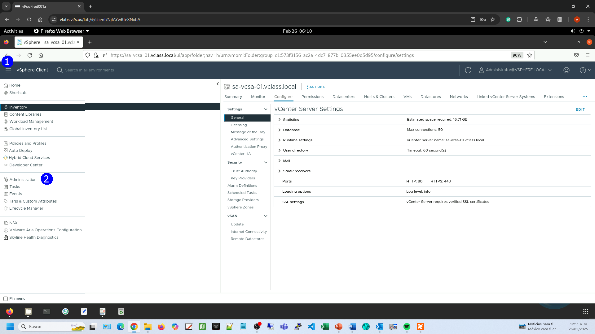

En la sección **Certificates**, click en **Certificates Managment**
(2)**,** en la sección **Machine SSL Certificate** (3), seleccionar
**VIEW DETAILS** (4)

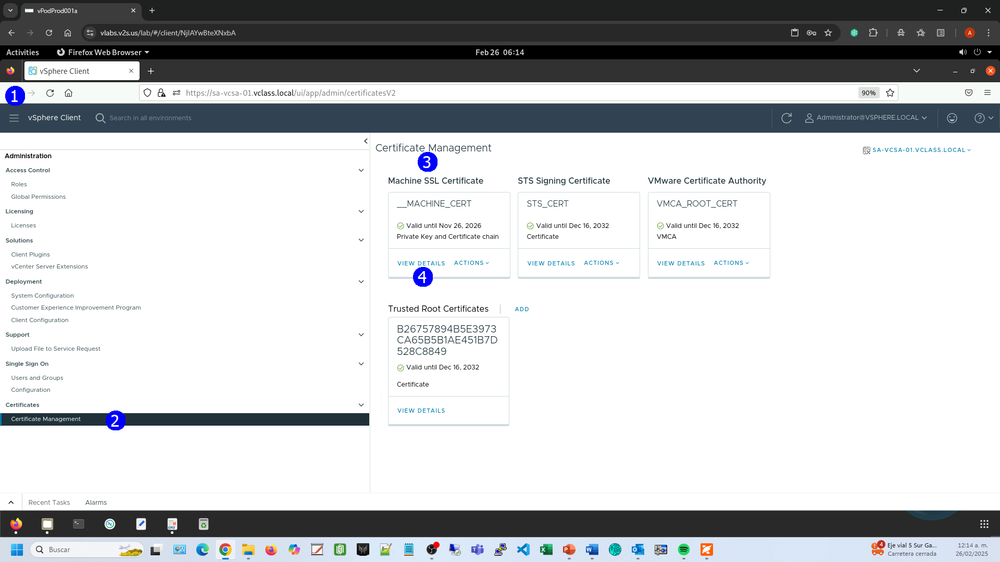

Se muestra la información del certificado que sería similar a la que se
muestra

Registrar la siguiente información del certificado para compararla en el
futuro.

Valid from: \_\_\_\_\_\_\_\_\_\_\_\_\_\_\_\_\_\_\_

Valid Until: \_\_\_\_\_\_\_\_\_\_\_\_\_\_\_\_\_\_\_

Thumbprint:
\_\_\_\_\_\_\_\_\_\_\_\_\_\_\_\_\_\_\_\_\_\_\_\_\_\_\_\_\_\_\_\_\_\_\_\_\_\_\_\_

La huella digital del certificado (**Thumbprint**), también llamada hash
de certificado, es única y cambia con cada certificado generado.

Al terminar de revisar el certificado SSL de máquina, haga click en
**BACK TO**

**CERTIFICATE MANAGEMENT** (1)

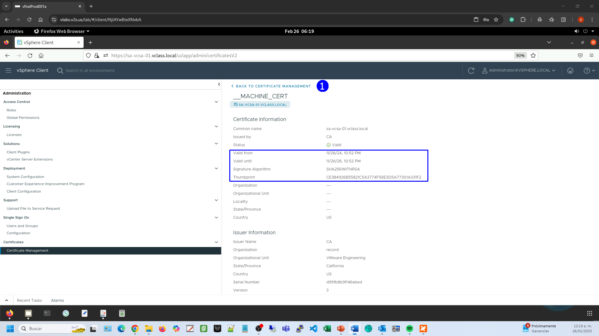

Click en **VIEW DETAILS** (2) para el primer certificado en la sección
**Trusted Root Certificates** (1)

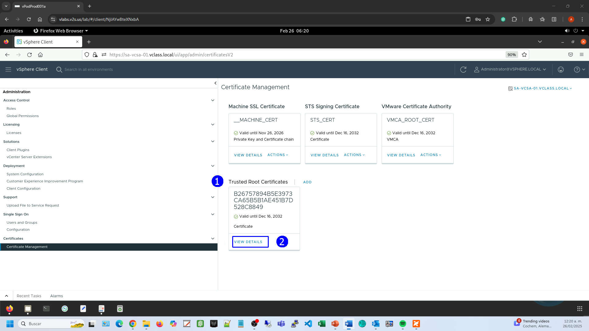

Observar que el certificado fue emitido por **CA** que indica que VMware
CA emitió el certificado. CA se refiere a la VMCA en vCenter

Click en **BACK TO CERTIFICATE MANAGEMENT**

## **Actividad \#2**

### **Crear una solicitud de firma de certificado**

Utilice **vSphere Certificate Manager** para crear una solicitud de
firma de certificado (**CSR**) que usará para solicitar un certificado
personalizado firmado por la autoridad de certificación (CA) del
controlador de dominio para el laboratorio.

Generar la solicitud de firma de certificado (**Certificate signing
request CSR**).

En el recuadro **Machine SSL Certificate** (2), click en **Actions**
(3), click en **Generate Certificate Signing Request (CSR)** (4)

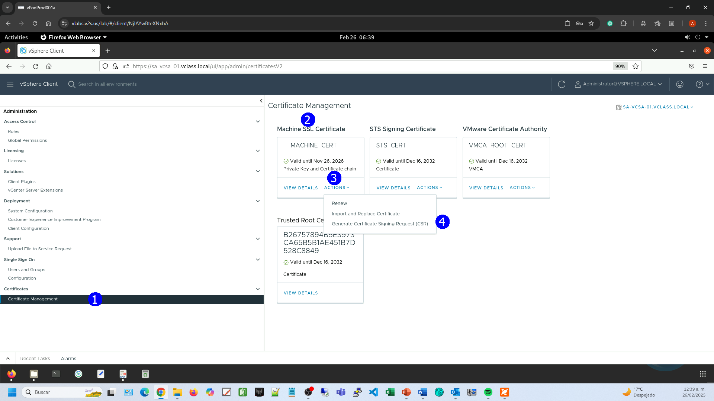

Ingresar los detalles necesarios para finalizar la solicitud de firma de
certificado.

| **Campo:**        | **Introducir**         |
|-------------------|------------------------|
| Organization      | **Netec**              |
| Organization Unit | **Educacion**          |
| Country           | Seleccionar **México** |
| State/Province    | **CDMX**               |
| Locality          | **Benito J**           |
| Email Address     | **admin@netec.com.mx** |

Dejar todos los demás campos como predeterminados.

Click en **NEXT** (1).

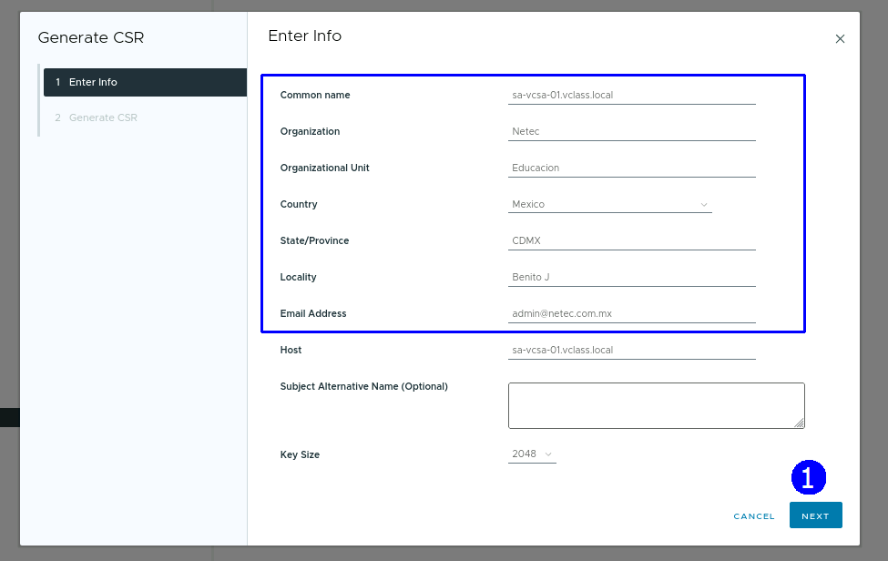

Click en **FINISH** (1) para cerrar el asistente.

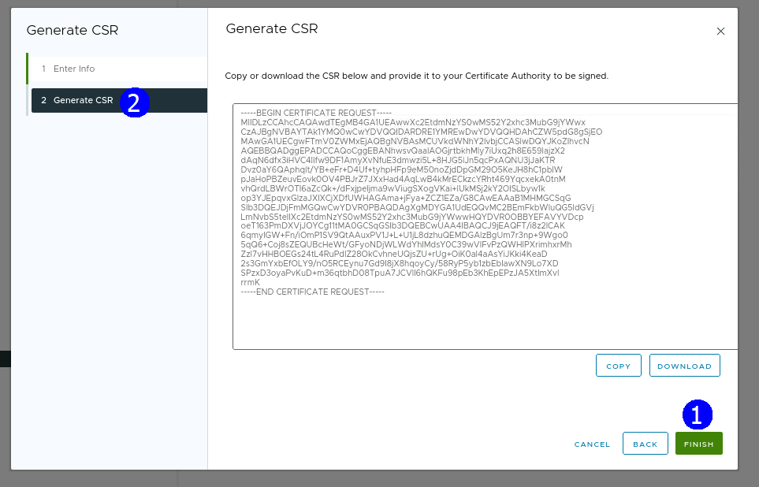

La generación de la CSR de vCenter en esta actividad es sólo para fines
de prueba.

## **Tarea 3: Reemplazar un certificado SSL de máquina con un certificado CA pregenerado**

Importar y reemplazar el certificado autofirmado (**self-signed
certificate)** de VMware CA con un certificado firmado por una entidad
certificadora externa mediante vSphere Client.

En el menú principal (1), seleccionar **Administration** (2), en la
sección **Certificates** (3), seleccionar **Certificate Management**
(4). En la sección **Machine SSL Certificate** (5), click en **ACTIONS**
(6), click en **Import and Replace Certificate** (7)

Se iniciará el asistente

En la página **Choose apropriate option** (1) seleccionar **Replace with
external CA certificate (requires private key)** (2). Click en **NEXT**
(3)

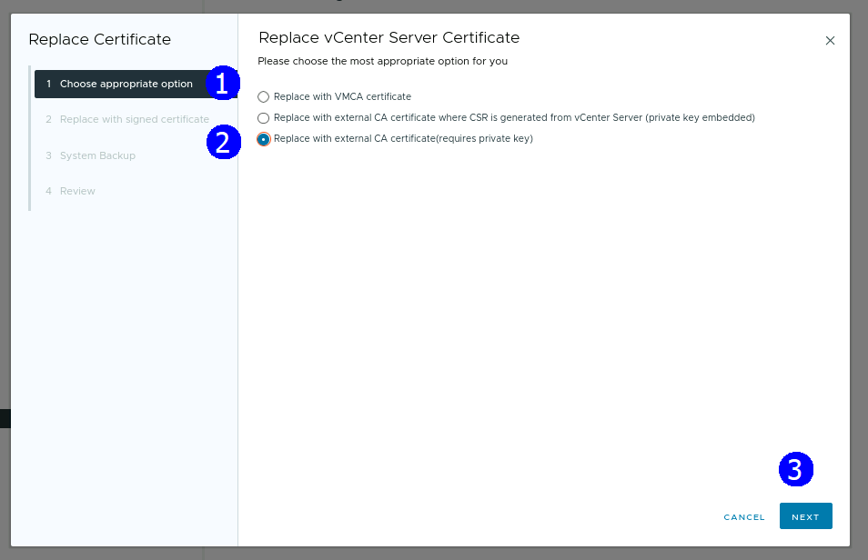

En el campo **Machine SSL Certificate** (2), click **BROWSE FILE** (3).

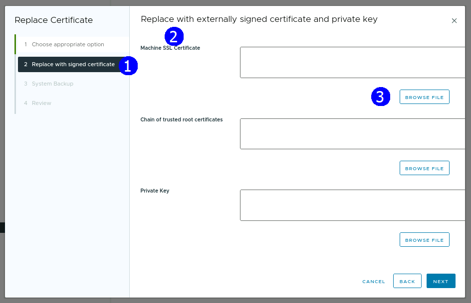

En la carpeta **/Desktop/Class Materials and Licenses/linux_CA**,

Seleccionar **ca_vcsa.crt** (4), dar click en **OPEN** (5)

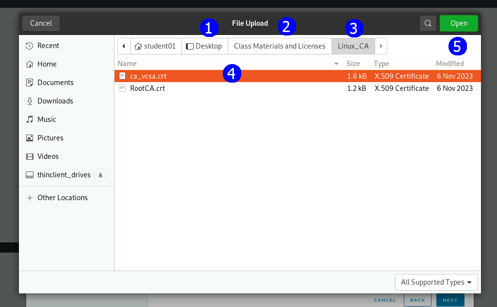

Después de seleccionar este archivo, el cuadro de texto se completará
con la información del certificado firmado por la entidad certificadora.

En el cuadro **Chain of trusted root certificates**, seleccione **BROWSE
FILE** (3).

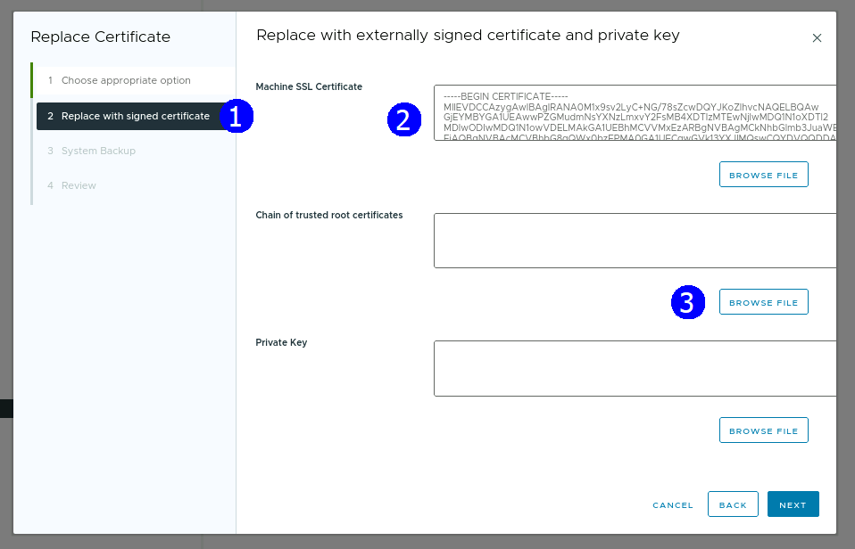

En la carpeta **/Desktop/Class Materials and Licenses/linux_CA**,

seleccionar **RootCA.crt** (4), click en **OPEN** (5)

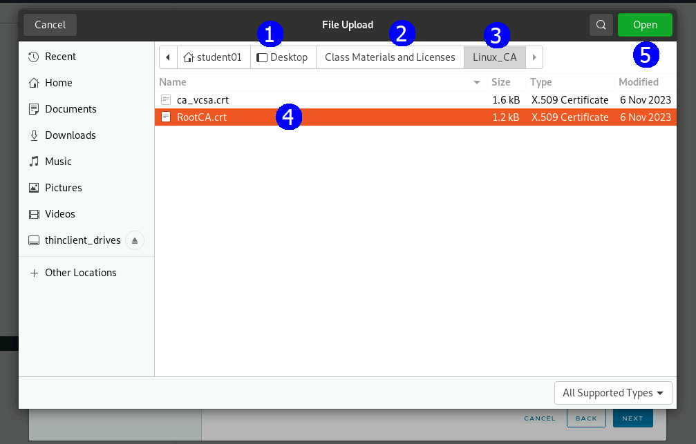

Después de seleccionar este archivo, el cuadro de texto se completará
con la información del certificado raíz

En el cuadro **Private Key,** click en **BROWSE FILE**

En la carpeta **/Desktop/Class Materials and Licenses/linux_CA**,

Seleccionar el archivo **vmca_issued_key.key**, click en **OPEN**.

Después de seleccionar este archivo, el cuadro de texto se completará
con la información de la Clave privada.

Clic en **NEXT**.

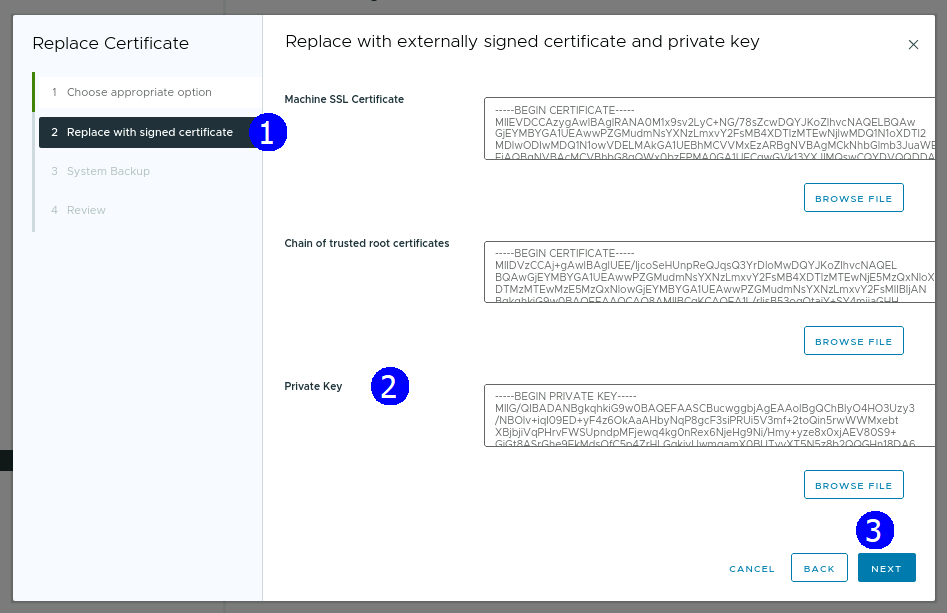

En la página **System Backup**, seleccione la casilla de verificación
**Backup acknowledgment** y haga clic en **NEXT**.

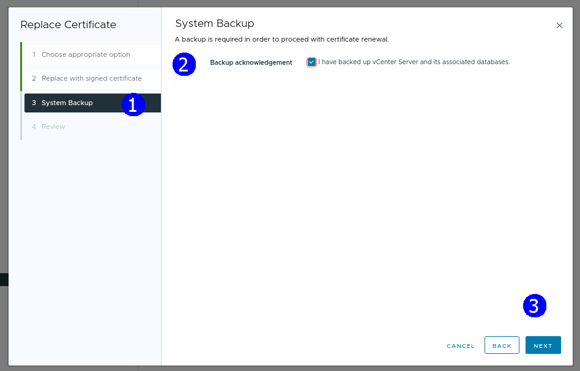

En la página **Review**, click en **FINISH**.

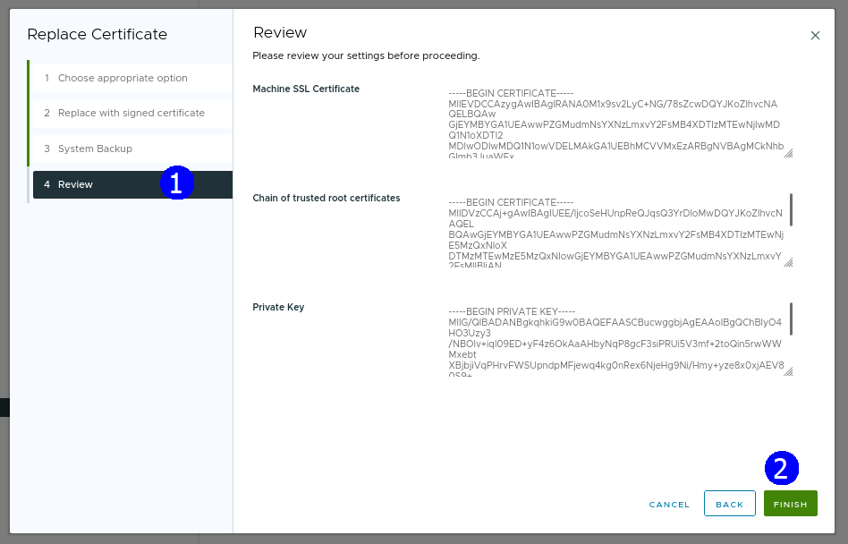

Después de unos segundos, debería aparecer un cuadro de mensaje que
indique que se ha

cambiado el certificado.

Click en **UPDATE**.

En una nueva pestaña de **Firefox**, abra el menú Firefox y seleccione
**Settings**.

Alternativamente, puede abrir una nueva pestaña del navegador Firefox e
ingresar

**about:preferences** en el **campo de dirección**.

Buscar la sección de **Cookies**

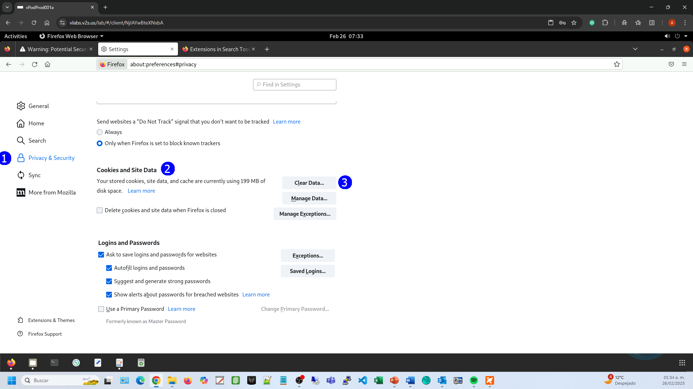

Click en **Clear data**, anule la selección de **Cookies and Site Data**
y haga clic en **Clear**.

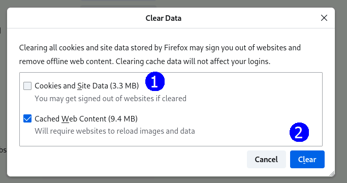

Esta acción borrará la memoria caché web de su navegador Firefox.

Reinicie su navegador Firefox.

Verifique el reemplazo del certificado.

Con vSphere Client, inicie sesión en la instancia de vCenter
**sa-vcsa-01.vclass.local** usando

sus credenciales de laboratorio de vCenter.

Si recibe el mensaje de Warning: Potential Security Risk Ahead en su
session de Firefox

haga click en **Advanced**

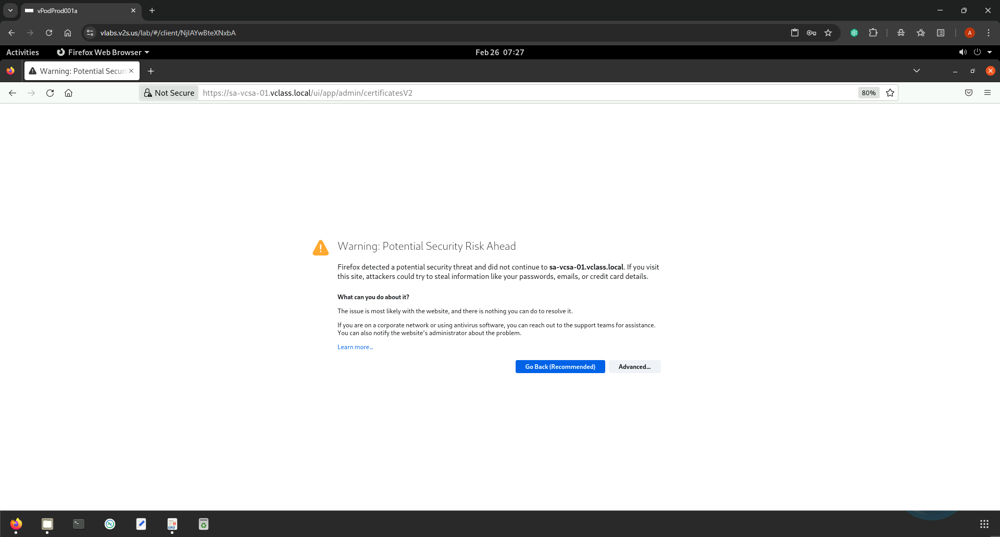

Y haga clic en **Accept the Risk and Continue** para pasar a la página
de inicio de sesión de vCenter.

Si no puede iniciar sesión en vCenter después de que se hayan reiniciado
los servicios, intente iniciar sesión con una nueva ventana privada de
Firefox.

En el menú principal, seleccione **Administration** seleccione
**Certificate Management** en la sección **Certificates**.

En el recuadro **Machine SSL Certificate**, click en **VIEW DETAILS**.

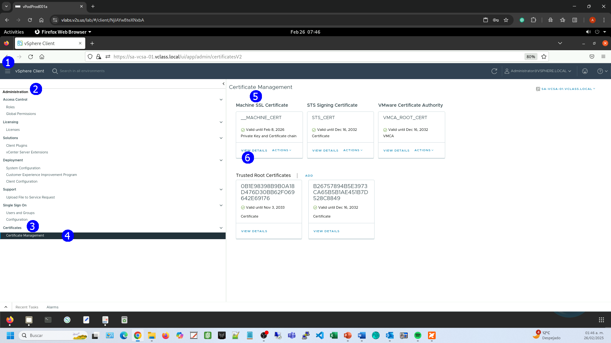

Registre la siguiente información del certificado y compare las fechas
válidas y la huella digital

con la información del certificado recopilada en una tarea anterior.

Valid from: \_\_\_\_\_\_\_\_\_\_\_\_\_\_\_\_\_\_\_\_

Valid until: \_\_\_\_\_\_\_\_\_\_\_\_\_\_\_\_\_\_\_\_

Thumbprint:
\_\_\_\_\_\_\_\_\_\_\_\_\_\_\_\_\_\_\_\_\_\_\_\_\_\_\_\_\_\_\_\_\_\_\_\_\_\_\_\_

### IMPORTANTE:

#### Las fechas válidas y la huella digital del certificado actual deben ser diferentes a las del certificado anterior.
