> # VMware vSphere
>
> ## Operación, Escalamiento y Seguridad
>
> ### Versión 8
>
> #### Guía de uso de laboratorio

## Laboratorio \# 16

> ### Configuración del modo Lockdown mode en un host Esxi
>
> Revisión 1.1 2024

## Laboratorio \# 16

### Configuración del modo Lockdown mode en un host Esxi

#### Actividades por realizar:

1.  Activar el servicio de SSH

2.  Habilitar y probar el modo Lockdown mode

3.  Deshabilitar el Modo Lockdown mode

## Actividad \# 1

### Activar el servicio de SSH

Utilizar de su sistema la herramienta de “**Conexión a escritorio
remoto**” con la dirección y puerto que le proporcionará su instructor;
utilizar como:

> Usuario: `vclass\Administrator`
>
> Contraseña: `VMware1!`

Abrir una instancia de Firefox, seleccionar el shortcut de **vCenter**

Para activar el servicio SSH

En la vista de **Hosts & Clusters** (1), click en el host **ESXi_01**
(2), click en la pestaña **Configure** (3), en la sección **System**,
click en **Services** (4), click en **SSH** (5) click en **Start** (6)

El servicio está activo

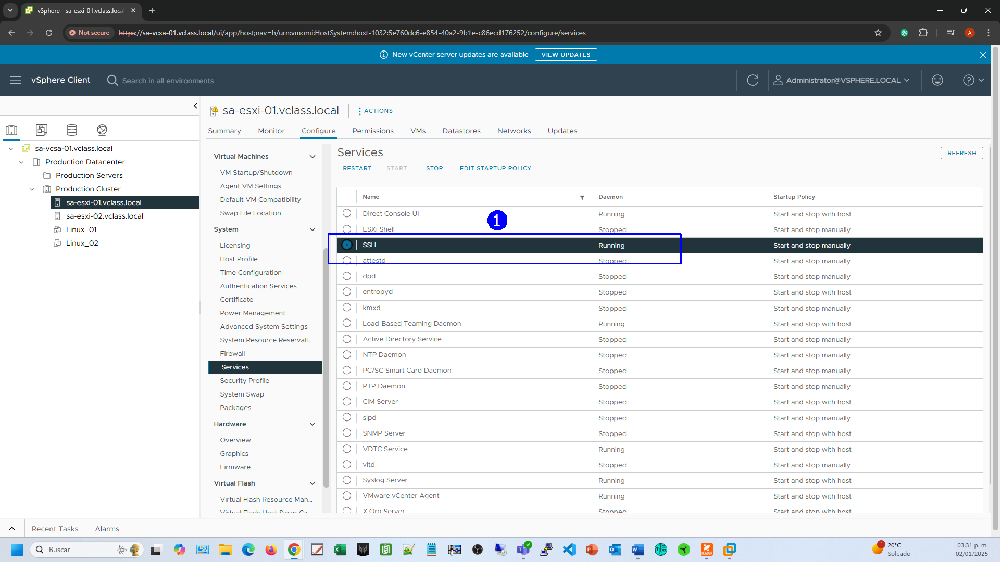

Verificar que se acepta una conexión con **PuTTY** usando la cuenta de
root, establecer como host

**sa-esxi-01.vclass.local** (1) y conexión con **SSH** (2)

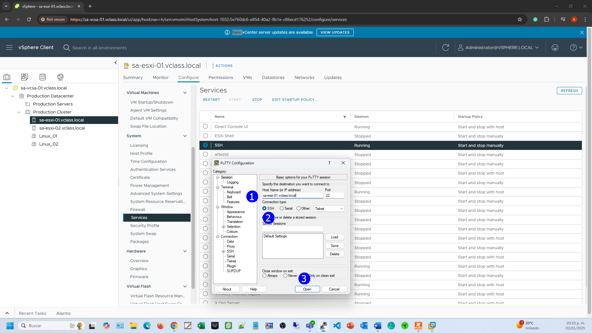

Se muestra la alerta de conexión con SSH

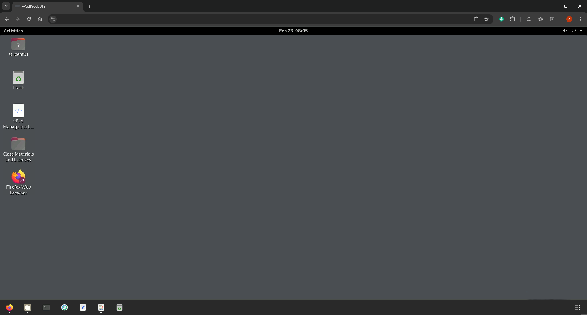

Se logra conexión con la cuenta de

User: `Root`

Password: `VMware1!`

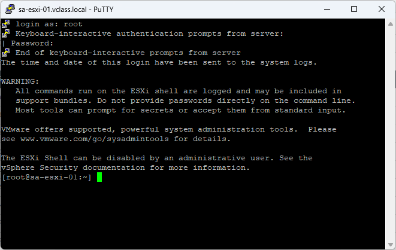

## Actividad \# 2

### Habilitar y probar el modo Lockdown mode

Enseguida activar el modo de protección Lockdown Mode

En la vista de **Hosts & Clusters** (1), click en el host **ESXi_01**
(2), click en la pestaña **Configure** (3), en la sección **System**,
click en **Security Profile** (4), observar que está deshabilitada la
protección (5), click en **EDIT** (6)

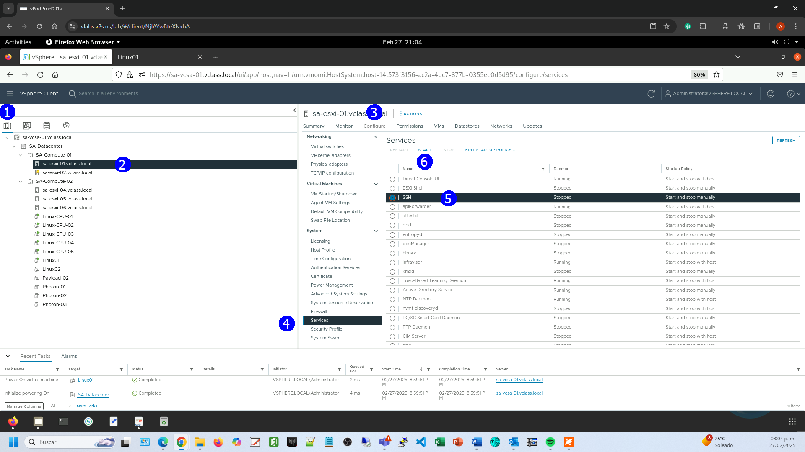

Seleccionar modo **NORMAL** (1) click en **OK** (2)

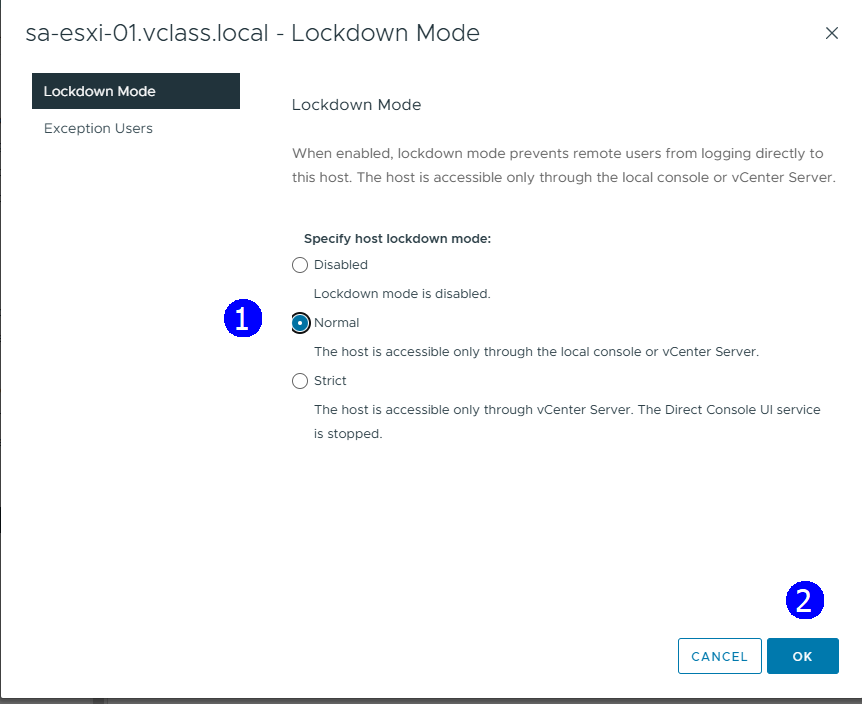

Se activa la protección (1), notar que la lista de **Exception User**
está vacía

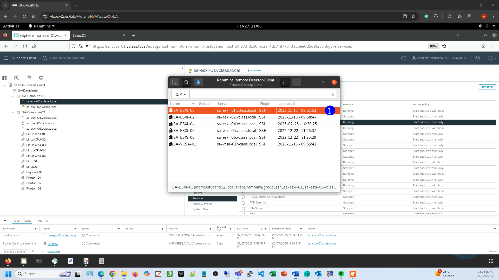

Verificar que no se acepta una conexión con **PuTTY** usando la cuenta
de root, establecer como host

**sa-esxi-01.vclass.local** (1) y conexión con **SSH** (2)

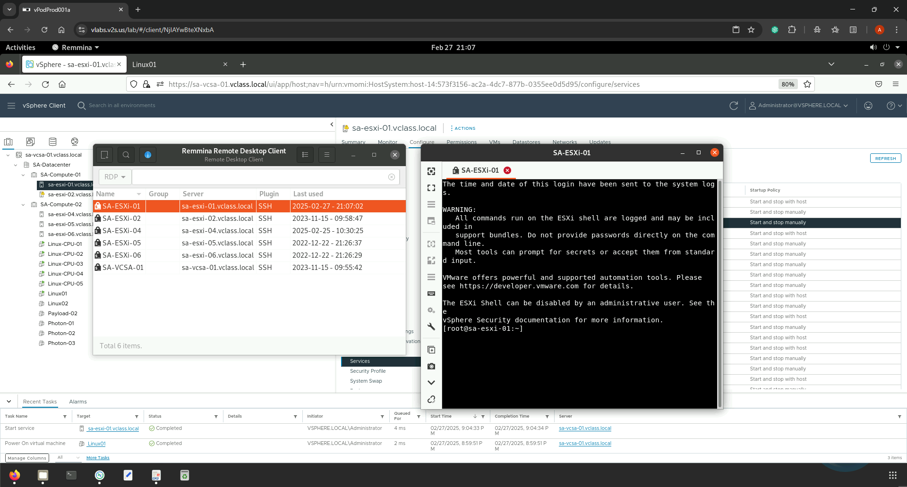

Se deniega la conexión con la cuenta de

User: `Root`

Password: `VMware1!`

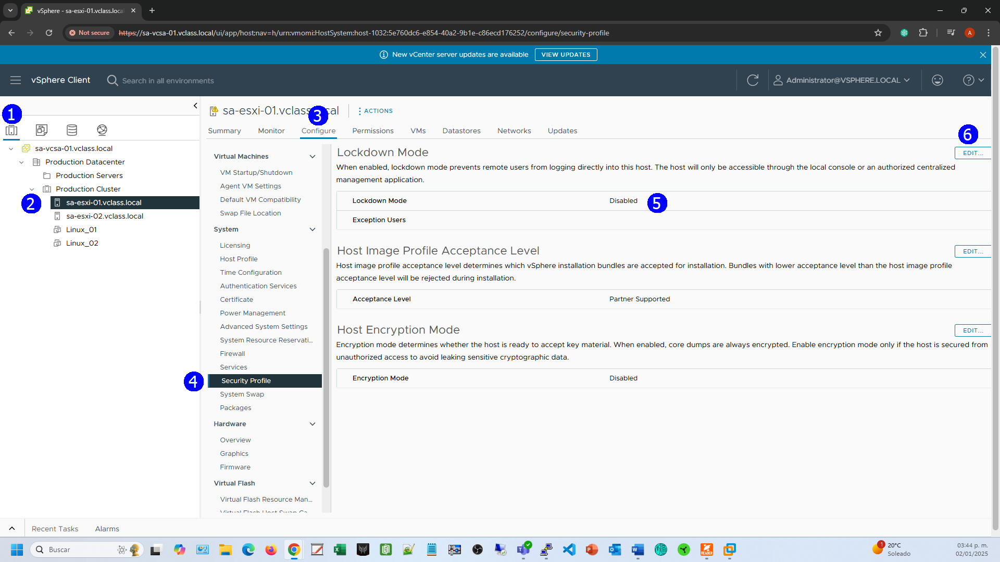

## Actividad \# 3

### Deshabilitar el Modo Lockdown mode

Para des-habilitar la protección click en **EDIT** (1)

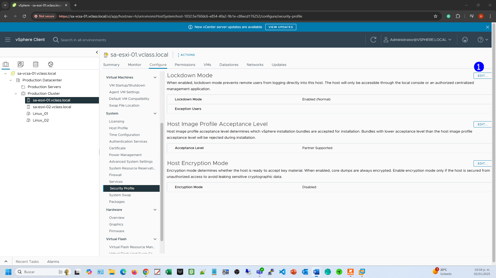

Click en **Disable** (1), **OK** (2)

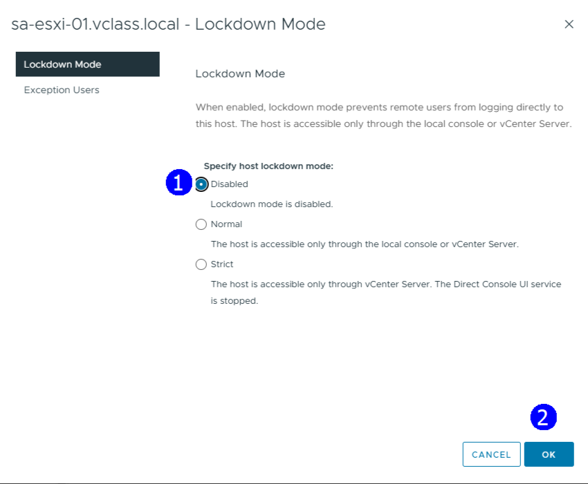

Se muestra el nuevo estado

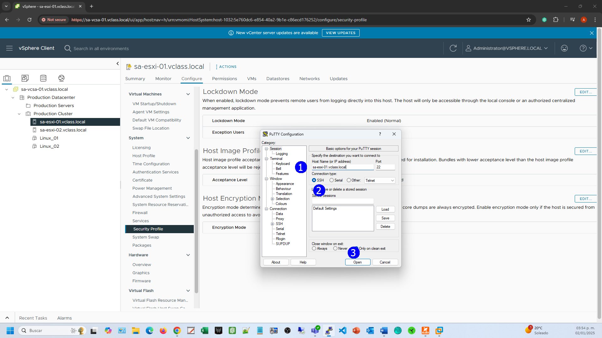

Apagar el servicio de SSH

En la vista de **Hosts & Clusters** (1), click en el host **ESXi_01**
(2), click en la pestaña **Configure** (3), en la sección **System**,
click en **Services** (4), click en **SSH** (5) click en **STOP** (6)

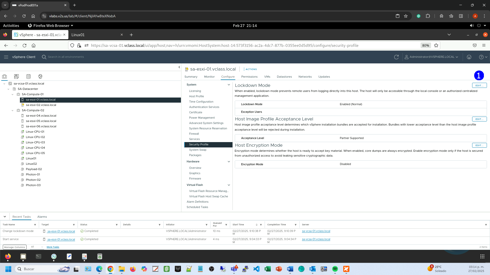

Aparece la advertencia de apagado de SSH, OK (1)

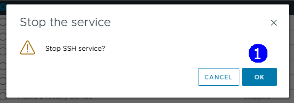

El servicio se ha detenido
