> # **VMware vSphere**
>
>## **Operación, Escalamiento y Seguridad**
>
> ### **Versión 8**
>
> #### **Guía de uso de laboratorio**

## **Laboratorio \# 17**

### **Configuración de vCenter para trabajar** **con un KMS externo**

#### Actividades por realizar:

1.  Configurar un KMS en vCenter

2.  Establecer confianza entre un KMS y vCenter

## **Actividad \# 1**

### **Configurar un KMS en vCenter**

Utilizar la liga de acceso proporcionada por su instructor

A manera de ejemplo:
[**https://vlabs.v2s.us/lab**](https://vlabs.v2s.us/lab)

Utilizar el usuario y contraseña que le proporcione su instructor

A manera de ejemplo

> Usuario: `student01a`
>
> Contraseña: `Arn0224!`
>
> Click en **Login**
>
> Seleccionar en esta interfaz el primer pod de trabajo **vPodProd001a**
> (1)
>
>  alt="A screenshot of a computer Description automatically generated" />

Al entrar, en la siguiente interfaz proporcionar

> Usuario: `student01`
>
> Contraseña: `mVMware1!`

Click en **OK**

> Se obtiene acceso al escritorio remoto
>
>  alt="A screenshot of a computer Description automatically generated" />

Abrir una instancia del browser Firefox con acceso directo al **vSphere
Client login interface**

User: `administrator@vsphere.local`

Password: `VMware1!`

Click en **Login**

Seleccionar la vista de **Host y& clusters**

Click en **sa-vcsa-01.vclass.local**, click en la pestaña **Configure**.

En la sección **Security** click en **Key** **Providerr**

Click en **ADD**

Seleccionar **Add Standard Key Provider**

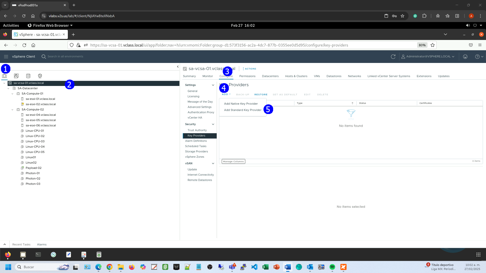

En el asistente establecer la siguiente configuración relativa al KMS

**Name**: **sa-kms-01.vclass.local**

**KMS**: **sa-kms-01.vclass.local**

**Address**: `172.20.10.193`

**Port**: `5696`

Click en **ADD KEY PROVIDER**

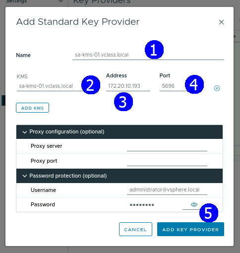

En la cuadro de diálogo **Make vCenter Trust Key Provider** Click en
**TRUST**

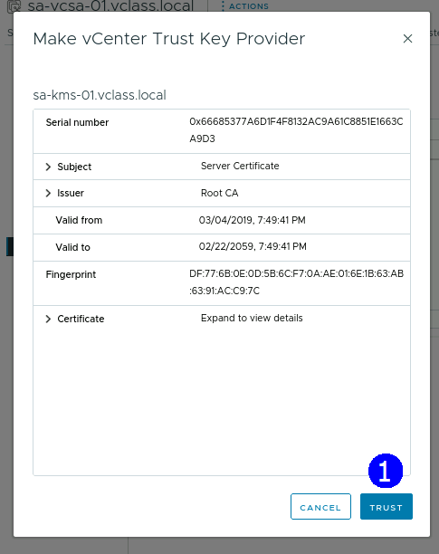

Verificar que el servidor **sa-kms-01.vclass.local** se ha agregado a la
lista de proveedores KMS

Seleccionar el servidor y verificar el estado de desconectado

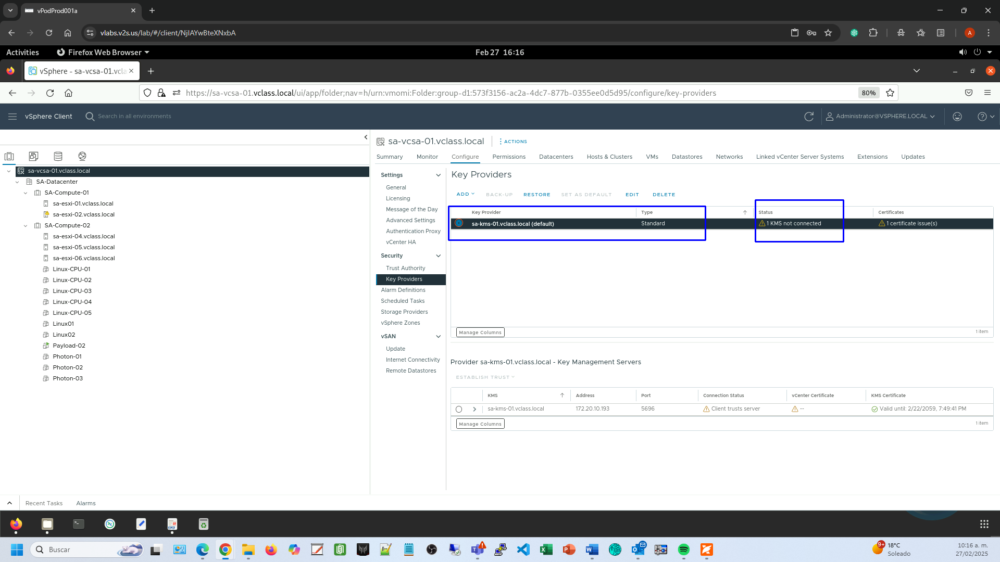

## **Actividad \#2**

### **Establecer una relación de confianza del KMS con el vCenter Server**

En la Sección **Key** **Providers**, click sobre el proveedor KMS
**sa-kms-01.vclass.local**.

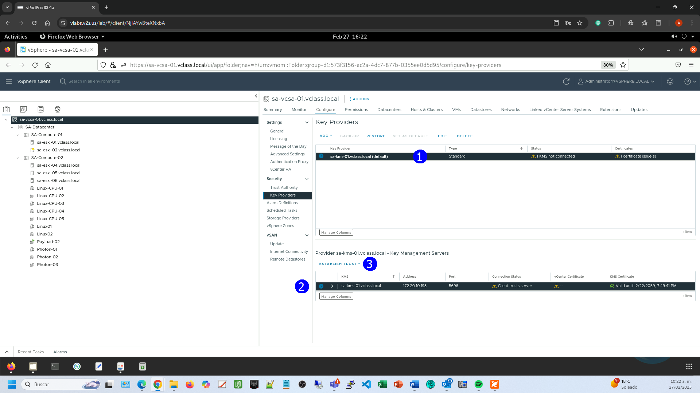

Click en la lista desplegable **ESTABLISH TRUST** y seleccionar **Make
KMS trust vCenter**.

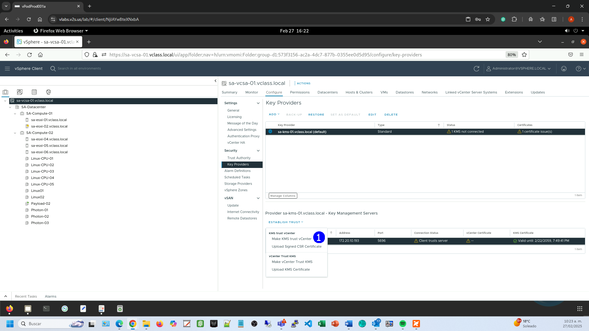

Se despliega el asistente **Make KMS trust vCenter**

En la Página **Choose a method**, seleccionar la opción **KMS
certificate and private key**

click en **NEXT**.

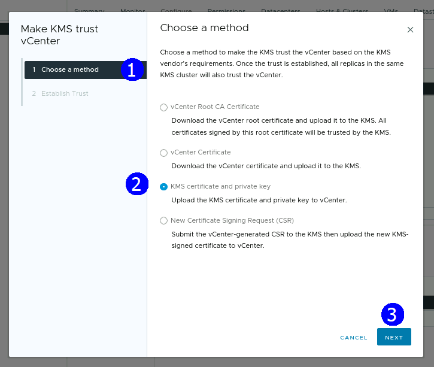

En la página **Upload KMS Certificate**, en la sección **KMS**
**Certificate**, click en **UPLOAD** **A FILE**

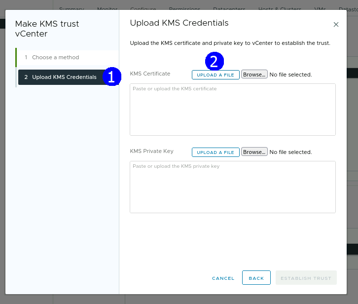

Seleccionar el archivo **/Downloads/KMS Keys/root_certificate.pem**

Click en **Open**.

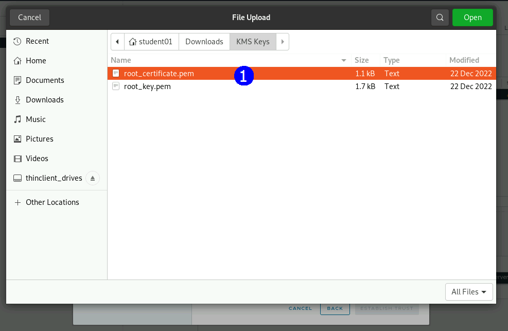

En la sección **KMS Private Key**, click en **UPLOAD A FILE**

Seleccionar el archivo **/Downloads/KMS Keys/root_key.pem**

click en **Open**.

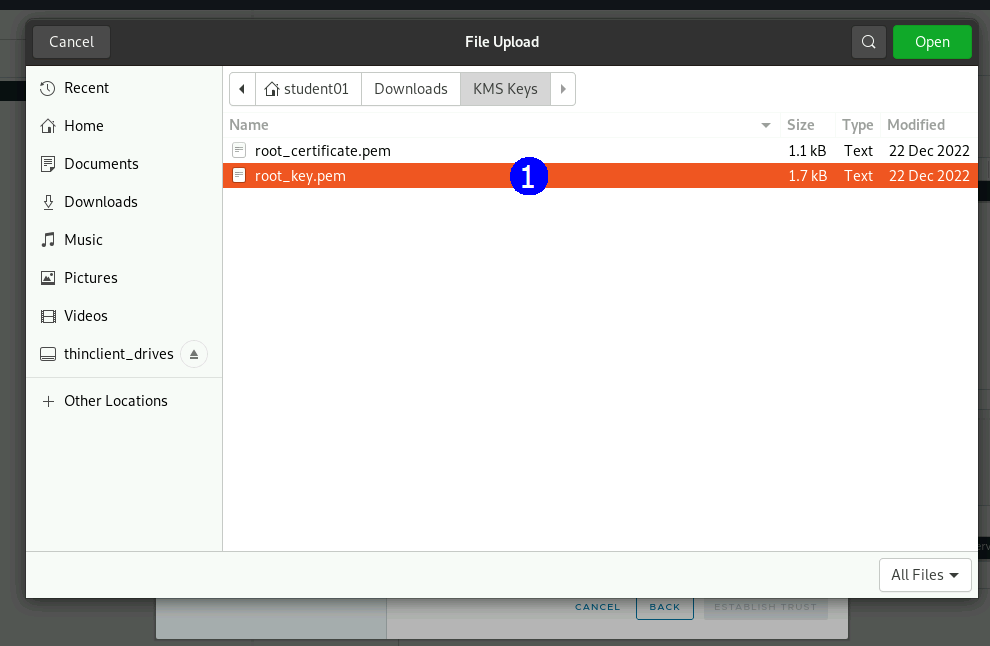

Click en **ESTABLISH TRUST**.

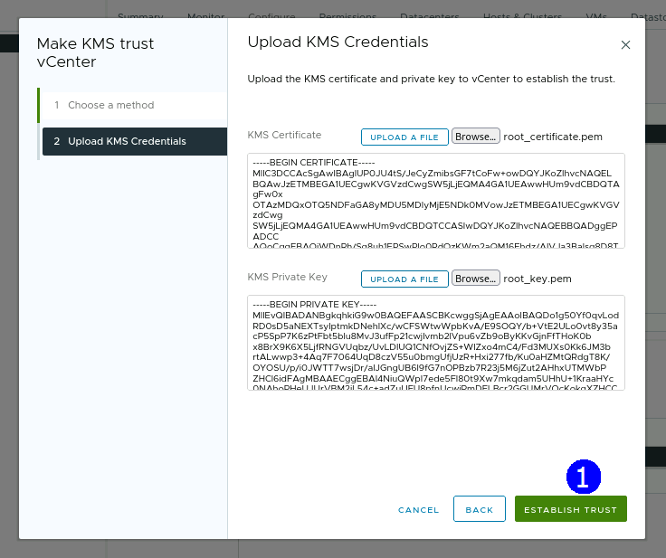

Confirmar que se ha establecido confianza entre el **KMS** and
**vCenter**

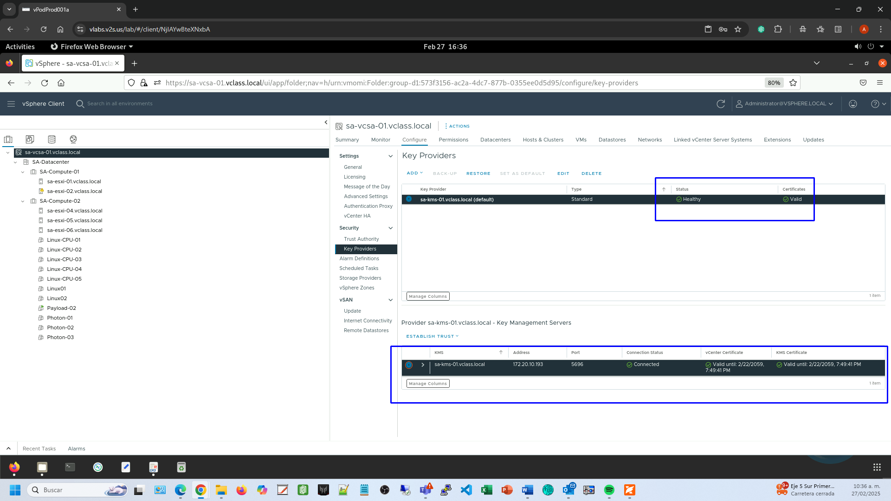
