# Práctica 18. Creando una máquina Virtual cifrada

## Objetivos de la práctica:

- Crear una Máquina virtual cifrada.
- Confirmar que la máquina virtual está cifrada con un proveedor de llaves standard.

## Duración aproximada:
- 40 minutos.

## Instrucciones

## **Actividad \# 1**

### **Crear una Máquina virtual cifrada**

Utilizar la liga de acceso proporcionada por su instructor.

A manera de ejemplo:
[**https://vlabs.v2s.us/lab**](https://vlabs.v2s.us/lab)

Utilizar el usuario y contraseña que le proporcione su instructor.

A manera de ejemplo:

> Usuario: `student01a`
>
> Contraseña: `Arn0224!`
>
> Click en **Login**
>
Seleccionar en esta interfaz el primer pod de trabajo **vPodProd001a** (1).
>
> 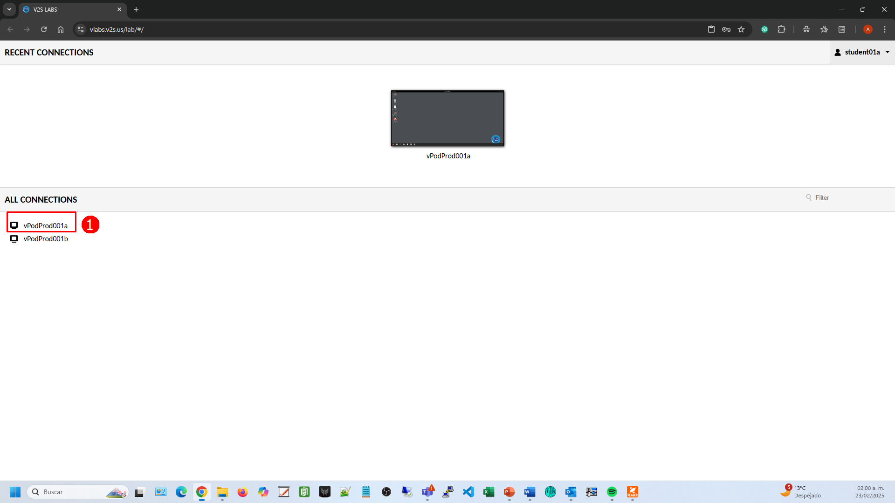 alt="A screenshot of a computer Description automatically generated" />

Al entrar, en la siguiente interfaz proporcionar:

> Usuario: `student01`
>
> Contraseña: `VMware1!`

Dar clic en **OK.**

> Se obtiene acceso al escritorio remoto.
>
> 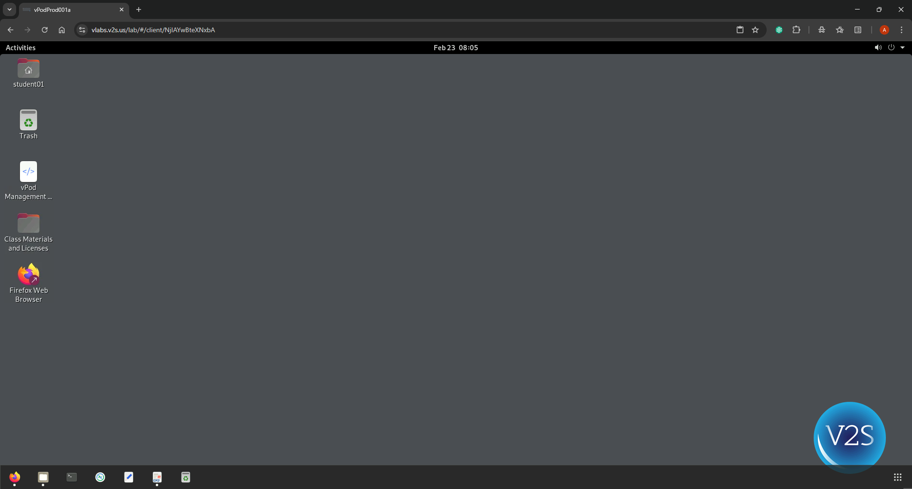 alt="A screenshot of a computer Description automatically generated" />

Abrir una instancia del browser Firefox con acceso directo al **vSphere
Client login interface.**

User: `administrator@vsphere.local>`

Password: `VMware1!`

Dar clic en **Login.**

Seleccionar la vista **VMs and Templates.**

Click derecho en **Lab VMs**, seleccionar **New Virtual Machine.**

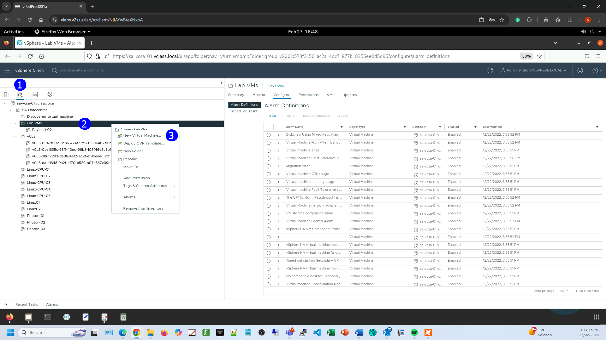

Se despliega el asistente **New Virtual Machine**

En la página **Select a creation** **type**, click en **Create a new
virtual machine**

click **NEXT**.

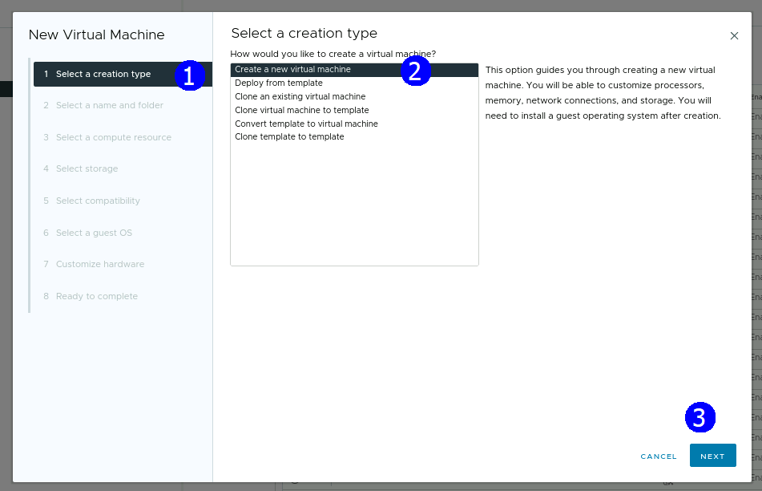

En la página **Select a name and folder**

Introducir el nombre de la máquina virtual **VM-cifrada** en el campo
**Virtual machine name**.

Seleccionar la ubicación **Lab VMs**

click en **NEXT**

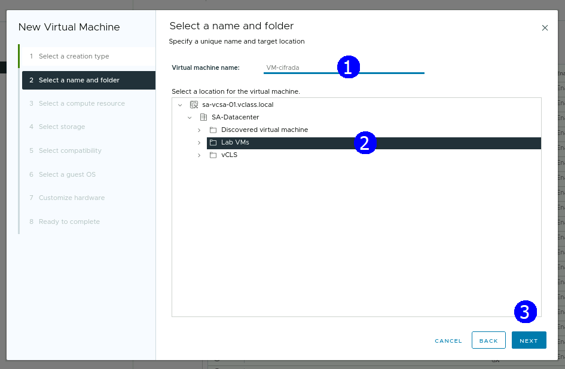

En la página **Select a compute resource** expandir la lista
**SA-Datacenter** y seleccionar **SA-Compute-02,** expandir la lista y
seleccionar el host **sa-esxi-06.vclass.local**

Click en **NEXT**.

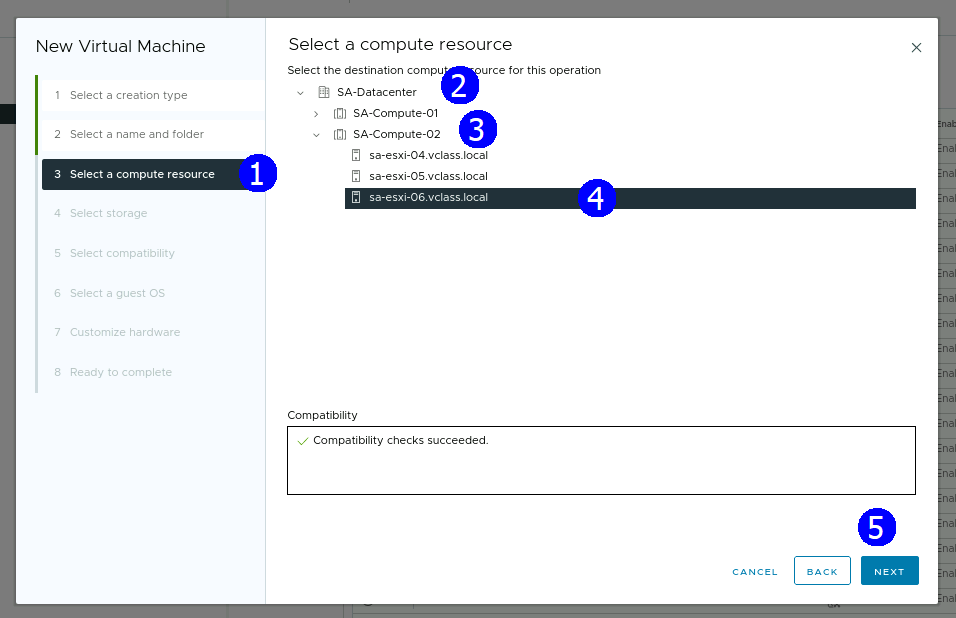

En la página **Select** **storage**, seleccionar **Encrypt this virtual
machine**, automáticamente se activa la política de almacenamiento
**Management Storage Policy - Encryption**

Seleccionar el datastore **vsanDatastore**, click en **NEXT**.

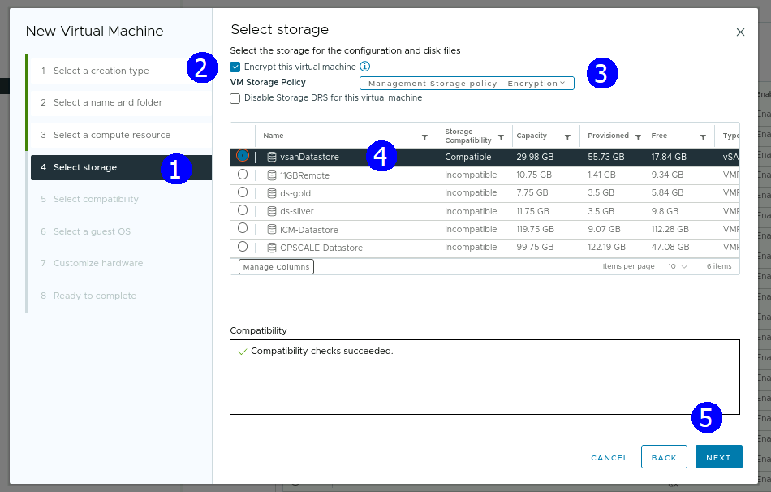

En la página **Select compatibility** click en **NEXT**

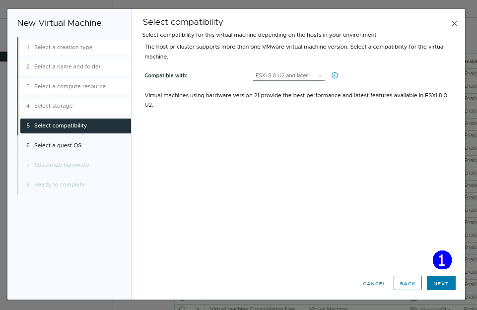

En la página **Select a guest OS**, seleccionar en la opción **Guest OS
Family:** **Linux**

En la opción **Guest OS Version** seleccionar **VMware Photon OS
(64bit),** click en **NEXT**.

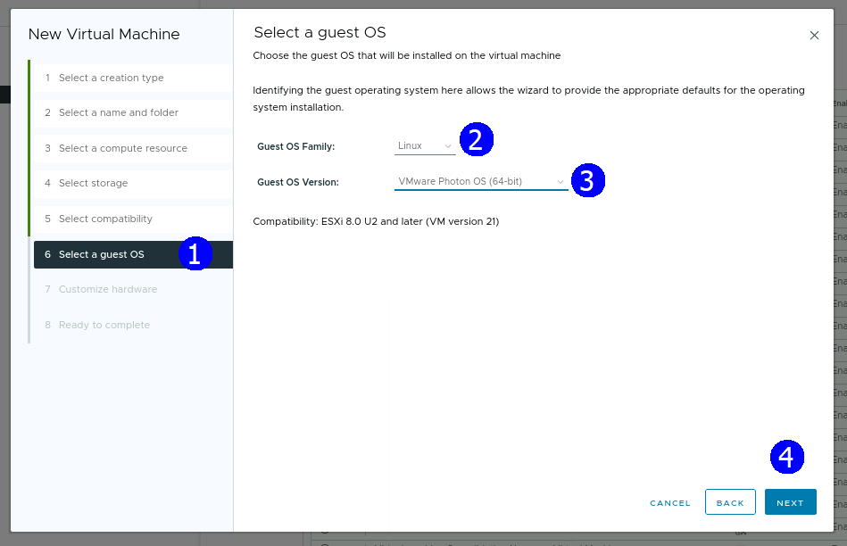

En la página **Customize hardware**, configurar la máquina virtual con
los siguientes parámetros en su hardware virtual:

**1 CPU**

**1 GB de memoria**

**1 disco de 2 GB**

**Red VM Network**

En la opción de **CD/DVD Drive**, seleccionar **Datastore ISO File**,
seleccionar el archivo el datastore **OPSCALE-Datastore**, click en el
folder **ISO**, seleccionar el archivo **photon-3.0-a0f216d.iso**

Click en **OK**.

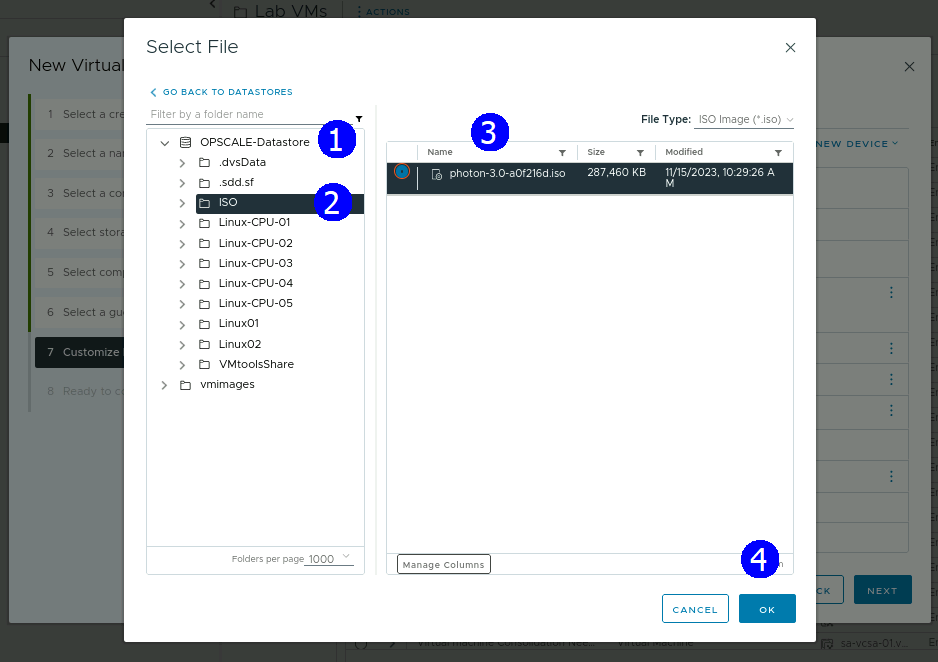

Expandir la sección **New CD/DVD Drive**, activar la opción **Connect At
Power**, Click en **NEXT**.

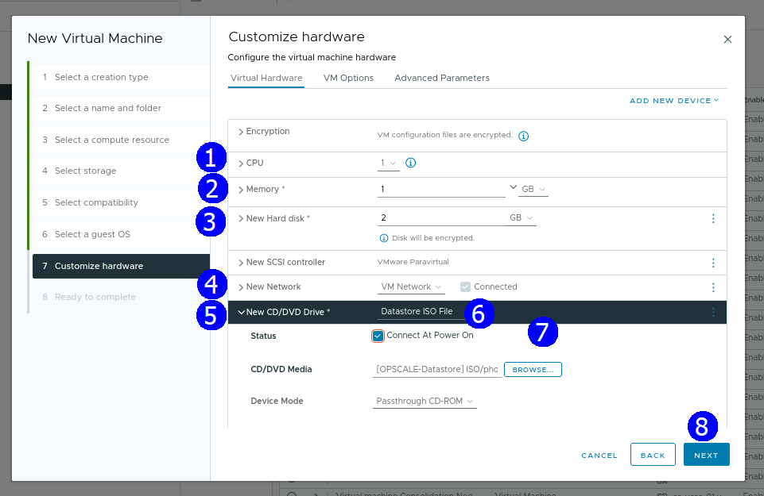

En la página **Ready to complete**, click en **FINISH**.

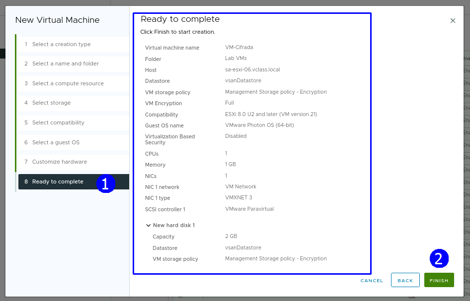

Verificar que aparece en la lista la máquina **VM-cifrada** en el folder
**Lab VMs**

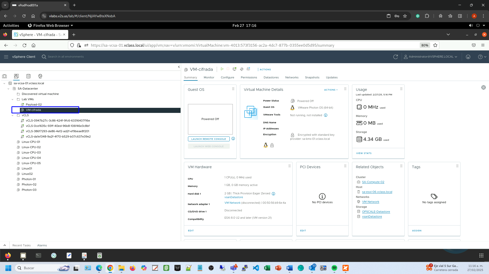

## **Actividad \# 2**

### **Confirmar que la máquina virtual está cifrada con un proveedor de llaves standard**

Seleccionar la máquina virtual **VM-Cifrada** en el inventario

En la pestaña **Summary**, revisar las especificaciones en la sección
**Virtual Machine Details**

Verificar que la máquina está cifrada

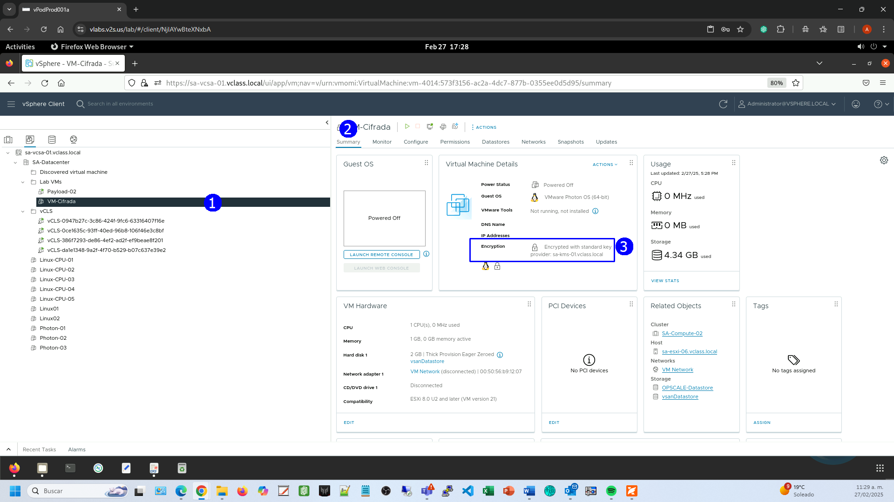
